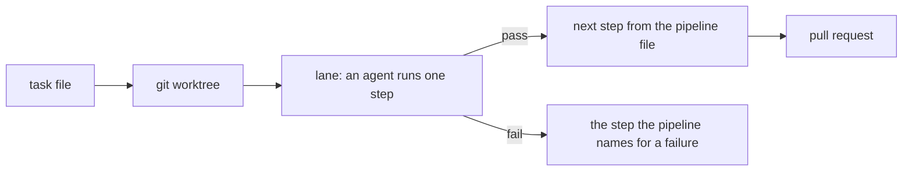

# Documentation

Every page of the spoolway documentation, in the order most people need them. The pages
live in [`docs/`](docs/README.md).

## Start here

| Page | What it covers |
|---|---|
| [Concepts](docs/concepts.md) | The terms: project, task, plan, pipeline, step, lane |
| [Installation and setup](docs/installation.md) | Installing, `spoolway init`, updating, platform notes |

## Doing work

| Page | What it covers |
|---|---|
| [Tasks and the queue](docs/tasks.md) | The task file, queueing, dependencies, conflicts |
| [Planning](docs/planning.md) | The plan skills, the queue screen, trials, routines |
| [The dispatcher](docs/dispatcher.md) | The board, scheduling, gates, backends, stepping into a lane |
| [Jobs](docs/jobs.md) | Running a routine on a cron schedule |

## Shaping the system

| Page | What it covers |
|---|---|
| [Pipelines](docs/pipelines.md) | The pipeline file: steps, routing, converting your own workflow |
| [Prompts](docs/prompts.md) | The prompt files steps run, and writing your own |
| [Agents and models](docs/agents.md) | Agent profiles, agent kinds, sessions, local models |
| [Documentation and templates](docs/documentation.md) | Domain documents and task skeletons |

## Safety, visibility, cost

| Page | What it covers |
|---|---|
| [Cost accounting](docs/cost.md) | The usage ledger and model prices |
| [Comparing versions](docs/eval.md) | What a prompt or pipeline edit did to cost and pass rate |

## Reference

| Page | What it covers |
|---|---|
| [Configuration](docs/configuration.md) | Every setting in the config file |
| [CLI reference](docs/cli-reference.md) | Every command, subcommand and flag |
| [Testing](docs/testing.md) | The test suites and how to run them |
| [Releasing spoolway](docs/releasing.md) | The release pipeline and the commands it runs |

## How it works

You write a task and queue it. The dispatcher gives it a worktree and starts an agent in a
lane. The pipeline file decides where a pass and a fail go. The dispatcher itself uses no
model.
