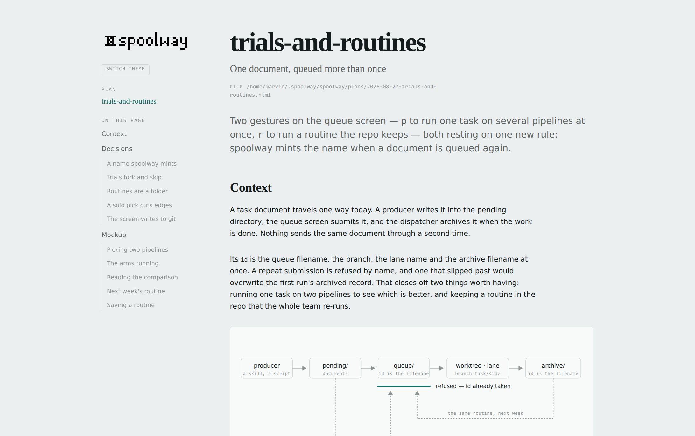
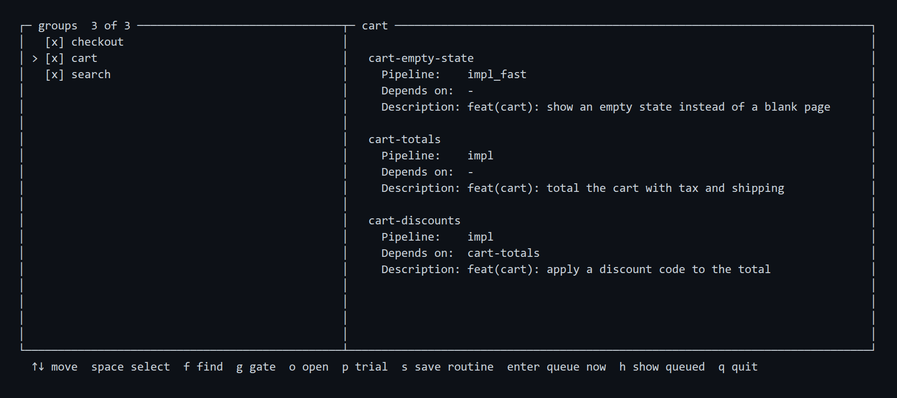
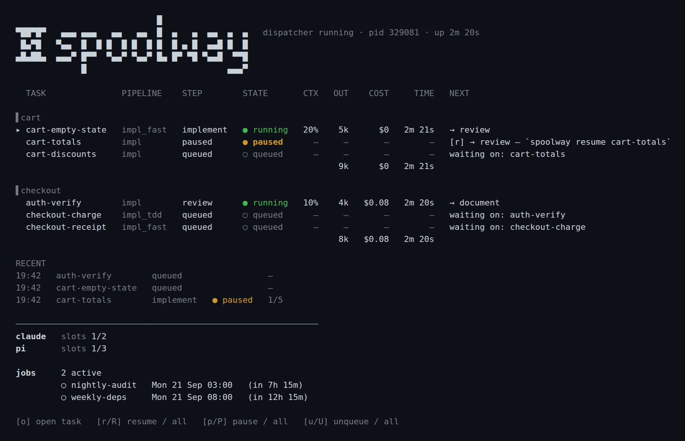
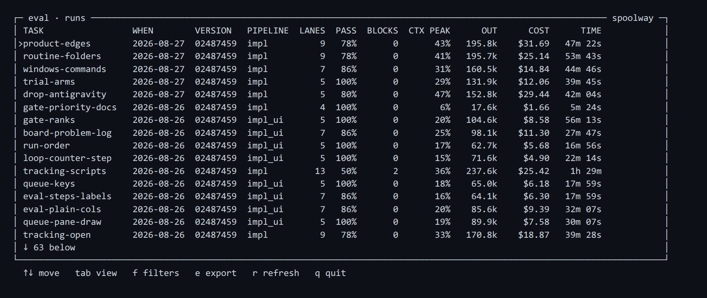

<p align="center">
  <picture>
    <source media="(prefers-color-scheme: dark)" srcset="docs/logo/lockup-a-mark-left-invert.png">
    
  </picture>
</p>

Minimalistic command line state machine for turning coding agents into a pipeline you can actually reason about. No dependencies, terminal native. Runs headless or controls supported multiplexers. Worktree management and built-in support for GitHub's stacked pull requests.

Supported providers:

- **`claude`**
- **`codex`**
- **`pi`**

Supported multiplexers:

- **`tmux`**
- **`herdr`**

## Why

Running one coding agent is easy. Running five is tab-juggling: which one is done, which
one is stuck, and which one is quietly rewriting a file another one needs. The order lives
in your head, and it stops the moment you look away.

It replaces the orchestrating agent that is supposed to keep everything together — and
sometimes does. spoolway won't surprise you with a bill or an opinion.

## Features

- **A dispatcher with no model in it.** Every scheduling decision is mechanical — a
  counter, a timestamp, a position in the pipeline file. It never drifts, costs nothing,
  and is safe to interrupt at any point.
- **Any mix of agents.** Each step names its own agent and model: a local model for
  implementation, a cloud model for review, a shell command for the test suite.
- **A worktree per task.** Every task builds on its own branch in its own checkout, so
  parallel tasks never step on each other.
- **Stacked pull requests.** A dependent task's branch is cut from its dependency's
  branch, so a chain of tasks arrives as one ordered stack of PRs. Nothing merges itself;
  you land the stack. Optional, and driven by **`spoolway stack`**.
- **Session reuse.** A step can resume its prompt's earlier conversation instead of
  paying to rebuild context, bounded by how full the model's window already is.
- **Unattended runs.** Overnight, nothing parks for a person: blocked work is resumed by
  an unblocker prompt, with an output-token ceiling as the brake.
- **Trials.** Fork one task into an arm per pipeline and queue them together, then read the
  arms side by side in eval.
- **Routines.** Keep the tasks you run over and over in `.spoolway/routines/`.
- **Eval built in.** Every lane's spend and outcome land in a ledger, so you can see what
  your last pipeline edit did to pass rate and price.

## Install

```
npm install -g spoolway
```

A prebuilt binary, not a Node program — the package is a thin wrapper that runs it. Linux
(x64, arm64, musl), macOS (Apple Silicon, Intel) and Windows (x64, experimental). Successful
self-updates show what changed, and `spoolway whats-new` reads the installed release notes
offline from any directory.

From source instead, in a clone of this repository:

```
cargo install --path .
```

Platform notes and requirements in full: **[Installation and setup](docs/installation.md)**.

## Quick start

### 1. Set up inside the project repo

```
spoolway init
```

`spoolway doctor` checks that everything the configured pipeline needs is actually
present, any time you want to confirm the project would run.

### 2. Plan, or create queueable spoolway tasks directly

Tell the `/spoolway-plan` skill what you want built. It argues the shape with you until
every question is settled, and writes the result as one plan page. Approve the page and it
cuts the plan into tasks.



Already know the shape you want? `/spoolway-tasks` skips the argument and cuts the task
documents straight away.

**Both skills are optional.** A task is only a Markdown file in
`~/.spoolway/<project>/pending/`, so anything that writes Markdown can produce one — an
issue exporter, a script, or a model you already talk to. The following command prints
the frontmatter a task document must carry:

```
spoolway task contract
```

### 3. Queue

```
spoolway queue
```



*The queue screen lists the groups on the left and previews the selected group's tasks on the
right — `enter` queues what is checked and offers to start dispatching on the spot. `g` gates
a task on the fly, `p` forks one across several pipelines as a trial, and `r` opens the
repeatable tasks you keep in `.spoolway/routines/`.*

### 4. Dispatch

```
spoolway dispatch      # watch the board, and step in only where you are needed
```



*One row per task, grouped by `group:`. The board says what each lane is spending as it
spends it, what every queued task is waiting on, and which tasks are waiting on you — the
paused one above passed a gated step. Tasks can be paused and resumed from the board.*

Every task on the board is in one of a few states:

| State | Meaning |
|---|---|
| `queued` | Waiting for its dependencies and a free slot. |
| `running` | An agent is working the task's current step right now. |
| `waiting on you` | A lane ended its turn on a question; answering it is what moves the task. |
| `paused` | Passed a gated step; you decide whether it goes on. |
| `blocked` | Something needs a person. |
| `unreachable` | A task it depends on is blocked, so it cannot start until you clear that one. |
| `done` | Finished: the branch is handed over, the worktree removed, the task archived. |

### 5. Calibrate

The `/spoolway-calibrate` skill reads your archived tasks and the spend ledger over them, and
works out what actually cost you loops and money — a prompt that keeps sending work back, a
step running on a model far bigger than it needs.

It walks each finding with you, with the arithmetic behind it. The ones you keep are cut
into tasks of their own, so the fix to your pipeline goes through the same line as
everything else. This is how a pipeline that blocks constantly turns into one that runs
unattended.

## A task is what travels the line, and you define it

```markdown
---
id: sessions
title: feat(auth): add session tokens on top of login
group: auth
touches:
  - src/auth/**
depends_on:
  - login
---
## Context
## Goal
## Non-goals
## Acceptance criteria
## References
```

**The frontmatter is spoolway's, the body is yours.** spoolway never reads the body; it is
what the agent works from, written from a skeleton you own.

## The pipeline is a file

- Mix agents and commands
- Set model and effort levels per step
- Create loops and inject skills
- Re-use previous sessions until the context threshold is met

```yaml
# .spoolway/pipelines/default.yml
steps:
  - id: implement
    description: Write the code to satisfy the task's acceptance criteria.
    agent: pi
    prompt: implementer
    model: qwen3-coder-30b
    session: true
    on_pass: review
    on_fail: blocked

  - id: review
    description: Check the diff against the acceptance criteria and project standards.
    agent: claude
    prompt: reviewer
    model: claude-opus-5
    effort: high
    session: true
    loop:
      implement: 2
    on_pass: document
    on_fail: implement

  - id: document
    description: Bring the domain documents in line with what this task changed.
    agent: pi
    prompt: archivist
    model: qwen3-coder-30b
    on_pass: handover
    on_fail: blocked

  - id: handover
    description: Commit, squash, push and open this task's pull request — no model,
      no rebase. Nothing is merged here; a person lands it.
    run: spoolway stack
    on_pass: checks
    on_fail: blocked

  - id: checks
    description: Wait for the pull request's checks, and fail if they are red.
    run: gh pr checks --watch --fail-fast
    timeout: 45m
    on_pass: done
    on_fail: blocked
```

**You do not have to write one by hand.** The `/spoolway-pipeline` skill writes a pipeline
for you, and edits the one you already have.

## Issue tracker

Use event hooks to sync with project management tools. GitHub and Jira sample scripts are shipped.

| Event | When it fires |
|---|---|
| `fetch` | `spoolway issue show <ref>` reads one issue out of the tracker |
| `open` | `spoolway queue add` opens a ticket per document |
| `queued` | A task arrives in the queue |
| `blocked` | A task comes to rest on `blocked` |
| `paused` | A task is held on `paused` |
| `done` | A task finishes |

**The two shipped scripts are samples.** `spoolway init` writes `github.sh` and `jira.sh` into
`.spoolway/hooks/` — the `.ps1` pair on a native Windows install.

See **[Issue Tracking](docs/configuration.md#issue_tracking--a-hook-fired-on-four-task-events)**.

## Configurable per project

- Unattended mode delegates **`blocked`** tasks to a prompt you define. It clears
  obstacles on its own and keeps your pipeline running while nobody is watching.
- Set specific models for generating pipelines or pull request summaries.

```toml
skills = ["spoolway-plan"]   # which skills `spoolway eval` gives a block of their own

[dispatch]
backend = "herdr"            # herdr, tmux, or headless
herdr_mode = "split"         # "split": a workspace per task; "grouped": one shared tab, a pane per task
interval = "10s"
lane_quiet = "15m"           # silence before a lane is reminded to report
default_pipeline = "default" # which pipeline a task runs when it names none
auto_commit = true

[unattended]
enabled = true               # the overnight switch
max_output_tokens = 0        # spend ceiling for a run with nobody watching; 0 is none
skip_blocked_lane = true     # a cleared block carries the task past the step it blocked on
blocked_agent = "claude"     # who staffs `blocked` when nobody is at the keyboard
blocked_model = "claude-opus-5"
blocked_effort = "medium"
blocked_prompt = "unblocker"

[pipeline_gen]
pipeline_agent = "claude"    # who `spoolway pipeline gen` opens its session as
pipeline_model = "claude-opus-5"
pipeline_effort = "medium"
pipeline_auto = false        # false asks before writing the pipeline
pipeline_local_models = false

[update]
check = true                 # tell a person at a keyboard that a newer release is out

[calibrate]
window = "14d"               # how far back `/spoolway-calibrate` reads

[stack.summary]
agent = "claude"             # writes each PR's title and summary
model = "claude-haiku-4-5"   # blank: the task file itself is the PR body
prompt = "summariser"

[agents.pi]
kind = "pi"
session_reuse_ctx = 50       # % of the window before a carried session restarts fresh

[agents.claude]
kind = "claude"
concurrency = 3
session_reuse_ctx = 50
permission_mode = "auto"

[models."*qwen3-coder-30b*"]
context_window = 100096
slots = 3                    # parallel lanes the local server can actually hold
exclusive = true             # never alongside another exclusive model
```

See **[Configuration](docs/configuration.md)**.

## Eval every run

Every lane's transcript is read when it settles and banked to a ledger: tokens, cost, wall
time, and what the lane reported. Every edit to your pipelines, prompts or config mints a
new version, so you can see what your last change did to pass rate and price.

```
spoolway eval
```



*The eval screen on its runs view, one row per attempt at a task — `tab` cycles the four
views: the version comparisons per pipeline and per step, this one, and what your skills
came to. `f` filters, `e` exports CSV.*

## Documentation

See **[Documentation index](DOCS.md)**. 

## License

MIT. See [LICENSE](LICENSE).
