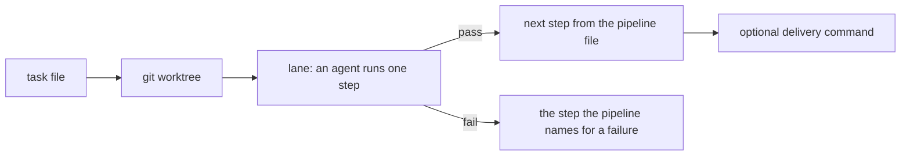

# spoolway documentation

spoolway is a command-line tool that runs coding agents as a pipeline. You describe the flow
once in a file. A background dispatcher moves every task through it in terminal panes and
asks you only where a decision is yours.

Each page covers one part of the system. The order below is the order most people need them.

## Start here

| Page | What it covers |
|---|---|
| [Concepts](concepts.md) | The terms: project, task, plan, pipeline, step, lane |
| [Installation and setup](installation.md) | Installing, `spoolway init`, updating, platform notes |

## Doing work

| Page | What it covers |
|---|---|
| [Tasks and the queue](tasks.md) | The task file, queueing, dependencies, conflicts |
| [Planning](planning.md) | The plan skills, the queue screen, trials, routines |
| [The dispatcher](dispatcher.md) | The board, scheduling, gates, pane layouts, stepping into a lane |
| [Jobs](jobs.md) | Running a routine on a cron schedule |

## Shaping the system

| Page | What it covers |
|---|---|
| [Pipelines](pipelines.md) | The pipeline file: steps, routing, converting your own workflow |
| [Prompts](prompts.md) | The prompt files steps run, and writing your own |
| [Agents and models](agents.md) | Agent profiles, agent kinds, sessions, local models |
| [Documentation and templates](documentation.md) | Domain documents and task skeletons |

## Safety, visibility, cost

| Page | What it covers |
|---|---|
| [Cost accounting](cost.md) | The usage ledger and model prices |
| [Comparing pipelines](eval.md) | What each pipeline costs to run, by pass rate and price |

## Reference

| Page | What it covers |
|---|---|
| [Configuration](configuration.md) | Every setting in the config file |
| [CLI reference](cli-reference.md) | Every command, subcommand and flag |
| [Migration guide](migrations.md) | The actions required between released versions |
| [Testing](testing.md) | The test suites and how to run them |
| [Releasing spoolway](releasing.md) | The release pipeline and the commands it runs |
| [The herdr plugin](herdr-plugin.md) | Installing spoolway as a herdr plugin, and the rehearsal before listing |

## How it works

You write a task and queue it. The dispatcher gives it a worktree and starts an agent in a
lane. The pipeline file decides where a pass and a fail go. The dispatcher itself uses no
model. A pipeline may finish locally or run a delivery command for the system you
use.

## What ships is a sample

Two pipelines and five prompts come with `spoolway init`, so a new project runs on its first
pass. They are a template. Edit them, cut steps, or replace them with the workflow your team
already follows: [Converting a workflow you already run](pipelines.md#converting-a-workflow-you-already-run).
