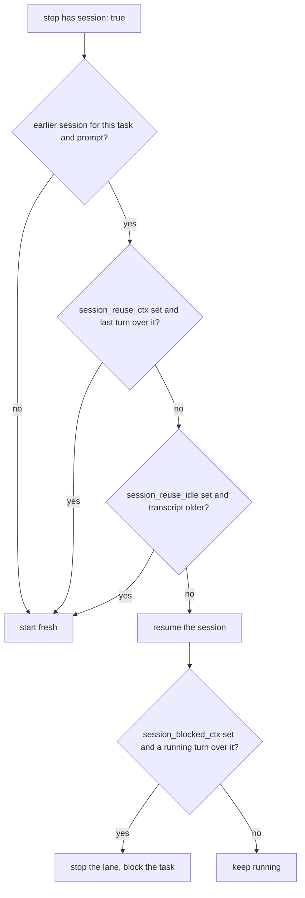

# Agents and models

An agent profile says which agent binary runs, how many at a time, and under what limits.
A pipeline step names a profile with `agent:`. The model and the effort are the step's own
keys. See [Which model a step runs](#which-model-a-step-runs).

## Profiles

Profiles live in `.spoolway/config.toml` under `[agents.<name>]`. Three ship:

| Profile | Kind | Used by |
|---|---|---|
| `pi` | `pi` | the shipped pipelines |
| `claude` | `claude` | the shipped pipelines |
| `codex` | `codex` | no shipped step |

Each shipped profile is named after its kind. You can name a profile anything, for example
`[agents.fast]` with `kind = "pi"`. A step is checked against the profiles the config
defines.

### Every profile key

| Key | Default | Meaning |
|---|---|---|
| `kind` | `pi` | Which agent binary this profile runs. See [Agent kinds](#agent-kinds). |
| `concurrency` | absent (`0`, unlimited) | Most lanes of this profile running at once. For a local model, set `models."<glob>".slots` instead. |
| `session_reuse_ctx` | `0` (off) | Percent of the model's context window. If the earlier session's last turn is larger, a `session: true` step opens a fresh session. `1..=100`. |
| `session_blocked_ctx` | `0` (off) | Percent of the model's context window. If a running lane's last turn is larger, the dispatcher stops the lane and blocks the task. Must be above `session_reuse_ctx` when both are set. |
| `permission_mode` | the kind's first mode; absent on `pi` | Whether the kind's lanes stop and ask about a tool call. `claude` ships `"auto"`, `codex` ships `"never"`. |

A profile carries no `model`, `context_window` or `args`. The model is a step key. The
context window is a `[models]` key. The argv is fixed per kind.

## Agent kinds

A kind is one row in spoolway's adapter table. The row says how the binary is launched, which
permission modes it accepts, how it takes an effort level, whether it runs headless, and where
its transcripts are read from.

| Kind | Permission modes | Effort | Headless | Skills directory | Transcripts |
|---|---|---|---|---|---|
| `pi` | none | none | yes | `.pi/skills` | `~/.pi/agent/sessions` |
| `claude` | `auto` (default), `acceptEdits`, `dontAsk`, `bypassPermissions`, `plan`, `manual` | `--effort <level>` | yes | `.claude/skills` | `~/.claude/projects` |
| `codex` | `never` (default), `on-request`, `untrusted` | `-c model_reasoning_effort=<level>` | yes, via `exec` | `.agents/skills` | `$CODEX_HOME/sessions` |

`spoolway agent list` prints this table for the installed binaries.

### Telling an interrupted turn from a finished one

Each kind writes a known last record when a person interrupts a turn with Escape. The
dispatcher reads that record off the transcript of every settled lane. See [A lane that
settles without reporting](dispatcher.md#a-lane-that-settles-without-reporting).

### Two ways to pin a session

Every lane's spend is read from the transcript spoolway pinned to that lane.

| Kind | How the session is pinned |
|---|---|
| `pi`, `claude` | spoolway mints a session id and passes it as `{session_id}`. The transcript file carries that id in its name. |
| `codex` | codex mints its own id. spoolway gives the lane its own `$CODEX_HOME` directory, so that home holds exactly one session. |

A codex lane's home links to the real `auth.json` and holds a copy of the real `config.toml`
with the worktree marked trusted. The lane runs with `-c check_for_update_on_startup=false`.
The home is removed when the task is archived.

Your own planning session gets its id from `$CLAUDE_CODE_SESSION_ID` or `$CODEX_THREAD_ID`,
and its transcript is read from the agent's own home.

### Cache warmth is a model's fact

A carried session is reused only while its transcript file is young enough. The limit is
`models."<glob>".session_reuse_idle`, matched by the same glob that prices the model:

```toml
[models."claude-*"]
session_reuse_idle = "5m"

[models."gpt-*"]
session_reuse_idle = "10m"
```

Unset means no age limit. Leave it unset on a local model. A llama.cpp cache has no timer,
and an expired limit makes the lane re-send the whole conversation.



### Accounting is optional, and its absence is a cost, not a refusal

A kind with no accounting row still launches and runs, but unmetered: no ledger lines, no
session reuse, and silence is read off the pane. Every shipped kind is metered.
`spoolway doctor` reports an unmetered profile as a note and still passes.

### Checking a kind

```
spoolway agent list                              # every kind: launch state, accounting state, binary
spoolway agent verify claude                     # one kind, clause by clause, nothing started
spoolway agent verify pi --live --model <name>   # plus one real turn and one resumed turn
```

`--live` checks that the turn ran, the prompt reached it, the transcript readings work, and
the resumed turn continued the same session. It needs a model: pass `--model`, or run it in a
project whose pipelines name one for that kind. Against a local endpoint it costs nothing.
codex needs `wire_api = "responses"` in its own config to talk to llama.cpp.

### Local models, and the pi integration

The shipped local steps run on `pi`. pi accepts a session id, prices its own transcripts, and
reports zero cost for a local model. The `pi` profile passes `--no-approve`, which skips the
project-trust dialog.

### Claude Code lanes

A `claude` lane receives its prompt as a file and is given the project's `.spoolway/`
directory, the project's own home and the repository's shared `.git` as extra workspace
directories with `--add-dir`. `bypassPermissions` is not the default mode, because many
organisations disable it.

### Leaving a pane without closing it

`claude` ends its session with `/exit` typed at its prompt. This lets a task's pane carry from
one step to the next. See [Vacating a pane](dispatcher.md#vacating-a-pane). Every other kind
has its panes closed and split again, one per step.

## The argument template

The argv a lane is started with is fixed per kind. Each row's template substitutes:

| Placeholder | Resolves to |
|---|---|
| `{model}` | The step's model |
| `{prompt_file}` | Absolute path to the composed system prompt |
| `{task_file}` | Absolute path to the task file |
| `{worktree}` | Absolute path to the task's worktree |
| `{repo}` | Absolute path to the project root |
| `{state_dir}` | Absolute path to the project's `.spoolway/` |
| `{project_home}` | Absolute path to the project's own home under `~/.spoolway/` |
| `{git_dir}` | Absolute path to the repository's shared `.git` |
| `{session_id}` | The session id spoolway minted for this lane |

`codex` has no `{session_id}`; its session is pinned by `$CODEX_HOME`. No part of the argv is
a config key.

## Which model a step runs

Exactly what its `model:` names. Every agent step must name one. `spoolway pipeline check`
and `spoolway doctor` refuse a step with a missing or blank model. See
[Pipelines](pipelines.md) for the step key.

### Effort

A step's `effort:` is a free string, handed to the kind's effort flag:

```yaml
- id: review
  agent: claude
  prompt: reviewer
  model: claude-opus-5
  effort: high
```

| Kind | How it is sent |
|---|---|
| `claude` | `--effort high` |
| `codex` | `-c model_reasoning_effort=high` |
| `pi` | not supported |

spoolway keeps no list of levels. `pipeline check` refuses `effort:` on a kind that cannot
carry one, and refuses the literal `auto`. No `effort:` sends nothing.

### Skills

A step's `skills:` names skills the lane invokes. Each kind reads them from its own directory,
listed in the kinds table above. `spoolway install` writes a project's skills there.
`pipeline check` refuses `skills:` on a command step and on a kind that loads none. Skill
names are not checked on disk; the agent resolves them at launch.

## Concurrency and the model server

`concurrency` caps how many lanes of one profile run at once. No shipped profile sets it.

For a local model, set `models."<glob>".slots` instead. It replaces `concurrency` for any
step naming that model. See
[`[models."<glob>"]`](configuration.md#modelsglob--what-a-model-costs-and-how-big-its-window-is).

A step capped by neither runs as many lanes as the queue offers. `spoolway doctor` names each
step in that state.

`session_reuse_ctx` and `session_blocked_ctx` read the model's `context_window` from
`[models]`. With no window set, a nonzero `session_reuse_ctx` opens a fresh session.

## What ends a lane

No profile carries a timeout. A busy lane runs until its turn ends.

A lane whose turn ended without `spoolway report` is sent the report contract again, up to
three times, each time it has written something since the last reminder. A lane that stays
quiet after a reminder is blocked on the next pass. Silence is read off the transcript file,
not the pane.

## What confines a profile

Nothing. A lane runs with the privileges of whoever started the dispatcher. Confine it with
the agent's own settings if you need to. See [Reach](concepts.md#reach).
