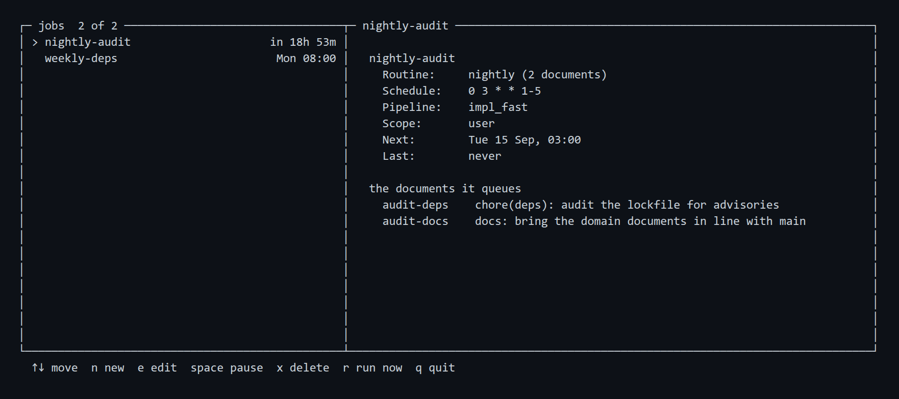
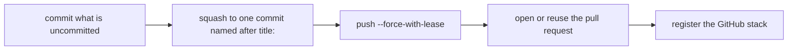

# CLI reference

Every command, subcommand and flag, in the order `spoolway --help` prints them. Where a
command has a page of its own, it is linked.

## Global flags

| Flag | Default | What it does |
|---|---|---|
| `-C`, `--repo <DIR>` | current directory's project | Run against this repository |
| `--json` | | Print machine-readable output, where the command supports it |
| `--help` | | Print the full help |
| `--version` | | Print the version |

## The `checkout:` line

Commands that read or write the tracked `.spoolway/` files answer for the checkout they run
in. When that checkout is a linked worktree, they print one line first naming it:

```
checkout: ~/.spoolway/worktrees/checkout-line (task/checkout-line)
```

In the main checkout nothing extra is printed. Under `--json` the same line is one JSON
object:

```
{"path":"/home/you/.spoolway/worktrees/checkout-line","branch":"task/checkout-line"}
```

The commands that print it: `pipeline show`, `pipeline check`, `pipeline list`, `pipeline
override`, `prompt list`, `prompt override`, `config show`, `config list`, `config get`,
`config path`, `config override`, `doctor` and `update`.

## Your work

### `spoolway queue`

Open the queue screen. The left pane lists one row per `group:` across the pending, queue and
archive directories. The right pane lists the highlighted group's tasks.


| Key | What it does |
|---|---|
| `↑` `↓` / `j` `k` | Move the cursor |
| `space` | Select a group. A group is queued whole |
| `enter` | Check the selection, queue it, and offer to start a dispatcher |
| `g` | Set or clear a `gate_at` on the highlighted task |
| `o` | Open the highlighted task's document in your editor |
| `f` | Filter groups by name, task id and title. `enter` keeps the filter, `esc` clears it |
| `h` | Show hidden groups: first the queued ones, then the finished ones |
| `p` | Fork the group into a trial. See [Trials](planning.md#trials) |
| `r` | Switch to the routines pane. See [Routines](planning.md#routines) |
| `s` | Save the highlighted group into `.spoolway/routines/<name>/` |
| `q` | Quit |

Queueing deletes the group's documents from the pending directory. A group that fails
validation is refused and nothing is deleted. See [Queueing a plan](planning.md#queueing-a-plan).

### `spoolway queue add`

Queue task documents. This is the only way a task enters the queue. See [Queueing a
task](tasks.md#queueing-a-task).

```
spoolway queue add --from <PATH>
```

| Flag | Default | What it does |
|---|---|---|
| `--from <PATH>` | | A document to queue: a file, a directory of `*.md` files, or `-` for a `---`-separated stream on stdin. Repeatable. Every document is validated together and written all or none |
| `--dry-run` | | Validate and print what would happen. Writes nothing and opens no ticket |

With no `--from`, it prints the default pipeline's skeleton document to fill in.

With `[issue_tracking]` configured, it opens a ticket per document first. See
[`open`](configuration.md#open--a-fifth-event-run-by-queue-add-itself).

### `spoolway queue list`

Print whether a dispatcher is running, then one row per task: TASK, PIPELINE, STEP, STATE,
NEXT, grouped by `group:`.

```
spoolway queue list
spoolway queue list --json
```

`--json` prints the dispatcher's pid and one object per task.

### `spoolway queue show <task>`

Print one task file.

### `spoolway queue conflicts`

Report queued tasks whose `touches` globs overlap with no `depends_on` between them.

### `spoolway queue pause <task>`

Interrupt the task's live lane and park it on `paused`.

```
spoolway queue pause <task> [--force]
```

| Flag | Default | What it does |
|---|---|---|
| `--force` | | Kill a running command step and pause anyway. Without it, a task running a command step is refused |

### `spoolway queue resume <task>`

Resume one task. Same as `spoolway resume <task>` with no other flags.

### `spoolway queue remove <task>`

Move a task out of the queue and back into the pending directory. Works on `queued`, `paused`
or `blocked` tasks with no lane running and no worktree cut. Anything else is refused.

### `spoolway group list`

Print one line per group with open tasks: the group, how many tasks are open, and their ids.

```
$ spoolway group list
auth                          2 open — auth-api, auth-session
pipeline-handover             1 open — pipeline-and-prompts
```

### `spoolway dispatch`

Run the pipeline. It draws the live board and keeps running until the queue is empty.


| Key | What it does |
|---|---|
| `↑` `↓` | Move the cursor |
| `r` / `R` | Resume the highlighted paused or blocked task / every paused task |
| `p` / `P` | Interrupt and park the highlighted task / every live lane |
| `u` / `U` | Move the highlighted queued task / every unstarted task back to pending |
| `ctrl-c` | Stop the run |

| Flag | Default | What it does |
|---|---|---|
| `--interval <DURATION>` | `dispatch.interval` | Time between passes, e.g. `5m` |
| `--dry-run` | | Print what one pass would do, then exit. Nothing is started or written |
| `--plain` | | Print one line per pass. The board is not drawn |
| `--unattended` | `unattended.enabled` | Start a lane on `blocked` for every blocked task. Nothing waits for a person. See [Unattended runs](pipelines.md#unattended-runs) |
| `--attended` | | Park blocked tasks for a person, whatever the config says |
| `--force` | | Start past the restart guard |

If another dispatcher already holds the lock, the board opens read-only, headed `watching
dispatcher`.

The restart guard refuses the fifth start in 30 seconds when the four before it could not
run. See [Restarting into a repo that cannot run](dispatcher.md#restarting-into-a-repo-that-cannot-run).

When an [overrides layer](configuration.md#the-overrides-layer) is active, the run first shows
what is patched and waits for a key:

```
  overrides are active for this project

    pipelines/impl.yml        2 keys      implement.model, test.timeout
    prompts/reviewer          whole file
    config.toml               1 key       agents.claude.concurrency

  [enter] start the run   [esc] back   [x] don't ask again until this changes
```

| Exit code | Meaning |
|---|---|
| `0` | The run finished |
| `3` | Empty queue and no job enabled |
| `4` | Another dispatcher holds the lock |
| `5` | The restart guard refused the start |
| `1` | Any other error |

### `spoolway issue show <reference>`

Read one issue through the `[issue_tracking]` hook's `fetch` event and print it as JSON:
`ref`, `url`, `title`, `state`, `labels`, `body`, `comments`.

```
spoolway issue show <reference>
```

The reference is passed to the hook as `SPOOLWAY_REF`, exactly as typed. Refused when no hook
is configured or the hook has no `fetch` branch. See
[`fetch`](configuration.md#fetch--a-sixth-event-run-by-spoolway-issue-show).

### `spoolway jobs`

Open the jobs screen. It is the only place that writes a cron job.



| Key | What it does |
|---|---|
| `n` | Write a new job: pick the routine, type the schedule, pick the pipeline |
| `e` | Edit the highlighted job through the same three panels |
| `space` | Pause or resume the highlighted job |
| `x` | Delete the highlighted job, after confirming |
| `r` | Fire the highlighted job now |
| `q` | Quit |

See [Jobs](jobs.md).

### `spoolway jobs list`

Print every job as a table: `NAME`, `SCOPE`, `SCHEDULE`, `PIPELINE`, `NEXT`, `LAST`.

```
spoolway jobs list
spoolway jobs list --json
```

`NEXT` reads `paused`, `bad expr`, `never`, or the next firing time. `--json` prints one
object per job.

### `spoolway jobs run <name>`

Fire one job now. Its schedule is unchanged.

### `spoolway eval`

Compare versions of the pipeline and prompts by what they cost. Bare, in a terminal, it opens
the eval screen. With any flag, or when stdout is not a terminal, it prints a table.

```
spoolway eval
```


| Key | What it does |
|---|---|
| `tab` | Cycle the views: `pipelines`, `steps`, `runs` |
| `↑` `↓` | Move the cursor |
| `f` | Open the filter panel |
| `e` | Export the rows on screen to `.spoolway/evals/eval-<view>-<timestamp>.csv` |
| `r` | Refresh |
| `q` | Quit |

| Flag | Default | What it does |
|---|---|---|
| `--pipeline <NAME>` | | One pipeline only |
| `--step <STEP>` | | One step only |
| `--since <WHEN>` | | Start of the window: a duration ago (`24h`, `7d`), a date (`2026-08-01`) or a month (`2026-08`) |
| `--until <WHEN>` | | End of the window, same forms |
| `--limit <N>` | `10` | Versions per pipeline |
| `--all` | | Every project |
| `--project <NAME>` | | One named project |
| `--runs` | | One row per run |
| `--task <ID>` | | `--runs` only: one task's runs |
| `--group <GROUP>` | | `--runs` only: one group's runs |
| `--trial <ID>` | | `--runs` only: one trial's arms side by side |
| `--discard <ID>` | | Delete a whole trial: every arm's document, worktree, branch, pane and run files. The ledger rows and the source group stay |
| `--force` | | `--discard` only: stop live lanes and discard anyway |
| `--csv` | | Print the rows as CSV |
| `--by`, `--month` | | Deprecated. Use `spoolway spend` |

See [Comparing versions](eval.md).

### `spoolway spend [<task|group|step|model|project|month|lane>]`

Print what the pipeline has spent, grouped by the named cut. Bare, it groups by `step`, or by
`project` when more than one project is in scope.

```
spoolway spend
spoolway spend task --since 7d
```

| Flag | Default | What it does |
|---|---|---|
| `--since <WHEN>` | | Start of the window, same forms as `eval` |
| `--until <WHEN>` | | End of the window |
| `--month <YYYY-MM>` | | One calendar month |
| `--all` | | Every project |
| `--project <NAME>` | | One named project |
| `--csv` | | Print the rows as CSV |

`--json` prints the raw ledger entries. See [Cost accounting](cost.md).

## When something needs you

### `spoolway lane [<lane>]`

Read a lane's output, answer it, or open its session. With no lane named, list the lanes.

```
spoolway lane
spoolway lane "<task> · <step>"
spoolway lane "<task> · <step>" -m "yes, use the second option"
spoolway lane "<task> · <step>" --attach
```

| Flag | Default | What it does |
|---|---|---|
| `-n`, `--lines <N>` | `100` | How many lines from the end |
| `-m`, `--message <WORDS>` | | Answer a lane that stopped on a question |
| `--attach` | | Open the lane's session in this terminal |

`-n` cannot be combined with `-m` or `--attach`. `--attach` needs a lane name.

### `spoolway resume <task>`

Carry a stopped task on. A `blocked` task resumes the step it stopped on. A `paused` task goes
on to the gated step's `on_pass`.

```
spoolway resume <task>
spoolway resume <task> --reject -m "the migration is missing"
spoolway resume <task> --stage review
```

| Flag | Default | What it does |
|---|---|---|
| `--stage <STEP>` | | Resume at this step instead |
| `--reject` | | Send a paused task back along the gated step's `on_fail`, or to `blocked` when it has none |
| `-m`, `--message <TEXT>` | | Note for the status log. With `--reject`, also written into `## Handoff` |

See [Gates](pipelines.md#gates).

## Shaping the project

### `spoolway pipeline show`

Print every pipeline as a flow, with every default resolved and each pipeline's
`description:` under its header.

```
$ spoolway pipeline show
pipeline `impl`  (default)  entry: implement
    One unit of feature work, start to finish: implement against the acceptance criteria, review the diff, carry the change into the end-to-end suites, then document and hand over.

  implement  agent     agent=claude prompt=implementer model=claude-sonnet-5 session
             Write the code to satisfy the task's acceptance criteria.
             pass -> review   fail -> blocked

  review     agent     agent=codex prompt=reviewer model=gpt-5.6-sol session loop=implement:2 exit=blocked
             Check the diff against the acceptance criteria and project standards.
             pass -> e2e   fail -> implement

  suite      command   waits timeout=45m last-of-chain
             The end-to-end suites, on the last task of the chain.
             run: scripts/e2e-pr.sh
             pass -> document   fail -> e2e
```

### `spoolway pipeline check`

Validate every pipeline file, its agent references and its prompts against the config.

```
$ spoolway pipeline check
3 pipeline(s) valid: ["bugfix", "default", "local"], agents ["claude", "pi"]
```

A missing or overlong `description:` is a warning, not a failure.

### `spoolway pipeline contract`

Print the pipeline format: every key, every rule refused at load, this project's agent
profiles and prompts, and a blank pipeline to copy.

Copy the blank to `.spoolway/pipelines/<name>.yml`, delete what you do not need, and run
`spoolway pipeline check`.

### `spoolway pipeline list`

Print every pipeline's name and description, marking the default.

```
$ spoolway pipeline list
bugfix
    Reproduce the bug first with a failing test, fix it, then run the same reproduction again to prove it is gone. For a defect with a known symptom and a way to trigger it, never for new work.

impl (default)
    One unit of feature work, start to finish: implement against the acceptance criteria, review the diff, carry the change into the end-to-end suites, then document and hand over.
```

### `spoolway pipeline list --json`

The same list as JSON: the default pipeline's name, then one entry per pipeline.

```
$ spoolway pipeline list --json
{"default": "impl", "pipelines": [{"name": "bugfix", "default": false, "description": "..."}, ...]}
```

A pipeline with no `description:` carries `"description": null`.

### `spoolway pipeline gen [--plan <path>]`

Open an agent session in a new pane to write a new pipeline. The session runs the
`[pipeline_gen]` profile and the `spoolway-config` skill. The command itself writes nothing.

```
$ spoolway pipeline gen --plan ~/.spoolway/myproject/plans/my-plan.html

agent         claude · claude-opus-5 · effort high
plan          ~/.spoolway/myproject/plans/my-plan.html

opened a pane on this checkout
prompted `spoolway-config`

Nothing is written yet. Answer it in that pane.
```

| Flag | Default | What it does |
|---|---|---|
| `--plan <PLAN>` | | What the pipeline is for: an issue URL, a page path, a ticket. Passed through as typed |

Refused when `pipeline_gen.pipeline_model` is blank, when `pipeline_gen.pipeline_agent` names
no profile, or when `dispatch.backend` is `headless`. See
[`[pipeline_gen]`](configuration.md#pipeline_gen--generating-a-pipeline).

### `spoolway pipeline override <name> --set <step>.<key>=<value>`

Patch one step's key in the [overrides layer](configuration.md#the-overrides-layer). The
tracked file is not touched.

```
$ spoolway pipeline override impl --set implement.model=claude-opus-5

  wrote ~/.spoolway/spoolway/overrides/pipelines/impl.yml
    implement.model   claude-sonnet-5 -> claude-opus-5

  active on the next dispatcher pass. `spoolway override drop impl` to clear it.
```

| Flag | Default | What it does |
|---|---|---|
| `--set <STEP.KEY=VALUE>` | required | The step, key and new value |

A step the pipeline does not have, or a key the merge refuses, is refused by name. `id:`
cannot be set. See [`spoolway override`](#spoolway-override-list--promote--drop).

### `spoolway prompt contract`

Print the contract a prompt is written against, rendered from this project's pipeline.

```
spoolway prompt contract [--step <STEP>] [--pipeline <PIPELINE>] [--task <TASK>]
```

| Flag | Default | What it does |
|---|---|---|
| `--step <STEP>` | first agent step of the default pipeline | Which step to render for |
| `--pipeline <PIPELINE>` | the default pipeline | Which pipeline the step belongs to |
| `--task <TASK>` | a sample task | Render against a real queued task |

### `spoolway prompt list`

Print every prompt and which steps run it.

### `spoolway prompt show <name>`

Print one prompt file.

### `spoolway prompt override <name>`

Copy the tracked prompt into `overrides/prompts/<name>/PROMPT.md` to edit there. An override
replaces the whole file. See the [overrides layer](configuration.md#the-overrides-layer).

### `spoolway agent list`

Print every agent kind spoolway knows, with its launch state, accounting state and binary
path. `--json` prints one object per kind.

### `spoolway agent verify <kind>`

Check one agent kind clause by clause: binary, launch row, args, env, session pinning, resume,
accounting, transcript directory. The exit code follows the launch checks only. See [Agents
and models](agents.md#accounting-is-optional-and-its-absence-is-a-cost-not-a-refusal).

```
spoolway agent verify claude
spoolway agent verify pi --live --model qwen3-coder
```

| Flag | Default | What it does |
|---|---|---|
| `--live` | | Run one real turn and one resumed turn, and read the transcript. Spends tokens |
| `--model <MODEL>` | a model this project's pipelines name for the kind | The model the live turns run |

`--json` prints the launch checks as one object. `--json` and `--live` cannot be combined. A
live turn is killed after 180 seconds.

Neither `agent list` nor `agent verify` needs a project.

### `spoolway task contract`

Print the task-document contract as JSON, or validate documents against it.

```
spoolway task contract
spoolway task contract --from ~/.spoolway/<project>/pending/
```

| Flag | Default | What it does |
|---|---|---|
| `--from <PATH>` | | A document, a directory of `*.md` files, or `-` for stdin. Repeatable. Checked as one set. Writes nothing |

The contract holds the default pipeline, the sizing guidance, the output directory, the
allowed and refused keys, one sentence per key, each pipeline's id budget and body skeleton,
and the rules that hold across a set. `--from` runs the same validation as `queue add --from`
and exits non-zero on a refusal.

### `spoolway template contract`

Print the two prose templates a project owns and where each lives.

| Template | File |
|---|---|
| Task body | `.spoolway/templates/tasks/<pipeline>.md` |
| Lane messages | `.spoolway/templates/lane-prompts.md` |

### `spoolway hook contract`

Print every event an issue-tracking hook runs on and the environment each one carries. See
[`[issue_tracking]`](configuration.md#issue_tracking--a-hook-fired-on-four-task-events).

| Event | When it runs |
|---|---|
| `open` | Before a task is queued. Synchronous |
| `queued`, `blocked`, `paused`, `done` | When a task reaches that state |
| `fetch` | From `spoolway issue show`. Synchronous |

### `spoolway config contract`

Print every setting `config.toml` may carry, its values, its default and one sentence each.

### `spoolway config show` / `list` / `path` / `get <key>` / `set <key> <value>` / `edit`

Read or write config values.

```
spoolway config show
spoolway config list
spoolway config path
spoolway config get agents.pi.concurrency
spoolway config set agents.pi.concurrency 4
spoolway config edit
```

| Subcommand | What it does |
|---|---|
| `show` | Print the whole file |
| `list` | Print every scalar setting as `key = value`. `--json` prints `[{"key","value"}, …]` |
| `path` | Print the file's path |
| `get <key>` | Print one value |
| `set <key> <value>` | Write one value into the project's file. Refused inside a linked worktree |
| `edit` | Open the file in `$EDITOR` and validate it on save |

See [Configuration](configuration.md).

### `spoolway config override`

Open `overrides/config.toml` in `$EDITOR`, creating it if needed. See the [overrides
layer](configuration.md#the-overrides-layer).

### `spoolway override contract`

Print the merge rule, what a pipeline, config or prompt patch may carry, and the four
`override` commands.

### `spoolway override list` / `promote` / `drop`

Manage the [overrides layer](configuration.md#the-overrides-layer).

```
$ spoolway override list

TARGET                     KIND        OVERRIDES
pipelines/impl.yml         patch       implement.model, test.timeout
prompts/reviewer           whole file  —
config.toml                patch       agents.claude.concurrency

layer version  a91c4f02    3 artifacts    `override promote <target>` to keep one
```

| Subcommand | What it does |
|---|---|
| `list` | One line per patched artifact. `--json` prints an array |
| `promote <target>` | Write the patched values into the tracked file and clear the entry. Refused inside a linked worktree |
| `drop [<target>]` | Remove one entry, or the whole layer when none is named |

A target is a bare pipeline name, or the form `list` prints: `pipelines/<name>.yml`,
`prompts/<name>`, `config.toml`.

```
$ spoolway override promote impl && git diff --stat

  wrote .spoolway/pipelines/impl.yml
    implement.model   claude-opus-5
    test.timeout      90m
  cleared pipelines/impl.yml from the layer

 .spoolway/pipelines/impl.yml | 4 ++--
 1 file changed, 2 insertions(+), 2 deletions(-)
```

### `spoolway models`

Print every model this project's pipelines name, with its window, prices, `SLOTS`, `EXCL`
and which price table answered. A model in no table is `unknown`.

```
spoolway models
spoolway models refresh [--vendor]
```

| Subcommand | What it does |
|---|---|
| `refresh` | Fetch litellm's price map and replace `~/.spoolway/model-prices.json` |
| `refresh --vendor` | Replace this checkout's `assets/model-prices.json` instead |

See [Pricing](cost.md#pricing).

## Setting up

### `spoolway init`

Scaffold `.spoolway/` in a repository: config, pipelines, prompts, templates, hook scripts and
skills. At a terminal it asks for the agent, the tracker and the project key. With no terminal
it takes the defaults.

`init` also binds this checkout to its home under `~/.spoolway/`. The binding is two files that
must agree: an id stamped into the checkout's `.git`, and a `project.toml` in the home holding
that id and the checkout's path. A fresh clone binds itself on whatever command it runs first.
`--adopt` and `--new-id` write a binding over one that already exists. See [Runtime
state](configuration.md#runtime-state).

```
spoolway init
spoolway init --provider codex --tracker github --project-key owner/repo
```

| Flag | Default | What it does |
|---|---|---|
| `--provider <claude\|codex>` | `claude` | The coding agent whose skills are installed and which becomes the project's agent profile |
| `--tracker <github\|jira\|none>` | `none` | The tracker `[issue_tracking]` names |
| `--project-key <KEY>` | | Where tickets open: `owner/repo` on github, a project key on jira |
| `--force` | | Overwrite existing config, pipeline and prompt files |
| `--adopt <NAME>` | | Bind this checkout to the home already at `~/.spoolway/<NAME>/` and stamp it with that home's id. `NAME` is the home's directory name, such as `api-8w4r2c`. Prints what that home already holds |
| `--new-id` | | Mint this checkout a fresh id and bind it to the fresh home that id keys |
| `--take-over` | | Accepted and ignored |

Run again in a project that already has a config, it installs skills and changes nothing else.
Every hook script is written whatever the tracker answer. See [Installation and
setup](installation.md#scaffolding-a-project).

### `spoolway install <provider>`

Install the pipeline skills for one coding agent. `init` runs this for you.

```
spoolway install codex
```

| Provider | Skills go in |
|---|---|
| `claude` | `.claude/skills/` |
| `codex` | `.agents/skills/` |
| `pi` | `.pi/skills/`. Loaded once the project is trusted |

| Flag | Default | What it does |
|---|---|---|
| `--force` | | Overwrite files that already exist |

### `spoolway update`

Install the latest release and bring forward the files spoolway writes, without touching what
you wrote. Prompts and task skeletons are never touched. After an npm self-update at a
terminal, it prints the release notes.

It writes the checkout it runs in. In a linked worktree that is the worktree's own files, not
the main checkout's, and the [`checkout:` line](#the-checkout-line) names which one.

```
spoolway update --dry-run
spoolway update
```

| Flag | Default | What it does |
|---|---|---|
| `--dry-run` | | Print what would change. Writes and installs nothing |
| `--replace <PATH>` | | Replace one file with the shipped version. Yours is saved beside it as `.bak`. Repeatable |

The binary is only updated where npm installed it. A running dispatcher stops the install.
`update` asks npm which release is out each time it runs. The wait is bounded. If npm does
not answer in time, `update` uses the last known version and carries on.

### `spoolway whats-new`

Print the release notes embedded in the installed binary. Works offline from any directory.

```
spoolway whats-new
spoolway whats-new --since 0.1.0
```

| Flag | Default | What it does |
|---|---|---|
| `--since <VERSION>` | | Print every embedded release after this version, oldest first |

### `spoolway doctor`

Check that everything the configured pipeline needs is present. It still runs when the config
or a pipeline file does not parse. One check opens a throwaway pane and runs a command in it
to prove a lane can start.

```
$ spoolway doctor
28 checks passed. Everything checks out.
```

| Flag | Default | What it does |
|---|---|---|
| `-v`, `--verbose` | | Print every check, including the ones that passed |
| `--no-live` | | Skip the throwaway-pane check |

By default it prints only failures, notes and a closing line. A failing run exits non-zero.
`--json` prints the findings as one object.

## Called by lanes, not by you

Prompts call these. You rarely run them yourself.

### `spoolway report [<task>]`

Report a step's outcome. The task defaults to `$SPOOLWAY_TASK`. A lane may only report on its
own task.

```
spoolway report --pass -m "tests green"
spoolway report --fail -m "review found a missing migration" --handoff "add the migration for sessions"
```

| Flag | Default | What it does |
|---|---|---|
| `--pass` | | The step succeeded. Route along `on_pass` |
| `--fail` | | The step failed. Route along `on_fail` |
| `--block` | | Something outside the step is in the way. Escalate |
| `--pause` | | Only on `blocked`: park the task on `paused` for a person |
| `-m`, `--message <TEXT>` | | One line for the status log |
| `--handoff <TEXT>` | | One thing the next step should know. Repeatable. Written into `## Handoff` |

### `spoolway stack [<task>]`

Hand a task's change over with git and `gh`. No model, no rebase. Run in the task's worktree,
usually as the `handover` step's `run:` line. See [`spoolway stack` hands the change
over](pipelines.md#spoolway-stack-hands-the-change-over).



The task defaults to `$SPOOLWAY_TASK`. A blank `title:` is refused. It never merges anything.
It exits 0 on success and non-zero on any git or `gh` failure.
