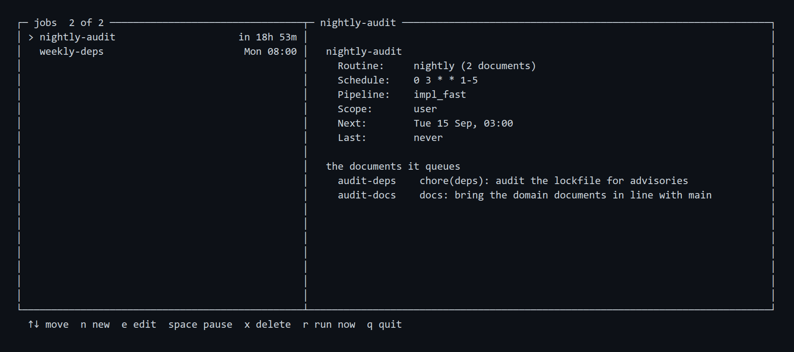
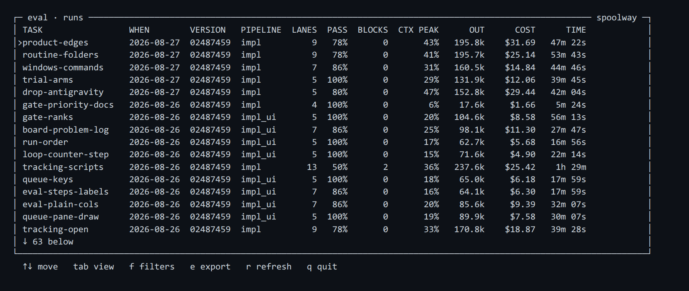
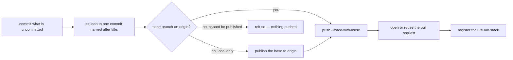

# CLI reference

Every command, subcommand and flag, in the order `spoolway --help` prints them. Where a
command has a page of its own, it is linked.

## Global flags

| Flag | Default | What it does |
|---|---|---|
| `-C`, `--repo <DIR>` | current directory's project | Run against this repository |
| `--json` | | Print machine-readable output, where the command supports it |
| `--help` | | Print the full help |
| `--version` | | Print the version |

## The `checkout:` line

Commands that read or write the tracked `.spoolway/` files answer for the checkout they run
in. When that checkout is a linked worktree, they print one line first naming it:

```
checkout: ~/.spoolway/worktrees/checkout-line (task/checkout-line)
```

In the main checkout nothing extra is printed. Under `--json` the same line is one JSON
object:

```
{"path":"/home/you/.spoolway/worktrees/checkout-line","branch":"task/checkout-line"}
```

The commands that print it: `pipeline show`, `pipeline check`, `pipeline list`, `pipeline
override`, `prompt contract`, `prompt list`, `prompt override`, `config show`, `config list`,
`config get`, `config path`, `config override`, `doctor` and `sync`.

## Your work

### `spoolway`

At a terminal, with no other command typed, opens one screen: five tabs, dispatch, queue,
routines, jobs and eval, in that order. It opens on the queue tab.

```
spoolway
```

One `spoolway` runs per project at a time. A second bare `spoolway`, or a typed `spoolway
dispatch`, refuses while this screen is open, or while a dispatcher started from the CLI is
running, printing the one line and exiting without drawing anything:

```
$ spoolway
Dispatcher already running
```

A project is `-C <DIR>` or the current directory's repository. A screen open in one project
never refuses one opened in another.

The screen draws on the terminal's alternate screen for as long as it is open, so scrolling up
finds nothing older than the current frame and the mouse wheel does nothing. `q` puts the
terminal back exactly as it was before spoolway started.

The strip is drawn bold, with no colour. The open tab's label is marked with brackets, the
same mark the key line gives a key: `[queue]`, `[dispatch]`. `←` sits one space outside
`dispatch`, the first tab, and `→` sits one space outside `eval`, the last. One blank row sits
above the strip and one below it.

| Key | What it does |
|---|---|
| `←` `→` | Move to the neighbouring tab, when no popup or sub-mode of the tab's own is open |
| `q` | Quit the whole screen, when no popup or sub-mode of the tab's own is open |

Inside the eval tab's filter panel and any popup drawn over a tab, `←` and `→` keep their own
meaning instead.

Each tab draws its own screen, under the strip. The dispatch tab draws the board inside a box
titled `dispatch`, as wide and as tall as the terminal allows, from a `spoolway dispatch` child
it starts and stops. The key line draws under the box, the same as under the queue, routines,
jobs and eval screens. The queue, jobs and eval tabs draw the queue, jobs and eval screens
described below; the routines tab draws the routine list, see
[Routines](planning.md#routines). Typed bare, `spoolway queue`, `spoolway jobs` and `spoolway
eval` print their usage or their tables instead.

The dispatch tab runs no pass itself. `enter` starts dispatching the way `unattended.enabled`
says, asking the overrides and warnings gates as popups first, each only when it has something
to say, then spawns a `spoolway dispatch` child. The moment the child starts, a `Starting
dispatcher` popup covers the board, naming no key: `enter`, the arrow keys and every other key
on this page still reach the board underneath it. It closes once the child's first pass has
claimed a slot or found nothing to claim, and does not open again on a later pass. `enter`
again, over a running child, opens a popup asking how to stop it, in place of `Starting
dispatcher` if that is still up:

```
[enter] let running steps finish
[i] interrupt them now   [esc] back
```

`enter` there stops the child the way `ctrl-c` does: nothing is torn down, and every lane keeps
running. `i` interrupts every live agent turn and kills every running command step first, parks
each of those tasks on `paused`, then stops the child. `esc` leaves the dispatcher running, and
a second `enter` while a stop is already going does nothing. Starting dispatching again resumes
every task that stop parked. See [Reading the state](dispatcher.md#reading-the-state). The
header reads `dispatcher running` and the child's pid, or `dispatcher stopped` with no pid once
it has stopped, next to a count of the steps still working (`3 steps finishing`, `1 step
finishing` for one, left out once none are). `r`/`R`, `p` and `u`/`U` work whether or not a
child is running. `q` or `ctrl-c` quits the whole screen and stops dispatching too.

A child the tab started stays up on an empty queue and the board reads `nothing queued`; only
`spoolway dispatch` run from a terminal exits on an empty queue. A child that exits on its own —
a refusal, or a spend ceiling — shows the reason in a popup, closed with `enter`. Ending before
its first pass, including under the `Starting dispatcher` popup, shows that reason there instead.


With stdout not a terminal — `spoolway | cat`, a script — it prints the grouped help instead,
the same as `spoolway --help`.

### `spoolway queue`

With no subcommand, prints its usage and exits, the same as `spoolway queue --help`.

Bare `spoolway`'s queue tab draws the queue screen. The left pane lists one row per `group:`
that still has a task to queue or has every task archived. A group with every task already
queued never appears. The right pane lists the highlighted group's tasks.


| Key | What it does |
|---|---|
| `↑` `↓` / `j` `k` | Move the cursor |
| `tab` | Switch focus between the groups and tasks panes |
| `esc` | With the tasks pane focused, return focus to the groups pane |
| `space` | Select a group. A group is queued whole |
| `enter` | Check the selection, queue it, and show what queued |
| `g` | With the tasks pane focused, set or clear a `gate_at` on the highlighted task |
| `o` | With the tasks pane focused, open the highlighted task in your editor |
| `f` | Filter groups by name, task id and title. `enter` keeps the filter, `esc` clears it |
| `h` | Show or hide done groups. A queued group never appears |
| `t` | Fork the group into a trial. See [Trials](planning.md#trials) |
| `s` | Save the highlighted group into `.spoolway/routines/<name>/`. See [Routines](planning.md#routines) |

Queueing deletes the group's pending tasks from the pending directory. A sibling task
already in the queue or the archive is left where it is. A group that
fails validation is refused and nothing is deleted. See [Queueing a
plan](planning.md#queueing-a-plan). Queueing a group or a routine ends on a popup naming what
queued. Below the list, a line says whether a dispatcher will pick the work up: `Dispatcher is
running` or `Start the dispatcher to begin working`. `enter` closes it back to the screen.

With `[issue_tracking]` configured, `enter` first checks the hook's declared tool
requirements. A requirement this machine does not meet draws a gate naming what is unmet:
`enter` queues the group with `tracking: off` written onto every task, and `esc` returns to
the queue screen with nothing queued. A task queued with `tracking: off` fires no
`[issue_tracking]` hook event and is never held waiting on one. See [the shipped hook
scripts](configuration.md#the-shipped-hook-scripts).

When every requirement is met and the batch still has a task with no `ticket:`, `enter` asks
before it opens any ticket. The question names the tracker and lists every task in the batch.
`enter` opens the tickets and queues, `n` queues the batch with `tracking: off` written onto
every task instead, and `esc` returns to the queue screen with nothing queued. Once the hook
runs, a popup fills in each task's row as the hook answers it and takes `enter` only once every
row is done. Queueing a routine from the routines tab asks the same question. A trial never
asks and opens no ticket. See
[`open`](configuration.md#open--a-fifth-event-run-by-queue-add-itself).

### `spoolway queue add`

Queue tasks. This is the only way a task enters the queue. See [Queueing a
task](tasks.md#queueing-a-task).

```
spoolway queue add --from <PATH> --base <BRANCH>
```

| Flag | Default | What it does |
|---|---|---|
| `--from <PATH>` | | A task to queue: a file, a directory of `*.md` files, or `-` for a `---`-separated stream on stdin. Repeatable. Every task is validated together and written all or none |
| `--base <BRANCH>` | | The branch the whole submission is cut from and merges into. A task's own `base:` wins over it |
| `--dry-run` | | Validate and print what would happen. Writes nothing and opens no ticket |

A task that sets neither its own `base:` nor `--base` is refused by name and nothing is
written. A `base:` that exists only on `origin` is accepted; the worktree is cut from
`origin/<base>` later, with no local branch made for it. A base on neither is refused, naming
both places.

With no `--from`, it prints a skeleton task to fill in, with a `pipeline:` row to fill in.

A `--from` path under this project's own pending directory is deleted once the batch is
written. A `--from` path anywhere else, including `-`, is read and left alone.

With `[issue_tracking]` configured, it checks the hook's declared tool requirements first; an
unmet one prints the same gate the queue screen draws and proceeds without a ticket, writing
`tracking: off` onto every task instead, since there is no key to wait on. Otherwise it opens a
ticket per task. See
[`open`](configuration.md#open--a-fifth-event-run-by-queue-add-itself).

### `spoolway queue list`

Print whether a dispatcher is running, then one row per task: TASK, PIPELINE, STEP, STATE,
NEXT, grouped by `group:`.

```
spoolway queue list
spoolway queue list --json
```

`--json` prints the dispatcher's pid and one object per task.

### `spoolway queue show <task>`

Print one task file.

### `spoolway queue pause <task>`

Interrupt the task's live lane and park it on `paused`.

```
spoolway queue pause <task> [--force]
```

| Flag | Default | What it does |
|---|---|---|
| `--force` | | Kill a running command step and pause anyway. Without it, a task running a command step is refused |

### `spoolway queue resume <task>`

Resume one task. Same as `spoolway resume <task>` with no other flags.

### `spoolway queue unqueue <task>`

Carry a not-started task back to the pending directory, with every reserved key
stripped. `spoolway queue add --from` takes the result again unchanged. The board's `u` key
carries the same task and every unstarted task that depends on it; this command has no panel
to list a chain on, so it refuses instead.

```
spoolway queue unqueue <task>
spoolway queue unqueue --all
spoolway queue unqueue <task> --force
```

| Flag | Default | What it does |
|---|---|---|
| `--all` | | Every not-started task, the way the board's `U` does. Refused together with `--force` |
| `--force` | | Interrupt any live lane, record uncommitted work, tear the checkout down, then unqueue a task that has started. No-op on a task still `queued` |

A task that has started is refused, naming its stage, its checkout when it has one, and both
routes onward: `spoolway queue pause <task>` to stop it in place, or `--force` to tear the
checkout down and unqueue it anyway. A task another queued sibling names in `depends_on` is
refused too, naming that sibling. A task already sitting in pending under the same id
refuses the move and leaves the queue file in place.

### `spoolway group list`

Print one line per group with open tasks: the group, how many tasks are open, and their ids.

```
$ spoolway group list
auth                          2 open — auth-api, auth-session
pipeline-handover             1 open — pipeline-and-prompts
```

### `spoolway dispatch`

Run the pipeline. It prints one line per pass and keeps running until the queue is empty.
`ctrl-c` stops the run. Bare `spoolway`'s dispatch tab draws the board instead of printing —
see [`spoolway`](#spoolway).

| Flag | Default | What it does |
|---|---|---|
| `--unattended` | `unattended.enabled` | Start a lane on `blocked` for every blocked task. Nothing waits for a person. See [Unattended runs](pipelines.md#unattended-runs) |
| `--attended` | | Park blocked tasks for a person, whatever the config says |

`spoolway dispatch` asks herdr which pane it is running in and refuses to start outside one.
See [The dispatcher](dispatcher.md#running-it).

Before anything else, each pre-loop check prints its own line as it returns:

```
  spoolway dispatch

  starting
    ✓ queue read            12 tasks
    ✓ task routes           impl_ui, impl, release
    ✓ backend available     herdr
    ✓ git identity
    ✓ index lock
    ✓ backend checkout
```

A check still running names what it is waiting on, in place of the `✓`. `backend available`
names the backend, with no version.

Before it starts, it checks every live task's `pipeline:` field. A missing or unknown pipeline
refuses the whole start and dispatches nothing:

```
refusing to start: task `auth-refresh` has no `pipeline:`
  Set `pipeline:` to one of: bugfix, impl, impl_fast, impl_lite, impl_tdd, impl_ui, release.

Nothing was dispatched.
```

It checks every live task's `base:` the same way. A dependent whose `base:` disagrees with its
dependency's, a cut task whose `base:` no longer names what it was cut from, or a task whose base
exists neither locally nor on `origin`, each refuses the whole start:

```
refusing to start: task `cart-totals` is based on `task/gh-412-checkout`, which
exists neither locally nor on `origin`
  Set `base:` in cart-totals to a branch that exists.

Nothing was dispatched.
```

See [Tasks and the queue](tasks.md#what-only-holds-across-a-set) for the other two shapes and for
what happens to the same problems once a run is already going.

If another dispatcher, or a screen opened with bare `spoolway`, already holds the project, it
prints the same line and exits:

```
Dispatcher already running
```

Queueing a batch while another dispatcher already holds the lock works the same way: the batch
is written, and the running dispatcher picks it up on its own next pass.

When an [overrides layer](configuration.md#the-overrides-layer) is active, it shows what is
patched and waits for a key:

```
  overrides are active for this project

    pipelines/impl.yml        2 keys      implement.model, test.timeout
    prompts/reviewer          whole file
    config.toml               1 key       agents.claude.concurrency

  [enter] start the run   [esc] back   [x] don't ask again until this changes
```

An entry the load left out draws its own row instead of its keys, labelled the same way:

```
    pipelines/release.yml  step publish  ignored — names both `run:` and `agent:`
```

Every other row, the title and the three keys, `[x]` included, are unchanged. See [the
overrides layer](configuration.md#the-overrides-layer).

It then shows a warnings screen, built from `spoolway doctor`'s own cheap checks, and waits for
a key:

```
before this run starts

settings
  unattended.enabled is on with no unattended.max_output_tokens and no
    unattended.max_cost_usd

files
  1 file(s) are behind this spoolway — run spoolway sync to apply them

problems
  prompt `archivist`: missing

[enter] start the run   [esc] back   [x] hide until these change
```

A line names the setting and its state, and nothing else. What to do about it is in
[Configuration](configuration.md). Each section is skipped when it has nothing to say, and the
whole screen is skipped, with nothing drawn, when all three are empty. `x` stores its own
fingerprint of the rendered lines, separate from the overrides screen's, and the screen returns
as soon as any line differs from it.

`esc` on either screen ends the command. Bare `spoolway`'s dispatch tab asks the same two things
as popups of its own before it starts a dispatcher — see [`spoolway`](#spoolway) — so `x` there
quiets this screen too, and the other way round.

The overrides screen, the warnings screen and the workspace notice below each take the alternate
screen before drawing, the same way bare `spoolway`'s screen does: that is what keeps a herdr pane
from turning a cleared frame into scrollback. Bare `spoolway`'s dispatch tab skips the overrides
and warnings screens — it already asked those two as popups of its own, on the one alternate
screen it holds. Its child dispatch run still reaches the workspace notice, but that child owns no
terminal, so the notice only prints there, without a screen, rather than waiting for a key.

Once the lock is taken, a last checklist row, `workspace`, prints once the run's own workspace
is found or opened. A failure to find or open it is shown instead, on its own notice with only
`[enter] continue` to press.

| Exit code | Meaning |
|---|---|
| `0` | The run finished |
| `3` | Empty queue and no job enabled |
| `4` | Another dispatcher or screen already holds the project |
| `1` | Any other error |

### `spoolway issue show <reference>`

Read one issue through the `[issue_tracking]` hook's `fetch` event and print it as JSON:
`ref`, `url`, `title`, `state`, `labels`, `body`, `comments`.

```
spoolway issue show <reference>
```

The reference is passed to the hook as `SPOOLWAY_REF`, exactly as typed. Refused when no hook
is configured or the hook has no `fetch` branch. See
[`fetch`](configuration.md#fetch--a-sixth-event-run-by-spoolway-issue-show).

### `spoolway jobs`

With no subcommand, prints its usage and exits, the same as `spoolway jobs --help`.

Bare `spoolway`'s jobs tab draws the jobs screen. It is the only place that writes a cron job.



| Key | What it does |
|---|---|
| `n` | Write a new job: pick the routine, type the schedule, pick the pipeline |
| `e` | Edit the highlighted job through the same three panels |
| `space` | Pause or resume the highlighted job |
| `x` | Delete the highlighted job, after confirming |
| `r` | Fire the highlighted job now |

See [Jobs](jobs.md).

### `spoolway jobs list`

Print every job as a table: `NAME`, `SCOPE`, `SCHEDULE`, `PIPELINE`, `NEXT`, `LAST`.

```
spoolway jobs list
spoolway jobs list --json
```

`NEXT` reads `paused`, `bad expr`, `never`, or the next firing time. `--json` prints one
object per job.

### `spoolway jobs run <name>`

Fire one job now. Its schedule is unchanged.

### `spoolway eval`

What each pipeline costs to run, grouped one way at a time. It always prints the lanes table.

```
spoolway eval
```

Bare `spoolway`'s eval tab draws the interactive eval screen instead.



| Key | What it does |
|---|---|
| `[tab]` | Switch between the lanes table and the directory table |
| `[↑↓]` | Move the cursor |
| `[f]` | Open the filter panel |
| `[e]` | Export the rows on screen to `.spoolway/evals/eval-by-<by>-<date>-<time>.csv` |
| `[r]` | Refresh |
| `[q]` | Quit |

| Flag | Default | What it does |
|---|---|---|
| `--by <group\|task\|pipeline\|step\|version>` | `pipeline` | What one lanes-table row stands for |
| `--pipeline <NAME>` | | One pipeline only |
| `--step <STEP>` | | One step only |
| `--pipeline-version <X.Y>` | | One pipeline version only |
| `--group <NAME>` | | One group's runs |
| `--task <ID>` | | One task's runs |
| `--since <WHEN>` | | Start of the window: a duration ago (`24h`, `7d`), a date (`2026-08-01`) or a month (`2026-08`) |
| `--until <WHEN>` | | End of the window, same forms |
| `--all` | | Every project |
| `--project <NAME>` | | One named project |
| `--trial <ID>` | | One trial's arms. With `--by task`, one row per arm and a delta line per arm against the first |
| `--discard <ID>` | | Delete a whole trial: every arm's task, worktree, branch, pane and run files. The ledger rows and the source group stay |
| `--force` | | `--discard` only: stop live lanes and discard anyway |
| `--csv` | | Print the lanes table's rows as CSV |

`--json` prints `{"by", "rows", "total"}` rather than a bare array.

See [Comparing pipelines](eval.md).

## When something needs you

### `spoolway lane [<lane>]`

Read a lane's output, answer it, or open its session. With no lane named, list the lanes.

```
spoolway lane
spoolway lane "<task> · <step>"
spoolway lane "<task> · <step>" -m "yes, use the second option"
spoolway lane "<task> · <step>" --attach
```

| Flag | Default | What it does |
|---|---|---|
| `-n`, `--lines <N>` | `100` | How many lines from the end |
| `-m`, `--message <WORDS>` | | Answer a lane that stopped on a question |
| `--attach` | | Open the lane's session in this terminal |

`-n` cannot be combined with `-m` or `--attach`. `--attach` needs a lane name.

### `spoolway resume <task>`

Carry a stopped task on. A `blocked` task resumes the step it stopped on. A `paused` task goes
on to the gated step's `on_pass`, unless the gate caught a block or a loop-max, in which case
it goes to `blocked`. A task an [issue-tracking
hook](configuration.md#issue_tracking--a-hook-fired-on-four-task-events) paused forgets that
hook's failed run, so it fires again; a task paused on `queued` or `started` resumes to
`queued`, and one paused on `done` resumes straight back to `done`.

```
spoolway resume <task>
spoolway resume <task> --stage review -m "send it back round"
```

| Flag | Default | What it does |
|---|---|---|
| `--stage <STEP>` | | Resume at this step instead |
| `-m`, `--message <TEXT>` | | Note for the status log |

See [Gates](pipelines.md#gates).

### `spoolway task edit <task>`

Rewrite one section of a `paused` or `blocked` task, under its task lock. Refused
against a task that is neither.

```
spoolway task edit <task> --section Mockup --from mockup.md
spoolway task edit <task> --section Mockup --from -
```

| Flag | Default | What it does |
|---|---|---|
| `--section <NAME>` | | The `##` heading to rewrite, named without its `##` |
| `--from <PATH>` | | The section's new content: a file path, or `-` for standard input |

See [The stop is yours to work in](tasks.md#the-stop-is-yours-to-work-in).

## Shaping the project

### `spoolway pipeline show`

Print every pipeline as a flow, with every default resolved and each pipeline's
`description:` under its header.

```
$ spoolway pipeline show
pipeline `impl`  entry: implement
    One unit of feature work, start to finish: implement against the acceptance criteria, review the diff, carry the change into the end-to-end suites, then document and hand over.

  implement  agent     agent=claude prompt=implementer model=claude-sonnet-5 session loop=2 exit=blocked
             Write the code to satisfy the task's acceptance criteria.
             pass -> review   fail -> blocked

  review     agent     agent=codex prompt=reviewer model=gpt-5.6-sol session
             Check the diff against the acceptance criteria and project standards.
             pass -> e2e   fail -> implement

  suite      command   waits timeout=45m last-of-chain
             The end-to-end suites, on the last task of the chain.
             run: scripts/e2e-pr.sh
             pass -> document   fail -> e2e
```

A command step marked `first: true` prints `first-of-chain` the same way, in place of
`last-of-chain`. A pipeline loaded from `local/pipelines/` prints `private · <file>` after its
`entry:` line, naming the file it came from. See [Private
pipelines](pipelines.md#private-pipelines).

### `spoolway pipeline check`

Validate every pipeline file, its agent references and its prompts against the config. This
covers a private pipeline in `local/pipelines/` and a private prompt in `local/prompts/` the
same way it covers a tracked one.

```
$ spoolway pipeline check
3 pipeline(s) valid: ["bugfix", "impl", "local"], agents ["claude", "pi"]
```

A missing or overlong `description:` is a warning, not a failure.

### `spoolway pipeline contract`

Print the pipeline format: every key, every rule refused at load, this project's agent
profiles and prompts, and a blank pipeline to copy.

Copy the blank to `.spoolway/pipelines/<name>.yml`, delete what you do not need, and run
`spoolway pipeline check`.

### `spoolway pipeline list`

Print every pipeline's name and description. A pipeline loaded from `local/pipelines/` prints
`private · <file>` after its name, naming the file it came from. See [Private
pipelines](pipelines.md#private-pipelines).

```
$ spoolway pipeline list
bugfix
    Reproduce the bug first with a failing test, fix it, then run the same reproduction again to prove it is gone. For a defect with a known symptom and a way to trigger it, never for new work.

impl
    One unit of feature work, start to finish: implement against the acceptance criteria, review the diff, carry the change into the end-to-end suites, then document and hand over.

impl-strict  private · /home/you/.spoolway/proj-ab12cd34/local/pipelines/impl-strict.yml
```

### `spoolway pipeline list --json`

The same list as JSON, one entry per pipeline.

```
$ spoolway pipeline list --json
{"pipelines": [{"name": "bugfix", "description": "...", "source": "tracked", "file": null}, ...]}
```

A pipeline with no `description:` carries `"description": null`. `source` is `"tracked"` for a
pipeline from `.spoolway/pipelines/` or `"private"` for one from `local/pipelines/`. `file`
names the private file a private pipeline came from, and is `null` for a tracked one.

### `spoolway pipeline override <name> --set <step>.<key>=<value>`

Patch one step's key in the [overrides layer](configuration.md#the-overrides-layer). The
tracked file is not touched.

```
$ spoolway pipeline override impl --set implement.model=claude-opus-5

  wrote ~/.spoolway/spoolway/overrides/pipelines/impl.yml
    implement.model   claude-sonnet-5 -> claude-opus-5

  active on the next dispatcher pass. `spoolway override drop impl` to clear it.
```

| Flag | Default | What it does |
|---|---|---|
| `--set <STEP.KEY=VALUE>` | required | The step, key and new value |

A step the pipeline does not have, a key the merge refuses, or `id:` set on the step is left
out of the merge instead: the command still runs, and prints one stderr line naming what it
left out. See [`spoolway override`](#spoolway-override-list--promote--drop).

### `spoolway prompt contract`

Print the contract a prompt is written against, rendered from the checkout's own pipeline.

```
spoolway prompt contract [--step <STEP>] [--pipeline <PIPELINE>] [--task <TASK>]
```

| Flag | Default | What it does |
|---|---|---|
| `--step <STEP>` | `--pipeline`'s first agent step | Which step to render for |
| `--pipeline <PIPELINE>` | required unless `--task` names one | Which pipeline the step belongs to |
| `--task <TASK>` | a sample task | Render against a real queued task |

### `spoolway prompt list`

Print every prompt and which steps run it.

### `spoolway prompt show <name>`

Print one prompt file.

### `spoolway prompt override <name>`

Copy the tracked prompt into `overrides/prompts/<name>/PROMPT.md` to edit there. An override
replaces the whole file. See the [overrides layer](configuration.md#the-overrides-layer).

### `spoolway agent list`

Print every agent kind spoolway knows, with its launch state, accounting state and binary
path. `--json` prints one object per kind.

### `spoolway agent verify <kind>`

Check one agent kind clause by clause: binary, launch row, args, env, session pinning, resume,
accounting, transcript directory. The exit code follows the launch checks only. See [Agents
and models](agents.md#accounting-is-optional-and-its-absence-is-a-cost-not-a-refusal).

```
spoolway agent verify claude
spoolway agent verify pi --live --model qwen3-coder
```

| Flag | Default | What it does |
|---|---|---|
| `--live` | | Run one real turn and one resumed turn, and read the transcript. Spends tokens |
| `--model <MODEL>` | a model this project's pipelines name for the kind | The model the live turns run |

`--json` prints the launch checks as one object. `--json` and `--live` cannot be combined. A
live turn is killed after 180 seconds.

Neither `agent list` nor `agent verify` needs a project.

### `spoolway task contract`

Print the task contract as JSON, or validate tasks against it.

```
spoolway task contract
spoolway task contract --from ~/.spoolway/<project>/pending/
```

| Flag | Default | What it does |
|---|---|---|
| `--from <PATH>` | | A task, a directory of `*.md` files, or `-` for stdin. Repeatable. Checked as one set. Writes nothing |
| `--base <BRANCH>` | | The base to check a task against when it sets none of its own. Same rule as `queue add --base` |

The contract holds every pipeline's longest agent step and body skeleton, the sizing guidance,
the output directory, the allowed and refused keys, one sentence per key, and the rules that
hold across a set. `--from` runs the same validation as `queue add --from`
and exits non-zero on a refusal.

Bare, with no `--from`, the contract also carries a top-level `base`: the branch the checkout
it ran in has out. A worktree reports its own branch. A detached checkout reports `null`.

### `spoolway template contract`

Print the prose template a project owns and where it lives.

| Template | File |
|---|---|
| Task body | `.spoolway/templates/tasks/<pipeline>.md` |

### `spoolway hook contract`

Print every event an issue-tracking hook runs on and the environment each one carries. See
[`[issue_tracking]`](configuration.md#issue_tracking--a-hook-fired-on-four-task-events).

| Event | When it runs |
|---|---|
| `open` | Before a task is queued. Synchronous |
| `queued`, `blocked`, `paused`, `done` | When a task reaches that state |
| `started` | When a queued task is ready and about to leave `queued` for its entry step |
| `fetch` | From `spoolway issue show`. Synchronous |
| `check` | From `spoolway doctor`, and once as the dispatcher starts. Synchronous |

### `spoolway config contract`

Print every setting `config.toml` may carry, its values, its default and one sentence each.

### `spoolway config show` / `list` / `path` / `get <key>` / `set <key> <value>` / `edit`

Read or write config values.

```
spoolway config show
spoolway config list
spoolway config path
spoolway config get agents.pi.concurrency
spoolway config set agents.pi.concurrency 4
spoolway config edit
```

| Subcommand | What it does |
|---|---|
| `show` | Print the whole file |
| `list` | Print every scalar setting as `key = value`. `--json` prints `[{"key","value"}, …]` |
| `path` | Print the file's path |
| `get <key>` | Print one value |
| `set <key> <value>` | Write one value into the project's file. Refused inside a linked worktree |
| `edit` | Open the file in `$EDITOR` and validate it on save |

See [Configuration](configuration.md).

### `spoolway config override`

Open `overrides/config.toml` in `$EDITOR`, creating it if needed. See the [overrides
layer](configuration.md#the-overrides-layer).

### `spoolway override contract`

Print the merge rule, what a pipeline, config or prompt patch may carry, and the four
`override` commands.

### `spoolway override list` / `promote` / `drop`

Manage the [overrides layer](configuration.md#the-overrides-layer).

```
$ spoolway override list

TARGET                     KIND        OVERRIDES
pipelines/impl.yml         patch       implement.model
                                        ignored  test.timeout — names step `test`, which pipeline `impl` does not have
prompts/reviewer           whole file  —
config.toml                patch       agents.claude.concurrency

layer version  a91c4f02    3 artifacts    `override promote <target>` to keep one
```

A stale entry gets its own `ignored` line under its row, naming the keys left out of the merge
and why. `--json` carries the same list under `ignored`.

| Subcommand | What it does |
|---|---|
| `list` | One line per patched artifact, plus one `ignored` line per stale entry. `--json` prints an array |
| `promote <target>` | Write the patched values into the tracked file and clear the entry. Refused inside a linked worktree |
| `drop [<target>]` | Remove one entry, or the whole layer when none is named |

A target is a bare pipeline name, or the form `list` prints: `pipelines/<name>.yml`,
`prompts/<name>`, `config.toml`.

```
$ spoolway override promote impl && git diff --stat

  wrote .spoolway/pipelines/impl.yml
    implement.model   claude-opus-5
    test.timeout      90m
  cleared pipelines/impl.yml from the layer

 .spoolway/pipelines/impl.yml | 4 ++--
 1 file changed, 2 insertions(+), 2 deletions(-)
```

### `spoolway models`

Print every model this project's pipelines name, with its window, prices, `SLOTS`, `EXCL`
and which price table answered. A model in no table is `unknown`.

```
spoolway models
spoolway models refresh [--vendor]
```

| Subcommand | What it does |
|---|---|
| `refresh` | Fetch litellm's price map and replace `~/.spoolway/model-prices.json` |
| `refresh --vendor` | Replace this checkout's `assets/model-prices.json` instead |

See [Pricing](cost.md#pricing).

## Setting up

### `spoolway init`

Scaffold a project's setup: config, pipelines, prompts, templates, hook scripts and skills. At
a terminal it asks where the setup lives, for the agent, whether to install the example setup,
the tracker and the project key. With no terminal it takes the defaults.

Before any of that, it prints the project directory it resolved and waits for a yes — a path you
do not recognise is the whole of the check, and it matters most when `init` was reached from a
keybinding rather than typed in a directory you were looking at. Answering no writes nothing and
exits 0. With nobody there to answer, that question takes its default, which is no, so a script
or CI runner passes `--yes`.

`Where should this project's setup live?` comes next, and `--setup` answers it. `repo`, the
default and the answer with nobody to ask, scaffolds a tracked `.spoolway/` in the checkout.
`home` puts the setup in a workspace under `~/.spoolway/` instead, and writes nothing into the
checkout or its `.git`. With no workspace yet, home mode creates one; with workspaces already
there, `init` also asks `Which workspace should this checkout use?`, and `--workspace <name>`
or `--workspace new` answers it. Joining a workspace keeps its `config/` exactly as it is and
skips the example and tracker questions. With nobody to ask and no `--workspace`, `init` starts
a new workspace rather than joining one unasked. See [Home mode](concepts.md#home-mode).

Moving a project between the two modes is refused: `--setup repo` on a checkout a workspace
already lists, `--setup home` or `--workspace` on a checkout with a tracked `.spoolway/`, and
`--workspace <name>` naming a workspace other than the one a checkout already uses. Each
refusal names the command to run instead.

`init` also binds this checkout to its home under `~/.spoolway/`. The binding is two files that
must agree: an id stamped into the checkout's `.git`, and a `project.toml` in the home holding
that id and the checkout's path. A fresh clone binds itself on whatever command it runs first.
`--adopt` and `--new-id` write a binding over one that already exists. A home-mode checkout is
listed in its workspace's `project.toml` instead, with nothing stamped into `.git`. See [Runtime
state](configuration.md#runtime-state).

```
spoolway init
spoolway init --yes --provider codex --tracker github --project-key owner/repo
spoolway init --setup home --workspace new --provider claude --examples --tracker none --yes
```

| Flag | Default | What it does |
|---|---|---|
| `--setup <repo\|home>` | `repo` | Answer `Where should this project's setup live?` without asking |
| `--workspace <NAME\|new>` | | Answer `Which workspace should this checkout use?` without asking. Implies `--setup home`. `new` starts a workspace; a name joins one that already exists |
| `--provider <claude\|codex>` | `claude` | The coding agent whose skills are installed and which becomes the project's agent profile |
| `--examples` | | Answer `Install the example setup?` yes without asking: write the shipped pipelines, prompts, task templates and ticket templates. Also the answer with nobody to ask |
| `--no-examples` | | Answer `Install the example setup?` no without asking: write `config.toml` and empty `pipelines/`, `prompts/` and `templates/` folders instead |
| `--tracker <github\|jira\|none>` | `none` | The tracker `[issue_tracking]` names |
| `--project-key <KEY>` | | Where tickets open: `owner/repo` on github, a project key on jira |
| `--yes` | | Answer `Set up this project?` yes without asking. Required of any run with nobody to answer it, which otherwise declines and writes nothing |
| `--force` | | Overwrite existing config, pipeline and prompt files |
| `--adopt <NAME>` | | Bind this checkout to the home already at `~/.spoolway/<NAME>/` and stamp it with that home's id. `NAME` is the home's directory name, such as `api-8w4r2c`. Prints what that home already holds |
| `--new-id` | | Mint this checkout a fresh id and bind it to the fresh home that id keys |
| `--take-over` | | Accepted and ignored |

`NAME` in the form `<workspace>/<dispatcher>` re-attaches a home-mode clone instead of binding
a repo-mode home: it rewrites that `dispatcher` clone entry's path, in the named workspace's
`project.toml`, to this checkout, and keeps that dispatcher's queue, archive and worktrees.
Nothing is stamped into `.git` either way. This is the exact command the "no spoolway project
found" error prints for a clone whose folder moved. See [Home mode](concepts.md#home-mode).

Run again in a project that already has a config, it installs skills, restores any example file
that went missing, and otherwise changes nothing. Hook scripts are written only when a tracker
is chosen, whichever one, so switching trackers later is a `spoolway config set
issue_tracking.hook` away. See [Installation and setup](installation.md#scaffolding-a-project).

### `spoolway install <provider>`

Install the pipeline skills for one coding agent. `init` runs this for you.

```
spoolway install codex
spoolway install claude --user
```

| Provider | Skills go in |
|---|---|
| `claude` | `.claude/skills/` |
| `codex` | `.agents/skills/` |
| `pi` | `.pi/skills/`. Loaded once the project is trusted |

`--user` installs into the agent's user folder instead — `~/.claude/skills/`,
`~/.agents/skills/` or `~/.pi/agent/skills/` — which it loads in every project. It needs no
project and writes nothing into any checkout. A home-mode project's plain `install` goes there
too, with or without `--user`, since its project skill folder sits inside a checkout that home
mode promises to leave untouched. pi's project-trust note is not printed for a user-level install,
since a user folder loads without being asked. See [The pipeline
skills](installation.md#the-pipeline-skills).

| Flag | Default | What it does |
|---|---|---|
| `--force` | | Overwrite files that already exist |
| `--user` | | Install into the agent's user folder instead of the project's |

### `spoolway update`

Install the latest release. Runs from any directory, project or not, and writes no project
file. After an npm self-update at a terminal, it prints the release notes.

```
spoolway update
```

The binary is only updated where npm installed it. A running dispatcher stops the install.
`update` asks npm which release is out each time it runs. The wait is bounded. If npm does
not answer in time, `update` uses the last known version and carries on.

### `spoolway sync`

Bring forward the files spoolway writes, without touching what you wrote. Prompts and task
skeletons are never touched.

It writes the checkout it runs in. In a linked worktree that is the worktree's own files, not
the main checkout's, and the [`checkout:` line](#the-checkout-line) names which one.

```
spoolway sync --dry-run
spoolway sync
```

| Flag | Default | What it does |
|---|---|---|
| `--dry-run` | | Print what would change. Writes nothing |
| `--replace <PATH>` | | Replace one file with the shipped version. Yours is saved beside it as `.bak`. Repeatable |

At a terminal, with something to write or remove, `sync` lists it and waits: enter writes the
files, records the stamp and prints the report; esc, ctrl-c, or the terminal going away
mid-question writes nothing and prints "Nothing was changed." With no terminal to answer, under
`--json`, inside a lane, with `--dry-run`, with `--replace`, or with nothing to write, it writes
straight away with no panel.

See [Keeping a project's files current](installation.md#keeping-a-projects-files-current) for
the panel itself.

On success, `sync` writes a stamp under the project's home recording this binary's version and
a fingerprint of the text it would write, one line per checkout. `spoolway init` writes the
same stamp for a freshly scaffolded project.

Every other command that needs a project reads that stamp back. When it no longer matches and a
scan finds files to change, the command prints one line on stderr and then runs:

```
Run spoolway sync to apply the last update.
```

That line prints only to a person at a terminal: never under `--json`, never inside a lane, and
never when stderr is not a terminal. It never stops the command and never reads a key.

Bare `spoolway` shows the same sentence in a popup over the tab it opens on instead, dismissed
by `[enter]` alone, unless the project's pipeline file cannot load, in which case its screen
cannot open to show the popup and it prints the line like every other command.

`init`, `doctor`, `whats-new`, `update`, `config edit` and `config override` never print this
line or show this popup. `sync` never does either: it draws its own panel first, described
above.

### `spoolway whats-new`

Print the release notes embedded in the installed binary. Works offline from any directory.

```
spoolway whats-new
spoolway whats-new --since 0.1.0
```

| Flag | Default | What it does |
|---|---|---|
| `--since <VERSION>` | | Print every embedded release after this version, oldest first |

### `spoolway doctor`

Check that everything the configured pipeline needs is present. It still runs when the config
or a pipeline file does not parse. One check opens a throwaway pane and runs a command in it
to prove a lane can start.

```
$ spoolway doctor
28 checks passed. Everything checks out.
```

| Flag | Default | What it does |
|---|---|---|
| `-v`, `--verbose` | | Print every check, including the ones that passed |
| `--no-live` | | Skip the throwaway-pane check |

By default it prints only failures, notes and a closing line. A failing run exits non-zero.
`--json` prints the findings as one object. The `bound to its home` check, under `-v`, names
whether the project runs in repo mode or home mode. See [Home mode](concepts.md#home-mode).

### `spoolway herdr bind`

Print the three `[[keys.command]]` blocks this writes into herdr's
`~/.config/herdr/config.toml`, then write them once confirmed.

```
$ spoolway herdr bind

  ~/.config/herdr/config.toml — 3 bindings to add

  prefix+alt+s  popup   spoolway init
  prefix+alt+d  popup   spoolway
  prefix+alt+k  popup   spoolway doctor

  Write them? [y/N] y

  wrote 3 bindings to ~/.config/herdr/config.toml
  reloaded the running herdr config
```

| Flag | Default | What it does |
|---|---|---|
| `--yes` | | Answer the confirmation yes without asking |

Each block opens `init`, bare `spoolway` or `doctor` as an 80%×80% popup. A key already
bound, to this or to anything else, is skipped and reported, never overwritten. The command
each block runs is `spoolway`, when that resolves on `PATH`; otherwise the absolute path to the
plugin's own binary, read off `herdr plugin list --json`. After a successful write it runs
`herdr server reload-config` and reports that separately, so a write that landed and a reload
that failed are never mistaken for one outcome.

### `spoolway herdr unbind`

Remove the blocks `bind` wrote from `~/.config/herdr/config.toml`, leaving every other block,
comment and table untouched.

```
$ spoolway herdr unbind

  ~/.config/herdr/config.toml — 3 bindings to remove

  prefix+alt+s   prefix+alt+d   prefix+alt+k

  Remove them? [y/N] y

  removed 3 bindings from ~/.config/herdr/config.toml
  reloaded the running herdr config
```

| Flag | Default | What it does |
|---|---|---|
| `--yes` | | Answer the confirmation yes without asking |

Only a block whose command matches one `bind` writes is removed. It also reloads the running
herdr config afterward, reported on its own line.

## Called by lanes, not by you

Prompts call these. You rarely run them yourself.

### `spoolway report [<task>]`

Report a step's outcome. The task defaults to `$SPOOLWAY_TASK`. A lane may only report on its
own task.

```
spoolway report --pass -m "tests green"
spoolway report --fail -m "review found a missing migration" --handoff "add the migration for sessions"
```

| Flag | Default | What it does |
|---|---|---|
| `--pass` | | The step succeeded. Route along `on_pass`. On `blocked`, when the step this pass stands in for is `gate: true`, it lands on `paused` at that step's own gate instead |
| `--stage <STEP>` | | Only with `--pass` on `blocked`: land on `<STEP>` instead of the default. `<STEP>` must be one this task has already run, and never one past a gate this pass has not answered for |
| `--fail` | | The step failed. Route along `on_fail` |
| `--block` | | Something outside the step is in the way. Escalate |
| `--pause` | | Only on `blocked`: park the task on `paused` for a person |
| `-m`, `--message <TEXT>` | | One line for the status log |
| `--handoff <TEXT>` | | One thing the next step should know. Repeatable. Written into `## Handoff` |

See [Gates](pipelines.md#gates).

### `spoolway stack [<task>]`

Optionally hand a task's change to GitHub with git and `gh`. The command makes no model call
and spends no tokens. It does not impose a pipeline step, step name or position; where or
whether you call it is up to you. See
[`spoolway stack`](pipelines.md#spoolway-stack).


```mermaid
flowchart LR
  A[commit what is uncommitted] --> B[squash to one commit named after title:]
  B --> H{base branch on origin?}
  H -->|yes| C[push --force-with-lease]
  H -->|no, local only| P[publish the base to origin] --> C
  H -->|no, cannot be published| R[refuse — nothing pushed]
  C --> D[open or reuse the pull request]
  D --> E[register the GitHub stack]
```

The task defaults to `$SPOOLWAY_TASK`. A blank `title:` is refused. It never merges anything.
It exits 0 on success and non-zero on any git or `gh` failure.
