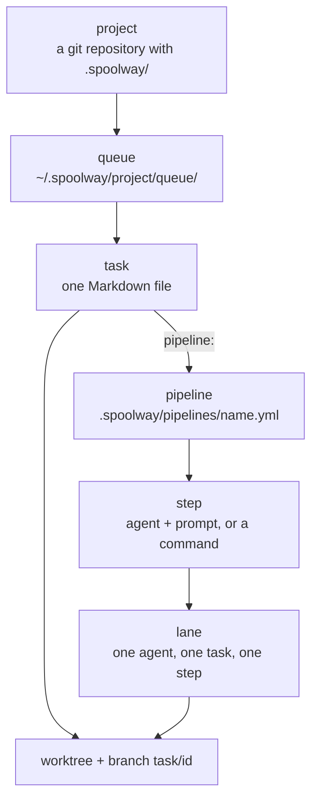

# Concepts

The terms spoolway uses. Every other page assumes them.

| Term | Meaning |
|---|---|
| Project | A git repository with a `.spoolway/` directory. |
| Task | One unit of work, stored as one Markdown file in the queue. |
| Plan | A group of tasks queued together from one branch. |
| Pipeline | A named graph of steps in `.spoolway/pipelines/`. |
| Step | One node of a pipeline: an agent running a prompt, or a command. |
| Lane | One running agent, on one task, at one step. |
| Worker slot | One unit of an agent profile's concurrency. |
| Prompt | A Markdown file a step runs its lane with. |
| Outcome | What a step reports: `pass`, `fail`, `block` or `pause`. |
| Gate | A step whose pass a person must let through. |
| Handover | The command step that pushes the branch and opens the pull request. |

## Project

A project is a git repository set up with `spoolway init`. The checkout holds `.spoolway/`
with the config, the pipelines, the prompts and the templates. It is tracked in git.

What spoolway writes while it runs lives elsewhere, under `~/.spoolway/<label>-<id>/`. The
`<id>` is a short id stamped into the project's `.git` directory, which every branch,
subdirectory and linked worktree of one clone shares. The `<label>` is a cleaned-up form of the
checkout's name. The home records the same id and its checkout in its own `project.toml`. Every
command checks the two against each other and refuses when they disagree. See [Runtime
state](configuration.md#runtime-state).

Everything spoolway writes while it runs lives in `~/.spoolway/<basename of the checkout>/`:
the queue, the archive, pending documents, worktrees and the ledger. See
[Runtime state](configuration.md#runtime-state).

Commands find the project through git. A command run inside a task worktree reaches the
project's real queue. The queue belongs to the project, so every worktree and every branch
shares one queue and one dispatcher.

A command reads `.spoolway/` from the checkout it runs in. When that differs from the main
checkout, the command prints a [`checkout:` line](cli-reference.md#the-checkout-line) first.

## Task

A task is a Markdown file with YAML frontmatter in the queue directory. The frontmatter is
spoolway's and holds every scheduling fact. The body is the project's, and only the agent
reads it. See [Tasks and the queue](tasks.md).

## Plan

A plan is a group of tasks that share one `base:` branch and one `group:`. The queue screen
lists and queues a group as one unit. A plan page is an HTML file a person reads to approve
the shape. spoolway never reads the page. See [Planning](planning.md).

## Pipeline

A pipeline is a named graph of steps in `.spoolway/pipelines/`. A task names one in its
`pipeline:` field, or takes the project's default.

Two pipelines ship: `default` for one change, and `bugfix` for a reproduce-first fix. They are
samples. Edit them, or replace them with the flow your team runs. See
[Converting a workflow you already run](pipelines.md#converting-a-workflow-you-already-run).

## Step

A step is one node of a pipeline. Its keys say what it is: `agent:` runs a prompt on a model,
`run:` runs a command, `end: true` finishes the task. The step id is written into the task's
`stage:` field.

Four stages belong to the dispatcher. No step may be named `queued`, `done` or `paused`.
Every pipeline gets a `blocked` step from `[unattended]` unless it declares its own. See
[Staffing `blocked`](pipelines.md#staffing-blocked).

| Stage | Meaning |
|---|---|
| `queued` | Waiting for its dependencies and a worker slot. |
| `done` | Finished. The worktree is removed, the branch deleted once pushed, the file archived. |
| `paused` | Held for a person after a gate. `spoolway resume` sends it on, `--reject` sends it back. |
| `blocked` | Needs help. `spoolway resume` continues it. An [unattended run](pipelines.md#unattended-runs) starts the unblocker lane instead. |

A step names where the task goes next with `on_pass` and `on_fail`. Prompts report an outcome
and never a destination.

## Lane

A lane is one running agent on one task at one step. It is named `<task> · <step>`, so
`login · implement` is the implementer working on `login`.

| Backend | What a lane is |
|---|---|
| herdr, tmux | A terminal pane. You can watch it, type into it and take over. |
| headless | A detached process writing to a log file. |

A lane takes one turn. When it reports an outcome, the task moves on. A lane that stops
without reporting is usually asking a question. See [The dispatcher](dispatcher.md).

## Worker slot

Each agent profile declares a `concurrency`: how many of its lanes run at once. A step with
`slot: false` takes no slot. Command steps and terminal steps take none.

## Prompt

A prompt is a Markdown file named by a step's `prompt:` field. It says what the lane's role is.
The dispatcher composes it into the lane's system prompt. See [Prompts](prompts.md).

## Reach

A lane runs as you, on your machine, with your credentials. spoolway does not confine it.
Confinement is your own agent's settings. See
[what confines a profile](agents.md#what-confines-a-profile).

## Outcome

| Outcome | Meaning | Where the task goes |
|---|---|---|
| `pass` | The step's work succeeded. | The step's `on_pass`. |
| `fail` | The work did not meet the bar. | The step's `on_fail`, or `blocked`. |
| `block` | Something outside the step is in the way. | `blocked`. |
| `pause` | Only a person can clear this. Allowed from `blocked` only. | `paused`, with the destination a pass would reach. |

## Gate

A step with `gate: true` stops the task on `paused` after its pass. A single task can do the
same with `gate_at: <step>` in its document. A `gate_at` is spent when it fires. The task pauses
once, and a later pass through the same step runs straight through unless something writes a
fresh `gate_at`. `spoolway resume` sends the task on by `on_pass`.
`spoolway resume --reject` sends it back by `on_fail`, or to `blocked` when the step has no
`on_fail`.

A gate holds in unattended runs too. Use it for a step no pull request shows first, such as a
deploy or a release.

## Handover

`handover` is a command step that runs `spoolway stack`. It commits what is uncommitted,
squashes to one commit, pushes, and opens the pull request against the branch the worktree was
cut from. When git or `gh` refuse, the step routes to `blocked`. See
[`spoolway stack` hands the change over](pipelines.md#spoolway-stack-hands-the-change-over).

## How a change reaches the mainline

Task branches never merge on their own. Each task's `handover` opens one pull request. A
dependent task's worktree is cut from its dependency's branch, so a chain of tasks arrives as
one stack of pull requests. A person merges the stack bottom-up. See
[Closing a plan out](planning.md#closing-a-plan-out).

## The design rule underneath all of it

The dispatcher uses no model. Every decision is a lookup.

| Question | Answer |
|---|---|
| Is the lane stuck, or still working? | Time since its transcript was last written to. |
| Is this a repeat failure? | A round counter in the task file. |
| What runs first? | Position in the pipeline file. Later steps go first. |

The dispatcher keeps no state between passes, so it is safe to interrupt at any point.
