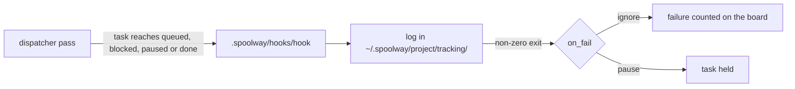
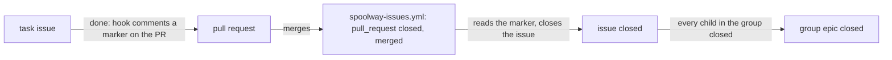

# Configuration

Every setting lives in one file: `.spoolway/config.toml`. It holds facts about this machine:
where lanes run, how many at once, what a model costs. What a step runs and which model it
uses is written in the pipeline file. See [Pipelines](pipelines.md).

## Editing it

```
spoolway config contract       # every setting, its values and its default
spoolway config edit           # open the file in $EDITOR, checked on save
spoolway config show           # the whole config
spoolway config list           # every scalar key, as `key = value`
spoolway config path           # where the file is
spoolway config get agents.pi.kind
spoolway config set models.claude-opus-5.input 5.0
```

The top of the file holds a table of every key, its values and its default. `config set`
changes one key and leaves every other byte alone. It refuses a key the file does not already
hold, with two exceptions: a `[models."<glob>"]` field and `agents.<profile>.concurrency` are
created on first write.

Run `config set` from the main checkout. The dispatcher reads the project's own config, so in
a linked worktree the command refuses and prints the `-C` form to run instead.

## Runtime state

The checkout holds the tracked files: `config.toml`, `.spoolway/pipelines/` and
`.spoolway/prompts/`. Everything spoolway writes while it runs lives at
`~/.spoolway/<label>-<id>/`. The `<id>` is a short id stamped into the project's `.git`
directory, which every branch and worktree of one clone shares. The `<label>` is a cleaned-up
form of the checkout's name.

The binding is two files that must agree: the stamp at `.git/spoolway-id`, and the record at
`~/.spoolway/<label>-<id>/project.toml`. Every command checks them before it does anything else.

| Case | What happens |
|---|---|
| The home already records this checkout | The command runs. |
| The checkout has no stamp and no home records it | It stamps itself and writes the record. A fresh clone needs no `init` first. |
| The record names a checkout that is gone, or one without the id | The record is rewritten to name this checkout. One line says so. |
| Anything else | The command refuses, naming both files by absolute path. |

Two commands write a binding over one that already exists, and nothing else does. `spoolway init
--adopt <name>` binds this checkout to the home already at `~/.spoolway/<name>/` and stamps it
with that home's id. `spoolway init --new-id` mints a fresh id and binds the checkout to the
fresh home that id keys.

The shared dispatch workspace sits at `~/.spoolway/.dispatcher/`. A project home always ends in
`-<id>`, so the two can never collide. See [One home for every run, in every
project](dispatcher.md#one-home-for-every-run-in-every-project).

| Directory | Holds | Swept by `retention_days` |
|---|---|---|
| `queue/`, `pending/`, `worktrees/`, `plans/`, `overrides/` | Work in flight | No |
| `archive/`, `scratch/`, `headless/`, `commands/`, `tracking/`, `system-prompts/` | What finished runs left behind | Yes |
| `project.toml`, `lanes.json`, `usage.jsonl`, `dispatch.pid`, `jobs.toml`, `jobs.state.json` | Project records | No |

Every directory inside a home is created the first time something resolves it. `overrides/` is
the exception. It is never created for you, because its absence is how the patch layer is
turned off. See [The overrides layer](#the-overrides-layer).

Delete `~/.spoolway/<label>-<id>/` to forget every task, plan and lane. The checkout is
untouched. The next command in that checkout refuses, because the checkout still carries a stamp
no home holds. Run `spoolway init --new-id` to start clean.

## The overrides layer

`~/.spoolway/<project>/overrides/` patches the tracked pipelines, config and prompts without
changing the checkout. It is merged at load time, and nothing downstream sees a difference.

```
~/.spoolway/<project>/overrides/
  pipelines/<name>.yml     # patches one pipeline, by file name
  config.toml              # patches the config, by dotted key
  prompts/<name>/PROMPT.md # replaces one prompt whole
```

A pipeline patch names steps by id and only the keys it changes:

```yaml
steps:
  implement:
    model: claude-opus-5
```

A patch cannot set `id:` or name a step the tracked pipeline lacks. The merged pipeline goes
through the same validation as the tracked one. A config patch goes through the same checks as
`spoolway config set`.

Write and inspect the layer with `spoolway pipeline override`, `prompt override`,
`config override` and `spoolway override list | promote | drop`. See
[`spoolway override`](cli-reference.md#spoolway-override-list--promote--drop).

## `[dispatch]` — the run loop

```toml
[dispatch]
backend = "herdr"
herdr_mode = "split"
worktree_root = ""
lane_quiet = "15m"
auto_commit = true
```

| Key | Default | What it controls |
|---|---|---|
| `backend` | `herdr` | Where lanes run. `herdr` is the supported runtime and puts each agent in a pane you can watch and take over. `headless` is an internal test backend; dispatch refuses it unless the test harness sets `SPOOLWAY_TEST_BACKEND`. |
| `herdr_mode` | `split` | Layout under `backend = "herdr"`. `split` gives each task its own workspace named `spoolway/<task>`. `grouped` puts every project in the shared `spoolway-dispatcher` workspace, one tab per project, one pane per task. See [the dispatcher](dispatcher.md#one-home-for-every-run-in-every-project). |
| `worktree_root` | blank | Where a task's worktree is created. Blank means `~/.spoolway/<project>/worktrees`. The directory is `task-<id>`, or `task-<slug>-<id>` with a tracker slug. |
| `lane_quiet` | `15m` | How long a lane may stay silent before the dispatcher reminds it to report. After three reminders the task is escalated. Not how often a pass looks — the dispatcher polls at a fixed rate nobody sets. |
| `auto_commit` | `true` | Commit a lane's uncommitted work as `wip(<task>): <step>` when its step ends. A task with work spoolway could not commit stops at `blocked` instead of being archived. |
| `priority` | `group` | Which ready task fills a free slot. `group` prefers a task whose group is already running. `any` weighs every ready task on steps left, group size and dependents. |
| `lane_child_ceiling` | `1h` | How long a lane with a running child process is excused from the reminder loop. |

`priority` and `lane_child_ceiling` are not written to a fresh `config.toml`. Add them by hand
or with `config set`.

Gates are not configured here. `gate:` is a step key in the pipeline.

## `[unattended]` — the overnight run

```toml
[unattended]
enabled = false
max_output_tokens = 0
max_cost_usd = 0.0
blocked_agent = "claude"
blocked_model = "claude-opus-5"
blocked_effort = ""
blocked_session = true
blocked_prompt = "unblocker"
```

These keys apply only when nobody is watching. See [Unattended runs](pipelines.md#unattended-runs).

| Key | Default | What it controls |
|---|---|---|
| `enabled` | `false` | `true` staffs `blocked` with the unblocker lane instead of parking the task for a person. `gate:` still pauses the task for a person. `spoolway dispatch --unattended` or `--attended` overrides this for one run. |
| `max_output_tokens` | `0` | Output tokens one unattended run may spend before the dispatcher stops starting lanes. `0` is no limit. Live lanes finish. |
| `max_cost_usd` | `0.0` | Dollars one unattended run may spend before the dispatcher stops starting lanes. `0.0` is no limit. Whichever limit is hit first stops the run. See [Cost accounting](cost.md). |
| `blocked_agent` | `claude` | The `[agents.*]` profile that runs the `blocked` step. A pipeline may override these five keys in its own `blocked` step. |
| `blocked_model` | `claude-opus-5` | The model for the `blocked` step. Blank refuses an unattended run. |
| `blocked_effort` | blank | The effort for the `blocked` step. |
| `blocked_session` | `true` | Whether the `blocked` lane carries its earlier session forward. |
| `blocked_prompt` | `unblocker` | The prompt the `blocked` lane runs. |

## `[housekeeping]` — everything spoolway does for its own upkeep

```toml
[housekeeping]
update_check = true
calibrate_window = "14d"
retention_days = 30
price_max_age_days = 30
```

| Key | Default | What it controls |
|---|---|---|
| `update_check` | `true` | Tell a person at a terminal when a newer release is out. The check reads a cached answer and refreshes it in the background once a day. `SPOOLWAY_SKIP_VERSION_CHECK=1` turns it off for one machine. |
| `calibrate_window` | `14d` | How far back `/spoolway-calibrate` reads archived tasks and ledger rows. Takes `30d`, `36h` or `90m`. Keep it below `retention_days`. |
| `retention_days` | `30` | Days before an entry in a swept directory is deleted. `0` keeps everything. A `scratch/` or `headless/` entry of a task still in the queue is kept. |
| `price_max_age_days` | `30` | Days before `spoolway doctor` notes that the price table is old. `0` turns the note off. Refresh with `spoolway models refresh`. See [Pricing](cost.md#pricing). |

Archiving a task removes its files under `tracking/`, `commands/` and its session home at
once. `queue add` cannot name a `depends_on` that was swept out of `archive/`.

## `[watch]` — directories whose own sessions count as this project's spend

```toml
[watch]
# Directories whose own sessions are counted beside the lanes. The project
# root is always watched; these are extra. Absolute, or ~-relative.
dirs = ["~/notes"]
```

| Key | Default | Meaning |
|---|---|---|
| `dirs` | `[]` | Directories, beside the project root, whose own agent sessions count as this project's spend |

The ledger holds one line per settled lane. A person also runs agent sessions by hand, and this
project pays for those too. This list names the directories those sessions run in. See
[Directory spend](cost.md#directory-spend).

Each entry is absolute, `~`-relative, or relative to the repo root. The project root is always
watched and never has to be named. An entry naming nothing that exists, or naming a file, is
dropped, and the rest of the config still loads.

Set the list with `spoolway config set watch.dirs ~/notes,docs`, comma-separated, the same as
every other list-valued key. `spoolway sync` keeps whatever a project has put there.

## `[agents.*]` — who runs a step

```toml
[agents.pi]
kind = "pi"
session_reuse_ctx = 0
session_blocked_ctx = 0

[agents.claude]
kind = "claude"
session_reuse_ctx = 0
session_blocked_ctx = 0
permission_mode = "auto"
```

A profile says which agent binary runs and under what limits. Three ship: `pi`, `codex` and
`claude`. `spoolway init` keeps only the one you chose. See [Agents and models](agents.md).

| Key | Default | What it controls |
|---|---|---|
| `kind` | one per profile | Which agent binary runs: `pi`, `codex` or `claude`. The command line per kind is fixed in the binary. |
| `concurrency` | unset | Most lanes of this profile at once. Absent means no cap. `config set` writes it; setting it to `0` removes it. |
| `session_reuse_ctx` | `0` | Percentage of the model's `context_window` (`1..=100`) above which a `session: true` step starts fresh instead of reusing its session. `0` never refuses on size. See [sessions](dispatcher.md#a-step-that-carries-its-own-session). |
| `session_blocked_ctx` | `0` | Percentage of the model's `context_window` (`1..=100`) above which a running lane is stopped and its task sent to `blocked`. Checked at turn ends. `0` is off. Must be above `session_reuse_ctx` when both are set. |
| `permission_mode` | the kind's first mode | The permission mode the lane starts with. `claude` ships `auto`, `codex` ships `never`. `pi` has no mode and no key. Blank is refused. |

`spoolway doctor` warns when `session_blocked_ctx` is set but the profile's steps run a model
with no `context_window`.

## `[models."<glob>"]` — what a model costs, and how big its window is

```toml
[models."claude-opus-5"]
context_window = 1000000
input = 5.0
output = 25.0
cache_read = 0.5
cache_write_5m = 6.25
cache_write_1h = 10.0
session_reuse_idle = "5m"

[models."Qwen3.6-35B-A3B"]
context_window = 100096
slots = 3
exclusive = true
local = true
```

Each row is keyed by a glob over the model name. The most literal match wins. A bare name
also matches `vendor/name`. Leave a field out to mean zero. `[models]` ships empty: the
built-in price table covers known models, so a row only corrects a price or describes a local
model. An unpriced model is reported as unpriced, not counted as free. See
[Cost accounting](cost.md).

| Key | Default | What it controls |
|---|---|---|
| `context_window` | `0` | Tokens one session gets. `session_reuse_ctx` and `session_blocked_ctx` take their percentage of this. For a local model use the server's per-slot window, such as llama.cpp's `--ctx-size` divided by `--parallel`. |
| `input` | `0` | USD per million input tokens. |
| `output` | `0` | USD per million output tokens. |
| `cache_read` | `0` | USD per million cached input tokens read. |
| `cache_write_5m` | `0` | USD per million tokens written to a five-minute cache. |
| `cache_write_1h` | `0` | USD per million tokens written to a one-hour cache. |
| `session_reuse_idle` | unset | How long a carried session may sit idle before it is not resumed. Unset never refuses on age. Do not set it on a local model. See [cache warmth](agents.md#cache-warmth-is-a-models-fact). |
| `slots` | `0` | Most lanes running this model at once, across every profile. `0` falls back to the profile's `concurrency`. Different from a step's `slot:` key. |
| `exclusive` | `false` | Never run alongside a different model that is also `exclusive`. Set `slots` too. |
| `local` | `false` | The model runs on your own hardware. Only `spoolway doctor` reads it. |

The window here is what spoolway believes, not what the server reports. Keep it in step with
the server yourself.

`spoolway doctor` notes a row with `slots` or `exclusive` but no `local`, an `exclusive` row
with no `slots`, and a row no pipeline step uses.

## `[issue_tracking]` — a hook fired on four task events

```toml
[issue_tracking]
hook = ""
project_key = ""
on_fail = ""
key_in_names = false
```

One script in `.spoolway/hooks/` connects spoolway to an issue tracker. No pipeline file
names a tracker.

| Key | Default | What it controls |
|---|---|---|
| `hook` | blank | A bare file name inside `.spoolway/hooks/`, such as `github.sh`. Blank runs no hook. A path is refused. |
| `project_key` | blank | Handed to the script as `SPOOLWAY_PROJECT_KEY`, unparsed. `owner/repo` on GitHub, a project key on Jira. |
| `on_fail` | `ignore` | What a failing hook does to its task. `ignore` records the failure. `pause` also holds the task: on `queued` it lands on `paused`, on `done` it stays out of the archive. |
| `key_in_names` | `false` | Prefix the `group:`, the branch (`task/<slug>-<id>`) and the worktree directory with the slug the `open` hook returns. A group already carrying the slug gains it exactly once. |

The script is called once per task per event. A failing hook retries on a doubling delay
from ten seconds, capped at an hour, and the count and next retry time survive a dispatcher
restart.

| Event | When it fires | Waits for the script |
|---|---|---|
| `fetch` | `spoolway issue show <ref>` reads one issue | Yes |
| `open` | `spoolway queue add` opens a ticket per document | Yes |
| `queued` | A task arrives in the queue | No |
| `blocked` | A task comes to rest on `blocked` | No |
| `paused` | A task arrives on the persisted `paused` stage | No |
| `done` | A task finishes | No |



Every hook run gets `SPOOLWAY_EVENT`, `SPOOLWAY_PROJECT_KEY`, `SPOOLWAY_TASK`,
`SPOOLWAY_FROM`, `SPOOLWAY_SOURCE`, `SPOOLWAY_GROUP`, `SPOOLWAY_BRANCH`, `SPOOLWAY_TITLE`,
`SPOOLWAY_TASK_FILE`, `SPOOLWAY_GROUP_SIZE`, `SPOOLWAY_EPIC` and `SPOOLWAY_TICKET`. The `done`
event of a group's last open task also gets `SPOOLWAY_GROUP_LAST=1`. Output goes to a log
under `~/.spoolway/<project>/tracking/`. The board prints
`issue_tracking: N hook failures — see tracking/` while any hook has failed.

`spoolway doctor` reports a `hook` with a blank `project_key`, a `hook` that is not a bare
file name, a script with no `fetch` branch, `key_in_names` on with a script that never writes
`slug=`, and a tool named in a `# spoolway-requires:` line whose installed version is below
the line's floor.

### `open` — a fifth event, run by `queue add` itself

`spoolway queue add` calls the hook with `SPOOLWAY_EVENT=open` once per document that has no
`ticket:` yet, in dependency order, before it writes anything. The script also gets
`SPOOLWAY_DEPENDS_TICKETS` (the ticket ids of the task's `depends_on`), `SPOOLWAY_GROUP_DESCRIPTION`
(the group's `group_description:`, blank if no document set one), `SPOOLWAY_EPIC_BODY` and
`SPOOLWAY_TICKET_BODY` (rendered from `.spoolway/templates/tracking/epic.md` and `ticket.md`).
`SPOOLWAY_TASK_FILE` is the document's own path while this hook runs, blank when the document
has no file of its own, such as a `queue add --from -` stream entry.

The submission is refused, naming the group, when no document in a group sets
`group_description:`.

A rendered `epic.md` or `ticket.md` line is dropped entirely, its own newline with it, when it
holds at least one `${SPOOLWAY_*}` placeholder and every placeholder on that line resolves
empty. A line with no placeholder, or one where at least one placeholder resolves to
something, renders unchanged.

The script answers by writing lines to the file named in `SPOOLWAY_OUT`:

| Line | Stored as | Notes |
|---|---|---|
| `epic=` | `epic:` | One epic per group. The first task's answer wins. |
| `ticket=` | `ticket:` | One ticket per task. |
| `slug=` | prefix on names | Used only with `key_in_names`. Lowercase letters, digits and hyphens. |
| `url=` | `url:` | Must be an absolute `http` or `https` URL. |

A non-zero exit refuses the whole batch. Ids already returned are written back into the
pending documents first, so running the command again resumes.

### `fetch` — a sixth event, run by `spoolway issue show`

`spoolway issue show <ref>` calls the hook with `SPOOLWAY_EVENT=fetch`, `SPOOLWAY_REF` (the
reference as typed) and `SPOOLWAY_PROJECT_KEY`. The script writes one JSON object to
`SPOOLWAY_OUT` with `ref`, `url`, `title`, `state`, `labels`, `body` and `comments`. The
command prints it. With no hook configured, or a script with no `fetch` branch, the command
refuses.

### The shipped hook scripts

`spoolway init` writes sample `github.sh` and `jira.sh` files into `.spoolway/hooks/`.
They are project-owned starting points, not required integrations: edit either script, replace
it with any executable that follows `spoolway hook contract`, or leave `hook` blank. `spoolway
sync` never changes them. Switch trackers with
`spoolway config set issue_tracking.hook <file>`.

A hook script names the tools it needs with a `# spoolway-requires: <tool> >= <version>`
comment line, one per tool. `spoolway doctor` reads these lines and checks each named tool's
`--version` output against the floor. Only `<tool> >= <version>` is understood; any other
shape in the line is reported as unreadable rather than interpreted.

Every submit route — the queue screen's `enter`, `spoolway queue add --from` and a routine —
checks the same lines before it opens any ticket. A tool below its floor, or missing from
PATH, gates the submission: the queue screen's `enter` shows what is unmet and waits for
`enter` to queue without issue tracking or `esc` to back out, and a non-interactive submit
prints the same notice and proceeds. See [`spoolway queue`](cli-reference.md#spoolway-queue).

| Script | Needs | What it does |
|---|---|---|
| `github.sh` | `gh` >= 2.97.0, logged in | Reads an issue on `fetch`. Creates the epic and ticket on `open`, nests them under the issue in `SPOOLWAY_SOURCE`, and returns `slug=gh-<number>` and `url=`. The epic is titled with the group's name and its body leads with the full `group_description:`, followed by the rendered epic template. Comments with the task file on `blocked` and `paused`. On `done` it leaves a `<!-- spoolway-issue: URL -->` marker comment on the task's pull request, swaps the `spoolway:in-progress` label for `spoolway:review`, and comments that the ticket is ready for review. It closes nothing itself. |
| `jira.sh` | `acli` >= 1.3.30 and `jq` >= 1.6 | The same events. Returns the lowercased key as the slug. Comments name the task without attaching the file. Check the link type, epic status and JSON field names named in the script's header against your site. |

### How the sample GitHub workflow works

At a high level, the sample connects four things: a source issue, a group issue, one child
issue per task, and the pull request that delivers each task. The `open` event creates the
group and task issues. Later events add progress comments. The `done` event marks a task issue
ready for review and leaves a marker on its pull request. The sample GitHub Actions workflow
uses that marker after a merge to close the task issue, then closes the group issue once all
of its children are closed.

The shipped hook never closes an issue itself. It expects the task's branch to have a pull
request by the time the task reaches `done`, however that pull request was created. Nobody has
necessarily merged or reviewed anything at that point, so closing there would mark work as
delivered before it was. A custom hook can give `done` any behavior that suits its pipeline.

Instead the `done` branch leaves a comment on the pull request carrying a
`<!-- spoolway-issue: URL -->` marker, and on the issue it swaps the `spoolway:in-progress`
label for `spoolway:review`. Closing the issue waits for the pull request to merge.

`spoolway init` writes `.github/workflows/spoolway-issues.yml` into the project when the
tracker is github. The workflow triggers on `pull_request: closed` and runs only when
`github.event.pull_request.merged` is true. It reads the pull request's comments for a marker
left by a trusted author — one whose association is OWNER, MEMBER or COLLABORATOR — checks
that the marked issue carries the `spoolway:task` label, then closes that issue and removes
its `spoolway:in-progress` and `spoolway:review` labels.



The workflow also closes the group's epic. After closing a task's issue it looks up that
issue's parent. If the parent carries the `spoolway:group` label and every one of its
sub-issues has closed, the workflow comments on the epic and closes it too.

The shipped Jira hook is unchanged. Jira has no pull request lifecycle of its own, so
`jira.sh` still transitions the epic on the group's last `done`.

## Retired keys

These keys still parse in an older `config.toml` and are dropped on the next save.

| Key | Replaced by |
|---|---|
| `[update]`, `[calibrate]`, `[retention]`, `[prices]` | `[housekeeping]` |
| `[pricing]` | `[models]` |
| `[effort]` | A step's own `model:` and `effort:` |
| `[stack.summary]` | The task's `title:` and body are the pull request |
| `[sandbox]`, `blocked_on_write`, `blocked_on_overreach` | Nothing. See [What confines a profile](agents.md#what-confines-a-profile). |
| `[paths]`, `[docs]`, `[plans]` | Fixed locations. See [Runtime state](#runtime-state). |
| `dispatch.max_launches`, `open_on_escalation`, `open`, `protected_branches`, `notify`, `default_pipeline`, `tmux_mode` | Nothing |
| `[pipeline_gen]` | Nothing |
| `agents.<profile>.model`, `context_window`, `args`, `env`, `session_reuse_uncached` | `model:` on the step, `[models]`, and `models.<glob>.session_reuse_idle` |

## When the config will not parse

Every command stops on a config error except `spoolway doctor`. It prints the error with its
line and still runs the checks that read no settings.
