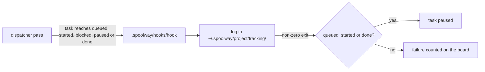
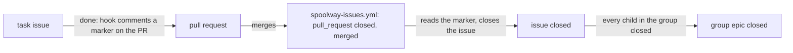

# Configuration

Every setting lives in one file: `.spoolway/config.toml`. It holds facts about this machine:
where lanes run, how many at once, what a model costs. What a step runs and which model it
uses is written in the pipeline file. See [Pipelines](pipelines.md).

## Editing it

```
spoolway config contract       # every setting, its values and its default
spoolway config edit           # open the file in $EDITOR, checked on save
spoolway config show           # the whole config
spoolway config list           # every scalar key, as `key = value`
spoolway config path           # where the setup, local/ and overrides folders live
spoolway config get agents.pi.kind
spoolway config set models.claude-opus-5.input 5.0
```

The top of the file holds a table of every key, its values and its default. `config set`
changes one key and leaves every other byte alone. It refuses a key the file does not already
hold, with two exceptions: a `[models."<glob>"]` field and `agents.<profile>.concurrency` are
created on first write.

Run `config set` from the main checkout. The dispatcher reads the project's own config, so in
a linked worktree the command refuses and prints the `-C` form to run instead.

## Runtime state

This section describes repo mode, where the checkout itself holds the tracked files. A
checkout with no `.spoolway/` can run in home mode instead, reading its config from a
workspace elsewhere on the machine. See [Home mode](concepts.md#home-mode).

The checkout holds the tracked files: `config.toml`, `.spoolway/pipelines/` and
`.spoolway/prompts/`. Everything spoolway writes while it runs lives at
`~/.spoolway/<label>-<id>/`. The `<id>` is a short id stamped into the project's `.git`
directory, which every branch and worktree of one clone shares. The `<label>` is a cleaned-up
form of the checkout's name.

The binding is two files that must agree: the stamp at `.git/spoolway-id`, and the record at
`~/.spoolway/<label>-<id>/project.toml`. Every command checks them before it does anything else.

| Case | What happens |
|---|---|
| The home already records this checkout | The command runs. |
| The checkout has no stamp and no home records it | It stamps itself and writes the record. A fresh clone needs no `init` first. |
| The record names a checkout that is gone, or one without the id | The record is rewritten to name this checkout. One line says so. |
| Anything else | The command refuses, naming both files by absolute path. |

A third file, `.git/spoolway-root`, sits beside the id stamp in the same common git directory.
It records the checkout's own absolute path. Unlike the id, which is minted once, it is
rewritten each time the checkout is stamped: by `spoolway init`, and by the first command that
binds an unstamped checkout. It exists for one case that neither the id stamp nor an ordinary
`git rev-parse` answers: a `--separate-git-dir` clone or a submodule. There the common git
directory need not sit inside the checkout, so its parent is not a reliable way back to it.

Nothing checks `spoolway-root` against anything else. It is a locator, not part of the binding
above. A linked worktree finds its checkout from the common directory's parent when that parent
checks out, then from this record, then from the workspace's clone listing. When none of the
three answers, as in a fresh `--separate-git-dir` clone or submodule with no record, `spoolway
init` refuses that linked worktree and tells you to run `spoolway init` in the main checkout
first. Run `spoolway init` there before working from a linked worktree of such a clone.

The shared dispatch workspace sits at `~/.spoolway/.dispatcher/`. A project home always ends in
`-<id>`, so the two can never collide. See [One home for every run, in every
project](dispatcher.md#one-home-for-every-run-in-every-project).

| Directory | Holds | Swept by `retention_days` |
|---|---|---|
| `queue/`, `pending/`, `worktrees/`, `plans/`, `overrides/`, `local/`, `claims/` | Work in flight | No |
| `archive/`, `scratch/`, `headless/`, `commands/`, `tracking/`, `system-prompts/` | What finished runs left behind | Yes |
| `project.toml`, `lanes.json`, `usage.jsonl`, `dispatch.pid`, `spoolway.pid`, `jobs.toml`, `jobs.state.json` | Project records | No |

Every directory inside a home is created the first time something resolves it. `overrides/` is
the exception. It is never created for you, because its absence is how the patch layer is
turned off. See [The overrides layer](#the-overrides-layer).

`local/` holds a project's own private pipelines, prompts and task skeletons, read only in
repo mode. See [Private pipelines](pipelines.md#private-pipelines).

Delete `~/.spoolway/<label>-<id>/` to forget every task, plan and lane. The checkout is
untouched. The next command in that checkout refuses, because the checkout still carries a stamp
no home holds. Delete `.git/spoolway-id` too and run `spoolway init` again to mint a fresh id
and a fresh home.

## The overrides layer

`~/.spoolway/<project>/overrides/` patches the tracked pipelines, config and prompts without
changing the checkout. It is merged at load time, and nothing downstream sees a difference.

```
~/.spoolway/<project>/overrides/
  pipelines/<name>.yml     # patches one pipeline, by file name
  config.toml              # patches the config, by dotted key
  prompts/<name>/PROMPT.md # replaces one prompt whole
```

A pipeline patch names steps by id and only the keys it changes:

```yaml
steps:
  implement:
    model: claude-opus-5
```

One override is one step's whole entry: every key it sets on that step id. An entry is stale
when it sets `id:`, names a step the pipeline no longer has, or leaves the step invalid once
merged, for example a step that already runs a command and gets `agent:` added on top. A
stale entry is left out of the merge. The step stays exactly as the tracked file wrote it, and
every other entry, in this file and in every other, still applies. A config patch key the
tracked config would refuse is left out the same way, with every other key in the patch still
applied. A prompt override for a prompt the checkout no longer has is left out too. A pipeline
patch or a prompt override written for a private target is also left out of the merge — a
patch only ever applies to a tracked file — but is named as waiting on `spoolway pipeline
promote`, not as missing, since the name is not wrong, only not tracked yet. The override file
itself is left alone, except for one case: `spoolway sync` deletes a key on the [Retired
keys](#retired-keys) list from `overrides/config.toml`, the same way it drops that key from
the tracked file. A config patch key merely unknown to the tracked config, such as a typo,
stays in the override file for you to fix yourself.

Outside a lane, each command that loads prints one stderr line per entry it leaves out:

```
spoolway: override ignored — pipelines/release.yml step `publish`: names both `run:` and `agent:` — a step runs a process or a model, not both
```

A command running inside a lane prints nothing. `spoolway override list`, its `--json` form
and `spoolway doctor`'s standing note mark the same entries and reasons.

Bare `spoolway` shows the same thing as an "override ignored" popup over the tab it opens on
instead, since the stderr line would be wiped by the screen's first frame. The popup has one
row per entry left out: the file, the step and the keys it set, or the config key, or "the
whole file" for a prompt, then the whole reason under it. `[enter]` closes it. The popup comes
back on the next open while the entry is still left out; nothing silences it for good, since a
skipped override changes what lanes run. The before-start overrides popup (see [`spoolway
dispatch`](cli-reference.md#spoolway-dispatch)) draws the same entry's row as `ignored —
<reason>` in place of its keys, with every other row unchanged.

Write and inspect the layer with `spoolway pipeline override`, `prompt override`,
`config override` and `spoolway override list | promote | drop`. See
[`spoolway override`](cli-reference.md#spoolway-override-list--promote--drop).

## `[dispatch]` — the run loop

```toml
[dispatch]
backend = "herdr"
herdr_mode = "split"
lane_quiet = "15m"
auto_commit = true
```

| Key | Default | What it controls |
|---|---|---|
| `backend` | `herdr` | Where lanes run. `herdr` is the supported runtime and puts each agent in a pane you can watch and take over. `headless` is an internal test backend; dispatch refuses it unless the test harness sets `SPOOLWAY_TEST_BACKEND`. |
| `herdr_mode` | `split` | Layout under `backend = "herdr"`. `split` gives each task its own workspace named `spoolway/<task>`. `grouped` puts every project in the shared `spoolway-dispatcher` workspace, one tab per project, one pane per task. See [the dispatcher](dispatcher.md#one-home-for-every-run-in-every-project). |
| `lane_quiet` | `15m` | How long a lane may stay silent before the dispatcher reminds it to report. After three reminders the task is escalated. Not how often a pass looks — the dispatcher polls at a fixed rate nobody sets. |
| `auto_commit` | `true` | Commit a lane's uncommitted work as `wip(<task>): <step>` when its step ends. A task with work spoolway could not commit stops at `blocked` instead of being archived. |
| `priority` | `group` | Which ready task fills a free slot. `group` prefers a task whose group is already running. `any` weighs every ready task on steps left, group size and dependents. |
| `lane_child_ceiling` | `1h` | How long a lane with a running child process is excused from the reminder loop. |

`priority` and `lane_child_ceiling` are not written to a fresh `config.toml`. Add them by hand
or with `config set`.

Gates are not configured here. `gate:` is a step key in the pipeline.

## `[unattended]` — the overnight run

```toml
[unattended]
enabled = false
max_output_tokens = 0
max_cost_usd = 0.0
blocked_agent = "claude"
blocked_model = "claude-opus-5"
blocked_effort = ""
blocked_session = true
blocked_prompt = "unblocker"
```

These keys apply only when nobody is watching. See [Unattended runs](pipelines.md#unattended-runs).

| Key | Default | What it controls |
|---|---|---|
| `enabled` | `false` | `true` staffs `blocked` with the unblocker lane instead of parking the task for a person. `gate:` still pauses the task for a person. `spoolway dispatch --unattended` or `--attended` overrides this for one run. |
| `max_output_tokens` | `0` | Output tokens one unattended run may spend before the dispatcher stops starting lanes. `0` is no limit. Live lanes finish. |
| `max_cost_usd` | `0.0` | Dollars one unattended run may spend before the dispatcher stops starting lanes. `0.0` is no limit. Whichever limit is hit first stops the run. See [Cost accounting](cost.md). |
| `blocked_agent` | `claude` | The `[agents.*]` profile that runs the `blocked` step. A pipeline may override these five keys in its own `blocked` step. `spoolway init`, run again with no `--provider`, reads this key as the project's own provider; pointing it at a profile `init` did not create falls back to the menu's default, `claude`. |
| `blocked_model` | `claude-opus-5` | The model for the `blocked` step. Blank refuses an unattended run. `spoolway init` writes it blank, so set it before the first unattended run. |
| `blocked_effort` | blank | The effort for the `blocked` step. |
| `blocked_session` | `true` | Whether the `blocked` lane carries its earlier session forward. |
| `blocked_prompt` | `unblocker` | The prompt the `blocked` lane runs. |

## `[housekeeping]` — everything spoolway does for its own upkeep

```toml
[housekeeping]
update_check = true
calibrate_window = "14d"
retention_days = 30
price_max_age_days = 30
```

| Key | Default | What it controls |
|---|---|---|
| `update_check` | `true` | Tell a person at a terminal when a newer release is out. The check reads a cached answer and refreshes it in the background once a day. `SPOOLWAY_SKIP_VERSION_CHECK=1` turns it off for one machine. |
| `calibrate_window` | `14d` | How far back `/spoolway-calibrate` reads archived tasks and ledger rows. Takes `30d`, `36h` or `90m`. Keep it below `retention_days`. |
| `retention_days` | `30` | Days before an entry in a swept directory is deleted. `0` keeps everything. A `scratch/` or `headless/` entry of a task still in the queue is kept. |
| `price_max_age_days` | `30` | Days before `spoolway doctor` notes that the price table is old. `0` turns the note off. Refresh with `spoolway models refresh`. See [Pricing](cost.md#pricing). |

Archiving a task removes its files under `tracking/`, `commands/` and its session home at
once. `queue add` cannot name a `depends_on` that was swept out of `archive/`.

## `[watch]` — directories whose own sessions count as this project's spend

```toml
[watch]
# Directories whose own sessions are counted beside the lanes. The project
# root is always watched; these are extra. Absolute, or ~-relative.
dirs = ["~/notes"]
```

| Key | Default | Meaning |
|---|---|---|
| `dirs` | `[]` | Directories, beside the project root, whose own agent sessions count as this project's spend |

The ledger holds one line per settled lane. A person also runs agent sessions by hand, and this
project pays for those too. This list names the directories those sessions run in. See
[Directory spend](cost.md#directory-spend).

Each entry is absolute, `~`-relative, or relative to the repo root. The project root is always
watched and never has to be named. An entry naming nothing that exists, or naming a file, is
dropped, and the rest of the config still loads.

Set the list with `spoolway config set watch.dirs ~/notes,docs`, comma-separated, the same as
every other list-valued key. `spoolway sync` keeps whatever a project has put there.

## `[issue_tracking]` — a hook fired on four task events

```toml
[issue_tracking]
hook = ""
project_key = ""
key_in_names = false
```

One script in `.spoolway/hooks/` (a home-mode workspace's own `config/hooks/`) connects
spoolway to an issue tracker. No pipeline file names a tracker.

| Key | Default | What it controls |
|---|---|---|
| `hook` | blank | A bare file name inside `.spoolway/hooks/` (a home-mode workspace's own `config/hooks/`), such as `github.sh`. Blank runs no hook. A path is refused. |
| `project_key` | blank | Handed to the script as `SPOOLWAY_PROJECT_KEY`, unparsed. `owner/repo` on GitHub, a project key on Jira. |
| `key_in_names` | `false` | Prefix the `group:`, the branch (`task/<slug>-<id>`) and the worktree directory with the slug the `open` hook returns. A group already carrying the slug gains it exactly once. |

The script is called once per task per event. A non-zero exit on `queued`, `started` or `done`
pauses the task with the reason `issue_tracking hook exited N`. The task file gains a
`## Hook error` section holding the run's last 15 log lines under `Last output:`, appended on
each failure. `spoolway resume` forgets that run, so the hook fires again. A non-zero exit on
`blocked` or `paused` only records the failure, since both stages are already stopped for a
person.

| Event | When it fires | Waits for the script | A non-zero exit |
|---|---|---|---|
| `fetch` | `spoolway issue show <ref>` reads one issue | Yes | Refuses the command |
| `open` | `spoolway queue add` opens a ticket per task | Yes | Refuses the whole batch |
| `queued` | A task arrives in the queue | No | Pauses the task |
| `started` | A queued task is ready and about to leave `queued` for its entry step | No | Pauses the task |
| `blocked` | A task comes to rest on `blocked` | No | Records the failure |
| `paused` | A task arrives on the persisted `paused` stage | No | Records the failure |
| `done` | A task finishes | No | Pauses the task |

A task queued with `tracking: off` fires none of `queued`, `started`, `blocked`, `paused` or
`done`, and is never held waiting on one of them. See [`tracking`](tasks.md#the-frontmatter-is-spoolways).


```mermaid
flowchart LR
  A[dispatcher pass] -->|task reaches queued, started, blocked, paused or done| B[.spoolway/hooks/hook]
  B --> C[log in ~/.spoolway/project/tracking/]
  C -->|non-zero exit| D{queued, started or done?}
  D -->|yes| E[task paused]
  D -->|no| F[failure counted on the board]
```

Every hook run on `queued`, `started`, `blocked`, `paused` or `done` gets `SPOOLWAY_EVENT`,
`SPOOLWAY_PROJECT_KEY`, `SPOOLWAY_TASK`, `SPOOLWAY_FROM`, `SPOOLWAY_SOURCE`, `SPOOLWAY_GROUP`,
`SPOOLWAY_BRANCH`, `SPOOLWAY_TITLE`, `SPOOLWAY_TASK_FILE`, `SPOOLWAY_GROUP_SIZE`,
`SPOOLWAY_LABELS` (its `labels:`, comma-joined, empty when it has none), `SPOOLWAY_EPIC` and
`SPOOLWAY_TICKET`. The `done` event of a group's last open task also gets
`SPOOLWAY_GROUP_LAST=1`. Output goes to a log under `~/.spoolway/<project>/tracking/`. The
board prints `issue_tracking: N hook failures — see tracking/` while any hook has failed.

`spoolway doctor` reports a `hook` with a blank `project_key`, a `hook` that is not a bare
file name, a script with no `fetch` branch, `key_in_names` on with a script that never writes
`slug=`, and a tool named in a `# spoolway-requires:` line whose installed version is below
the line's floor.

### `open` — a fifth event, run by `queue add` itself

`spoolway queue add` calls the hook with `SPOOLWAY_EVENT=open` once per task that has no
`ticket:` yet, in dependency order, before it writes anything. The script also gets
`SPOOLWAY_DEPENDS_TICKETS` (the ticket ids of the task's `depends_on`), `SPOOLWAY_GROUP_DESCRIPTION`
(the group's `group_description:`, blank if no task set one), `SPOOLWAY_EPIC_BODY` and
`SPOOLWAY_TICKET_BODY` (rendered from `.spoolway/templates/tracking/epic.md` and `ticket.md`).
`SPOOLWAY_TASK_FILE` is the task's own path while this hook runs, blank when the task
has no file of its own, such as a `queue add --from -` stream entry.

The submission is refused, naming the group, when no task in a group sets
`group_description:`.

On the queue screen, `enter` asks before any of this runs. The question names the tracker,
the hook script's own file name minus its extension (`github.sh` reads `github`), and lists
every task in the batch: `enter` creates the tickets and queues, `n` queues the batch with
`tracking: off` written onto every task instead, and `esc` goes back with nothing queued.
Queueing a routine asks the same question. A trial never asks and opens no ticket. See
[`spoolway queue`](cli-reference.md#spoolway-queue) and
[`tracking`](tasks.md#the-frontmatter-is-spoolways).

A rendered `epic.md` or `ticket.md` line is dropped entirely, its own newline with it, when it
holds at least one `${SPOOLWAY_*}` placeholder and every placeholder on that line resolves
empty. A line with no placeholder, or one where at least one placeholder resolves to
something, renders unchanged.

The script answers by writing lines to the file named in `SPOOLWAY_OUT`:

| Line | Stored as | Notes |
|---|---|---|
| `epic=` | `epic:` | One epic per group. The first task's answer wins. |
| `ticket=` | `ticket:` | One ticket per task. |
| `slug=` | prefix on names | Used only with `key_in_names`. Lowercase letters, digits and hyphens. |
| `url=` | `url:` | Must be an absolute `http` or `https` URL. |

A non-zero exit refuses the whole batch. Ids already returned are written back into the
pending tasks first, so running the command again resumes.

### `fetch` — a sixth event, run by `spoolway issue show`

`spoolway issue show <ref>` calls the hook with `SPOOLWAY_EVENT=fetch`, `SPOOLWAY_REF` (the
reference as typed) and `SPOOLWAY_PROJECT_KEY`. The script writes one JSON object to
`SPOOLWAY_OUT` with `ref`, `url`, `title`, `state`, `labels`, `body` and `comments`. The
command prints it. With no hook configured, or a script with no `fetch` branch, the command
refuses.

### `started` — a seventh event, fired by the dispatcher itself

`queued` fires on a task's first pass through the queue, even while it still waits on a
dependency. `started` fires once, the moment a task actually leaves `queued` for its entry
step. It carries the same variables `queued`, `blocked`, `paused` and `done` do. The task
launches only once this hook exits clean. A non-zero exit pauses the task, exactly as a
failing `queued` hook does. `spoolway resume` runs the hook again. A trial arm never fires
`started`, the same as `queued` and `done`.

### The shipped hook scripts

`spoolway init` writes sample `github.sh` and `jira.sh` files into `.spoolway/hooks/` (a
home-mode workspace's own `config/hooks/`), but only when a tracker is chosen; answering `none`
leaves that folder unwritten. They are project-owned starting points, not required
integrations: edit either script, replace it with any executable that follows `spoolway hook
contract`, or leave `hook` blank. `spoolway sync` never changes them. Switch trackers with
`spoolway config set issue_tracking.hook <file>`.

A hook script names the tools it needs with a `# spoolway-requires: <tool> >= <version>`
comment line, one per tool. `spoolway doctor` reads these lines and checks each named tool's
`--version` output against the floor. Only `<tool> >= <version>` is understood; any other
shape in the line is reported as unreadable rather than interpreted.

Every submit route — the queue screen's `enter`, the jobs screen's `r`, `spoolway queue add
--from`, `spoolway jobs run` and a job the dispatcher fires — checks the same lines before it
opens any ticket. A tool below its floor, or missing from PATH, gates the submission. On a
screen it shows what is unmet as a popup: `enter` queues with `tracking: off` written onto
every task, `esc` backs out. From the CLI or the dispatcher, where there is no key to wait on,
it prints the same notice and proceeds the same way. See
[`spoolway queue`](cli-reference.md#spoolway-queue).

Both shipped scripts run under `bash`, with `set -eE` and an ERR trap. A command that fails
outside an `if`, an `&&`/`||` list, or one marked `|| true` stops the script and writes a trace
to the run's own log: the command, its line, the case arm it ran in, and the functions that
called it. That log is what a paused task's `## Hook error` reads its tail from.

| Script | Needs | What it does |
|---|---|---|
| `github.sh` | `bash` >= 3.2, `gh` >= 2.97.0, logged in | Reads an issue on `fetch`. Creates the epic and ticket on `open`, nests them under the issue in `SPOOLWAY_SOURCE`, and returns `slug=gh-<number>` and `url=`. The epic is titled with the group's name and its body leads with the full `group_description:`, followed by the rendered epic template. Before either issue, it creates whichever of `SPOOLWAY_LABELS` `gh label list` does not already show, matched case-insensitively, then puts every one of them on both the epic and the ticket, beside `spoolway:group` and `spoolway:task`; a task queued later onto an already-open epic adds its own labels there too. Labels the ticket `spoolway:in-progress` on `started`. Comments with the task file on `blocked` and `paused`. On `done` it leaves a `<!-- spoolway-issue: URL -->` marker comment on the task's pull request, swaps the `spoolway:in-progress` label for `spoolway:review`, and comments that the ticket is ready for review. It closes nothing itself. |
| `jira.sh` | `bash` >= 3.2, `acli` >= 1.3.39 and `jq` >= 1.6 | Reads an issue on `fetch`. On `open` creates one Story per group, a group of one included, and one Sub-task per task under it; links a Sub-task `Blocks` the task named in its own `depends_on`, and links the Story `Relates` to a `…/browse/<key>` source. Returns the lowercased Story key as the slug. A Sub-task moves to Draft at `open`, In Progress at `started`, and Review at `done`, and carries the task's own labels. The Story leaves Draft at the first `started` in its group and moves to Review once the group's last task reaches `done`; its own labels are the union of every task's. Comments name the task without attaching the file. Nothing in the shipped script ever sets Resolved. Check the link type and status names named in the script's header against your site. |

### How the sample GitHub workflow works

At a high level, the sample connects four things: a source issue, a group issue, one child
issue per task, and the pull request that delivers each task. The `open` event creates the
group and task issues. Later events add progress comments. The `done` event marks a task issue
ready for review and leaves a marker on its pull request. The sample GitHub Actions workflow
uses that marker after a merge to close the task issue, then closes the group issue once all
of its children are closed.

The shipped hook never closes an issue itself. It expects the task's branch to have a pull
request by the time the task reaches `done`, however that pull request was created. Nobody has
necessarily merged or reviewed anything at that point, so closing there would mark work as
delivered before it was. A custom hook can give `done` any behavior that suits its pipeline.

Instead the `done` branch leaves a comment on the pull request carrying a
`<!-- spoolway-issue: URL -->` marker, and on the issue it swaps the `spoolway:in-progress`
label for `spoolway:review`. Closing the issue waits for the pull request to merge.

spoolway's own repository keeps this workflow at `.github/workflows/spoolway-issues.yml`.
Neither `init` nor `sync` writes or checks it in a project; copy the file in by hand for the
same close-on-merge automation. It triggers on `pull_request: closed` and runs only when
`github.event.pull_request.merged` is true. It reads the pull request's comments for a marker
left by a trusted author — one whose association is OWNER, MEMBER or COLLABORATOR — checks
that the marked issue carries the `spoolway:task` label, then closes that issue and removes
its `spoolway:in-progress` and `spoolway:review` labels.


```mermaid
flowchart LR
  Task[task issue] -->|done: hook comments a marker on the PR| PR[pull request]
  PR -->|merges| Workflow[spoolway-issues.yml: pull_request closed, merged]
  Workflow -->|reads the marker, closes the issue| Closed[issue closed]
  Closed -->|every child in the group closed| Epic[group epic closed]
```

The workflow also closes the group's epic. After closing a task's issue it looks up that
issue's parent. If the parent carries the `spoolway:group` label and every one of its
sub-issues has closed, the workflow comments on the epic and closes it too.

The shipped Jira hook has no pull request lifecycle to wait on. `jira.sh` moves a Sub-task to
Review on `done`, and moves its Story to Review too once the group's last task reaches `done`.
See [Closing tickets on merge](#closing-tickets-on-merge).

### Closing tickets on merge

Neither shipped hook closes anything on `done`. `github.sh` leaves an issue labelled
`spoolway:review`. `jira.sh` leaves a Sub-task, and its Story on the group's last task, in
Review. Spoolway's own part ends there.

Every tracker names its own closing status: Resolved on Jira, Closed on GitHub. Setting it is
left to the user's own merge automation, not a shipped hook. Three ordinary ways to wire it:

- The tracker's own GitHub app, with an automation rule keyed on the pull request title.
- A pull request workflow the project already runs.
- A `spoolway jobs` routine polled on a schedule. See [Jobs](jobs.md).

A custom hook should keep the same split: move a ticket toward review on `done`, and leave the
close for whatever watches the merge.

## `[agents.*]` — who runs a step

```toml
[agents.pi]
kind = "pi"
session_reuse_ctx = 0
session_blocked_ctx = 0

[agents.claude]
kind = "claude"
session_reuse_ctx = 0
session_blocked_ctx = 0
permission_mode = "auto"
```

A profile says which agent binary runs and under what limits. Three ship: `pi`, `codex` and
`claude`. `spoolway init` keeps only the one you chose. See [Agents and models](agents.md).

| Key | Default | What it controls |
|---|---|---|
| `kind` | one per profile | Which agent binary runs: `pi`, `codex` or `claude`. The command line per kind is fixed in the binary. |
| `concurrency` | unset | Most lanes of this profile at once. Absent means no cap. `config set` writes it; setting it to `0` removes it. |
| `session_reuse_ctx` | `0` | Percentage of the model's `context_window` (`1..=100`) above which a `session: true` step starts fresh instead of reusing its session. `0` never refuses on size. See [sessions](dispatcher.md#a-step-that-carries-its-own-session). |
| `session_blocked_ctx` | `0` | Percentage of the model's `context_window` (`1..=100`) above which a running lane is stopped and its task sent to `blocked`. Checked at turn ends. `0` is off. Must be above `session_reuse_ctx` when both are set. |
| `permission_mode` | the kind's first mode | The permission mode the lane starts with. `claude` ships `auto`, `codex` ships `never`. `pi` has no mode and no key. Blank is refused. |

`spoolway doctor` warns when `session_blocked_ctx` is set but the profile's steps run a model
with no `context_window`.

## `[models."<glob>"]` — what a model costs, and how big its window is

```toml
[models."claude-opus-5"]
context_window = 1000000
input = 5.0
output = 25.0
cache_read = 0.5
cache_write_5m = 6.25
cache_write_1h = 10.0
session_reuse_idle = "5m"

[models."Qwen3.6-35B-A3B"]
context_window = 100096
slots = 3
exclusive = true
local = true
```

Each row is keyed by a glob over the model name. The most literal match wins. A bare name
also matches `vendor/name`. Leave a field out to mean zero. `[models]` ships empty: the
built-in price table covers known models, so a row only corrects a price or describes a local
model. An unpriced model is reported as unpriced, not counted as free. See
[Cost accounting](cost.md).

| Key | Default | What it controls |
|---|---|---|
| `context_window` | `0` | Tokens one session gets. `session_reuse_ctx` and `session_blocked_ctx` take their percentage of this. For a local model use the server's per-slot window, such as llama.cpp's `--ctx-size` divided by `--parallel`. |
| `input` | `0` | USD per million input tokens. |
| `output` | `0` | USD per million output tokens. |
| `cache_read` | `0` | USD per million cached input tokens read. |
| `cache_write_5m` | `0` | USD per million tokens written to a five-minute cache. |
| `cache_write_1h` | `0` | USD per million tokens written to a one-hour cache. |
| `session_reuse_idle` | unset | How long a carried session may sit idle before it is not resumed. Unset never refuses on age. Do not set it on a local model. See [cache warmth](agents.md#cache-warmth-is-a-models-fact). |
| `slots` | `0` | Most lanes running this model at once, across every profile. `0` falls back to the profile's `concurrency`. Different from a step's `slot:` key. |
| `exclusive` | `false` | Never run alongside a different model that is also `exclusive`. Set `slots` too. |
| `local` | `false` | The model runs on your own hardware. Only `spoolway doctor` reads it. |

The window here is what spoolway believes, not what the server reports. Keep it in step with
the server yourself.

`spoolway doctor` notes a row with `slots` or `exclusive` but no `local`, an `exclusive` row
with no `slots`, and a row no pipeline step uses.

## Retired keys

A file naming a retired key always loads. None of them refuses to parse any more, even
`dispatch.interval` and `issue_tracking.on_fail`, which used to fail every command except
`spoolway sync`. Each key is dropped from the tracked file on the next save. These keys load
with a note: `dispatch.interval`, `issue_tracking.on_fail`, a non-blank
`dispatch.worktree_root`, `dispatch.backend` set to `tmux` (which loads as `herdr` instead),
`dispatch.tear_lanes_on_stop`, an `[agents.<profile>.env]` table, and an `[agents.<profile>]`
naming a kind spoolway no longer knows how to launch. Only the notes for `dispatch.interval`,
`issue_tracking.on_fail` and `dispatch.worktree_root` name `spoolway sync` as the command that
drops the key for good. The others say the key is rewritten or dropped on the next save. The
rest of the table below are dropped with nothing printed.
`spoolway sync` also drops a retired key it finds in the [overrides layer](#the-overrides-layer).

| Key | Replaced by |
|---|---|
| `[update]`, `[calibrate]`, `[retention]`, `[prices]` | Nothing. `[housekeeping]` holds the same settings under new names. |
| `[pricing]` | `[models]` |
| `[effort]` | A step's own `model:` and `effort:` |
| `[stack.summary]` | The task's `title:` and body are the pull request |
| `[sandbox]`, `blocked_on_write`, `blocked_on_overreach` | Nothing. See [What confines a profile](agents.md#what-confines-a-profile). |
| `[paths]`, `[docs]`, `[plans]` | Fixed locations. See [Runtime state](#runtime-state). |
| `dispatch.max_launches`, `open_on_escalation`, `open`, `protected_branches`, `notify`, `default_pipeline`, `tmux_mode`, `worktree_root` | Nothing |
| `issue_tracking.on_fail` | Nothing. A failing `queued`, `started` or `done` hook always pauses its task. |
| `[pipeline_gen]` | Nothing |
| `agents.<profile>.model`, `context_window`, `args`, `env`, `session_reuse_uncached` | `model:` on the step, `[models]`, and `models.<glob>.session_reuse_idle` |

## When the config will not parse

Every command stops on a config error except `spoolway doctor`. It prints the error with its
line and still runs the checks that read no settings.
