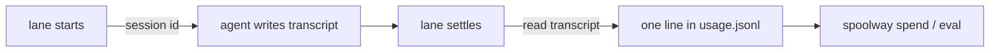

# Cost accounting

spoolway records what every lane spent: tokens, cost, wall time and outcome. The record is
the ledger, one line per lane, in `~/.spoolway/<project>/usage.jsonl`.

## How the numbers get there

spoolway does not talk to a model. Each agent writes its own transcript with per-turn token
counts. The dispatcher names the session when it starts the lane, finds that transcript when
the lane ends, and appends one line to the ledger.



`pi` and `claude` accept a session id from spoolway. `codex` gets its own `$CODEX_HOME`
directory named after the id. See [Two ways to pin a session](agents.md#two-ways-to-pin-a-session).

Every launchable agent kind is metered. `spoolway agent verify <kind>` shows how a kind is
read back.

### Settled lanes

A transcript can grow after the lane is torn down. Every `spoolway eval` and `spoolway spend`
reads settled sessions again and appends one line for the turns that arrived later. That
line carries no `outcome`. Lanes still running are left alone.

A lane banked more than once still counts as one lane. `spoolway spend` and `spoolway eval`
group these lines by task, step, round and session. Tokens, cost and time are deltas against
what a lane already banked, so a settled line's zero adds nothing and `WALL` sums every line
for that lane.

### Directory spend

A watched directory has sessions of its own that never went through the dispatcher: a person
running `claude` or `pi` by hand inside it. See
[`[watch]`](configuration.md#watch--directories-whose-own-sessions-count-as-this-projects-spend).
Every read of the ledger sweeps those too, and banks one line per session under `dir`. The `dir`
is the most specific watched root the session ran under.

A directory line carries no `task`, `step`, `pipeline`, `agent`, `outcome`, `run` or
`pipeline_version`, because spoolway dispatched no such work. `spoolway spend` skips these
lines, so its tables show lanes only. The directory table of `spoolway eval` reads them, and
reads nothing else. See [The directory table](eval.md#the-directory-table).

A session already banked as a lane is never banked again under `dir`. A transcript that has not
changed since its last banked line is not read again.

codex sessions are not swept. Its session store records no working directory, so there is
nothing to match against a watched root.

## Reading it

```
spoolway spend                                  # this project, by step
spoolway spend task                             # what each task came to
spoolway spend lane                             # one row per lane, newest last
spoolway spend project --all                    # every project
spoolway spend group --project webshop          # one named project
spoolway spend --month 2026-08                  # one calendar month, local time
spoolway spend --since 2026-06-01 --until 7d    # a window
spoolway spend month --all                      # what each month came to
```

```
STEP          LANES         IN        OUT    CACHE R    CACHE W    COST USD      WALL
implement         4      52.2k      15.4k     794.4k          0           0       49m
review            4        536     222.1k     27.22M     568.3k       24.85       53m
pipeline         17     118.4k     339.9k     36.57M     683.2k       31.12     3h29m

total                    131.1k     399.7k     64.21M     811.5k       43.27
```

| Column | What it is |
|---|---|
| `LANES` | Lanes in this row |
| `IN`, `OUT`, `CACHE R`, `CACHE W` | The four priced token classes |
| `COST USD` | Priced spend. `—` means no price table knows the model. See [Pricing](#pricing). |
| `WALL` | How long the lanes were busy |

When only some lanes in a row have a price, the row prints the priced part and a footer names
the unpriced model.

| Option | What it does |
|---|---|
| `task`, `group`, `step`, `model`, `project`, `month`, `lane` | What to group by. Default `step`, or `project` with more than one project in scope. `lane` prints one row per lane. |
| `--since`, `--until` | A duration back from now (`4h`, `2d6h`), a local date (`2026-08-01`), or a month (`2026-08`). `--until` includes the whole day or month. |
| `--month <YYYY-MM>` | One calendar month |
| `--all`, `--project <name>` | Every project, or one named project |
| `--csv` | The same rows as CSV |
| `--json` | The matching ledger lines, ungrouped. Not allowed with `--csv`. |

`eval --month` is a deprecated alias for `spoolway spend --month`.

## Pricing

Prices are per million tokens, keyed by a glob over the model name, in `.spoolway/config.toml`:

```toml
[models."claude-opus-5"]
context_window = 1000000
input = 5.0
output = 25.0
cache_read = 0.5        # 0.1x input
cache_write_5m = 6.25   # 1.25x input
cache_write_1h = 10.0   # 2x input
session_reuse_idle = "5m"
```

| Key | What it is |
|---|---|
| `context_window` | The model's window in tokens. `session_reuse_ctx` in the agent profile is a percentage of it. |
| `input`, `output` | USD per 1M tokens |
| `cache_read` | USD per 1M tokens read from the prompt cache |
| `cache_write_5m`, `cache_write_1h` | USD per 1M tokens written to a five-minute or one-hour cache |
| `session_reuse_idle` | How long a carried session may sit before a step opens a fresh one. Set it for hosted models only. |
| `slots`, `exclusive`, `local` | See [`[models."<glob>"]`](configuration.md#modelsglob--what-a-model-costs-and-how-big-its-window-is) |

Set a price from the command line:

```
spoolway config set models.'<model-glob>'.input <usd per 1M>
```

A model is priced from the first table that knows it:

| Table | Where | Matched by |
|---|---|---|
| Project | `[models]` in `config.toml` | glob |
| Refreshed | `~/.spoolway/model-prices.json`, written by `spoolway models refresh` | exact name |
| Built-in | `assets/model-prices.json`, compiled into the binary | exact name |

A model in none of them has an unknown cost, not a free one. `spoolway models` lists every
model the pipelines name, its window, its rates, which table answered, and how old that table
is. `spoolway doctor` notes a table older than `housekeeping.price_max_age_days`.

The built-in table is litellm's `model_prices_and_context_window.json` (MIT), cut down to the
fields above. `spoolway models refresh --vendor` fetches the upstream file with curl and
rewrites `assets/model-prices.json` for review and commit.

`pi` prices its own transcripts and reports zero for a local model. Claude Code records no
cost, so the price table answers for it.

## The version a lane ran under

Each line records the `pipeline_version` its pipeline file carried when the lane started, and
what the lane reported. See [Comparing pipelines](eval.md).

## One ledger per project

Each project has its own `usage.jsonl`. Setup and dispatch note the project root in an index
under the state directory, and `--all` reads every ledger it lists. The index holds no usage.
