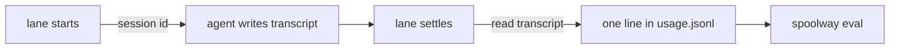

# Cost accounting

spoolway records what every lane spent: tokens, cost, wall time and outcome. The record is
the ledger, one line per lane, in `~/.spoolway/<project>/usage.jsonl`.

## How the numbers get there

spoolway does not talk to a model. Each agent writes its own transcript with per-turn token
counts. The dispatcher names the session when it starts the lane, finds that transcript when
the lane ends, and appends one line to the ledger.


```mermaid
flowchart LR
  A[lane starts] -->|session id| B[agent writes transcript]
  B --> C[lane settles]
  C -->|read transcript| D[one line in usage.jsonl]
  D --> E[spoolway eval]
```

`pi` and `claude` accept a session id from spoolway. `codex` gets its own `$CODEX_HOME`
directory named after the id. See [Two ways to pin a session](agents.md#two-ways-to-pin-a-session).

Every launchable agent kind is metered. `spoolway agent verify <kind>` shows how a kind is
read back.

### Settled lanes

A transcript can grow after the lane is torn down. Every `spoolway eval` reads settled sessions
again and appends one line for the turns that arrived later. That line carries no `outcome`.
Lanes still running are left alone.

A lane banked more than once still counts as one lane. `spoolway eval`
groups these lines by task, step, round and session. Tokens, cost and time are deltas against
what a lane already banked, so a settled line's zero adds nothing and `WALL` sums every line
for that lane.

### Directory spend

A watched directory has sessions of its own that never went through the dispatcher: a person
running `claude` or `pi` by hand inside it. See
[`[watch]`](configuration.md#watch--directories-whose-own-sessions-count-as-this-projects-spend).
Every read of the ledger sweeps those too, and banks one line per session under `dir`. The `dir`
is the most specific watched root the session ran under.

A directory line carries no `task`, `step`, `pipeline`, `agent`, `outcome`, `run` or
`pipeline_version`, because spoolway dispatched no such work. The lanes table of
`spoolway eval` skips these lines. Its directory table reads them, and reads nothing else. See
[The directory table](eval.md#the-directory-table).

A session already banked as a lane is never banked again under `dir`. A transcript that has not
changed since its last banked line is not read again.

A subagent's transcript is banked as its own session line, under its own id. `spoolway eval`
folds that line onto the session that ran it, so the directory table never shows a row for a
subagent on its own. See [The directory table](eval.md#the-directory-table).

codex sessions are not swept. Its session store records no working directory, so there is
nothing to match against a watched root.

### Worktree spend

A session run by hand inside one of the project's own worktrees is swept the same way as a
watched directory's own sessions. Where it lands depends on whose worktree it is.

Inside a task's own worktree, the session is not a directory line. It joins the lanes table
instead, on the step the task was on when the session started. Its tokens and cost add to that
step's row. No run, pass or block of its own is added. A held task's worktree still counts this
way, on the step it was held from.

Inside a worktree no task owns, the session is banked as a directory line on the project root's
own row, the same row the checkout itself banks under. Neither table has a row for a worktree
on its own.

A subagent started inside that session follows it: onto the same lanes row for a session in a
task's own worktree, or folded onto the same directory row otherwise. A subagent of a dispatched
lane's own session is never banked this way. That spend is the lane's own.

## Reading it

```
spoolway eval --by pipeline                    # this project, by pipeline
spoolway eval --by task                        # what each task came to
spoolway eval --by group --all                 # every project
spoolway eval --by group --project webshop     # one named project
spoolway eval --since 2026-06-01 --until 7d    # a window
```

```
PIPELINE    RUNS  PASS  BLOCKS  CTX PEAK AVG  CTX PEAK       IN      OUT  CACHE R  CACHE W       USD      TIME
impl          41   82%       3           32%       52%    26.3k    6.39M    1.72B   32.78M    692.90   49h 12m
impl_ui       15   79%       2           31%       50%    12.2k    2.95M   793.5M   15.15M    319.95   31h 00m
Total         56             5                            38.5k    9.34M    2.51B   47.93M   1012.85   80h 12m
```

| Column | What it is |
|---|---|
| `RUNS` | Runs that touched this row |
| `IN`, `OUT`, `CACHE R`, `CACHE W` | Each priced token class, summed over the row |
| `USD` | Priced spend. Blank when no lane on the row has a price. See [Pricing](#pricing). |
| `TIME` | Wall time, summed over the row |

`spoolway eval --per-run` divides each token class and the time by `RUNS`. See
[Comparing pipelines](eval.md) for the full column set, `--by` and the rest of the flags.

## Pricing

Prices are per million tokens, keyed by a glob over the model name, in `.spoolway/config.toml`:

```toml
[models."claude-opus-5"]
context_window = 1000000
input = 5.0
output = 25.0
cache_read = 0.5        # 0.1x input
cache_write_5m = 6.25   # 1.25x input
cache_write_1h = 10.0   # 2x input
prompt_cache_ttl = "1h"
```

| Key | What it is |
|---|---|
| `context_window` | The model's window in tokens. `session_reuse_ctx` in the agent profile is a percentage of it. |
| `input`, `output` | USD per 1M tokens |
| `cache_read` | USD per 1M tokens read from the prompt cache |
| `cache_write_5m`, `cache_write_1h` | USD per 1M tokens written to a five-minute or one-hour cache |
| `prompt_cache_ttl` | How long a session's prompt cache is trusted to stay warm. A carried session older than this opens fresh. Defaults to `5m`, and to no limit on a `local` model. `"0"` turns it off. |
| `slots`, `local` | See [`[models."<glob>"]`](configuration.md#modelsglob--what-a-model-costs-and-how-big-its-window-is) |

Set a price from the command line:

```
spoolway config set models.'<model-glob>'.input <usd per 1M>
```

A model is priced from the first table that knows it:

| Table | Where | Matched by |
|---|---|---|
| Project | `[models]` in `config.toml` | glob |
| Refreshed | `~/.spoolway/model-prices.json`, written by `spoolway models refresh` | exact name |
| Built-in | `assets/model-prices.json`, compiled into the binary | exact name |

A model in none of them has an unknown cost, not a free one. `spoolway models` lists every
model the pipelines name, its window, its rates, which table answered, and how old that table
is. `spoolway doctor` notes a table older than `housekeeping.price_max_age_days`.

The built-in table is litellm's `model_prices_and_context_window.json` (MIT), cut down to the
fields above. `spoolway models refresh --vendor` fetches the upstream file with curl and
rewrites `assets/model-prices.json` for review and commit.

`pi` prices its own transcripts and reports zero for a local model. Claude Code records no
cost, so the price table answers for it.

## The version a lane ran under

Each line records the `pipeline_version` its pipeline file carried when the lane started, and
what the lane reported. See [Comparing pipelines](eval.md).

## One ledger per project

Each project has its own `usage.jsonl`. Setup and dispatch note the project root in an index
under the state directory, and `--all` reads every ledger it lists. The index holds no usage.

A read or a write of the index drops any project whose checkout and whose home are both gone
from disk.
