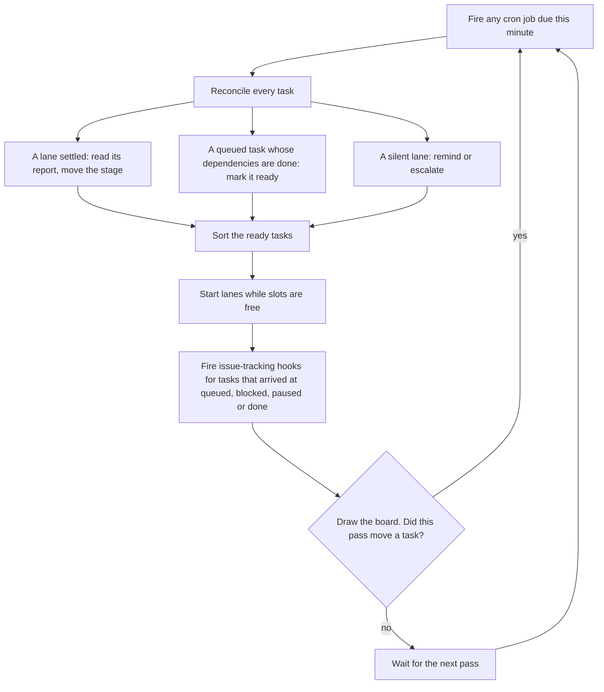
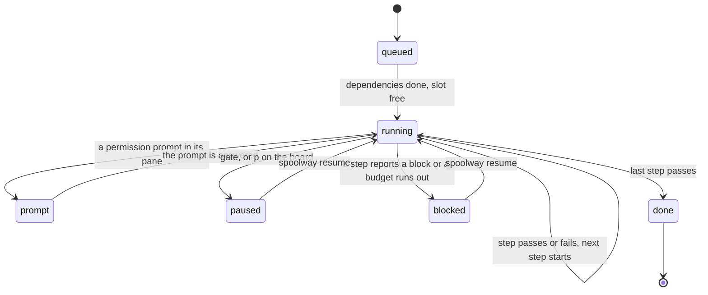

# The dispatcher

The dispatcher moves tasks through their pipelines. It uses no model. Every decision is a
lookup in a task file or in the list of live lanes.

## Running it

```
spoolway dispatch                 # runs until the queue is empty
spoolway dispatch --force         # start past the restart guard
spoolway dispatch --plain         # print the board once as a plain table, for scripts
```

`spoolway dispatch` asks herdr which pane it is running in and refuses to start outside one,
whatever flags are given:

```
$ spoolway dispatch
spoolway: a dispatcher has to be visible, and this is not a herdr pane.

  Open one and run it there:

    herdr
    spoolway dispatch
```

An internal headless backend exists for automated tests only. It is not a supported runtime
or an alternative to installing herdr. See [Testing](testing.md).

One dispatcher serves the whole project. Every pass re-reads the queue, so a task queued
while it runs is picked up on the next pass. A second `spoolway dispatch` on the same project
prints that a dispatcher is already running, asks herdr to focus its pane, and exits without
drawing a board:

```
$ spoolway dispatch
  a dispatcher is already running for this repo (pid 8123)
  → focusing its pane w1:p5
```

`spoolway dispatch --plain` against the same held lock prints its own one-shot table headed
`watching dispatcher (pid N)` instead, for scripts.

Queueing a batch from the queue screen while another dispatcher holds the lock works the same
way: the batch is written, and `enter` on the overview brings that dispatcher's workspace to
the front instead of starting a second one. See [`spoolway queue`](cli-reference.md#spoolway-queue).

Before the first pass, `enter` on the queue screen and an [overrides
layer](configuration.md#the-overrides-layer) screen, in turn, a warnings screen holds `spoolway
doctor`'s cheap findings until a key answers it. See
[`spoolway dispatch`](cli-reference.md#spoolway-dispatch). Once the run has taken the lock, a
failure to find or open its own workspace gets a notice of its own.

| Exit code | Meaning |
|---|---|
| 0 | The run dispatched and stopped on its own. |
| 3 | The queue was empty and no job is enabled. |
| 4 | Another dispatcher holds the lock. |
| 5 | The restart guard refused the start. |
| 1 | Any other error. |

### When it stops

The run stops when the queue is empty. A `paused` or `blocked` task keeps the run alive,
because it is waiting on a person. While any job is enabled, the run also stays up on an empty
queue and prints when the next job fires. See [Jobs](jobs.md).

`ctrl-c` stops the run the same way. A stop tears nothing down. Every worktree, pane, tab and
lane stays where it is, and the next run picks it back up. Before it exits, the run banks each
still-running lane's spend in the usage ledger and forgives that lane's launch counter, so the
next run does not treat a lane that survived the stop as a failed launch. A second `ctrl-c`
kills the process at once.

### Restarting into a repo that cannot run

Four starts in a row that find another dispatcher holding the lock, inside 30 seconds, get the
fifth refused with exit code 5. A start that runs clears the count, and so does `--force`.

## What a pass does

A pass reads two things: each task file's stage, and the list of live lanes.



A key also answers inside a pass, not only during the wait between passes: the dispatcher checks
stdin between each task, during and between each lane start, the sweep and the archive, so a busy
run reads the keyboard at the same rate as an idle one.

Between two passes the wait is not empty. The dispatcher slices the wait into one-second
stretches and draws a frame at the top of each one, so the board redraws every second on every
target. On Linux, the dispatcher also watches the queue directory and the commands directory for
the whole wait, alongside the keystroke it already listens for. A file landing in the queue
directory ends the current stretch early, so the board redraws at once instead of waiting out the
second. A file landing in the commands directory, such as a background command step finishing,
ends the wait immediately and starts the next pass, which is what routes that step. A pass also
draws on the same once-a-second cadence between the checkpoints in its own work, so the board
keeps redrawing through a slow pass too.

A model's `slots` caps lanes on that model, and a profile's `concurrency` caps lanes on that
profile. A model marked `exclusive` never runs beside a different exclusive model. See
[`[models."<glob>"]`](configuration.md#modelsglob--what-a-model-costs-and-how-big-its-window-is).

A task with a `depends_on` is cut from its first dependency's branch. A task without one is cut
from `base:`. A task file that does not parse is skipped and named under the board.

## What runs next

When more tasks are ready than there are free slots, the pass sorts them:

1. Fewest steps left on its pipeline first.
2. Then the group with the least work left.
3. Then the task the most other tasks wait on.

With `dispatch.priority = "group"`, the default, a task from a group that has not started yet
ranks behind every task from a group that is already running. It still takes a slot when no
running group has ready work. With `dispatch.priority = "any"` only the three rules apply.

## What a lane is sent

A lane starts with a system prompt and one typed message. The system prompt holds the step's
prompt file and the report contract: the exact `spoolway report` calls and what they do. It is
written to `~/.spoolway/<project>/system-prompts/<lane>.md`. The typed message is the task
file's path. `spoolway prompt contract` prints the system prompt for a sample task.

## Reading the state

The dispatcher draws the board in the terminal it runs in and runs a pass every ten seconds.
That rate is not configurable, and stays the floor under how long a quiet run can go without a
pass: a change in the queue or commands directory wakes the board or the next pass sooner, as
described above. A pass that moves a task to a new stage, frees a lane or archives a task runs
the next pass at once instead of waiting for the next one. A long run of such passes in a row
eventually waits anyway.


The header above the task rows names the running dispatcher's version, next to its pid. If a
`spoolway` executable on `PATH` reports a newer version, the header adds `(restart to use latest
installed version)`.

Rows are grouped by `group:`. A `▌<group>` line opens each block, and a total line closes it.
The total is the group's banked spend: every step that has settled, across every task in the
group, added up as soon as each one banks. It does not include a running step's unbanked
figures, so it can read lower than the row above it. A group with nothing banked yet closes
with no figures at all.
When the group has an issue behind it, the group name is a link to that issue. A `∥` after a
task id marks `parallel: true`.

### Columns

| Column | What it shows |
|---|---|
| TASK | The task id. |
| PIPELINE | The pipeline the task runs on. |
| STEP | The current step. `↻ <n>` is how many times the task has arrived at that step, whichever route carried it there. It appears from the second arrival on and always draws dim. |
| STATE | One of the states below. |
| CTX | How full the lane's context window is, as a percentage of the model's `context_window`. |
| OUT | Output tokens this step has produced. |
| COST | What this step has cost. |
| TIME | How long the lane's pane has been busy on this step. A paused or blocked row's TIME does not grow. |
| NEXT | For a running task, the step it goes to on pass. For one with a scheduled pause, `→ paused after <step>`. For a queued task, what it waits on. For a paused task, the outcome the pause caught and where a resume sends it, key first: `[r] review failed → e2e — \`spoolway resume <task>\``; a caught pass reads `[r] → e2e — \`spoolway resume <task>\``. A task parked before it ever started reads `→ queued — [r] resumes it`. For a lane holding a permission prompt, `press a key in pane \`<task> · <step>\``. |

`spoolway eval --by task` gives the task's whole bill.

### States



| State | Meaning |
|---|---|
| `queued` | Waiting for its dependencies and a free slot. |
| `running` | A lane is working the current step, or the next lane is about to start. |
| `prompt` | A live lane's pane is holding a permission prompt. Read fresh off the lane list every redraw, and gone the instant the prompt is answered. Not resumable: the task has not stopped. |
| `paused` | The task's own stage is `paused`: a gate, or a park from `p`. |
| `blocked` | A step reported a block, a launch failed, or a loop budget ran out. Read `## Blocker` in the task file. |
| `done` | Finished and archived. The row stays, dimmed, until the whole group is done. |

`RECENT` lists the last task moves. Errors from a pass go to `~/.spoolway/logs/<project>.log`.

### Keys

Lowercase acts on the row under the `▸` cursor. Uppercase acts on the whole run.

| Key | What it does |
|---|---|
| `↑` `↓` | Move the cursor. It starts on the first row of the first group and walks every row the board draws, done ones included. If its row leaves the board, such as its group finishing, the cursor falls back to the first row with no key pressed. |
| `o` | Open the task file in `$VISUAL`, else `$EDITOR`, in a new pane. Works on a `done` row too. |
| `r` | Resume a paused or blocked row whose dependencies are done. A row parked before it ever started resumes straight back to `queued`, whatever its dependencies read. Same as `spoolway resume <task>`. |
| `R` | Resume every paused task. Asks first if any of them is at a real gate. |
| `p` | Pause the row, including a `blocked` one. Asks first if it would interrupt a running agent turn or command. |
| `P` | Pause every task in the run, including any `blocked`. Asks first, listing what it would interrupt. |
| `s` | On an open pause panel, schedule the pause instead of carrying it out. |
| `u` | Take a `queued` task, and every unstarted task that depends on it, out of the queue and write their documents back to `~/.spoolway/<project>/pending/`. Asks first. |
| `U` | Do the same for every task that has not started. Asks first. |
| `ctrl-c` | Stop the run. |

Pausing an agent turn sends Escape to the pane, so a resume picks the session back up. Pausing
a command step kills the run, and the command runs again in full on resume.

`s` on a pause panel interrupts nothing. It writes a `gate_at` for the step the panel named, so
each named task pauses itself once that step reports, whatever it reports. Under `P`, the tasks
with nothing running still park at once. Press `s` again on a row that already has a scheduled
pause to clear it.

### Footer

One line per agent profile: `<profile>   slots <live>/<cap>`. A model with its own `slots` gets
its own figure appended after the profile's, model name then `<live>/<cap>`, so a profile
running a pooled model reads `pi   slots 2/3   Ornith-1.5-35B-A3B   1/2`. A line
`issue_tracking: N hook failures — see tracking/` appears while any hook
has failed. Then the job ledger lists every enabled job with its next firing:

```
jobs    2 active
        ○ nightly-audit       Sat 12 Sep 03:00   (in 6h 48m)
        ○ release-readiness   Mon 14 Sep 08:00   (in 2d 12h)
```

`spoolway queue list` prints the same table from another terminal, and `spoolway lane <lane>`
shows what one lane is doing.

## Gates: when the pipeline waits for you

A step with `gate: true` stops the task on `paused` after the step reports. The pane stays open
for you to read.

```
spoolway resume deploy-login                            # let it past
spoolway resume deploy-login --stage implement -m "not tonight"  # send it back round
```

A paused task holds no slot. You can type into its pane. When that turn ends, the dispatcher
commits the worktree with a `## Status Log` line saying a person drove the round.

Three other things put a task on `paused`:

| Cause | How the task file records it |
|---|---|
| `p` or `P` on the board | `parked_from: <step>` |
| Escape typed by hand into a lane's pane | `parked_from: <step>`, written on the next pass |
| A staffed `blocked` lane reports `--pause`, `--fail` or `--block` | `paused_at: <the step it blocked on>` |

`spoolway resume` on any of these puts the task back on its step. A paused task's pane survives
a stop of the dispatcher.

## A lane that settles without reporting

A lane can end its turn without calling `spoolway report`. Then:

1. The next pass sends the report contract into the pane again.
2. Each later pass where the transcript has grown sends another reminder, up to three.
3. A lane whose transcript has not grown since the last reminder is blocked, with the last of
   what the pane said in the task's `## Blocker`. `spoolway resume` restarts the step on the
   same session.
4. A fourth due reminder blocks the task instead.

A lane that still holds a process it started, such as a long build, is excused from reminders
until `dispatch.lane_child_ceiling` (one hour by default), then escalated.

A lane whose multiplexer reports it `blocked` is on a permission prompt. The board reads this
live off the lane list every redraw: the row draws `● prompt` with the pane named in NEXT, and
nothing is sent to it. The task's own stage does not move. Answer the prompt and the row reads
`running` again on the next redraw.

## A step that carries its own session

```yaml
- id: implement
  session: true       # reuse the newest session this prompt held on this task
- id: document
  session: false      # the default: every visit opens fresh
```

The step carries the session on if two bounds hold:

| Bound | Setting | Checked against |
|---|---|---|
| Size | `agents.<profile>.session_reuse_ctx`, a percentage | The input, cache-read and cache-write tokens of the session's last turn, over the model's `context_window`. |
| Age | `models.<glob>.session_reuse_idle` | The session store's modification time. |

Otherwise the step opens a fresh session, and `RECENT` says why. The lookup goes by prompt,
so two steps running the same prompt share one conversation. A blocked task's resume is
separate from this. See [When a task needs a person](tasks.md#when-a-task-needs-a-person).

## Restarts, laps and escalation

| Limit | What it bounds | Reset by |
|---|---|---|
| Launch guard | A lane that dies at launch and leaves no session blocks the task. In an unattended run it is retried on a doubling delay, capped at one hour. | A pass that sees the lane; every stage transition; a dispatcher stop. |
| Launch-failure ceiling | A launch that cannot start at all, such as a refused tab or an unconfigured model, is retried twice. The third failure in a row routes the task to the step's `on_fail`, or `blocked`. | A launch that starts; arriving at the step again; re-queueing the document. |
| Pane-busy wait | A pane that has not reached its shell prompt refuses `agent start`. The task waits. After ten minutes it routes the way the launch-failure ceiling does. | A launch that starts; arriving at the step again; re-queueing the document. |
| A step's `loop:` | How many times a task may arrive at the step from a given step. | `spoolway resume`, for the loops out of the step it resumes at. |
| Reminder loop | Three reminders to a silent lane. | Anything the lane writes to its transcript. |
| Live-child ceiling | How long a lane may hold a child process before it is escalated. | The process exiting. |
| Issue-tracking hook retry | A failing `[issue_tracking]` hook retries on a doubling delay from ten seconds, capped at an hour. | The hook succeeding. |

When a loop budget runs out, the task parks on `blocked`.

## Escalation

An escalation puts the task on `blocked`. In an attended run the board marks the row amber and
names the pane in NEXT, and the task waits for `spoolway resume`. In an
[unattended run](pipelines.md#unattended-runs) a lane starts on the `blocked` step instead, using
the `[unattended]` `blocked_*` settings.

A staffed `blocked` lane answers with `--pass` when it cleared the way, or `--pause` when it
cannot. A `--fail` or `--block` from it is read as `--pause`. A `--pass` carries the task past
the blocked step to that step's `on_pass`, or back to itself for a command step. `--pass --stage
<step>` sends it to `<step>` instead, bounded by the steps this task has already run. A
`--pause`, `--fail` or `--block` puts the task on `paused`, and `spoolway resume` then hands it
back to the step it blocked on.

A blocked task keeps its pane open until it is resumed.

## Where a lane lives

```toml
[dispatch]
herdr_mode = "split"  # or "grouped"
```

| Mode | Where a lane runs |
|---|---|
| `grouped` | One tab per project in the shared `spoolway-dispatcher` workspace. One pane per running task. |
| `split` | One herdr workspace per task, nested under the project's row as `spoolway/<task>`. |

Under a multiplexer every lane is a real pane you can watch and type into. A task holds one
pane for its whole life. See [Vacating a pane](#vacating-a-pane). A lane is named
`<task> · <step>`. Sessions you start by hand are never touched.

### One home for every run, in every project

`spoolway-dispatcher` is one herdr workspace shared by every project on the
machine. It opens on `~/.spoolway/.dispatcher/`, which is not a repository. Every project's home
is named `<label>-<id>`, so no project can take the name `.dispatcher`. The board itself stays
in the pane you ran `spoolway dispatch` in.

### herdr

Under `grouped`, the project's tab closes when its last task is archived. The shared workspace
is only ever closed by hand. Under `split`, each task's workspace is bound to its worktree with
`herdr worktree open`.

A task gets one tab, whichever step it is on. Every pane after the first splits inside that same
tab. Each split halves the smallest pane in the tab along its longer side, so a tab grows as a
spiral. A tab left holding nothing is closed on the next pass, unless it is its workspace's only
tab.

Under `split`, a task's tab is renamed to the task's slug, and stays that way across a
dispatcher restart. Its panes then show only the step. Under `grouped`, several tasks share one
tab, so its panes show `<task> · <step>`, the same as the lane's own name.

### Vacating a pane

When a step finishes, the dispatcher asks its session to leave the pane, so the next step can
start in the same pane. Only `claude` has a quit gesture. See [Leaving a pane without closing
it](agents.md#leaving-a-pane-without-closing-it).

The next step waits up to two minutes for the earlier lane to leave. After that it splits its
own pane and the old one is closed. The pane goes blank during the transition.

## Looking into a lane

```
spoolway lane                       # the lanes there are
spoolway lane "login · implement"   # that lane's output
spoolway lane "login · implement" -n 500
```

Quote the lane name. It holds a space.

## Where work happens on disk

Each task gets a git worktree at `dispatch.worktree_root`, which is
`~/.spoolway/<project>/worktrees/task-<id>` by default. If somebody already has the task's
branch checked out, the lane borrows that checkout and cleanup leaves it alone. See
[Whose worktree](pipelines.md#whose-worktree).

When the worktree root holds a `Cargo.toml`, its `target/debug` is a symlink into
`.cargo-target/debug`, a directory beside the worktree root that every lane shares.
`target/release` stays a real, private directory in each worktree. Tearing a worktree down
removes the symlink, not the shared directory. A worktree with no root `Cargo.toml` gets no
`target/` and no shared `.cargo-target` at all.

When a task reaches `done`:

1. Leftover work is committed as `wip(<task>): <step>`. If that fails, the task is held on
   `blocked`.
2. The worktree is removed, unless it was borrowed.
3. The branch is deleted, unless a queued task still depends on it or it has commits no remote
   has.
4. The task file moves to `archive/`, and its run files and session homes are deleted.

### Trial arms

A trial forks a group into one arm per task under one `trial:` id. See
[Trials](planning.md#trials). An arm is a disposable copy:

- Its `queued` and `done` events never fire the `[issue_tracking]` hook.
- `spoolway stack` is a no-op for it, so it opens no pull request.
- Its branch is deleted at cleanup whether or not a remote has it.

When the last arm reaches `done`, every arm's copy is removed. The source group and the usage
rows stay:

```
trial t9f3a settled

  kept      source group board-step-grace-window
  kept      usage rows for 3 trial tasks
  removed   3 task documents, worktrees and local branches
  removed   3 panes, scratch dirs, sessions and run-file sets

  read      spoolway eval --by task --trial t9f3a
```

`spoolway eval --discard <id>` removes a trial before it settles. It refuses while an arm is
mid-turn unless you pass `--force`.
