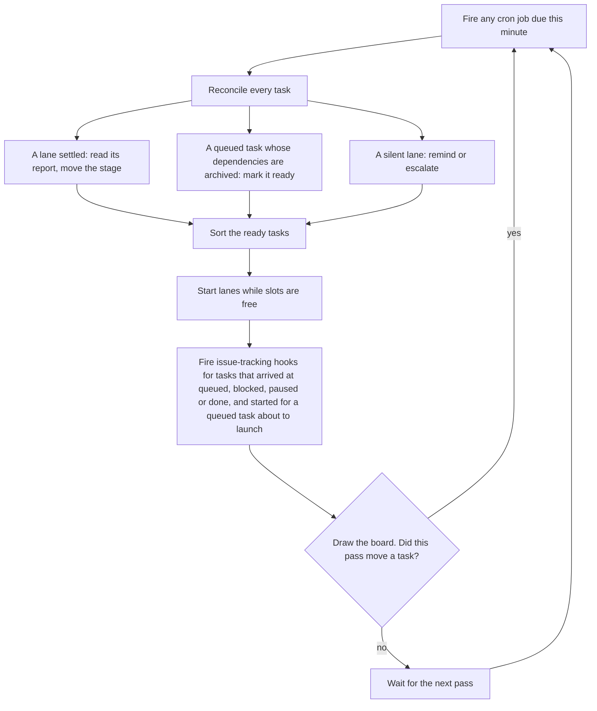
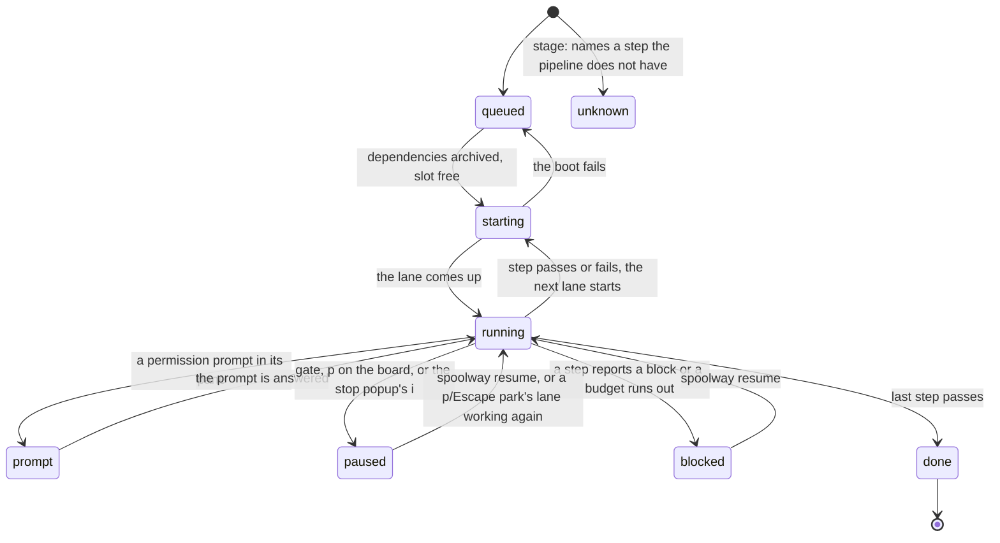

# The dispatcher

The dispatcher moves tasks through their pipelines. It uses no model. Every decision is a
lookup in a task file or in the list of live lanes.

## Running it

```
spoolway dispatch                 # runs until the queue is empty, printing a line per pass
```

`spoolway dispatch` asks herdr which pane it is running in and refuses to start outside one,
whatever flags are given:

```
$ spoolway dispatch
spoolway: Open herdr and start spoolway there:

  herdr
  spoolway
```

An internal headless backend exists for automated tests only. It is not a supported runtime
or an alternative to installing herdr. See [Testing](testing.md).

One `spoolway` serves the whole project at a time: a dispatcher started with `spoolway
dispatch`, or a screen opened with bare `spoolway`. Every pass re-reads the queue, so a task
queued while a dispatcher runs is picked up on the next pass. A second `spoolway dispatch`
while either is up prints the same line and exits without drawing a board:

```
$ spoolway dispatch
Dispatcher already running
```

Queueing a batch from the queue screen while another dispatcher holds the lock works the same
way: the batch is written, and the running dispatcher picks it up on its next pass. See
[`spoolway queue`](cli-reference.md#spoolway-queue).

Before the first pass, an [overrides layer](configuration.md#the-overrides-layer) screen, then
a warnings screen holding `spoolway doctor`'s cheap findings, each holds for a key, whenever
either has something to say. See [`spoolway dispatch`](cli-reference.md#spoolway-dispatch). Once
the run has taken the lock, a failure to find or open its own workspace gets a notice of its
own.

| Exit code | Meaning |
|---|---|
| 0 | The run dispatched and stopped on its own. |
| 3 | The queue was empty and no job is enabled. |
| 4 | Another dispatcher or screen already holds the project. |
| 1 | Any other error. |

### When it stops

The run stops when the queue is empty. A `paused` or `blocked` task keeps the run alive,
because it is waiting on a person. While any job is enabled, the run also stays up on an empty
queue and prints when the next job fires. See [Jobs](jobs.md).

`ctrl-c` stops the run the same way. A stop tears nothing down. Every worktree, pane, tab and
lane stays where it is, and the next run picks it back up. Before it exits, the run banks each
still-running lane's spend in the usage ledger and forgives that lane's launch counter, so the
next run does not treat a lane that survived the stop as a failed launch. A second `ctrl-c`
kills the process at once.

## What a pass does

A pass reads two things: each task file's stage, and the list of live lanes. Before it reads the
queue, it deletes any half-written task file in `queue/` whose writer has stopped running.


```mermaid
flowchart TD
  A[Fire any cron job due this minute] --> B[Reconcile every task]
  B --> B1[A lane settled: read its report, move the stage]
  B --> B2[A queued task whose dependencies are archived: mark it ready]
  B --> B3[A silent lane: remind or escalate]
  B1 & B2 & B3 --> C[Sort the ready tasks]
  C --> D[Start lanes while slots are free]
  D --> E[Fire issue-tracking hooks for tasks that arrived at queued, blocked, paused or done, and started for a queued task about to launch]
  E --> F{Draw the board. Did this pass move a task?}
  F -->|yes| A
  F -->|no| G[Wait for the next pass]
  G --> A
```

A key also answers inside a pass, not only during the wait between passes: the dispatcher checks
stdin between each task, during and between each lane start, the sweep and the archive, so a busy
run reads the keyboard at the same rate as an idle one.

Between two passes the wait is not empty. The dispatcher slices the wait into one-second
stretches and draws a frame at the top of each one, so the board redraws every second on every
target. On Linux, the dispatcher also watches the commands directory for the whole wait,
alongside the keystroke it already listens for. A file landing there, such as a background
command step finishing, ends the wait immediately and starts the next pass, which is what routes
that step. A pass also draws on the same once-a-second cadence between the checkpoints in its
own work, so the board keeps redrawing through a slow pass too.

A task that `spoolway queue unqueue` moves to the pending directory while a pass runs is dropped
by that pass. The pass does not write its task file back. It starts no command and sends no
briefing for the task, and it removes the checkout and the branch it cut for it, unless that branch
holds commits. A lane already booting for the task is stopped.

A model's `slots` caps lanes on that model, and a profile's `concurrency` caps lanes on that
profile. See
[`[models."<glob>"]`](configuration.md#modelsglob--what-a-model-costs-and-how-big-its-window-is).

The `slots` cap belongs to a `[models]` row. Every model name that matches the same row shares
its count. With `[models.qwen3] slots = 1`, a step on `qwen3` and a step on `local/qwen3` share
one slot. A row keyed by a glob such as `qwen3-coder*` shares its slots across all the names it
matches. A task that waits prints the row, as in `waiting for a qwen3 slot (1/1)`. A model with
no `[models]` row that sets `slots` is not capped.

Only the lane on a task's current step counts against those caps, from the pass that starts it.
A lane whose task has moved to another step counts for nothing, even while it is `Working`, the
same as a session you started by hand. Typing into one on a local model may make the server swap
weights. The footer counts lanes by the same rule.

A task with a `depends_on` is cut from its first dependency's branch. A task without one is cut
from `base:`. A `starts_from:` set in the task file wins over both. When the branch to cut from
exists nowhere, the task pauses instead, as
[A start branch that does not exist](tasks.md#a-start-branch-that-does-not-exist) describes. A task file that does not parse is skipped and named under the board.

## What runs next

When more tasks are ready than there are free slots, the pass sorts them:

1. Fewest steps left on its pipeline first.
2. Then the group with the least work left.
3. Then the task the most other tasks wait on.

With `dispatch.priority = "group"`, the default, a task from a group that has not started yet
ranks behind every task from a group that is already running. It still takes a slot when no
running group has ready work. With `dispatch.priority = "any"` only the three rules apply.

A task that reaches a `serial: true` command step while another task's run of the same step and
pipeline is going waits there unstarted, out of the sort above. Its run starts on the first pass
after that run exits, alongside whichever other ready task the sort picks first.

## What a lane is sent

A lane starts with a system prompt and a typed opening. The system prompt holds the step's
prompt file and the report contract: the exact `spoolway report` calls and what they do. It is
written to `~/.spoolway/<project>/system-prompts/<lane>.md`. `spoolway prompt contract` prints
the system prompt for a sample task.

The opening is one message naming the task file's path. A step that lists `skills:` opens with
one message per skill, in the order listed, and then that message. The first message is typed
when the lane starts. The unsent ones are saved with the lane in `lanes.json`.

A later pass types the next message when the lane's turn has ended. It types nothing into a
lane that is working or waiting on a permission prompt. A step with several skills therefore
takes one pass per skill to open.

## Reading the state

The dispatcher runs a pass every ten seconds. That rate is not configurable, and stays the floor
under how long a quiet run can go without a pass: a change in the queue or commands directory
wakes the next pass sooner, as described above. A pass that moves a task to a new stage, frees a
lane or archives a task runs the next pass at once instead of waiting for the next one. A long
run of such passes in a row eventually waits anyway.


The header sits in the top-right corner of the board, on the first line of the wordmark. On a pane too narrow for both, it takes its own right-aligned row above the wordmark. On a pane too narrow for the wordmark, it stays at the left margin. A header wider than the pane is cut short with `…`.

The header names the running dispatcher's version, next to its pid. If a
`spoolway` executable on `PATH` reports a newer version, the header adds `(restart to use latest
installed version)`.
Otherwise, if npm has published a newer release, the header adds `(<version> available)` in
yellow, for example `v0.9.0 (0.10.0 available)`. The notice is the same for every install. The
check is off when `housekeeping.update_check` is `false` or `SPOOLWAY_SKIP_VERSION_CHECK` is set.

Bare `spoolway`'s dispatch tab draws the same board, under the tab strip, from a `spoolway
dispatch` child the tab starts on `enter` and stops with the next `enter` — the tab runs no
pass itself. Its header names the pid of that child, or reads `dispatcher stopped`
with no pid once it has stopped, next to a count of the steps still working: `dispatcher stopped
· 3 steps finishing` (`1 step finishing` for one), left out once none are. The wordmark's spool
turns while that count is above zero. On `enter`, before the child's first pass has claimed
anything, the tab covers the board with a keyless `Starting dispatcher` popup. See
[`spoolway`](cli-reference.md#spoolway).

`enter` over a running dispatcher stops it at once when no agent lane or command step is
running. Queued tasks and scheduled jobs do not count as running. When at least one agent lane
or command step is running, `enter` opens the stop popup instead:

```
╭─ stop dispatching ──────────────────────────────────────────────────╮
│                                                                     │
│  No new steps will be started.                                      │
│  Interrupting stops agents and commands. When resumed, agents pick  │
│  up where they left off and commands restart.                       │
│                                                                     │
│  [enter] let running steps finish                                   │
│  [i] interrupt them now   [esc] back                                │
╰─────────────────────────────────────────────────────────────────────╯
```

`enter` there stops the child the way `ctrl-c` does: nothing is interrupted, and every lane
keeps running. `i` interrupts every live agent turn and kills every running command step first,
parking each of those tasks on `paused` with a mark saying the stop parked it, then stops the
child. `esc` leaves the dispatcher running. A second `enter` while a stop is already going does
nothing: there is nothing left to ask.

Starting dispatching again, from the tab or with `spoolway dispatch`, resumes every task the
stop parked, back onto the step it was on, before its first pass.

Rows are grouped by `group:`. A `▌<group>` line opens each block, and a total line closes it.
The total is the group's banked spend: every step that has settled, across every task in the
group, added up as soon as each one banks. It does not include a running step's unbanked
figures, so it can read lower than the row above it. A group with nothing banked yet closes
with no figures at all.
When the group has an issue behind it, the group name is a link to that issue. A group whose
first task stacks onto another group's own last task reads `▌<group>  after <group>`. See
[Stacking one group on another](tasks.md#stacking-one-group-on-another).

### A full board

When the queue has more rows than the pane can show, `RECENT` gives way first. It shows only when
the whole task table fits, in the rows the table leaves. The wordmark, the column header, the
slots, the jobs and the key line keep their rows.

A table that still does not fit scrolls under the cursor, in `spoolway dispatch` and in the
dispatch tab alike. It takes every row between the column header and the rule. The view keeps
the cursor's row on screen, and the total line under it when the cursor is on a group's last
task. `↑` and `↓` walk every task, so every task can be reached and seen.

The table's last row is a marker counting the tasks out of view, such as `↑ 7 tasks above · ↓ 18
tasks below`. It counts task rows only, never group lines, total lines or blank rows. It names
one side alone when tasks are hidden on that side only, and it is left off when no task is
hidden. On a narrow pane it shortens to `↑ 7 above · ↓ 18 below`, then to `↑ 7 · ↓ 18`.

When the view starts partway through a group, that group's `▌<group>` line is drawn on the
view's first row, in place of a task or the group's total line. A task it covers counts as
above. The cursor never lands on this line.

A pane too short for the wordmark, the footer and the key line together gives the table no rows
at all. The frame is then cut from the bottom so it never scrolls the terminal.

### The empty board

With no task on the queue, the board clears to a calm screen. The header stays in the top-right corner. The wordmark sits in the middle of the pane, with a bold greeting under it and a dim `Nothing queued` under that. The pane's key line shows only `[enter]` and, inside bare `spoolway`'s dispatch tab, `[q] quit`.

```
Good afternoon, Marvin.
Nothing queued
```

The greeting follows the local hour and ends in a full stop.

| Local time | Greeting |
|---|---|
| 05:00 to 11:59 | `Good morning` |
| 12:00 to 17:59 | `Good afternoon` |
| 18:00 to 21:59 | `Good evening` |
| 22:00 to 04:59 | `Working late` |

The greeting adds a comma and the first word of `git config user.name` for the board's repo. With no git, no name set or a blank value, it reads `Good afternoon.` instead. The board reads the name once, when it opens.

While a dispatcher holds the lock and at least one job is enabled, the job ledger follows `Nothing queued`, after one blank row. It uses the busy board's own words and order, and is centred as one block. Jobs fire only inside a dispatcher's pass, so a board with no dispatcher running lists no jobs. When a job fires and queues its routine, the board switches back to the busy layout by itself.

```
Good evening, Marvin.
Nothing queued

jobs   2 active
       ○ nightly-audit   Sun 11 Oct 03:00   (in 5h 12m)
       ○ weekly-deps     Mon 12 Oct 09:00   (in 1d 11h)
```

An empty board draws none of the following, and each returns once a task is on the board: the rule, the slots lines, the `pipelines` notice and the parse warning. The keys that act on a row are left off the key line. The wordmark does not turn.

An empty board draws no `RECENT`, whether a dispatcher is running or not. The board still remembers it, and shows it again once a task is back. The wordmark, the two lines and the job ledger are centred together. A pane too short for all of them drops the whole job ledger first, then the wordmark, and always keeps the two lines. Once the wordmark is gone the job ledger stays gone.

### Columns

| Column | What it shows |
|---|---|
| TASK | The task id. |
| PIPELINE | The pipeline the task runs on. |
| STEP | The current step. For a starting task, the step the dispatcher is booting a lane for, ahead of the task file's own stage. `↻ <n>` is how many times the task has arrived at that step, whichever route carried it there. It appears from the second arrival on and always draws dim. |
| STATE | One of the states below. |
| CTX | How full the lane's context window is, as a percentage of the model's `context_window`. |
| OUT | Output tokens this step has produced. |
| COST | What this step has cost. |
| TIME | How long the lane's pane has been busy on this step. A paused or blocked row's TIME does not grow. |
| NEXT | For a running or starting task, the step it goes to on pass. For one with a scheduled pause, `→ paused after <step>`. For a queued task, what it waits on. For a paused task, the outcome the pause caught and where a resume sends it, key first: `[r] review failed → e2e`; a caught pass reads `[r] → e2e`. A task parked before it ever started reads `→ queued — [r] resumes it`. A task the dispatch tab's stop popup parked reads `→ <step> — resumes when dispatching starts`. A paused task whose resume has no step to name reads `[r] resume`, or `no step named` while a dependency or its own lane is busy. A blocked task waiting for a person reads `[r] → <step>`, naming the step a resume sends it back to. While a dependency or the task's own lane is busy, the row reads `→ <step>` with no key. For a lane holding a permission prompt, `press a key in pane \`<task> · <step>\``. NEXT never names a step the task walks past. When a pass or a resume leads onto one, NEXT names the first step after it that the task runs. |

`spoolway eval --by task` gives the task's whole bill.

### States


```mermaid
stateDiagram-v2
  [*] --> queued
  [*] --> unknown: stage: names a step the pipeline does not have
  queued --> starting: dependencies archived, slot free
  starting --> running: the lane comes up
  starting --> queued: the boot fails
  running --> starting: step passes or fails, the next lane starts
  running --> prompt: a permission prompt in its pane
  prompt --> running: the prompt is answered
  running --> paused: gate, p on the board, or the stop popup's i
  running --> blocked: a step reports a block or a budget runs out
  paused --> running: spoolway resume, or a p/Escape park's lane working again
  blocked --> running: spoolway resume
  running --> done: last step passes
  done --> [*]
```

| State | Meaning |
|---|---|
| `queued` | Waiting for its dependencies and a free slot. |
| `starting` | The dispatcher has claimed a slot and is booting the lane. herdr does not list it until the boot is well along. The logo turns the same as it does for `running`. |
| `running` | A lane is working the current step. |
| `prompt` | A live lane's pane is holding a permission prompt. Read fresh off the lane list every redraw, and gone the instant the prompt is answered. Not resumable: the task has not stopped. |
| `paused` | The task's own stage is `paused`: a gate, or a park from `p` or the dispatch tab's stop. |
| `blocked` | A step reported a block, a launch failed, a loop budget ran out, or, in an unattended run, the dispatcher stopped a lane that ended without reporting or crossed a ceiling. Read `## Blocker` in the task file. Entries above a `Cleared` line belong to a stop that is over. |
| `unknown` | The task file's `stage:` names a step the task's pipeline does not have. Nothing on the row can be resumed. Correct `stage:` in the task file. |
| `done` | Finished and archived. The row stays, dimmed, until the whole group is done. |
| `finished` | Only on a stopped dispatch tab: a step whose lane has settled, or whose command run has exited, with nothing up to move it on. TIME stops where the board first saw it settle. NEXT reads `moves on when dispatching starts`. The same step reads `running` while a dispatcher is up, since it moves on within the pass that settles it. |

### Recent moves

`RECENT` says what each task last did, one sentence per task, newest on top.
A cause in brackets follows when the route alone does not explain the move.

| Line | When |
|---|---|
| `started, moved to <step>` | The task left `queued` for its first step. |
| `passed <step>, moved to <step>` | The step passed, or a command step exited zero. The move may go past steps the task walks past, such as `passed test, moved to document`. |
| `failed <step>, moved to <step>` | The step failed, or a command step exited non-zero. The move may go past steps the task walks past. |
| `skipped <step>, moved to <step>` | The task passed over the step without running it, or the step sent no report. |
| `failed <step> in the background, moved to <step>` | A background command step exited non-zero after the task had moved on. |
| `resumed, moved to <step>` | The task left `paused`. |
| `unblocked, moved to <step>` | The task left `blocked`. |
| `unblocked by its lane, moved to <step>` | The `blocked` lane reported a pass. |
| `left <step>, moved to <step>` | The task file does not say how the task left the step. |
| `passed <step>, moved to paused (gate)` | The step has `gate: true`. |
| `passed <step>, moved to paused (scheduled)` | A scheduled pause took effect at the step. The same cause follows `failed <step>` and `reported a block on <step>`. |
| `passed <step>, moved to paused (hook failed)` | The issue hook for `done` exited non-zero, or was killed three times in a row. |
| `stopped before starting, moved to paused (hook failed)` | The issue hook for `queued` or `started` exited non-zero, or was killed three times in a row. |
| `stopped on <step>, moved to paused (manually)` | A person pressed `p` on the board, or Escape in the lane's pane. |
| `stopped before starting, moved to paused (manually)` | A person paused the task before it started. |
| `stopped on <step>, moved to paused (dispatching stopped)` | The dispatch tab's stop popup parked the task. |
| `stopped on <step>, moved to paused (escalated)` | The dispatcher stopped the lane in an attended run. The task file's `## Status Log` gives the exact reason. |
| `stopped on <step>, moved to blocked (escalated)` | The dispatcher stopped the lane in an unattended run, and the unblocker takes the task. The `## Blocker` section gives the exact reason. |
| `stopped before starting, moved to paused (branch <name> missing)` | The branch the task starts from does not exist. |
| `stopped on <step>, moved to paused` | The task file names no cause for the step the task left. A cause counts only when the file names that step. |
| `reported a pause on blocked, moved to paused` | The `blocked` lane reported a pause. |
| `reported a block on blocked, moved to paused` | The `blocked` lane reported a block. The same holds for `failed blocked` when it reported a fail. |
| `stopped on blocked, moved to paused (escalated)` | The dispatcher stopped the `blocked` lane, in any run. The `## Status Log` gives the exact reason. |
| `reported a block on <step>, moved to blocked` | The lane for the step reported a block. |
| `failed <step>, moved to blocked (loop limit on <step>)` | The step failed, and the step it routes to has used its `loop:`. The same cause follows `passed <step>` and `skipped <step>`. |
| `could not launch <step>, moved to <step> (3 attempts)` | The launch was refused three times in a row. |
| `could not launch <step>, moved to <step> (lane died at launch)` | The lane started and left nothing behind. |
| `could not launch <step>, moved to <step>` | The launch failed and the task file does not say why. A pane that never got ready reads this way. |
| `passed <step>, moved to blocked (uncommitted work)` | The last step passed, and the worktree held work that could not be committed. |

Errors from a pass go to `~/.spoolway/logs/<project>.log`.

### Keys

Lowercase acts on the row under the `▸` cursor. Uppercase `U` acts on the whole run.

| Key | What it does |
|---|---|
| `↑` `↓` | Move the cursor. It starts on the first row of the first group and walks every row the board draws, done ones included. If its row leaves the board, such as its group finishing, the cursor falls back to the first row with no key pressed. |
| `o` | Open the task file in `$VISUAL`, else `$EDITOR`, in a new pane. Works on a `done` row too. |
| `r` | Open the resume picker for a paused or blocked row whose dependencies have finished. The picker lists every step the task runs, preselects the natural next step, and `enter` resumes the task there. A row parked before it ever started, or paused by its `done` hook, resumes at once with no picker. See [Resume picker](#resume-picker). |
| `p` | Pause the row, including a `blocked` one. Asks first if it would interrupt a running agent turn or command. |
| `s` | On a running, paused or blocked row, open the restart panel. See [Restart panel](#restart-panel). On an open pause panel, schedule the pause instead of carrying it out. |
| `u` | Take a `queued` task, and every unstarted task that depends on it, out of the queue and write their tasks back to `~/.spoolway/<project>/pending/`. Asks first. |
| `U` | Do the same for every task that has not started. Asks first. |
| `ctrl-c` | Stop the run. |

### Resume picker

`r` on a held row opens a picker titled `resume <task>`. It lists the steps of the task's pipeline in pipeline order, except `blocked` and `done`. The line above the list says where the task stopped.

A step the task walks past is left out: a `first:` step when the task is not its chain's root, a `last:` step when a task in its group still depends on it, and a step its own `skip:` names. `spoolway resume --stage` refuses those steps, so the picker does not offer them. Two hidden steps are still listed. One is the step the task stopped at, so the person sees where the task is. `enter` on that row is refused unless it is also the `(next)` row. The other is the `(next)` row when a plain resume lands on a hidden step, which happens when that step has no `on_pass`.

```
paused at review — it passed

  reproduce   on fail
  review      paused
▸ document    on pass (next)

[↑↓] pick   [enter] resume   [esc] cancel
```

| Label | Meaning |
|---|---|
| `paused`, `blocked` | The step the task stopped at. |
| `on pass`, `on fail` | The steps a pass or a fail of the stopped step lands on. A route onto a hidden step is followed past it, so these name the step the task would really run next. |
| `(next)` | Where `spoolway resume <task>` sends the task, past any hidden step. The cursor starts here. |

When a plain resume goes to `blocked` or `done`, one extra `blocked (next)` or `done (next)` row sits under the steps. When the stopped step is not in the pipeline, the header names it, no row reads `(next)`, and the cursor starts on the first step.

| Key | What it does |
|---|---|
| `↑` `↓` | Move the cursor. A long list scrolls, with `▲ n more` and `▼ n more` lines. |
| `enter` on the `(next)` row | The same as `spoolway resume <task>`. |
| `enter` on any other row | The same as `spoolway resume <task> --stage <step>`. |
| `esc` | Close the picker and change nothing. |

An `enter` the resume refuses leaves the picker open and prints the reason under the list. When the task has moved on since the picker opened, `enter` resumes nothing and says so. Press `esc` and `r` again to see where the task stands.

Pausing an agent turn sends Escape to the pane, so a resume picks the session back up. Pausing
a command step kills the run, and the command runs again in full on resume.

`s` on a pause panel interrupts nothing. It writes a `gate_at` for the step the panel named, so
the named task pauses itself once that step reports, whatever it reports. For a command step,
the task pauses once the command exits, whatever the exit code. Press `s` again on a
row that already has a scheduled pause to clear it.

### Restart panel

`s` on a row opens a panel titled `restart <task>`. It names the step, the lane and the session that a restart throws away. The session row is left out when the task has no session on record.

```
╭─ restart login ─────────────────────────────────────╮
│                                                     │
│ step      review                                    │
│ lane      login · review                            │
│ session   32b0d7bd — abandoned, already banked      │
│                                                     │
│ The lane is torn down and `review` is briefed from  │
│ scratch. Its conversation is not kept.              │
│                                                     │
│ [s] restart   [esc] cancel                          │
╰─────────────────────────────────────────────────────╯
```

| Key | What it does |
|---|---|
| `s` | The same as `spoolway restart <task>`. |
| `esc` | Close the panel and change nothing. |

The panel opens for a task that `spoolway restart` accepts. A queued, done or hook-held row opens nothing, and neither does a row on a command step. A restart the command refuses leaves the panel open and prints the reason under the two closing lines. When the task has moved to another step since the panel opened, `s` restarts nothing and says so.

### Footer

A board with at least one task ends with a footer. One line per agent profile: `<profile>   slots <live>/<cap>`. A model with its own `slots` gets
its own figure appended after the profile's, model name then `<live>/<cap>`, so a profile
running a pooled model reads `pi   slots 2/3   Ornith-1.5-35B-A3B   1/2`. A line `pipelines  <files> changed since this run started — restart the dispatcher
to use it` appears while a pipeline file differs from the copy the dispatcher loaded. See
[Editing a pipeline while it runs](#editing-a-pipeline-while-it-runs). Then the job ledger lists every enabled job with its next firing:

```
jobs    2 active
        ○ nightly-audit       Sat 12 Sep 03:00   (in 6h 48m)
        ○ release-readiness   Mon 14 Sep 08:00   (in 2d 12h)
```

`spoolway queue list` prints the same table from another terminal, and `spoolway lane <lane>`
shows what one lane is doing.

## Editing a pipeline while it runs

The dispatcher reads the pipelines once, when it starts. Configuration is read every pass,
with a few exceptions; see the end of this section. Right after it takes the project's
lock, it writes a copy of what it loaded to `<home>/dispatch-pipelines.json`. A dispatcher
that starts later replaces that copy.

While a dispatcher is running, these commands route a task on that copy and not on the files:

- `spoolway report`
- `spoolway resume` and `spoolway queue resume`
- `spoolway restart`
- the `r` picker and the `s` key on the board
- `spoolway queue add`

Each reads only the pipeline its own task names. With no dispatcher running, they read the
pipeline files.

An edit to a pipeline file changes nothing until the dispatcher restarts. A pipeline override
follows the same rule: `spoolway pipeline override` writes a patch file, and the running
dispatcher uses it only after a restart. The footer and `spoolway pipeline check` name each
pipeline file or override patch that differs from the loaded copy:

```
$ spoolway pipeline check
  pipelines: t.yml changed since the running dispatcher started — restart the dispatcher to use it
```

`spoolway queue add` refuses a task whose pipeline the running dispatcher did not load. It
tells you to restart the dispatcher and try again.

Configuration is the exception. The dispatcher reads `config.toml` and the config override again
at the start of every pass, so a change such as a higher `agents.claude.concurrency` applies on
the next pass with no restart. If the file stops parsing, the dispatcher keeps running on the
last good config and prints the error once. It reads the file again every pass, so the error
clears as soon as the file is valid.

Three groups of keys are fixed when the dispatcher starts. `spoolway config get` shows a new
value for them at once, but the running dispatcher keeps the old one until you restart it.
They are `unattended.enabled`, the `unattended.blocked_*` keys and `dispatch.backend`.

## Gates: when the pipeline waits for you

A step with `gate: true` stops the task on `paused` after the step reports. The pane stays open
for you to read. A command step has no pane. The dispatcher stops the task on `paused` when the
command exits with a pass.

Press `r` on the paused row to open the [resume picker](#resume-picker). The natural next step
is preselected, so `enter` lets the task past the gate. Move the cursor to another step and press
`enter` to send the task back round to it instead.

A paused task holds no slot. You can type into its pane. When that turn ends, the dispatcher
commits the worktree with a `## Status Log` line saying a person drove the round.

Other things put a task on `paused`:

| Cause | How the task file records it |
|---|---|
| `p` on the board | `parked_from: <step>` |
| The dispatch tab's stop popup, `i` | `parked_from: <step>` and `parked_by_stop: true` |
| Escape typed by hand into a lane's pane | `parked_from: <step>`, written on the next pass |
| A staffed `blocked` lane reports `--pause`, `--fail` or `--block` | `paused_at: <the step it blocked on>` |
| A failing `[issue_tracking]` hook on `queued`, `started` or `done` | `hook_paused: queued`, `hook_paused: started` or `hook_paused: done` |
| A queued task whose start branch exists nowhere | `missing_start_branch: <branch>` |

`spoolway resume` on any of these puts the task back on its step, and so does `r` on the board.
A task the stop popup parked also resumes on its own, back onto the step it was on, the next
time dispatching starts — from the tab or from `spoolway dispatch` — and its NEXT column reads
`→ <step> — resumes when dispatching starts` until then. A paused task's pane survives a stop of
the dispatcher.

A `p` or Escape park also goes back onto its step without a key press, once its own lane is seen
`Working` again — a person typed a follow-up straight into the pane instead of pressing `r`. The
next pass restores it straight away; nothing is relaunched, since the lane never left. A report
that lane sends while the task is still parked is applied the same way, as if the task were
already back on its step. The stop popup's own park does not auto-restore like this: it waits for
dispatching to start, as above.

A hook pause is the one exception: nothing inside the pipeline failed, so there is no step to
go back to. `spoolway resume` forgets the hook's failed run, so it fires again. A task paused on
`queued` or `started` resumes to `queued`. A task paused on `started` never actually left
`queued`. A task paused on `done` resumes straight back to `done`.

## A lane that settles without reporting

A lane can end its turn without calling `spoolway report`. If the lane still has opening
messages to receive, the pass types the next one instead. Otherwise:

1. The next pass sends the report contract into the pane again.
2. Each later pass where the transcript has grown sends another reminder, up to three.
3. A lane whose transcript has not grown since the last reminder is escalated, with the last of
   what the pane said in the task's `## Blocker`. An attended run parks the task on `paused`. An
   unattended run sends it to `blocked`. `spoolway resume` restarts the step on the same session,
   unless its last reply is past `prompt_cache_ttl`, in which case it opens fresh.
4. A fourth due reminder escalates the task instead.

A lane that still holds a process it started, such as a long build, is excused from reminders
until `dispatch.lane_child_ceiling` (one hour by default), then escalated.

A lane whose multiplexer reports it `blocked` is on a permission prompt. The board reads this
live off the lane list every redraw: the row draws `● prompt` with the pane named in NEXT, and
nothing is sent to it. The task's own stage does not move. Answer the prompt and the row reads
`running` again on the next redraw.

## A step that carries its own session

```yaml
- id: implement
  session: true       # reuse the newest session this prompt held on this task
- id: document
  session: false      # the default: every visit opens fresh
```

The step carries the session on if two bounds hold:

| Bound | Setting | Checked against |
|---|---|---|
| Size | `agents.<profile>.session_reuse_ctx`, a percentage | The input, cache-read and cache-write tokens of the session's last turn, over the model's `context_window`. |
| Age | `models.<glob>.prompt_cache_ttl`, `5m` unless set, none for a `local` model | The time since the session's last reply to the model, read from the transcript. A transcript with no reply timestamp uses the file's modification time. |

Otherwise the step opens a fresh session. The lookup goes by prompt,
so two steps running the same prompt share one conversation. A task carrying `restart: <step>`
opens a fresh session on that step whatever `session:` says. A blocked task's resume
passes the same age check but not the size bound. See [When a task needs a person](tasks.md#when-a-task-needs-a-person).

## Restarts, laps and escalation

| Limit | What it bounds | Reset by |
|---|---|---|
| Launch guard | A lane that dies at launch and leaves no session blocks the task. In an unattended run it is retried on a doubling delay, capped at one hour. | A pass that sees the lane; every stage transition; a dispatcher stop. |
| Launch-failure ceiling | A launch that cannot start at all, such as a refused tab, an unconfigured model or a worktree that cannot be cut, is retried twice. The third failure in a row routes the task to the step's `on_fail`, or `blocked`. | A launch that starts; arriving at the step again; re-queueing the task. |
| Pane-busy wait | A pane that has not reached its shell prompt refuses `agent start`. The task waits. After ten minutes it routes the way the launch-failure ceiling does. | A launch that starts; arriving at the step again; re-queueing the task. |
| A step's `loop:` | How many times a task may arrive at the step, by any route. A walk-past, a failed launch and a late background failure count like a lane's report. A walk-past also counts at each step it skips that has a `loop:`. | The task leaving `blocked`, by any road. Every step's count starts again from zero. A resume from any other step refunds nothing. |
| Command kills | A command step whose run is killed without an exit code runs again. The third kill in a row blocks the task. | An exit code from any run; arriving at the step again. |
| Hook kills | An issue hook run killed without an exit code is fired again. The third kill in a row pauses the task. | `spoolway resume` on the paused task. |
| Reminder loop | Three reminders to a silent lane. | Anything the lane writes to its transcript. |
| Live-child ceiling | How long a lane may hold a child process before it is escalated. | The process exiting. |

When a loop budget runs out, the task parks on `blocked`.

## Escalation

An escalation stops a task that the pipeline cannot move on by itself. The task goes to `blocked`
or to `paused`, depending on the cause and the run.

| Cause | Attended run | [Unattended run](pipelines.md#unattended-runs) |
|---|---|---|
| A step reported a block, a launch failed, or a loop budget ran out | `blocked` | `blocked` |
| A lane ended without reporting, held a child past `dispatch.lane_child_ceiling`, or crossed `session_blocked_ctx` | `paused` | `blocked` |
| The `blocked` lane itself went quiet | `paused` | `paused` |

In an attended run the board marks a `blocked` row amber and names the pane in NEXT. The task
waits for `spoolway resume`. A task on `paused` waits for `spoolway resume` too.

In an unattended run a lane starts on the `blocked` step, using the `[unattended]` `blocked_*`
settings.

A staffed `blocked` lane answers with `--pass` when it cleared the way, or `--pause` when the
cause is still there and only a person can clear it. A `--fail` or `--block` from it is read as
`--pause`. A `--pass` carries the task past the blocked step to that step's `on_pass`, or back to
itself for a command step. `--pass --stage <step>` sends it to `<step>` instead, bounded by the
steps this task has already run. A lane that cleared the cause but did not do the stuck step's
work names that step, so the step runs again. A `--pause`, `--fail` or `--block` puts the task on
`paused`, and `spoolway resume` then hands it back to the step it blocked on.

A blocked task keeps its pane open until it is resumed.

## Where a lane lives

Every task runs in a herdr workspace of its own, nested under the project's row as
`spoolway/<task>`. There is no setting for the layout. A config that still names
`dispatch.herdr_mode` loads with a note, and `spoolway sync` drops the key.

A task that an older release left in a pane of the shared `spoolway-dispatcher` workspace is
moved on its next step. Spoolway closes that pane and opens the task a workspace of its own on
the checkout it already has.

Under a multiplexer every lane is a real pane you can watch and type into. Each agent step of a
task gets a pane of its own, and keeps it until the task is done. See [Finished lanes keep their
pane](#finished-lanes-keep-their-pane). A lane is named `<task> · <step>`. Sessions you start by
hand are never touched.

The board itself stays in the pane you ran `spoolway dispatch` in.

### herdr

Each task's workspace is bound to its worktree with `herdr worktree open`.

A task gets one tab, whichever step it is on. Every pane after the first splits inside that same
tab. Each new step's split halves the smallest pane in the tab along its longer side, so a tab
grows as a spiral. A step that comes back is the exception. See [Finished lanes keep their
pane](#finished-lanes-keep-their-pane). A tab left holding nothing is closed on the next pass,
unless it is its workspace's only tab.

A task's tab is renamed to the task's slug, and stays that way across a dispatcher restart. Its
panes then show only the step.

Spoolway types at most 512 bytes into a pane in one `herdr pane run`. Longer text is refused with
an error naming the pane and the byte count, and nothing is typed. A paned command step's pane
is typed one short line that runs the step's script file. See [Background and
headless](pipelines.md#background-and-headless).

### Finished lanes keep their pane

When a step finishes, its agent is left running, idle, in its own pane. Nothing is typed into it
and nothing is closed. The task's next step splits a new pane in the same tab, so every step the
task has run stays on screen and you can still type into it. See [Leaving a pane without closing
it](agents.md#leaving-a-pane-without-closing-it).

A finished lane does not count as running. A profile's `concurrency` and a model's `slots`
count only the lane on the step the task is on. A follow-up you type into a finished pane runs
outside every cap, the same as a session you started by hand. A report from a
finished lane is refused, because the task has left its step.

A step that comes back replaces its own pane. A review that fails and sends the task round again
splits the old review pane, and then closes it. The new pane takes the old one's whole area, so
the tab looks the same. A tab therefore holds at most one pane per agent step. The old run's
transcript stays on disk under its session id, and its report stays in the task file. If the old
lane is still mid-turn, its spend is banked first.

To show one agent pane per task, set `keep_finished_lanes = false` under `[dispatch]`, or
run `spoolway config set dispatch.keep_finished_lanes false`. Each new agent step then opens where
the spiral puts it, and the task's most recent kept pane is closed once the new one is ready. Its
spend is banked first. Panes that were already kept when you turned it off stay open until the
task is done, and only the most recent one closes with each new step. A parked task's pane is still
held for you.

A lane is banked when its step moves on, and again when the task is done. The second bank
counts only what was added since the first, so rounds you ran in a finished pane are counted.

A task whose pane is parked for you, on `paused` or on a `blocked` step nobody staffs, is still
focused once. Its pane stays open when the task moves on. `spoolway resume` closes only the
settled lane on the step it sends the task to. Every pane closes with the task's workspace when
the task is done.

Command steps open no pane of their own beyond what they always have. The headless backend has
no panes, so none are kept there.

## Looking into a lane

```
spoolway lane                       # the lanes there are
spoolway lane "login · implement"   # that lane's output
spoolway lane "login · implement" -n 500
```

Quote the lane name. It holds a space.

## Where work happens on disk

Each task gets a git worktree under the project's own home, at
`~/.spoolway/<project>/worktrees/task-<id>`, or, for a home-mode checkout, its
workspace's `dispatchers/<dispatcher>/worktrees/task-<id>`. See [Home
mode](concepts.md#home-mode). If somebody already has the task's branch checked out, the lane
borrows that checkout and cleanup leaves it alone. See
[Whose worktree](pipelines.md#whose-worktree).

If you delete a task's worktree folder by hand, the dispatcher runs `git worktree prune` before the
task's next start and cuts the worktree again. The task is not marked `borrowed`. If the prune
fails, the start fails with a message that says to run `git worktree prune` in the repository and
resume the task. The new worktree uses the task's own branch, and `base_commit` keeps the value it
had.

A task's first worktree is never cut onto a branch that already exists. If `task/<id>` exists and
the task has no checkout on record, the start fails and the task retries, then moves to `blocked`.
The message names the branch. The branch is either left over from an earlier task with the same
id, or it holds this task's own work saved by `spoolway queue unqueue --force`. A dispatcher
stopped in the middle of a cut does not count: the task records the cut before the branch is made,
so the next dispatcher re-cuts onto it. Otherwise, choose one:

| Goal | Steps |
|---|---|
| Keep the branch | Run `git branch -m task/<id> <name>`. Set `starts_from: <name>` in the task. Resume the task. |
| Drop the branch | Run `git branch -D task/<id>`. Resume the task. |

Each worktree builds into its own `target/` directory. Lanes never share a build directory.

When a task reaches `done`:

1. A lane that is still mid-turn is waited for while its transcript keeps moving. Closing its
   pane ends the wait. A lane silent for two minutes is stopped. On the headless backend a busy
   lane is stopped at once.
2. Leftover work is committed as `wip(<task>): <step>`. If that fails, the task is held on
   `blocked` and keeps every pane open.
3. Every lane of the task is stopped, its pane closes, and its spend is banked.
4. The worktree is removed, unless it was borrowed.
5. The branch is deleted, unless a queued task still depends on it or it has commits no remote
   has.
6. The task file moves to `archive/`, and its run files and session homes are deleted.
7. One line for the task is appended to `archive/index.jsonl`.

### The archive index

`archive/index.jsonl` holds one JSON line for each archived task. The `<id>.md` files in
`archive/` stay as they are, and the index is a copy that spoolway can always rebuild from them.

| Field | Holds |
|---|---|
| `id` | The task id. |
| `group` | The task's group. |
| `title` | The task's title. |
| `pipeline` | The pipeline the task ran. |
| `branch` | The task's branch. |
| `depends_on` | The ids the task depended on. |
| `worktree_path` | The task's worktree. Left out when the task had none. |
| `base` | The branch the task's group lands on. Left out when the task has none. |
| `trial` | `true` when the task was a trial arm. Left out otherwise. |
| `slug` | The task's issue slug. Left out when the task has none. |
| `url` | The task's issue URL. Left out when the task has none. |
| `created_ns` | When the task file was created, in nanoseconds. It is the file's modification time on a filesystem that keeps no creation time. |
| `archived_at` | When the task was archived, in Unix seconds. |

Four readers list archived tasks from the index:

| Reader | Uses it for |
|---|---|
| The board | The done rows and the issue link on a group band. |
| The queue tab | The archived groups, ordered by `created_ns`. |
| `spoolway queue add` and `spoolway task contract` | The check that a `depends_on` names a queued or archived task. |
| `spoolway eval` | The worktree path of each archived task. |

None of them opens a task file while the index matches the folder. The queue tab opens one
archived file by name when a key needs that task's text. The index matches when its modification
time equals the modification time of `archive/`. Each write to the index sets its time to the
folder's.

Archiving a task adds its line to a screen's cache without reading any other archived file.

The index is rebuilt from the `<id>.md` files when it is missing, when a line does not parse, or
when the folder has changed since the index was written. A file that does not parse is left out.
A rebuilt line uses the file's modification time as `archived_at` and the file's creation time as `created_ns`.

The retention sweep removes the line of every archive file it deletes. It never deletes
`index.jsonl` itself. It only deletes archive files when `archive_retention_days` is set. See
[Configuration](configuration.md).

Archiving a task, the retention sweep, a trial settling and `spoolway eval --discard` each take
the lock at `<home>/archive-index.lock` before they change `archive/`. They wait up to ten minutes
for it. A reader of the index waits three seconds, then reads the task files without writing the
index.

### Trial arms

A trial forks a group into one full copy per ticked pipeline, each copy in a group of its own,
every task in every copy an arm under one shared `trial:` id. See [Trials](planning.md#trials).
An arm is a disposable copy:

- Its `queued`, `started` and `done` events never fire the `[issue_tracking]` hook.
- `spoolway stack` is a no-op for it, so it opens no pull request.
- Its branch is deleted at cleanup whether or not a remote has it.
- It carries `trial_group:`, the source group a person tried. Every ledger line it banks stores
  that source group beside `trial:`. The field is absent on an ordinary task's lines.

When the last arm reaches `done`, every arm's copy is removed. The source group and the usage
rows stay:

```
trial t9f3a settled

  kept      source group board-step-grace-window
  kept      usage rows for 6 trial tasks
  removed   6 tasks, worktrees and local branches
  removed   6 panes, scratch dirs, sessions and run-file sets

  read      spoolway eval --by task --trial t9f3a
```

`spoolway eval --discard <id>` removes a trial before it settles. It refuses while an arm is
mid-turn unless you pass `--force`.
