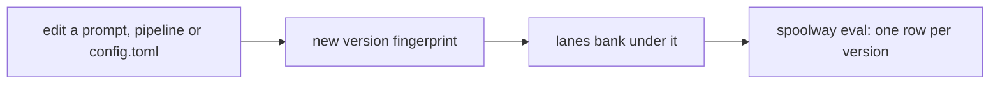

# Comparing versions

`spoolway eval` shows what a change to a prompt, a pipeline or the config did to pass rate,
cost and time. It reads the ledger described in [Cost accounting](cost.md). There is no second
store.



```
spoolway eval
```
```
pipelines
default
VERSION    SINCE        RUNS   L/RUN  PASS  BLOCKS  CTX PEAK  USD/RUN   TIME/RUN
c310d7e2   2026-08-16      1     2.0   50%       0       68%     4.42    12m 40s
b210d1a8   2026-08-15      4     4.8   74%       5       91%    70.26     1h 04m
```

## The screen

`spoolway eval` with no flags, in a terminal, opens a screen. Any flag, or a redirected stdout,
prints the table instead.


| View | What it shows |
|---|---|
| `pipelines` | One block per pipeline, one row per version |
| `steps` | Per pipeline, one row per step |
| `runs` | One row per run, newest first |

| Key | What it does |
|---|---|
| `tab` | Next view |
| `↑` `↓` | Move the cursor |
| `f` | Open the filter panel: `pipeline`, `step`, `since`, `until`. `←`/`→` cycle pipeline and step. `enter` on a date opens a calendar. `enter` applies, `esc` cancels. |
| `e` | Export the rows on screen to `.spoolway/evals/eval-<view>-<date>-<time>.csv` |
| `r` | Re-read the ledger |
| `q` | Quit |

In the calendar, `←`/`→` move a day, `↑`/`↓` a week, `pgup`/`pgdn` a month. `enter` picks the
day, `x` clears the bound, `esc` goes back.

A line under the table names any model on screen that has no price. Its cost figures are then
a floor.

## What a version is

A version is a fingerprint over the parts of `.spoolway/` that decide how work is done:
`config.toml`, every pipeline and every prompt. An active
[overrides layer](configuration.md#the-overrides-layer) is part of the fingerprint. `queue/`
and `archive/` are not.

spoolway stores no change history. Git holds every version of `.spoolway/`.

## A block per pipeline

One version covers every pipeline, so the same version can appear in several blocks. Blocks
are ordered by their newest version. Every block repeats the header, one row per version,
newest first. With `--all`, a `PROJECT` column appears when the rows span more than one
project.

## Reading a row

```
spoolway eval                          every pipeline, the last ten versions
spoolway eval --pipeline default       one pipeline's block
spoolway eval --step review            one step, across every pipeline
spoolway eval --pipeline default --step review
spoolway eval --limit 3                fewer versions per block
spoolway eval --since 30d              a window
```

`--since` and `--until` take a duration back from now (`30d`, `4h`), a local date
(`2026-08-21`), or a whole month (`2026-08`). `--until` includes the whole day or month.

| Column | What it is |
|---|---|
| `RUNS` | Runs that touched this row |
| `L/RUN` | Lanes per run |
| `PASS` | Share of lanes that reported `pass`. Lanes that never reported are left out. |
| `BLOCKS` | Lanes that ended blocked |
| `CTX PEAK` | The largest context reading any lane banked, as a share of the model's window. A raw token count when the model has no `context_window`. `—` when no lane banked one. |
| `USD/RUN` | Cost per run |
| `TIME/RUN` | Wall time per run |

A row ends in ` ovr` when its lanes ran under an overrides layer.

A run whose lanes span two versions counts on both rows. A footer says how many:

```
2 run(s) spanned a version change and are counted in both rows.
```

## Runs

Every task gets a `run` id when its worktree is cut. Every ledger line for that task carries
it.

```
spoolway eval --runs
```

```
TASK    WHEN        VERSION   PIPELINE  LANES  PASS  BLOCKS  CTX PEAK      OUT  COST USD      TIME
login   2026-08-04  8b21ee90  default      4  100%       0       73%    12.1k      0.41    9m 20s
signup  2026-08-09  3f9a1c04  default      6   67%       1         —    24.0k      1.02   14m 02s
```

One row per run. The columns are totals for that run.

| Flag | What it does |
|---|---|
| `--runs --task <id>` | One task's runs |
| `--runs --group <name>` | Every run whose task carries that `group:` |
| `--runs --trial <id>` | One trial's arms, with a delta line per arm against the first |
| `--discard <id>` | Remove a trial's arms now. `--force` stops arms still running. The ledger rows stay. |

A trial forks one group into one arm per task, each under its own pipeline, all under one
trial id. See [Trials](planning.md#trials).

## As CSV

```
spoolway eval --pipeline default --csv
spoolway eval --runs --csv
```

```
project,pipeline,version,since,tasks,lanes,lanes_per_task,pass,blocks,ctx_peak_tokens,ctx_peak_pct,out_tokens,out_per_task,cost_usd,cost_per_task,unpriced,time_s,time_per_task_s
spoolway,default,c310d7e2,2026-08-16,1,2,2.00,0.50,0,68000,0.68,40300,40300,4.42,4.42,0,760,760
```

Same rows and order as the table. Raw seconds, raw tokens, no `$`, no `k`. Header names match
the `--json` keys. `unpriced` is how many lanes have no price. `cost_usd` is blank when every
lane is unpriced, and `null` in `--json`. `--csv` and `--json` are not allowed together.

## Spend, by `spoolway spend`

`spoolway spend` reads the same ledger as a spend table, grouped by task, group, step, model,
project, month or lane. See [Cost accounting](cost.md).

## The honest limit

Every task is different work. A version that drew easy tasks looks better than one that drew
hard ones. Read every figure against `RUNS`, the sample size. `spoolway eval` catches drift,
such as a review step that got a third pricier after a prompt edit.

## Where the fields come from

`spoolway report` writes a lane's verdict to the task's `last_report:`. The dispatcher reads it
back when it banks the lane. A lane that never reported counts as neither pass nor failure.

Ledger lines written before versions existed group under `unversioned`.
