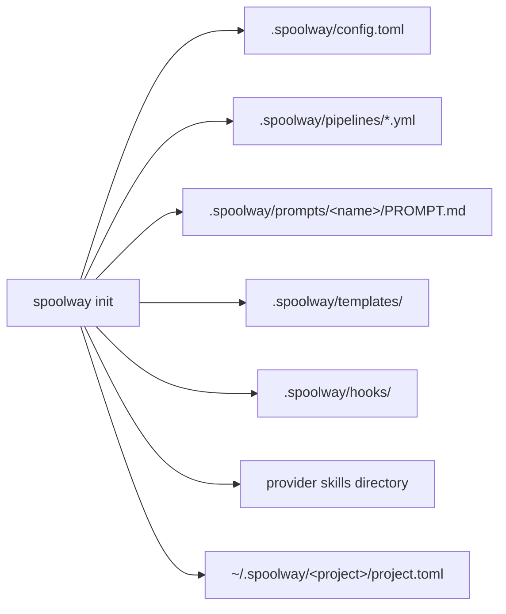

# Installation and setup

How to install spoolway, set up a project, check that it runs, and keep it up to date.

## Installing

```
npm install -g spoolway
```

The npm package is a small wrapper around a prebuilt binary. Nothing is compiled and no Node
program runs underneath.

| Platform | Package | Status |
|---|---|---|
| Linux x64 | `@spoolway/linux-x64` | Supported |
| Linux x64 (musl) | `@spoolway/linux-x64-musl` | Supported |
| Linux arm64 | `@spoolway/linux-arm64` | Supported |
| macOS Apple Silicon | `@spoolway/darwin-arm64` | Supported |
| macOS Intel | `@spoolway/darwin-x64` | Supported |

From source, in a clone of this repository:

```
cargo install --path .
```

By hand: every GitHub release has one archive per platform and a `SHA256SUMS` file. Unpack the
archive and put the binary on your `PATH`.

## What spoolway needs

| Requirement | What it means |
|---|---|
| A multiplexer | `herdr` or `tmux`. The `headless` backend needs none. |
| Agent binaries | `claude`, `codex` or `pi`, whichever your pipeline steps name. |
| `git` | Always. Plus `gh` if your pipeline opens pull requests. |

Nothing is checked at install time. `spoolway doctor` checks all of it against your configured
pipeline.

## Scaffolding a project

Run this inside a git repository:

```
spoolway init
```

At a terminal it asks three questions. Each one has a flag, and a given flag skips its question.
Without a terminal, the defaults apply: `claude` and no tracker.

| Question | Flag | Default |
|---|---|---|
| The coding agent you plan in | `--provider claude\|codex` | `claude` |
| The issue tracker | `--tracker github\|jira\|none` | `none` |
| The tracker's project | `--project-key <KEY>` | none |

`--provider` becomes the project's one agent profile. Every pipeline step runs on it. Model
and effort are left blank on every step, and you fill them in before dispatching.



| Path | What it is |
|---|---|
| `.spoolway/config.toml` | Every setting, with defaults and comments. |
| `.spoolway/pipelines/` | The two sample pipelines. Edit or replace them. |
| `.spoolway/prompts/<name>/PROMPT.md` | The six sample prompts. Updates never touch them. |
| `.spoolway/prompts/archivist/assets/` | The document skeletons the archivist fills. |
| `.spoolway/templates/tasks/` | One task skeleton per shipped pipeline. |
| `.spoolway/templates/tracking/` | The `epic.md` and `ticket.md` bodies a tracker hook renders. |
| `.spoolway/hooks/` | `github.sh` and `jira.sh`. See [`[issue_tracking]`](configuration.md#issue_tracking--a-hook-fired-on-four-task-events). |
| `~/.spoolway/<label>-<id>/project.toml` | Records the id and the checkout this home belongs to. |
| The provider's skills directory | The five pipeline skills. See [The pipeline skills](#the-pipeline-skills). |

Existing files are kept. `--force` overwrites them.

Running `init` again in a set-up project installs skills and changes nothing else. To change
settings later, use `spoolway config set`.

Everything spoolway writes while it runs lives outside the checkout, at
`~/.spoolway/<label>-<id>/`: the queue, the archive, plans, lane records and the usage ledger.
The `<id>` is a short id stamped into the project's `.git` directory, which every branch and
worktree of one clone shares. The `<label>` is a cleaned-up form of the checkout's name.

The home records that id and this checkout's path in the `project.toml` listed above. Every
command checks the two against each other. A checkout nothing has recorded stamps itself and
writes the record on its first command, so a fresh clone works without running `init`. Where the
two disagree, the command refuses and names both files by absolute path.

`init --adopt <name>` binds this checkout to the home already at `~/.spoolway/<name>/`.
`init --new-id` mints a fresh id and a fresh home. These two flags are the only way to write a
binding over one that already exists.

Delete the directory to forget every task, plan and lane. The next command refuses, because the
checkout still carries a stamp no home holds. Run `spoolway init --new-id` to start clean. See
[Runtime state](configuration.md#runtime-state).

`init` does not write to `.gitignore`. `spoolway sync` removes the marked block an older
version wrote there.

### Upgrading from 0.2

Under 0.2 a project's home was filed under the checkout's plain name, at
`~/.spoolway/<name>/`, with no id involved. The first command you run after upgrading moves
that home onto the id-keyed path for you, once, and prints the two paths and what came
across:

```
  moved  ~/.spoolway/api/  ->  ~/.spoolway/api-k7f2q9/
         queue 2 . archive 37 . ledger . worktrees 1
```

The queue, the archive, the ledger and any dispatched worktrees all move with it. Nothing is
deleted, and no later command moves anything again.

The move is refused while work is live — while a dispatcher is running over that home, or
while a process is still working in one of its worktrees. The refusal names the old path and
leaves it exactly where it is, so it is safe to hit:

```
spoolway: ~/.spoolway/api/ cannot move while work is live
  dispatcher running   pid 48120
  the old home is untouched at ~/.spoolway/api/
  run this again once the dispatch finishes
```

Run the same command again once the dispatch has finished and it moves.

**If you renamed the checkout's folder before upgrading, spoolway cannot find its old home.**
That home records the path the checkout used to have, nothing on disk links it to the new
one, and spoolway will not guess — so the checkout binds itself a fresh, empty home instead,
and your old queue is left untouched under its old name. Recover it by naming it yourself:

```
spoolway init --adopt api
```

That carries the old home onto this checkout the same way the automatic move would, with the
same refusal while work is live. Run `ls ~/.spoolway/` to see the name it is still filed
under. If you would rather start clean and leave the old home alone, `spoolway init --new-id`
mints a fresh one.

### The pipeline skills

`init` installs the skills. Run this to add another provider or to take newer skills:

```
spoolway install codex
```

| Skill | What it does |
|---|---|
| `spoolway-plan` | Turns one goal into a plan page. After you approve it, it cuts the tasks into the pending directory. |
| `spoolway-tasks` | Cuts an agreed shape into task documents: pipeline, size, ids, globs, dependency order. |
| `spoolway-config` | Changes pipelines, prompts, `config.toml`, templates and hooks, as an override or as an edit. |
| `spoolway-doctor` | Runs every read-only check and reports the findings. |
| `spoolway-calibrate` | Compares archived tasks, step-level evaluation results and spend data against the prompts and pipelines that produced them, then applies the changes you pick. |

Each skill is one directory holding a `SKILL.md`. All three providers read that layout.

| Provider | Skills go in |
|---|---|
| `claude` | `.claude/skills/` |
| `codex` | `.agents/skills/` |
| `pi` | `.pi/skills/`. pi loads them once the project is trusted, so answer its trust prompt or start it with `--approve`. |

Start a fresh agent session after installing so it picks the skills up.

### Checking the setup

```
spoolway doctor
```

`doctor` checks that the configured pipeline would run on this machine:

- the config parses and the pipelines validate against it
- the task dependency graph has no cycle
- you are on a real branch, not a detached HEAD
- each base branch the queue names can be pushed
- each agent binary is on `PATH`, has a model set, and accepts the configured permission mode
- every prompt a step names exists and passes its checks

Problems set a non-zero exit code. Notes do not. The `spoolway-doctor` skill reads both.

`doctor` still runs when the config or a pipeline file does not parse. It reports the parse
error with its line and runs every check that does not need that file. It does the same when the
project's stamped home cannot be resolved, reporting that as one failed check. Flags are in the
[CLI reference](cli-reference.md).

## Keeping spoolway current

```
spoolway update
```

If npm installed this binary and a newer release is out, `update` runs
`npm install -g spoolway@<version> --ignore-scripts` and then hands over to the new binary. At
a terminal it then prints the old and new versions, the highlights, every migration that
applies, and links to the full notes. `update` installs the binary only. It runs from any
directory, project or not, and writes no project file.

`update` asks npm which release is out each time it runs. The wait is bounded. If npm does
not answer in time, `update` says so and uses the last known version.

The release notes are compiled into the binary:

```
spoolway whats-new                 # this release
spoolway whats-new --since 0.1.0   # every later release, oldest first
```

The source is [`CHANGELOG.md`](../CHANGELOG.md). Its contract is written at the top of the
file.

Two things stop the binary update:

| What stops it | What happens |
|---|---|
| npm did not install this binary | You are told which release is out. Upgrade the way you installed. |
| A dispatcher is running | The binary is left alone until the run ends. |

A newer release is announced by one line on stderr before the command's own output:

```
Update available: 0.2.0. Run "spoolway update"
```

The line is not printed inside a lane, under `--json`, or when output is not a terminal. Turn
it off with `housekeeping.update_check = false` in the config, or with
`SPOOLWAY_SKIP_VERSION_CHECK=1` for one machine.

## Keeping a project's files current

```
spoolway sync --dry-run     # print what would change
spoolway sync               # apply it
```

`sync` brings a project's own files forward. It needs a project, and lands its writes on the
checkout it runs in. In a linked worktree that is the worktree's own tracked files, and the
[`checkout:` line](cli-reference.md#the-checkout-line) names it first.

What `sync` replaces, file by file:

| File | What is replaced |
|---|---|
| `config.toml` | The comments and the settings reference. Your values stay. |
| Pipeline file | Only the key reference between `# >>> spoolway >>>` and `# <<< spoolway <<<`. A file without the markers is left alone. |
| `.gitignore` | Only the old marked block, removed once. |
| Skills | Every installed provider's skills. |
| Prompts | Nothing. |
| Document skeletons | Nothing. |
| Task skeletons | Nothing. |
| A retired template | Removed, with the reason it is gone. |

`sync` never merges. A marked block you edited by hand stops the sync on that file.
`spoolway sync --replace <path>` writes the shipped file over yours and saves your version
beside it as `.bak`. That is also how to take a newer default prompt or skeleton on purpose.
`spoolway doctor` reports files that are behind. `spoolway pipeline check` reports a prompt
that names a command or flag this binary does not have.

On success, `sync` records this binary's version and a fingerprint of the text it would write
in a stamp under the project's home, one line per checkout. `spoolway init` writes the same
stamp for a freshly scaffolded project.

## Platform notes

### Linux

The reference platform. All three backends run here.

### macOS

The same as Linux. The headless backend reads a lane's liveness from a lock file.

### Windows

Not supported. The last release carrying a Windows binary is 0.3.x. Under WSL you get the
Linux build, including the headless backend.
