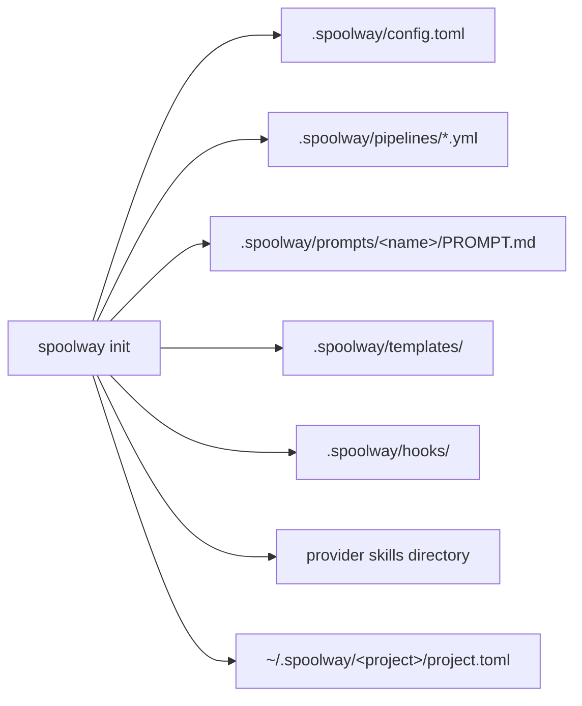

# Installation and setup

How to install spoolway, set up a project, check that it runs, and keep it up to date.

## Installing

```
npm install -g spoolway
```

The npm package is a small wrapper around a prebuilt binary. Nothing is compiled and no Node
program runs underneath.

| Platform | Package | Status |
|---|---|---|
| Linux x64 | `@spoolway/linux-x64` | Supported |
| Linux x64 (musl) | `@spoolway/linux-x64-musl` | Supported |
| Linux arm64 | `@spoolway/linux-arm64` | Supported |
| macOS Apple Silicon | `@spoolway/darwin-arm64` | Supported |
| macOS Intel | `@spoolway/darwin-x64` | Supported |
| Windows x64 | `@spoolway/win32-x64` | Experimental, see [Windows](#windows) |

From source, in a clone of this repository:

```
cargo install --path .
```

By hand: every GitHub release has one archive per platform and a `SHA256SUMS` file. Unpack the
archive and put the binary on your `PATH`.

## What spoolway needs

| Requirement | What it means |
|---|---|
| A multiplexer | `herdr` or `tmux`. The `headless` backend needs none. |
| Agent binaries | `claude`, `codex` or `pi`, whichever your pipeline steps name. |
| `git` | Always. Plus `gh` if your pipeline opens pull requests. |

Nothing is checked at install time. `spoolway doctor` checks all of it against your configured
pipeline.

## Scaffolding a project

Run this inside a git repository:

```
spoolway init
```

At a terminal it asks three questions. Each one has a flag, and a given flag skips its question.
Without a terminal, the defaults apply: `claude` and no tracker.

| Question | Flag | Default |
|---|---|---|
| The coding agent you plan in | `--provider claude\|codex` | `claude` |
| The issue tracker | `--tracker github\|jira\|none` | `none` |
| The tracker's project | `--project-key <KEY>` | none |

`--provider` becomes the project's one agent profile. Every pipeline step runs on it. Model
and effort are left blank on every step, and you fill them in before dispatching.



| Path | What it is |
|---|---|
| `.spoolway/config.toml` | Every setting, with defaults and comments. |
| `.spoolway/pipelines/` | The two sample pipelines. Edit or replace them. |
| `.spoolway/prompts/<name>/PROMPT.md` | The six sample prompts. Updates never touch them. |
| `.spoolway/prompts/archivist/assets/` | The document skeletons the archivist fills. |
| `.spoolway/templates/tasks/` | One task skeleton per shipped pipeline. |
| `.spoolway/templates/task-log.md` | The headings spoolway appends to a task file. |
| `.spoolway/templates/tracking/` | The `epic.md` and `ticket.md` bodies a tracker hook renders. |
| `.spoolway/hooks/` | `github.sh` and `jira.sh`. On native Windows, `github.ps1` and `jira.ps1`. See [`[issue_tracking]`](configuration.md#issue_tracking--a-hook-fired-on-four-task-events). |
| `~/.spoolway/<project>/project.toml` | Claims the project's name. |
| The provider's skills directory | The five pipeline skills. See [The pipeline skills](#the-pipeline-skills). |

Existing files are kept. `--force` overwrites them.

Running `init` again in a set-up project installs skills and changes nothing else. To change
settings later, use `spoolway config set`.

Everything spoolway writes while it runs lives outside the checkout, at
`~/.spoolway/<basename of the checkout>/`: the queue, the archive, plans, lane records and the
usage ledger. A second checkout with the same name is refused. If the old checkout is gone but
its state is still there, `init --take-over` claims the name and keeps that state. Delete the
directory to forget every task, plan and lane. See [Runtime state](configuration.md#runtime-state).

`init` does not write to `.gitignore`. `spoolway update` removes the marked block an older
version wrote there.

### The pipeline skills

`init` installs the skills. Run this to add another provider or to take newer skills:

```
spoolway install codex
```

| Skill | What it does |
|---|---|
| `spoolway-plan` | Turns one goal into a plan page. After you approve it, it cuts the tasks into the pending directory. |
| `spoolway-tasks` | Cuts an agreed shape into task documents: pipeline, size, ids, globs, dependency order. |
| `spoolway-config` | Changes pipelines, prompts, `config.toml`, templates and hooks, as an override or as an edit. |
| `spoolway-doctor` | Runs every read-only check and reports the findings. |
| `spoolway-calibrate` | Reads archived tasks and the spend ledger, and turns what cost loops and money into findings. |

Each skill is one directory holding a `SKILL.md`. All three providers read that layout.

| Provider | Skills go in |
|---|---|
| `claude` | `.claude/skills/` |
| `codex` | `.agents/skills/` |
| `pi` | `.pi/skills/`. pi loads them once the project is trusted, so answer its trust prompt or start it with `--approve`. |

Start a fresh agent session after installing so it picks the skills up.

### Checking the setup

```
spoolway doctor
```

`doctor` checks that the configured pipeline would run on this machine:

- the config parses and the pipelines validate against it
- the task dependency graph has no cycle
- you are on a real branch, not a detached HEAD
- each base branch the queue names can be pushed
- each agent binary is on `PATH`, has a model set, and accepts the configured permission mode
- every prompt a step names exists and passes its checks

Problems set a non-zero exit code. Notes do not. The `spoolway-doctor` skill reads both.

`doctor` still runs when the config or a pipeline file does not parse. It reports the parse
error with its line and runs every check that does not need that file. Flags are in the
[CLI reference](cli-reference.md).

## Keeping a project current

```
spoolway update --dry-run     # print what would change
spoolway update               # apply it
```

If npm installed this binary and a newer release is out, `update` first runs
`npm install -g spoolway@<version> --ignore-scripts` and then hands over to the new binary. At
a terminal it then prints the old and new versions, the highlights, every migration that
applies, and links to the full notes.

The release notes are compiled into the binary:

```
spoolway whats-new                 # this release
spoolway whats-new --since 0.1.0   # every later release, oldest first
```

The source is [`CHANGELOG.md`](../CHANGELOG.md). Its contract is written at the top of the
file.

Two things stop the binary update. Neither stops the file updates.

| What stops it | What happens |
|---|---|
| npm did not install this binary | You are told which release is out. Upgrade the way you installed. |
| A dispatcher is running | The binary is left alone until the run ends. |

A newer release is announced by one line on stderr before the command's own output:

```
Update available: 0.2.0. Run "spoolway update"
```

The line is not printed inside a lane, under `--json`, or when output is not a terminal. Turn
it off with `housekeeping.update_check = false` in the config, or with
`SPOOLWAY_SKIP_VERSION_CHECK=1` for one machine.

What `update` replaces, file by file:

| File | What is replaced |
|---|---|
| `config.toml` | The comments and the settings reference. Your values stay. |
| Pipeline file | Only the key reference between `# >>> spoolway >>>` and `# <<< spoolway <<<`. A file without the markers is left alone. |
| `.gitignore` | Only the old marked block, removed once. |
| Skills | Every installed provider's skills. |
| Prompts | Nothing. |
| Document skeletons | Nothing. |
| Task skeletons | Nothing. |

`update` never merges. A marked block you edited by hand stops the update on that file.
`spoolway update --replace <path>` writes the shipped file over yours and saves your version
beside it as `.bak`. That is also how to take a newer default prompt or skeleton on purpose.
`spoolway doctor` reports files that are behind. `spoolway pipeline check` reports a prompt
that names a command or flag this binary does not have.

## Platform notes

### Linux

The reference platform. All three backends run here.

### macOS

The same as Linux. The headless backend reads a lane's liveness from a lock file.

### Windows

Experimental. It builds, the tests run, and lanes start, but it has had far less use than the
Linux build.

| Difference | What it means |
|---|---|
| Panes run PowerShell | spoolway types a lane's environment at the pane's prompt in PowerShell syntax. A multiplexer whose default shell is `cmd.exe` or Git Bash starts lanes with no environment. |
| Hooks are `.ps1` | `init` writes `github.ps1` and `jira.ps1`. |
| No headless backend | Run lanes through a multiplexer, or use WSL for the Linux build. |
| Command steps run | A `run:` line runs as PowerShell. `handover` and `checks` work. |

Under WSL you get the Linux build, including the headless backend.
