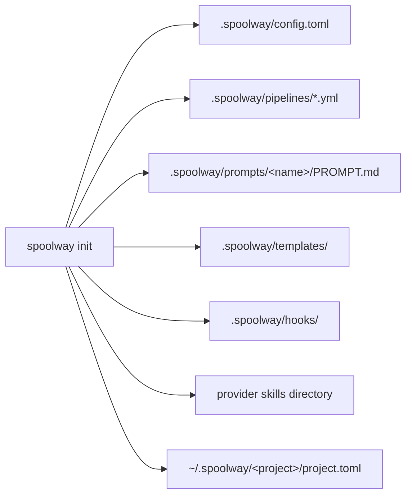

# Installation and setup

How to install spoolway, set up a project, check that it runs, and keep it up to date.

## Installing

```
npm install -g spoolway
```

The npm package is a small wrapper around a prebuilt binary. Nothing is compiled and no Node
program runs underneath.

| Platform | Package | Status |
|---|---|---|
| Linux x64 | `@spoolway/linux-x64` | Supported |
| Linux x64 (musl) | `@spoolway/linux-x64-musl` | Supported |
| Linux arm64 | `@spoolway/linux-arm64` | Supported |
| macOS Apple Silicon | `@spoolway/darwin-arm64` | Supported |
| macOS Intel | `@spoolway/darwin-x64` | Supported |

From source, in a clone of this repository:

```
cargo install --path .
```

By hand: every GitHub release has one archive per platform and a `SHA256SUMS` file. Unpack the
archive and put the binary on your `PATH`.

As a herdr plugin:

```
herdr plugin install marvingygas/spoolway
```

`herdr-plugin.toml` at the repository root declares spoolway's id, version, minimum herdr
version, description, platforms, one `[[build]]` step and four panes and actions, one pair per
command: `init`, `queue`, `dispatch` and `doctor`. The `[[build]]` step runs
`scripts/fetch-or-build.sh`, which maps the host's platform onto one of the triples in
[`npm/targets.json`](../npm/targets.json), downloads that platform's release archive and its
`SHA256SUMS`, verifies the checksum, and unpacks the binary to `./bin/spoolway` inside the
plugin's own directory. `herdr plugin uninstall` deletes that directory, so nothing the script
writes lands anywhere else, such as `~/.local/bin` or `~/.cargo/bin`. If the host's platform has
no matching triple, no release matches the manifest's version, or the checksum fails to verify,
the script falls back to `cargo build --release` and copies the result into place instead of
failing the install.

See [The herdr plugin](herdr-plugin.md) for the manifest's panes and actions, what
`spoolway herdr bind`/`unbind` write, and the rehearsal run before the repository is listed
in herdr's marketplace.

`herdr-plugin.toml`'s `version` is kept equal to `Cargo.toml`'s by hand; CI fails the build when
the two disagree. See [Testing](testing.md).

## What spoolway needs

| Requirement | What it means |
|---|---|
| A multiplexer | `herdr`. |
| Agent binaries | `claude`, `codex` or `pi`, whichever your pipeline steps name. |
| `git` | Always. Plus `gh` if your pipeline opens pull requests. |

Nothing is checked at install time. `spoolway doctor` checks all of it against your configured
pipeline.

## Scaffolding a project

Run this inside a git repository:

```
spoolway init
```

It opens by printing the project directory it resolved and waiting for a yes — check the path
is the one you meant, especially when `init` was reached from a keybinding rather than typed
where you were standing. Answering no writes nothing and exits 0.

Then, at a terminal, it asks more questions. Each one has a flag, and a given flag skips its
question. Without a terminal, the defaults apply: a tracked `.spoolway/` in the checkout,
`claude`, the example setup, and no tracker.

| Question | Flag | Default |
|---|---|---|
| Set up this project? | `--yes` | no — so a script or CI runner passes `--yes` |
| Where should this project's setup live? | `--setup repo\|home` | `repo` |
| The workspace menu (home mode, when a workspace already exists) | `--workspace <name>\|new` | starts a new workspace |
| The coding agent you plan in | `--provider claude\|codex\|pi` | `claude` |
| Install the example setup? (skipped when joining or moving into an existing workspace) | `--examples`/`--no-examples` | yes |
| The issue tracker (skipped when joining or moving into an existing workspace) | `--tracker github\|jira\|none` | `none` |
| The tracker's project | `--project-key <KEY>` | none |

`--provider` becomes the project's one agent profile. Every pipeline step runs on it. Model
and effort are left blank on every step, and you fill them in before dispatching.

An established project keeps its own provider: a repeat `init` run with `--provider` left off
takes the project's already-chosen provider rather than falling back to `claude`, whether run
without a terminal or answered at the menu, whose own default is pre-selected to it. Naming
a different `--provider` on an established project adds that provider's skills. The project's
own profile and pipelines stay as they are until `spoolway init --force` rewrites them.

Answering yes to the example setup writes the shipped pipelines, prompts, task templates and
ticket templates. Answering no writes `config.toml` and empty `pipelines/`, `prompts/`
and `templates/` folders instead, for the `spoolway-config` skill to fill. An established
project is not asked again: it keeps whatever its own files already show, and a repeat run
restores any of its example files that went missing. An example pipeline whose name a private
pipeline already uses is skipped instead: `init` prints a line naming the private file, and
renaming that private pipeline lets the example come back on the next run.


```mermaid
flowchart LR
  I[spoolway init] --> C[.spoolway/config.toml]
  I --> P[.spoolway/pipelines/*.yml]
  I --> R[.spoolway/prompts/&lt;name&gt;/PROMPT.md]
  I --> T[.spoolway/templates/]
  I --> H[.spoolway/hooks/]
  I --> S[provider skills directory]
  I --> N[~/.spoolway/&lt;project&gt;/project.toml]
```

| Path | What it is |
|---|---|
| `.spoolway/config.toml` | Every setting, with defaults and comments. |
| `.spoolway/pipelines/` | The two sample pipelines, with the example setup. Edit or replace them. |
| `.spoolway/prompts/<name>/PROMPT.md` | The five sample prompts, with the example setup. Updates never touch them. |
| `.spoolway/prompts/archivist/assets/` | The document skeletons the archivist fills, with the example setup. |
| `.spoolway/templates/tasks/` | One task skeleton per shipped pipeline, with the example setup. |
| `.spoolway/templates/tracking/` | `epic.md` and `ticket.md`, with the example setup. Nothing reads either; the `open` hook builds the whole issue body itself. |
| `.spoolway/hooks/` | `github.sh` and `jira.sh`, written only when a tracker is chosen. See [`[issue_tracking]`](configuration.md#issue_tracking--a-hook-fired-on-four-task-events). |
| `~/.spoolway/<label>-<id>/project.toml` | Records the id and the checkout this home belongs to. |
| The provider's skills directory | The four pipeline skills. See [The pipeline skills](#the-pipeline-skills). |

Existing files are kept. `--force` overwrites them. A skill file is the exception: `init`
and `install` rewrite it whenever it differs from the shipped copy, `--force` or not.

Running `init` again in a set-up project installs skills, restores any example file that went
missing, and otherwise changes nothing. To change settings later, use `spoolway config set`.

Everything spoolway writes while it runs lives outside the checkout, at
`~/.spoolway/<label>-<id>/`: the queue, the archive, plans, lane records and the usage ledger.
The `<id>` is a short id stamped into the project's `.git` directory, which every branch and
worktree of one clone shares. The `<label>` is a cleaned-up form of the checkout's name.

The home records that id and this checkout's path in the `project.toml` listed above. Every
command checks the two against each other. A checkout nothing has recorded stamps itself and
writes the record on its first command, so a fresh clone works without running `init`. Where the
two disagree, the command refuses and names both files by absolute path.

Delete the directory to forget every task, plan and lane. The next command refuses, because the
checkout still carries a stamp no home holds. Delete `.git/spoolway-id` too and run `spoolway
init` again to mint a fresh id and a fresh home. See [Runtime
state](configuration.md#runtime-state).

`init` does not write to `.gitignore`. `spoolway sync` removes the marked block an older
version wrote there, outside home mode. A home-mode checkout keeps its `.gitignore`
untouched, matching home mode's own promise to write nothing into the checkout.

### Home mode

`--setup home` puts the setup in a workspace under `~/.spoolway/` instead of the checkout, and
`init` writes nothing into the checkout or its `.git`. With no workspace yet, or with
`--workspace new`, it creates `~/.spoolway/<label>-<id>/`: a `dispatchers/<name>/` for this
clone, a `project.toml` listing it, and a `config/` scaffolded the same way the table above
scaffolds a repo-mode checkout's `.spoolway/`. `<label>` and `<id>` take the same shape a
repo-mode home's own folder does.

With workspaces already there, `init` asks the workspace menu instead: "Select the spoolway
workspace for this checkout. Pick an existing workspace or create a new one." A checkout no
workspace lists yet sees every workspace, those of this repository marked `same repository` and
listed first, and `Create a new workspace` last as the default, so pressing Enter without
reading the menu starts a fresh workspace. A checkout a workspace already lists sees that
workspace first, marked `current` and still the default, then every other workspace of this
repository, then `Create a new workspace`.

Joining a workspace, or moving into one that already exists, keeps its `config/` exactly as it
is, skips the example and tracker questions, and adds this clone to its `project.toml` with a
dispatcher folder of its own — the clone's directory name, with `-2` added when that name is
taken. The run ends with one line naming where the checkout went, `Joined workspace <name>.` or
`Moved to workspace <name>.`, since the workspace's setup is already settled. Moving into a new
workspace scaffolds its `config/` from scratch instead, asking the usual questions, with the
same closing line added to say where the checkout went.

With nobody to ask and no `--workspace`, an unlisted checkout starts a new workspace, the same
default the menu above takes. When a workspace already holds a clone of this repository, `init`
prints a note naming it and the `--workspace` that joins it instead, then still starts the new
workspace. A listed checkout with nobody to ask stays where it is.

Skills install into the coding agent's user folder instead of the project's own, since a
project skill folder sits inside a checkout that home mode promises to leave untouched. See [The
pipeline skills](#the-pipeline-skills).

Moving a project between the two modes is refused: `--setup repo` on a checkout a workspace
already lists, `--setup home` or `--workspace` on a checkout with a tracked `.spoolway/`, and
`--setup home` on a repository whose default branch tracks a `.spoolway/` of its own. Each
refusal names the command to run instead. See [Home mode](concepts.md#home-mode).

Joining a workspace, or moving into one, whose `config/` has gone missing is refused too, naming
the missing path.

Picking another workspace in the menu, or passing `--workspace <other>`, moves a listed checkout
there, carrying its queue, archive and worktrees along. The move is refused, with nothing
written, while any of its tasks holds a worktree, naming each one, and for a workspace of another
repository, with no flag to force it. A workspace the move leaves with no checkout listed is
removed, and the move prints that it was removed.

```
$ spoolway init --setup home --workspace new --provider claude --examples --tracker none --yes
...
  wrote  ~/.spoolway/api-k7f2q9/config/config.toml
  wrote  ~/.spoolway/api-k7f2q9/config/pipelines/default.yml
  ...
  bound  /home/you/work/api  ->  ~/.spoolway/api-k7f2q9/dispatchers/api/
Skills installed successfully, into ~/.claude/skills.
Project initialized successfully.
```

A second clone joining that workspace keeps its `config/` and ends with the workspace it joined:

```
$ spoolway init --setup home --workspace api-k7f2q9 --provider claude --yes
...
Skills already installed, in ~/.claude/skills.
Joined workspace api-k7f2q9.
```

Picking another workspace moves a checkout already listed in one, and says where it went:

```
$ spoolway init --workspace other-h4m1xs --provider claude --yes
...
Skills already installed, in ~/.claude/skills.
Moved to workspace other-h4m1xs.
Removed workspace api-k7f2q9. It held no other checkout.
```

### The pipeline skills

`init` installs the skills. Run this to add another provider or to take newer skills:

```
spoolway install codex
```

| Skill | What it does |
|---|---|
| `spoolway-plan` | Turns one goal into a plan page. After you approve it, it cuts the tasks into the pending directory. |
| `spoolway-tasks` | Cuts an agreed shape into tasks: pipeline, size, ids, globs, dependency order. |
| `spoolway-config` | Changes pipelines, prompts, `config.toml`, templates and hooks, as an override or as an edit. Also sets a repo up, joins a workspace, tries a pipeline privately, and repairs a project that is broken, refused or behind. |
| `spoolway-calibrate` | Compares archived tasks, step-level evaluation results and spend data against the prompts and pipelines that produced them, then applies the changes you pick. |

Each skill is one directory holding a `SKILL.md`. All three providers read that layout.

| Provider | Skills go in |
|---|---|
| `claude` | `.claude/skills/` |
| `codex` | `.agents/skills/` |
| `pi` | `.pi/skills/`. pi loads them once the project is trusted, so answer its trust prompt or start it with `--approve`. |

Start a fresh agent session after installing so it picks the skills up.

`spoolway install <provider> --user` installs into the agent's user folder instead, which it
loads in every project. It needs no project and writes nothing into any checkout. A home-mode
project's plain `init` and `install` both use the user folder too, since a project skill
folder sits inside a checkout that home mode promises to leave untouched.

| Provider | User folder |
|---|---|
| `claude` | `~/.claude/skills/` |
| `codex` | `~/.agents/skills/` |
| `pi` | `~/.pi/agent/skills/`. pi also reads `~/.agents/skills/`, so installing both codex and pi at user level shows pi each skill twice. |

pi's trust note is not printed for a user-level install, since a user folder loads without
being asked. `spoolway sync` keeps current any user folder holding one of the four shipped
skills: `spoolway-plan`, `spoolway-tasks`, `spoolway-config`, `spoolway-calibrate`. Those
names belong to spoolway, so a hand-made folder sharing one of them is overwritten too.
`sync` never removes a retired skill name from a user folder.

### Checking the setup

```
spoolway doctor
```

`doctor` checks that the configured pipeline would run on this machine:

- the config parses and the pipelines validate against it
- the task dependency graph has no cycle
- you are on a real branch, not a detached HEAD
- each base branch the queue names can be pushed
- each agent binary is on `PATH`, has a model set, and accepts the configured permission mode
- every prompt a step names exists and passes its checks

Problems set a non-zero exit code. Notes do not. The `spoolway-config` skill's repair section
reads both.

`doctor` still runs when the config or a pipeline file does not parse. It reports the parse
error with its line and runs every check that does not need that file. It does the same when the
project's stamped home cannot be resolved, reporting that as one failed check. Flags are in the
[CLI reference](cli-reference.md).

## Keeping spoolway current

```
spoolway update
```

If npm installed this binary and a newer release is out, `update` runs
`npm install -g spoolway@<version> --ignore-scripts` and then hands over to the new binary. At
a terminal it then prints the old and new versions, the highlights, every migration that
applies, and links to the full notes. `update` installs the binary only. It runs from any
directory, project or not, and writes no project file.

`update` asks npm which release is out each time it runs. The wait is bounded. If npm does
not answer in time, `update` says so and uses the last known version.

The release notes are compiled into the binary:

```
spoolway whats-new                 # this release
spoolway whats-new --since 0.1.0   # every later release, oldest first
```

The source is [`CHANGELOG.md`](https://github.com/marvingygas/spoolway/blob/main/CHANGELOG.md).
Its contract is written at the top of the file. See the [Migration guide](migrations.md) for
the actions required between released versions.

Two things stop the binary update:

| What stops it | What happens |
|---|---|
| npm did not install this binary | You are told which release is out. Upgrade the way you installed. |
| A dispatcher is running | The binary is left alone until the run ends. |

A newer release is announced by one line on stderr before the command's own output:

```
Update available: 0.2.0. Run "spoolway update"
```

Bare `spoolway` shows the same sentence as a popup over the tab it opens on instead, since a
line on stderr ahead of the screen would be wiped by the screen's first frame. `[enter]` closes
it.

The line, or the popup, is not shown inside a lane, under `--json`, or when output is not a
terminal. Turn it off with `housekeeping.update_check = false` in the config, or with
`SPOOLWAY_SKIP_VERSION_CHECK=1` for one machine.

## Keeping a project's files current

```
spoolway sync --dry-run     # print what would change
spoolway sync               # apply it
```

`sync` brings a project's own files forward. It needs a project, and lands its writes on the
checkout it runs in. In a linked worktree that is the worktree's own tracked files, and the
[`checkout:` line](cli-reference.md#the-checkout-line) names it first.

What `sync` replaces, file by file:

| File | What is replaced |
|---|---|
| `config.toml` | The comments and the settings reference. Your values stay. |
| Pipeline file | The key reference between `# >>> spoolway >>>` and `# <<< spoolway <<<`. A file without the markers is left alone. |
| `.gitignore` | Only the old marked block, removed once. Left alone in home mode. |
| Skills | Every installed provider's skill file that differs from the shipped copy, in a project's own folder and in any user folder holding one of the four shipped skills. The project's own folder is skipped in home mode; only the user folder is refreshed there. |
| Prompts | Nothing. |
| Document skeletons | Nothing. |
| Task skeletons | Nothing. |
| A retired template | Removed, with the reason it is gone. |

In home mode, this leaves the checkout untouched: nothing under it is read, written or
removed. See [Home mode](concepts.md#home-mode).

A `config.toml` that `sync` cannot read fails the whole command, naming the file and pointing
at `spoolway doctor`. One it cannot parse as TOML does the same, pointing at `spoolway config
edit` instead.

`sync` never merges. A marked block you edited by hand stops the sync on that file, and it is
reported, not overwritten. A skill file has no such block: sync always rewrites it to match the
shipped copy.

`spoolway sync --replace <path>` writes the shipped file over yours and saves your version
beside it as `.bak`. That is also how to take a newer default prompt or skeleton on purpose. It
does not cover skill files: `spoolway install <provider> --force` also takes the shipped skills
back, overwriting that provider's whole set with no `.bak` saved. Replacing a hook script under
`.spoolway/hooks/` also leaves it executable on Unix, whether or not its text changed.
`spoolway doctor` reports files that are behind. `spoolway pipeline check` reports a prompt that
names a command or flag this binary does not have.

At a terminal, with something to write or remove, `sync` lists it and waits before writing
anything:

```
┌─ new version installed, apply updates ───────────────────────┐
│                                                                │
│  write   .spoolway/config.toml                                │
│  remove  .spoolway/templates/task-log.md                      │
│          (no longer written to a task file)                   │
│                                                                │
│  Your config values, prompts and task skeletons are kept.     │
│                                                                │
│  [enter] apply   [esc] cancel                                  │
└─────────────────────────────────────────────────────────────┘
```

Enter writes the files, records the version stamp described next, and prints the report `sync`
always prints. Esc, ctrl-c, or the terminal going away mid-question writes nothing, changes no
stamp, and prints "Nothing was changed." With no terminal to answer, under `--json`, inside a
lane, with `--dry-run`, with `--replace`, or with nothing to write, `sync` writes straight away
and draws no panel.

On success, `sync` records this binary's version and a fingerprint of the text it would write
in a stamp under the project's home, one line per checkout. It deletes a leftover per-skill-file
stamp an older release left there, if it finds one. `spoolway init` and `spoolway install` write
the same per-checkout stamp for a freshly scaffolded or newly installed project.

Every other command that needs a project reads that stamp back first. When it no longer
matches and a scan finds files to change, the command prints one line on stderr and then runs:

```
Run spoolway sync to apply the last update.
```

That line prints only to a person at a terminal: never under `--json`, never inside a lane, and
never when stderr is not a terminal. It never stops the command and never reads a key. Only
`spoolway sync` writes the files.

Bare `spoolway` shows the same sentence in a popup over the tab it opens on, since the screen's
first frame would wipe a line printed ahead of it:

```
┌─ update installed ────────────────────────────┐
│                                               │
│  Run spoolway sync to apply the last update.  │
│                                               │
│  [enter] dismiss                              │
└───────────────────────────────────────────────┘
```

Enter dismisses the popup and writes nothing. When the project's pipeline file cannot load, the
screen cannot open to show the popup, so bare `spoolway` prints the line first and then ends on
the pipeline refusal.

`init`, `doctor`, `whats-new`, `update`, `config edit` and `config override` never print this
line or show this popup. `sync` never does either: it asks its own version of the same question
first, above.

## Platform notes

### Linux

The reference platform.

### macOS

The same as Linux.

### Windows

Not supported. The last release carrying a Windows binary is 0.4.x. Under WSL you get the
Linux build.
