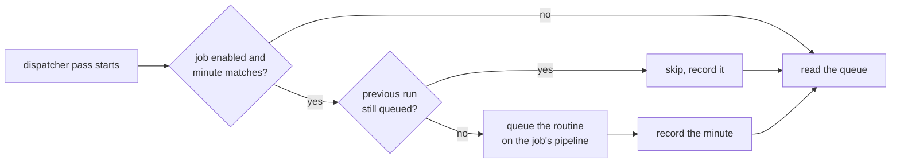

# Jobs

A job runs a routine on a schedule. It is a cron expression, a pipeline, and a routine saved
under `.spoolway/routines/`.

## Overview

spoolway has no clock of its own. The dispatcher fires a due job at the top of its pass.
While any job is enabled, `spoolway dispatch` stays up on an empty queue, so a dispatcher left
running is all a job needs.

A job only queues routine documents that already exist. It never changes them.

## How it works



A folder routine is queued as one batch with fresh ids. A single `.md` routine is queued alone
with its `depends_on` emptied. The same pass dispatches what it queued.

The fired minute is written to `jobs.state.json`, so a job fires once per matching minute. A
window that passes while no dispatcher runs is not caught up later. A job whose previous run
is still in the queue skips its window. A `--dry-run` pass fires nothing.

### The resident dispatcher

While any job is enabled, an empty queue does not stop the run. It prints once:

```
queue is empty. 2 jobs enabled — staying up for them.
next: nightly-audit, Mon 8 Sep 03:00  (in 5h 48m)
ctrl-c stops.
```

The board shows the first and last line. Its job ledger shows the next firing of every job.
With no job enabled, an empty queue stops the run as usual. See
[When it stops](dispatcher.md#when-it-stops).

## The jobs screen


`spoolway jobs` opens the screen. It is the only thing that writes a job. The left pane lists
every job from both stores. The right pane shows the highlighted job: its routine, schedule,
pipeline, scope, next firing, last firing, and the documents it queues.

| Key | What it does |
|---|---|
| `↑` `↓` | Move. |
| `n` | Write a new job. |
| `e` | Edit the highlighted job. |
| `space` | Pause or resume it. |
| `x` | Delete it, after `y`/`n`. |
| `r` | Fire it now. |
| `q` | Quit. |

### The three choices

`n` and `e` walk three panels. `esc` on any of them writes nothing.

1. The routine. This is the same routines browser as the queue screen's `r` pane. `space`
   ticks a folder and `enter` picks it. `space` over a single document picks that document.
2. The schedule. The field states the expression in words and shows its next three firings as
   you type. `enter` is refused until the expression parses.
3. The pipeline. The picker lists every pipeline the repo defines and narrows as you type.
   `enter` saves the job.

### What the screen decides for you

A new job goes to the user store. Its name is the leaf of its routine: the folder `nightly`
gives the job `nightly`, the document `nightly/audit.md` gives the job `audit`. A job in the
project store is written by hand once; the screen then edits it in place.

## The cron grammar

Five fields: minute, hour, day of month, month, day of week.

| Field | Values |
|---|---|
| minute | `0-59` |
| hour | `0-23` |
| day of month | `1-31` |
| month | `1-12` or `jan`-`dec` |
| day of week | `0-6` or `sun`-`sat`, `0` is Sunday |

Each field is a comma list of `*`, `n`, `a-b`, `*/n` or `a-b/n`. `@hourly`, `@daily`,
`@weekly` and `@monthly` are aliases for a whole expression. Times are the dispatcher
machine's local time.

## Where a job lives

| Path | Scope | Tracked |
| --- | --- | --- |
| `~/.spoolway/<project>/jobs.toml` | `user`, the default | No |
| `<checkout>/.spoolway/jobs.toml` | `project`, shared with the team | Yes |
| `~/.spoolway/<project>/jobs.state.json` | firing history | No |

A store file holds `[jobs.<name>]` tables:

```toml
[jobs.nightly-audit]
schedule = "0 3 * * 1-5"
pipeline = "impl_fast"
routine  = "nightly"     # a folder or a single .md under .spoolway/routines/
enabled  = true          # optional; absent means enabled
```

One name in both stores is refused.

## Usage

```
spoolway jobs                      # the screen: write, edit, pause, delete, fire
spoolway jobs list                 # every job across both stores
spoolway jobs list --json          # the same rows as JSON
spoolway jobs run <name>           # fire one job now
```

```
NAME           SCOPE    SCHEDULE      PIPELINE    NEXT        LAST
nightly-audit  user     0 3 * * 1-5   impl_fast   in 5h 48m   ok, 19h ago
weekly-deps    project  0 3 * * sun   impl        Sun 03:00   ok, 3d ago
lint-sweep     user     */30 * * * *  impl_fast   paused      -

3 jobs, 2 enabled.
  ~/.spoolway/spoolway/jobs.toml    2
  .spoolway/jobs.toml               1
```

`NEXT` reads `paused` for a disabled job, `bad expr` for an expression that will not parse,
and `never` for one that never comes round. `spoolway jobs run <name>` records the run like a
scheduled firing and leaves the schedule unchanged.

A `--json` row carries `name`, `scope`, `schedule`, `pipeline`, `routine`, `enabled`,
`source`, `next` and `last_fired`. `schedule_error` appears only when the expression will
not parse.

## Diagnostics

`spoolway doctor` checks every job:

| Check | Fails when |
| --- | --- |
| job `<name>` schedule fires | The expression will not parse, or never comes round. |
| job `<name>` routine exists | The routine path is missing or outside `.spoolway/routines/`. |
| job `<name>` pipeline is defined | `pipeline` names no defined pipeline. |
| job stores load | A name is in both stores, or a store is malformed TOML. |

## Reference

| Path | Responsibility |
| --- | --- |
| `src/jobs.rs` | The stores, firing due jobs, the firing history. |
| `src/cron.rs` | Parsing and matching the cron expression. |
| `src/commands/jobs.rs` | `spoolway jobs`, `jobs list` and `jobs run`. |
| `src/commands/dispatch.rs` | The dispatcher that stays up for jobs. |
| `src/commands/doctor.rs` | The job checks. |

## Constraints

A supervisor that restarts `spoolway dispatch` on exit code 3 will wait forever once a job is
enabled, because the dispatcher stays up on an empty queue.

There is no `[jobs]` section in `config.toml`. A job is defined only in a store file.

## Related

[Planning](planning.md#routines) covers routines. [The dispatcher](dispatcher.md) covers the
pass that fires a job. [CLI reference](cli-reference.md#spoolway-jobs) lists the commands.
