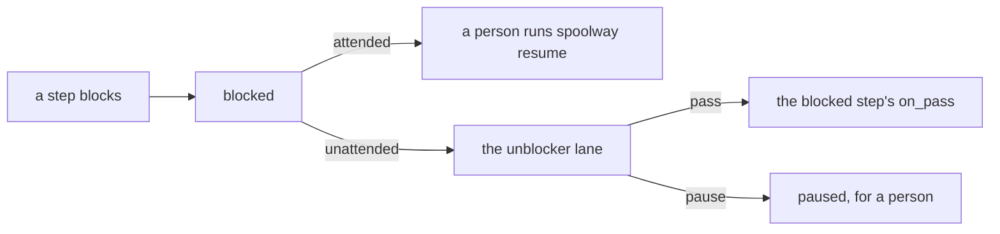
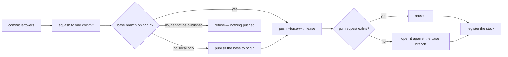
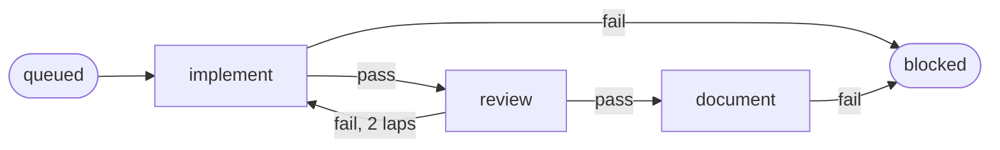
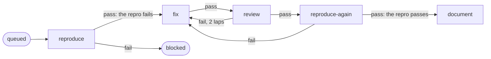

# Pipelines

A pipeline is a named list of steps. It is a YAML file in `.spoolway/pipelines/`. Changing
the flow is a file edit.

## One file each

The file name is the pipeline name. There is no `name:` key.

```
.spoolway/pipelines/
  default.yml        # implement, review, document
  bugfix.yml         # reproduce, fix, review, reproduce again, document
  hotfix.yml         # yours
```

A complete example pipeline:

```yaml
# .spoolway/pipelines/default.yml
description: One unit of work: implement, review, then document.

steps:
  - id: implement          # the first step is where a task starts
    agent: claude
    prompt: implementer
    model: claude-opus-5
    session: true
    on_pass: review

  - id: review
    agent: claude
    prompt: reviewer
    model: claude-opus-5
    effort: high
    session: true
    loop:
      implement: 2         # two laps back to implement, then blocked
    on_pass: document
    on_fail: implement

  - id: document
    agent: claude
    prompt: archivist
    model: claude-sonnet-5
    on_pass: done
```

- A task picks its pipeline with its own `pipeline:` field. The field is required and must
  name a pipeline that exists.
- Every step runs for every task, in order. There is no condition key. A step that should only
  run sometimes belongs in a second pipeline file.
- A lane reads the pipelines on its own branch. See [Project](concepts.md#project).
- Keys on a step can also be set from outside the checkout. See [The overrides
  layer](configuration.md#the-overrides-layer).
- `default` and `bugfix` ship as samples. Edit them, cut steps, or replace them. See
  [Converting a workflow you already run](#converting-a-workflow-you-already-run).

## Per-pipeline keys

| Key | Default | What it does |
|---|---|---|
| `description` | none | One sentence on what this pipeline is for. Shown when choosing between pipelines. |
| `task_template` | the pipeline's name, then `default` | Which task skeleton a task queued here is written from. |
| `steps` | required | The steps, in order. The first one is where a task starts. |

## Per-step keys

| Key | Default | What it does |
|---|---|---|
| `id` | required | The step name. Written to the task's `stage:`. |
| `description` | none | One line, shown by `spoolway pipeline show`. |
| `agent` | none | A profile from `config.toml`. Makes this an agent step. |
| `run` | none | A shell command line. Makes this a command step. |
| `end` | `false` | `true` makes this a terminal step. The task stops here. |
| `prompt` | the step id | The prompt file the step runs. |
| `model` | none | The model. Required on every agent step. |
| `effort` | none | Passed to the agent kind's effort flag. Blank sends no flag. See [Effort](agents.md#effort). |
| `skills` | none | Skills invoked at the top of the opening prompt. Comma separated, names only. |
| `session` | `false` | `true` resumes this prompt's earlier conversation on the task. |
| `slot` | `true` | Whether the step takes one of the profile's slots. A model's own `slots` and `exclusive` apply either way. |
| `gate` | `false` | `true` holds the step's pass on `paused` until `spoolway resume`. See [Gates](#gates). |
| `on_pass` | none | Where a pass goes. `done` finishes the task. Absent means the task stays put. |
| `on_fail` | `blocked` | Where a failure goes. Writing `blocked` outright is redundant; `spoolway pipeline check` warns and leaving the key absent does the same thing. |
| `loop` | unbounded | How many times a task may arrive here from a given step. A number, or a map keyed by step. |
| `timeout` | `30m` | Command steps only. How long the command may run before it is killed. |
| `background` | `false` | Command steps only. `true` lets the task move on while the command runs. |
| `headless` | `false` | Command steps only. `true` runs the command with no pane. |
| `last` | `false` | Command steps only. `true` runs it only on the last task of a chain. See [`last:`](#last--a-step-the-chain-runs-once). |
| `first` | `false` | Command steps only. `true` runs it only on a chain's declared root. See [`first:`](#first--a-step-only-a-chains-root-runs). |
| `serial` | `false` | Command steps only. `true` runs it for one task at a time. Every other task waits on the step until that run exits. See [`serial:`](#serial--one-run-of-the-step-at-a-time). |

The same table is at the top of every pipeline file, between `# >>> spoolway >>>` and
`# <<< spoolway <<<`. `spoolway sync` rewrites that block. A file without the markers is
never written to.

There is no `kind:` key. A step with `agent:` runs a prompt on a model. A step with `run:` runs
a command, and its exit code is the outcome. A step with `end: true` stops the task.

Steps further down the file are scheduled first. A task on `document` gets a slot before a
task on `implement`.

### Reserved stages

Four stages belong to the dispatcher. No step may use `queued`, `done` or `paused` as its id.
Every pipeline may route to `done` and `blocked` without declaring them.

| Stage | What it means |
|---|---|
| `queued` | Where every task starts. It waits for its dependencies and a free slot. |
| `done` | The task finished. Its worktree is removed and its file is archived. |
| `blocked` | The task needs help. Attended, `spoolway resume <task>` resumes it. Unattended, a lane is started on it. See [Staffing `blocked`](#staffing-blocked). |
| `paused` | The task passed a `gate:` step and waits for `spoolway resume <task>`. See [Gates](#gates). |

## Routing

A step names where a task goes on a pass and on a fail. Prompts report an outcome and the
pipeline picks the destination.

| Target | Meaning |
|---|---|
| `<step id>` | The task moves to that step. |
| `done` | The task finishes. |
| `blocked` | The task parks for a person, or for the unblocker in an unattended run. |

A step never names its own id in `on_pass` or `on_fail` — a lap goes through another step or
not at all. `spoolway pipeline check` refuses a file that tries it, naming the step and the
key.

### Loops

`loop` counts arrivals at this step from a given step. Put it on the step that sends work
back. In the shipped pipeline `review` fails back to `implement`, so `review` carries it.

```yaml
  - id: review
    session: true
    loop:
      fix: 3          # three arrivals from fix
      verify: 5       # five arrivals from verify
```

- A bare number bounds every route into the step. A route left out of a map is unbounded.
- A step named in the map that never routes here is refused.
- A spent loop parks the task on `blocked`. The round count is written to `## Status Log`.
- A file still declaring `on_loop_max:` is refused, naming the pipeline, the step and the key.
- Every cycle needs a `loop` whose exit leaves the cycle. `spoolway pipeline check` refuses the
  file otherwise.

### Proving the loops

`spoolway pipeline check` proves a pipeline's graph has a way out. A `cargo test` in
`src/route_sim.rs` proves the counters that walk that graph agree with it. It routes every
outcome at every step, to a bounded depth, over the shipped pipelines, the tracked
`.spoolway/pipelines` files, and pipelines it generates that pass `spoolway pipeline check`.
Each path it walks must reach a terminal step, keep every `loop` count rising except where a
person resumes a blocked task, and start no more lanes than a stated bound.

## Unattended runs

Set `enabled = true` under `[unattended]` in `config.toml`, or pass `--unattended` to
`spoolway dispatch`. A task that blocks still lands on `blocked`. A lane is then started there
to clear it.



The unblocker lane continues the lane that stopped, with everything it had read. A `gate:`
still waits for a person. A lane that keeps dying at launch is retried with a doubling delay,
up to an hour.

### Staffing `blocked`

`[unattended]` in `config.toml` builds a `blocked` step for every pipeline:

```toml
[unattended]
blocked_agent   = "claude"
blocked_model   = "claude-opus-5"
blocked_effort  = ""
blocked_session = true
blocked_prompt  = "unblocker"
```

A pipeline may override `agent`, `model`, `effort`, `session` and `prompt` on its own `blocked`
step. Any other key is refused. Keys left out fall back to the config.

```yaml
  - id: blocked
    model: claude-sonnet-5
    effort: high
```

- A `--pass` carries the task past the blocked step to that step's `on_pass` for an agent step,
  and back to itself for a command step. `--pass --stage <step>` sends it to `<step>` instead,
  bounded by the steps this task has already run.
- A `--pause`, `--fail` or `--block` parks the task on `paused`. `spoolway resume` then hands it
  back to the step it blocked on.
- `spoolway dispatch` refuses an unattended run with a blank `blocked_model`.
- `spoolway pipeline show` marks where each pipeline's `blocked` step comes from.

The shipped `unblocker` prompt clears whatever is in the way. It never merges, stops the
dispatcher, or destroys work. See [Prompts](prompts.md).

### The brake

An unattended run stops when it reaches a ceiling in output tokens or in dollars. `0` means no
ceiling.

```toml
[unattended]
enabled = true
max_output_tokens = 2_000_000
max_cost_usd = 20.0
```

Reaching either starts no further lane. Live lanes finish, then the dispatcher stops. Tasks
stay where they are, and the next `spoolway dispatch` picks them up.

## Command steps

A build, a test suite, a formatter or a deploy script is a command step.

```yaml
  - id: build
    description: Build the release binary before anything reviews it.
    run: cargo build --release
    timeout: 45m          # 30m when absent
    on_pass: review
    on_fail: fix
```

- `run:` goes to the shell whole, via `sh -c`. Pipes, `&&` and
  globs work. There is no `shell:` key.
- It runs in the task's worktree with `SPOOLWAY_TASK`, `SPOOLWAY_STEP`, `SPOOLWAY_REPO`,
  `SPOOLWAY_WORKTREE` and `SPOOLWAY_TASK_FILE` set, and with the privileges of whoever started
  the dispatcher.
- Exit code zero takes `on_pass`. Anything else takes `on_fail`. Running out of `timeout` is a
  failure, and the whole process group is killed. `timeout: 0s` is refused.
- A `run:` means one thing by each exit code. A command that answers the same code for two
  different outcomes cannot be routed on, and fixing that is the command's job, not spoolway's.
- `prompt`, `model`, `effort`, `session` and `gate` are refused. The step takes no slot.
- Output goes to `<task> · <step>.log` under the project's home.
- Other tasks keep moving while the command runs.
- The exit code stays on disk until the pass that read it has written the task's move to the
  destination step. A pass that cannot place that destination, for want of a free slot, leaves
  the task on the command step and routes on the same code next time, instead of running the
  command again.

### Background and headless

| | Blocking (default) | `background: true` |
|---|---|---|
| Next step | starts when the command exits | starts at once |
| Routing | exit 0 takes `on_pass`, else `on_fail` | `on_pass` at once. A later non-zero exit sends the task to `on_fail` from wherever it is. |
| `timeout` | routes to `on_fail` | kills the run, nothing routes |

A command step runs in its own pane. `headless: true` runs that command with no pane; this
step option is separate from the internal test-only dispatcher backend. A pane closes the
moment its exit code is judged, on a pass and on a failure alike. Only a timed-out run's pane
stands, until the task reaches the step again or is cleaned up.

### `last:` — a step the chain runs once

The top task of a chain carries every change beneath it, so a suite the whole stack must pass
runs once, there. A task is last when no unfinished task depends on it. Any other task walks
past the step to its `on_pass`. In a fan, every task is last. `last:` is allowed on command
steps only.

### `first:` — a step only a chain's root runs

The root task of a chain carries no declared dependency, so setup that a whole stack needs
runs only once, there. A task is the root when its own `depends_on` is empty. `depends_on`
is read from the task's own file, and archiving what it names does not empty it, so a task
naming an archived dependency is still not the root. Any other task walks past the step to
its `on_pass`. In a fan, every independent root runs it. `first:` is allowed on command
steps only, and is refused together with `last:` on the same step.

### `serial:` — one run of the step at a time

```yaml
  - id: setup
    description: Create the task's own database.
    run: scripts/setup-db.sh
    serial: true
    on_pass: implement
```

Only one task's run of a `serial: true` step goes at a time, counting a `background: true` run
until it exits. A task that reaches the step while another task's run of it is going waits there
unstarted: no pane, no run files, no timeout clock. Its own run starts on the first pass after
the earlier run exits. `spoolway queue list` and the board show it as `○ waiting` with
`serial: after <task>`.

The hold is per pipeline: two pipelines with a step of the same id do not hold each other, and
neither does another project's dispatcher. `serial:` is allowed on command steps only.
`spoolway pipeline check` refuses it on any step with an `agent:`.

## `spoolway stack`

`spoolway stack` commits what is uncommitted, squashes to one commit, pushes with
`--force-with-lease`, opens or reuses the GitHub pull request against the branch the worktree
was cut from, and registers the GitHub stack. It uses git and `gh` only, so no model runs and
no tokens are spent. The command does not impose a step name or pipeline position; where or
whether you call it is up to you.



- The pull request's title is the task's `title:`. Its body is the task file's body plus a
  trailer that lists files outside `touches` and predicted conflicts with open `parallel: true`
  tasks.
- A base branch that exists locally but not on `origin` is pushed to `origin` before the pull
  request is opened. A base that cannot be published refuses before the task's own branch is
  force-pushed, so a failed run leaves nothing published.
- An empty diff against the cut point opens no pull request.
- A git or `gh` failure exits non-zero. Calling the command again reuses the existing pull
  request.
- Two tasks that depend on the same task are siblings. A GitHub stack is one line, so only the
  first sibling joins it. The second passes and reports `none — <task> is a sibling of #<n>`
  on its `stack` line.

### `skip:` — walking past a step

A task's own `skip:` field walks the named steps to their `on_pass` without starting a lane.
The queue screen's `t` trial picker writes it, so a trial arm never opens a pull request. See
[Runs](eval.md#runs).

## Gates

`gate: true` on a step holds its pass for a person. Do not name a step `gate`. A task's own `gate_at:` field gates one step for that task alone. See [Tasks](tasks.md).

The lane runs and reports as usual. On its pass the task lands on `paused` and its pane stays
open.

```
spoolway resume <task>                            # let it past: the on_pass route
spoolway resume <task> --stage implement -m "why"  # send it back to a step you name
```

- `on_pass` is the only road a plain resume ever takes past a gate, whatever `on_fail` a step
  declares or does not.
- `--stage <step>` reroutes the task to that step, whatever the gate would otherwise have done.
- A gated step with no `on_fail` still parks a *failed report* on `blocked` — that is about
  `spoolway report --fail` at the step itself, not about resuming it. `spoolway pipeline check`
  warns about it. Writing `on_fail: blocked` outright silences that warning without changing
  where the fail goes, so `pipeline check` warns about the redundant key instead.
- A gate waits for a person in an unattended run too.
- No shipped step is gated. A pull request is already a checkpoint. Gate a step that changes
  something without leaving a pull request behind, such as a deploy.

## The agent path in the shipped `default` pipeline



| Step | Runs |
|---|---|
| `implement` | the `implementer` prompt, session kept |
| `review` | the `reviewer` prompt, session kept. A fail goes back to `implement`, twice at most. |
| `document` | the `archivist` prompt, on this task's diff |
| `blocked` | the unblocker, in an unattended run |

Every agent step ships with a blank `model` and `effort`. `spoolway init` rewrites `agent:
claude` to the profile you pick. Fill in the models before the first run.

This repository's own `.spoolway/pipelines/impl.yml` adds an end-to-end step, a `test` command
step and a `suite` step with `last: true`. No pipeline waits on a pull request's hosted checks;
`handover` opens it and the task is done. See
[Local gates and daily CI](testing.md#local-gates-and-daily-ci).

`.spoolway/pipelines/impl_lite.yml` sits between `impl` and `impl_fast`: it keeps `review`,
`test` and `suite`, but `test` runs `scripts/gate-quick.sh` instead of `scripts/gate.sh`, and
`suite` runs the `smoke` tier instead of `pr`.

## The agent path in the shipped `bugfix` pipeline



Both `reproduce` steps run the same `reproducer` prompt. Before the fix, a failing repro is the
pass. After the fix, a passing repro is the pass. Its agent path joins `default` at `document`.

| Step | Runs |
|---|---|
| `reproduce` | the `reproducer`: write the repro and see it fail |
| `fix` | the `implementer`, session kept |
| `review` | the `reviewer`. A fail goes back to `fix`, twice at most. |
| `reproduce-again` | the `reproducer`. A fail goes back to `fix`. Arrivals from `review` are bounded at two. |

## Whose worktree

Every lane runs in a git worktree. A branch cannot be checked out twice.

| The task's branch is | The lane |
|---|---|
| already checked out somewhere | borrows that checkout and leaves it alone |
| nowhere | gets a fresh worktree, removed at `done` |

The task file records which it was as `borrowed:`. A borrowed checkout and its branch are never
removed.

## Working with pipelines

```
spoolway pipeline show      # every pipeline, with defaults resolved
spoolway pipeline check     # validate against the config they will run with
spoolway pipeline contract  # every key, every rule, and a blank to copy
```

`pipeline check` validates the graph, the agent profiles, the prompts, every `loop`, and every
queued task's `skip:` list. It refuses an agent step with no `model:`.

The `spoolway-config` skill writes and edits pipelines with you, starting from the blank that
`spoolway pipeline contract` prints.

## Converting a workflow you already run

| Your workflow has | It becomes |
|---|---|
| A stage where somebody uses judgement | An agent step: a `prompt:` on a `model:` |
| A stage that is a command with an exit code | A `run:` step |
| "If that fails, go back and fix it" | `on_fail` pointing back, plus a `loop` |
| "Check with me before this one" | `gate: true`, then `spoolway resume` |
| A handoff that only tells a person the last stage finished | Nothing. Delete it. |

There is no nesting. A stage with three parts is three steps, or one step whose prompt
describes all three. A pipeline says nothing about what a lane may reach. See [What confines
a profile](agents.md#what-confines-a-profile).

The `spoolway-config` skill does the conversion with you and writes the prompts the steps need.
See [Writing your own](prompts.md#writing-your-own).

## Moving a pipeline between projects

```
cp .spoolway/pipelines/default.yml ../other-project/.spoolway/pipelines/
cp -r .spoolway/prompts/reviewer ../other-project/.spoolway/prompts/   # each prompt its steps name
cd ../other-project && spoolway pipeline check
```

`pipeline check` names every prompt and agent profile the other project lacks.

## Adding a step

A new step is two files: the prompt, and the step that runs it.

```yaml
  - id: audit
    agent: claude
    prompt: auditor
    model: claude-opus-5
    on_pass: document
    on_fail: implement
```

See [Prompts](prompts.md) for what goes in the file. `spoolway prompt contract --step audit`
prints what that lane is handed.
