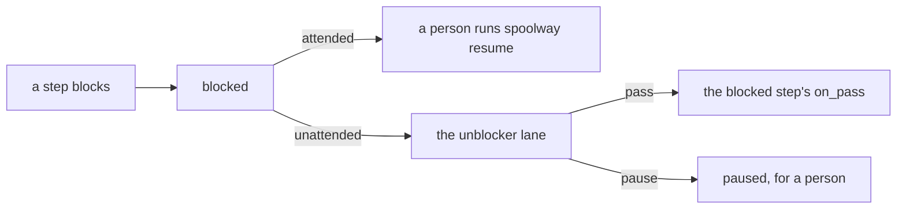
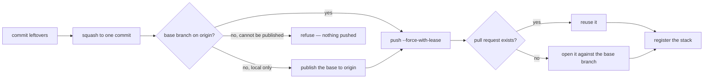
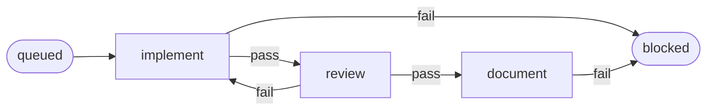
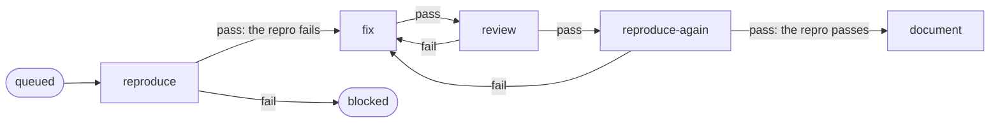

# Pipelines

A pipeline is a named list of steps. It is a YAML file in `.spoolway/pipelines/`. Changing
the flow is a file edit.

## One file each

The file name is the pipeline name. There is no `name:` key.

```
.spoolway/pipelines/
  default.yml        # implement, review, document
  bugfix.yml         # reproduce, fix, review, reproduce again, document
  hotfix.yml         # yours
```

A complete example pipeline:

```yaml
# .spoolway/pipelines/default.yml
description: One unit of work: implement, review, then document.

steps:
  - id: implement          # the first step is where a task starts
    agent: claude
    prompt: implementer
    model: claude-opus-5
    session: true
    loop: 2               # two arrivals at most, then blocked
    on_pass: review

  - id: review
    agent: claude
    prompt: reviewer
    model: claude-opus-5
    effort: high
    session: true
    on_pass: document
    on_fail: implement

  - id: document
    agent: claude
    prompt: archivist
    model: claude-sonnet-5
    on_pass: done
```

- A task picks its pipeline with its own `pipeline:` field. The field is required and must
  name a pipeline that exists.
- Every step runs for every task, in order. There is no condition key. A step that should only
  run sometimes belongs in a second pipeline file.
- A lane reads the pipelines on its own branch. See [Project](concepts.md#project).
- While a dispatcher runs, `report`, `resume` and `queue add` route on the pipelines it loaded
  at start. An edit to a pipeline file is used after the dispatcher restarts. See [Editing a
  pipeline while it runs](dispatcher.md#editing-a-pipeline-while-it-runs).
- Keys on a step can also be set from outside the checkout. See [The overrides
  layer](configuration.md#the-overrides-layer).
- `default` and `bugfix` ship as samples. Edit them, cut steps, or replace them. See
  [Converting a workflow you already run](#converting-a-workflow-you-already-run).

## Per-pipeline keys

| Key | Default | What it does |
|---|---|---|
| `version` | `1.0` | The pipeline's own version, in `x.y` form. Yours to raise when the pipeline changed enough to compare. spoolway only records it. |
| `description` | none | One sentence on what this pipeline is for. Shown when choosing between pipelines. |
| `task_template` | the pipeline's name, then `default` | Which task skeleton a task queued here is written from. |
| `steps` | required | The steps, in order. The first one is where a task starts. It is never `blocked`. |

## Per-step keys

| Key | Default | What it does |
|---|---|---|
| `id` | required | The step name. Written to the task's `stage:`. |
| `description` | none | One line, shown by `spoolway pipeline show`. |
| `agent` | none | A profile from `config.toml`. Makes this an agent step. |
| `run` | none | A shell command line. Makes this a command step. |
| `prompt` | the step id | The prompt file the step runs. |
| `model` | none | The model. Required on every agent step. |
| `effort` | none | Passed to the agent kind's effort flag. Blank sends no flag. See [Effort](agents.md#effort). |
| `skills` | none | Skills the lane invokes before the task briefing, each as its own message. Comma separated, names only. See [Skills](agents.md#skills). |
| `session` | `false` | `true` resumes this prompt's earlier conversation on the task. |
| `slot` | `true` | Whether the step takes one of the profile's slots. A model's own `slots` applies either way. |
| `gate` | `false` | `true` holds the step's pass on `paused` until `spoolway resume`. See [Gates](#gates). |
| `on_pass` | none | Where a pass goes. `done` finishes the task. Absent means the task stays put. |
| `on_fail` | `blocked` | Where a failure goes. Writing `blocked` outright is redundant; `spoolway pipeline check` warns and leaving the key absent does the same thing. |
| `loop` | unbounded | The most times a task may arrive at this step, by any route. The next arrival parks on `blocked`. A written value is 1 or more. |
| `timeout` | `30m` | Command steps only. How long the command may run before it is killed. |
| `background` | `false` | Command steps only. `true` lets the task move on while the command runs. |
| `headless` | `false` | Command steps only. `true` runs the command with no pane. |
| `last` | `false` | Command steps only. `true` runs it only on the last task of a chain. See [`last:`](#last--a-step-the-chain-runs-once). |
| `first` | `false` | Command steps only. `true` runs it only on a chain's declared root. See [`first:`](#first--a-step-only-a-chains-root-runs). |
| `serial` | `false` | Command steps only. `true` runs it for one task at a time. Every other task waits on the step until that run exits. See [`serial:`](#serial--one-run-of-the-step-at-a-time). |

The same table is at the top of every pipeline file, between `# >>> spoolway >>>` and
`# <<< spoolway <<<`. `spoolway sync` rewrites that block. A file without the markers is
never written to.

There is no `kind:` key. A step with `agent:` runs a prompt on a model. A step with `run:` runs
a command, and its exit code is the outcome. A step finishes the task with `on_pass: done`. A step stops the task for a person with `gate: true`.

Steps further down the file are scheduled first. A task on `document` gets a slot before a
task on `implement`.

### Reserved stages

Four stages belong to the dispatcher. No step may use `queued`, `done` or `paused` as its id.
Every pipeline may route to `done` and `blocked` without declaring them.

| Stage | What it means |
|---|---|
| `queued` | Where every task starts. It waits for its dependencies and a free slot. |
| `done` | The task finished. Its worktree is removed and its file is archived. |
| `blocked` | The task needs help. Attended, `spoolway resume <task>` resumes it. Unattended, a lane is started on it. See [Staffing `blocked`](#staffing-blocked). |
| `paused` | The task passed a `gate:` step and waits for `spoolway resume <task>`. See [Gates](#gates). |

`started` is not one of these four. It is an `[issue_tracking]` hook event, fired the moment a
task actually leaves `queued` for its entry step — see
[`[issue_tracking]`](configuration.md#issue_tracking--a-hook-fired-on-four-task-events). Nothing
ever writes it to a task's own `stage:`, so a step may still use `started` as its id.

## Routing

A step names where a task goes on a pass and on a fail. Prompts report an outcome and the
pipeline picks the destination.

| Target | Meaning |
|---|---|
| `<step id>` | The task moves to that step. |
| `done` | The task finishes. |
| `blocked` | The task parks for a person, or for the unblocker in an unattended run. |

A step never names its own id in `on_pass` or `on_fail` — a lap goes through another step or
not at all. `spoolway pipeline check` refuses a file that tries it, naming the step and the
key. Fix it by hand: send the failure to a step that leaves, or delete the step.

A task starts on the first step, so `blocked` may not be first. `spoolway pipeline check`
refuses the file and tells you to put a working step first.

A step that no route from the first step reaches is allowed. `spoolway pipeline check` warns
about it and still passes. A task can reach such a step only by being
resumed onto it, from the board's picker or with `spoolway resume --stage`.

```
$ spoolway pipeline check
  warning: pipeline t: step `old` is reached by no route
```

### Loops

`loop` counts arrivals at this step, by any route, the first included. Put it on the step
that is sent back to. In the shipped pipeline `review` fails back to `implement`, so
`implement` carries it.

```yaml
  - id: implement
    session: true
    loop: 3          # at most three arrivals here, then blocked
```

- A spent loop parks the task on `blocked`. The arrival count is written to `## Status Log`.
- Every way a task reaches a step counts as an arrival: a lane's report, a command's exit code,
  a walk-past by `skip:`, `first:` or `last:`, a lane that cannot start or whose pane stays
  busy, and a background command that fails after the task moved on. A walk-past counts one
  arrival at the step it lands on. It also counts one arrival at each step it skips that
  carries a `loop:`. A skipped step without a `loop:` counts none.
- A walk-past over a step whose `loop:` is spent goes to that step's loop exit, which is
  `blocked`. This stops a cycle whose only `loop:` is on a step the task skips.
- A task leaving `blocked` starts every step's count again from zero. This holds for every
  outcome the unblocker reports and for a person's `spoolway resume`.
- `loop: 0` is refused, naming the step. A loop is 1 or more. A step with no `loop:` has no
  limit, so delete the line to keep the meaning 0.7 gave `loop: 0`. `loop: 1` is not the same:
  it blocks the task on its second arrival. `spoolway sync` refuses a file carrying it, and
  writes nothing to that file until it is fixed.
- The map form, keyed by the step a failure is sent back from, is refused at parse. The
  refusal names the step that should carry the limit instead: delete the map and give that
  step a bare `loop:` of its own.
- `on_loop_max:` is refused, naming the pipeline, the step and the key. A spent loop budget
  always parks on `blocked`, so the key chooses nothing; delete it.
- Every cycle needs some step along it carrying a `loop:`. `spoolway pipeline check` refuses
  the file otherwise.

### Proving the loops

`spoolway pipeline check` proves a pipeline's graph has a way out. A `cargo test` in
`src/route_sim.rs` proves the counters that walk that graph agree with it. It routes every
outcome at every step, and the walk-past and the failed launch or busy pane, to a bounded
depth. It runs over the shipped pipelines, the tracked `.spoolway/pipelines` files, and
pipelines it generates that pass `spoolway pipeline check`.
Each path it walks must reach `done` or `blocked`, keep every `loop` count rising, and start no
more lanes than a stated bound.

## Unattended runs

Set `enabled = true` under `[unattended]` in `config.toml`, or pass `--unattended` to
`spoolway dispatch`. A task that blocks still lands on `blocked`. A lane is then started there
to clear it.


```mermaid
flowchart LR
  A[a step blocks] --> B[blocked]
  B -->|attended| C[a person runs spoolway resume]
  B -->|unattended| D[the unblocker lane]
  D -->|pass| E[the blocked step's on_pass]
  D -->|pause| F[paused, for a person]
```

The unblocker lane continues the lane that stopped, with everything it had read. A `gate:`
still waits for a person. A lane that keeps dying at launch is retried with a doubling delay,
up to an hour.

### Staffing `blocked`

`[unattended]` in `config.toml` builds a `blocked` step for every pipeline:

```toml
[unattended]
blocked_agent   = "claude"
blocked_model   = "claude-opus-5"
blocked_effort  = ""
blocked_session = true
blocked_prompt  = "unblocker"
```

A pipeline may override `agent`, `model`, `effort`, `session` and `prompt` on its own `blocked`
step. Any other key is refused. Keys left out fall back to the config.

```yaml
  - id: blocked
    model: claude-sonnet-5
    effort: high
```

`spoolway pipeline override <name> --set blocked.model=<model>` patches this step the same way,
whether or not the pipeline file declares it. The command refuses `blocked.description`. It
refuses `blocked.session=false` while `blocked_session` in `[unattended]` is `true`. To start the
lane without a session, set `blocked_session = false` in the config.

- A `--pass` carries the task past the blocked step to that step's `on_pass` for an agent step,
  and back to itself for a command step. `--pass --stage <step>` sends it to `<step>` instead,
  bounded by the steps this task has already run.
- The gate belongs to the step, whoever does its work: if the step this task blocked on is
  `gate: true`, a plain `--pass` lands on `paused` at that step's own gate instead, exactly as it
  would have if that step's own lane had reported the pass. `--stage` may not name a step past a
  gate this task's pass has not yet answered for — naming the gate step itself, or a step before
  it, still works. See [Gates](#gates).
- A `--pause`, `--fail` or `--block` parks the task on `paused`. `spoolway resume` then hands it
  back to the step it blocked on.
- `spoolway dispatch` refuses an unattended run with a blank `blocked_model`.
- `spoolway pipeline show` marks where each pipeline's `blocked` step comes from.

The shipped `unblocker` prompt clears whatever is in the way. It never merges, stops the
dispatcher, or destroys work. See [Prompts](prompts.md).

### The brake

An unattended run stops when it reaches a ceiling in output tokens or in dollars. `0` means no
ceiling.

```toml
[unattended]
enabled = true
max_output_tokens = 2_000_000
max_cost_usd = 20.0
```

Reaching either starts no further lane. Live lanes finish, then the dispatcher stops. Tasks
stay where they are, and the next `spoolway dispatch` picks them up.

## Command steps

A build, a test suite, a formatter or a deploy script is a command step.

```yaml
  - id: build
    description: Build the release binary before anything reviews it.
    run: cargo build --release
    timeout: 45m          # 30m when absent
    on_pass: review
    on_fail: fix
```

- `run:` goes to the shell whole, via `sh -c`. Pipes, `&&` and
  globs work. There is no `shell:` key.
- The line runs in a child shell. A line that starts with `exec` still has its exit code
  recorded and routed.
- It runs in the task's worktree with `SPOOLWAY_TASK`, `SPOOLWAY_STEP`, `SPOOLWAY_REPO`,
  `SPOOLWAY_WORKTREE` and `SPOOLWAY_TASK_FILE` set, and with the privileges of whoever started
  the dispatcher.
- Exit code zero takes `on_pass`. Anything else takes `on_fail`. Running out of `timeout` is a
  failure, and the whole process group is killed. `timeout: 0s` is refused.
- A `run:` means one thing by each exit code. A command that answers the same code for two
  different outcomes cannot be routed on, and fixing that is the command's job, not spoolway's.
- `prompt`, `model`, `effort` and `session` are refused. The step takes no slot.
- `gate: true` holds a passing exit on `paused`. See [Gates](#gates). A `background: true` step
  passes when it starts, so it has no exit to hold, and `gate` is refused there.
- Output goes to `<task> · <step>.log` under the project's home.
- Other tasks keep moving while the command runs.
- Every arrival at a command step runs the command in full. The move onto the step stops any old
  run still going and deletes its exit code, pid and kill count. The log stays. This holds for
  every way a task reaches the step, including a lane's report and a resume.
- A dispatcher restart is not an arrival. The restarted dispatcher adopts the run it finds on
  the step, or routes on the exit code that run wrote.
- The run's pid file holds the pid and the process start time. After a reboot, a live process
  with the same pid but a different start time is not the run. The step reads as interrupted and
  runs again, and neither the timeout nor a cleanup signals that process. A pid file with no
  start time is read as the pid alone. Only Linux records a start time.
- A run killed without writing an exit code runs again. A run killed three times in a row
  blocks the task. The task's `## Status Log` names the run's log.
- A late background failure can move a task off a command step. That stops the step's running
  command and deletes its run files, including an exit code it already wrote. The next visit
  runs the command again.
- A blocking command whose task leaves the step by another road, such as a `spoolway report`
  typed by hand or a `last:` walk-past, is stopped on the dispatcher's next pass. Its run files
  are deleted and its exit code never moves the task. Its pane closes.
- The exit code stays on disk until the pass that read it has written the task's move to the
  destination step. A pass that cannot place that destination, for want of a free slot, leaves
  the task on the command step and routes on the same code next time, instead of running the
  command again.

### Background and headless

| | Blocking (default) | `background: true` |
|---|---|---|
| Next step | starts when the command exits | starts at once |
| Routing | exit 0 takes `on_pass`, else `on_fail` | `on_pass` at once. A later non-zero exit sends the task to `on_fail` from wherever it is. |
| `timeout` | routes to `on_fail` | kills the run, nothing routes |

A command step runs in its own pane. `headless: true` runs that command with no pane; this
step option is separate from the internal test-only dispatcher backend. A pane closes the
moment its exit code is judged, on a pass and on a failure alike. Only a timed-out run's pane
stands, until the task reaches the step again or is cleaned up.

A paned step's script is written to `<task> · <step>.sh` beside the log, readable by you alone,
because it holds the step's environment. The pane is typed one short line that runs that file.
The `run:` line itself is never typed. Spoolway types nothing over 512 bytes into any pane and
refuses longer text with an error naming the pane and the byte count.

### `last:` — a step the chain runs once

The top task of a chain carries every change beneath it, so a suite the whole stack must pass
runs once, there. A task is last when no unfinished task in its own group depends on it. Any
other task walks past the step to its `on_pass`. Each group gets its own `last:` run, whatever
stacks on top of it. `last:` is allowed on command steps only.

### `first:` — a step only a chain's root runs

The root task of a chain carries no declared dependency, so setup that a whole stack needs
runs only once, there. A task is the root when its own `depends_on` is empty. `depends_on`
is read from the task's own file, and archiving what it names does not empty it, so a task
naming an archived dependency is still not the root. Any other task walks past the step to
its `on_pass`. In a fan, every independent root runs it. `first:` is allowed on command
steps only, and is refused together with `last:` on the same step.

### Steps a task walks past

A step is hidden for a task when its own `skip:` names it, when it is a `last:` step and
something in the task's group is still open above it, or when it is a `first:` step and the
task is not its chain's root. These moves follow `on_pass` past hidden steps and write the
first step the task runs as its stage: a lane's report, a command step's exit,
`spoolway resume`, a cleared block, and a task's start off `queued`. The walk stops after as
many hops as the pipeline has steps. A hidden step with no `on_pass` is where the task lands.

The step the task lands on spends one `loop:` arrival. Each hidden step that carries a `loop:`
spends one as well, and a spent one sends the task to `blocked`. A task's start off `queued`
spends none at the hidden steps. The task's `## Status Log` names each hidden step in order,
with its rule, on the line for the step it landed on, after any message the move carries:

```
- 2026-10-08 14:09 → `document`: walked past `suite` (not last in its chain)
```

The dispatcher also walks a task past a hidden step it finds the task sitting on. These tasks
reach it:

- A task that was waiting its `serial:` turn when a dependent was queued above it.
- A task sent to a step by a failed lane start's `on_fail`, a background command's late
  `on_fail`, a resume of a parked task, or an unattended self-resume after an escalation.

### `serial:` — one run of the step at a time

```yaml
  - id: setup
    description: Create the task's own database.
    run: scripts/setup-db.sh
    serial: true
    on_pass: implement
```

Only one task's run of a `serial: true` step goes at a time, counting a `background: true` run
until it exits. A task that reaches the step while another task's run of it is going waits there
unstarted: no pane, no run files, no timeout clock. Its own run starts on the first pass after
the earlier run exits. `spoolway queue list` and the board show it as `○ waiting` with
`serial: after <task>`.

The hold is per pipeline: two pipelines with a step of the same id do not hold each other, and
neither does another project's dispatcher. `serial:` is allowed on command steps only.
`spoolway pipeline check` refuses it on any step with an `agent:`.

## `spoolway stack`

`spoolway stack` commits what is uncommitted, squashes to one commit, pushes with
`--force-with-lease`, opens or reuses the GitHub pull request against the branch the worktree
was cut from, and registers the GitHub stack. It uses git and `gh` only, so no model runs and
no tokens are spent. The command does not impose a step name or pipeline position; where or
whether you call it is up to you.


```mermaid
flowchart LR
  A[commit leftovers] --> B[squash to one commit] --> H{base branch on origin?}
  H -->|yes| C[push --force-with-lease]
  H -->|no, local only| P[publish the base to origin] --> C
  H -->|no, cannot be published| R[refuse — nothing pushed]
  C --> D{pull request exists?}
  D -->|yes| E[reuse it]
  D -->|no| F[open it against the base branch]
  E --> G[register the stack]
  F --> G
```

- The pull request's title is the task's `title:`, with its `ticket:` put in front when
  `ticket:` is a bare tracker key such as `KAN-11` rather than a GitHub URL. Its body is the
  task file's body plus a co-authorship tag. `## Status Log`, `## Handoff`, `## Blocker` and
  `## Hook error` move out of the plan and into one closed "Run history" section at the foot
  of the body, above the tag, so a reviewer opens on the plan sections alone. A body with none
  of the four gets no such section.
- `spoolway stack` prints a `conflicts` line to the console, naming every open task of another
  group, outside this task's own stack, whose branch `git merge-tree` predicts a conflict with:
  `conflicts   billing-copy (group billing-copy)`. The pull request body never repeats it.
- A base branch that exists locally but not on `origin` is pushed to `origin` before the pull
  request is opened. A base that cannot be published refuses before the task's own branch is
  force-pushed, so a failed run leaves nothing published.
- An empty diff against the cut point opens no pull request.
- The owner and repo come from the `origin` URL. These shapes are read:

  | `origin` | Owner and repo |
  |---|---|
  | `git@github.com:o/r.git` | `o`, `r` |
  | `https://github.com/o/r` | `o`, `r` |
  | `git@github.com-work:o/r.git` | `o`, `r` |

  The last shape is an SSH host alias, the usual way to use two GitHub accounts. An `origin`
  that is not on GitHub, such as a gitlab URL or a bare repository path, is refused with
  `is not a github.com remote`.
- A git or `gh` failure exits non-zero. Calling the command again reuses the existing pull
  request.
- Two tasks that depend on the same task are siblings. A GitHub stack is one line, so only the
  first sibling joins it. The second passes and reports `none — <task> is a sibling of #<n>`
  on its `stack` line.
- When the branch a task was cut from is gone, `stack` opens against the task's own `base:`
  if that branch exists. Otherwise it opens against the branch the merged pull request landed
  in. Either way it prints `` `<branch>` has landed — against `<base>` ``. When the only pull
  request for that branch was closed without merging, `stack` stops and names it, since there
  is no work in it to open against.
- A `starts_from:` branch that is gone from `origin` counts as gone, even when a local branch
  or an `origin/` tracking ref for it is still there. A local branch counts only when GitHub
  shows a merged pull request for it. A branch nobody has published yet is still pushed and
  used. A task with no `starts_from:`, or one equal to `base:`, is not checked this way. No
  local branch is deleted.

### `skip:` — walking past a step

A task's own `skip:` field walks the named steps to their `on_pass` without starting a lane.
The step it lands on spends its `loop:` budget, and so does each named step that carries a
`loop:`. A task over a limit lands on `blocked`.
The queue screen's `t` trial picker writes it, so a trial arm never opens a pull request. See
[Runs](eval.md#runs).

## Gates

`gate: true` on a step holds its pass for a person. Do not name a step `gate`. A task's own `gate_at:` field gates one step for that task alone. See [Tasks](tasks.md).

The lane runs and reports as usual. On its pass the task lands on `paused` and its pane stays
open. A command step has no lane to report: `gate: true` holds its passing exit the same way,
and a task's `gate_at:` holds a command step's exit whatever it was. A `background: true` step
passes as soon as it starts, so `gate: true` is refused there.

On the board, press `r` on the paused row. The picker preselects the `on_pass` route, so `enter`
lets the task past. Pick another step to send the task there instead.

- `on_pass` is the only road a plain resume ever takes past a gate, whatever `on_fail` a step
  declares or does not. The one exception is a command step whose failing exit a task's
  `gate_at:` held: resuming that takes the step's `on_fail`, the route the exit code chose.
- Picking another step in the picker reroutes the task to that step, whatever the gate would
  otherwise have done.
- A gated step with no `on_fail` still parks a *failed report* on `blocked` — that is about
  `spoolway report --fail` at the step itself, not about resuming it. `spoolway pipeline check`
  warns about it. Writing `on_fail: blocked` outright silences that warning without changing
  where the fail goes, so `pipeline check` warns about the redundant key instead.
- A gate waits for a person in an unattended run too.
- A gate holds an unblocker's `--pass` from `blocked` too, at the gate of the step this pass
  stands in for rather than of `blocked` itself: `spoolway resume` still takes that step's own
  `on_pass`. `--pass --stage <step>` off `blocked` may not name a step past a gate it has not
  answered for — naming the gate step itself, or a step before it, still works. See
  [Staffing `blocked`](#staffing-blocked).
- No shipped step is gated. A pull request is already a checkpoint. Gate a step that changes
  something without leaving a pull request behind, such as a deploy.

## The agent path in the shipped `default` pipeline


```mermaid
flowchart LR
  Q([queued]) --> I[implement]
  I -->|pass| R[review]
  R -->|pass| D[document]
  R -->|fail| I
  I & D -->|fail| B([blocked])
```

| Step | Runs |
|---|---|
| `implement` | the `implementer` prompt, session kept. Arrivals here are bounded at two, from any route. |
| `review` | the `reviewer` prompt, session kept. A fail goes back to `implement`. |
| `document` | the `archivist` prompt, on this task's diff |
| `blocked` | the unblocker, in an unattended run |

Every agent step ships with a blank `model` and `effort`. `spoolway init` rewrites `agent:
claude` to the profile you pick. Fill in the models before the first run.

This repository's own `.spoolway/pipelines/impl.yml` adds an end-to-end step, a `test` command
step and a `suite` step with `last: true`. No pipeline waits on a pull request's hosted checks;
`handover` opens it and the task is done. See
[Local gates and daily CI](testing.md#local-gates-and-daily-ci).

`.spoolway/pipelines/impl_lite.yml` sits between `impl` and `impl_fast`: it keeps `review`,
`test` and `suite`, but `test` runs `scripts/gate-quick.sh` instead of `scripts/gate.sh`, and
`suite` runs the `smoke` tier instead of `pr`.

## The agent path in the shipped `bugfix` pipeline


```mermaid
flowchart LR
  Q([queued]) --> P[reproduce]
  P -->|pass: the repro fails| F[fix]
  F -->|pass| R[review]
  R -->|pass| A[reproduce-again]
  R -->|fail| F
  A -->|pass: the repro passes| D[document]
  A -->|fail| F
  P -->|fail| B([blocked])
```

Both `reproduce` steps run the same `reproducer` prompt. Before the fix, a failing repro is the
pass. After the fix, a passing repro is the pass. Its agent path joins `default` at `document`.

| Step | Runs |
|---|---|
| `reproduce` | the `reproducer`: write the repro and see it fail |
| `fix` | the `implementer`, session kept. Arrivals here are bounded at two, from any route. |
| `review` | the `reviewer`. A fail goes back to `fix`. |
| `reproduce-again` | the `reproducer`. A fail goes back to `fix`. |

## Whose worktree

Every lane runs in a git worktree. A branch cannot be checked out twice.

| The task's branch is | The lane |
|---|---|
| already checked out somewhere | borrows that checkout and leaves it alone |
| nowhere | gets a fresh worktree, removed at `done` |

The task file records which it was as `borrowed:`. A borrowed checkout and its branch are never
removed.

## Working with pipelines

```
spoolway pipeline show      # every pipeline, with defaults resolved
spoolway pipeline check     # validate against the config they will run with
spoolway pipeline contract  # every key, every rule, and a blank to copy
```

`pipeline check` validates the graph, the agent profiles, the prompts, every `loop`, and every
queued task's `skip:` list. It refuses an agent step with no `model:`.

The `spoolway-config` skill writes and edits pipelines with you, starting from the blank that
`spoolway pipeline contract` prints.

## Converting a workflow you already run

| Your workflow has | It becomes |
|---|---|
| A stage where somebody uses judgement | An agent step: a `prompt:` on a `model:` |
| A stage that is a command with an exit code | A `run:` step |
| "If that fails, go back and fix it" | `on_fail` pointing back, plus a `loop` |
| "Check with me before this one" | `gate: true`, then `spoolway resume` |
| A handoff that only tells a person the last stage finished | Nothing. Delete it. |

There is no nesting. A stage with three parts is three steps, or one step whose prompt
describes all three. A pipeline says nothing about what a lane may reach. See [What confines
a profile](agents.md#what-confines-a-profile).

The `spoolway-config` skill does the conversion with you and writes the prompts the steps need.
See [Writing your own](prompts.md#writing-your-own).

## Moving a pipeline between projects

```
cp .spoolway/pipelines/default.yml ../other-project/.spoolway/pipelines/
cp -r .spoolway/prompts/reviewer ../other-project/.spoolway/prompts/   # each prompt its steps name
cd ../other-project && spoolway pipeline check
```

`pipeline check` names every prompt and agent profile the other project lacks.

## Private pipelines

A private pipeline lives outside the checkout, under the project's own home, and is never
tracked by git:

```
~/.spoolway/<label>-<id>/local/
  pipelines/<name>.yml           # a private pipeline, the same shape as a tracked one
  prompts/<name>/PROMPT.md       # a private prompt, see Prompts
  templates/tasks/<name>.md      # a private task skeleton, see Documentation and templates
```

A private pipeline loads beside the tracked ones. A task names it with the same `pipeline:`
field it would use for a tracked pipeline. The file name is the pipeline name, and it may end
in `.yml` or `.yaml`. This works in repo mode only; home mode has no private layer of its own,
because a home-mode project's whole setup is already private to the machine it runs on.

- `spoolway pipeline copy <from> <to>` writes a new private pipeline and, when `from` names no
  `task_template:` of its own, a task skeleton to go with it; when `from` does name one, the
  copy shares that same skeleton instead of writing a new one. `spoolway prompt copy <from>
  <to>` writes a new private prompt, copying the whole prompt folder `from` names, `assets/`
  included; a source folder holding a symlinked directory is refused outright, naming it. Both
  require `<from>` and `<to>` to be one plain name each: not empty, not absolute, and holding
  none of `/`, `\` or `..`. Both also refuse a `<to>` that already exists, tracked or private;
  `pipeline copy` also refuses a `<to>` whose skeleton already exists on its own. Run from a
  linked worktree, those checks also cover the main checkout's tracked files, naming the
  clashing file, since the main checkout and the dispatcher load those files even when the
  worktree's own checkout has never picked up the commit that added them. In home mode they
  write into the workspace's own `config/` instead, since there is no private layer to add
  there. `spoolway pipeline promote <name>` moves a private pipeline, the private prompts it
  names and the skeleton its `task_template:` names (the pipeline's own name when it sets
  none) into `.spoolway/`, then
  deletes the private files. It refuses inside a linked worktree, refuses any clash with a
  tracked file, refuses a step's prompt name or the pipeline's `task_template:` that is not one
  plain name, refuses when another private pipeline names the same skeleton, and is refused
  outright in home mode. See [`pipeline copy`](cli-reference.md#spoolway-pipeline-copy-from-to),
  [`prompt copy`](cli-reference.md#spoolway-prompt-copy-from-to) and [`pipeline
  promote`](cli-reference.md#spoolway-pipeline-promote-name).
- A private pipeline whose name matches a tracked one is refused, naming both files. Two
  private files of the same name but different extensions — `foo.yml` beside `foo.yaml` — are
  refused the same way, naming both private files; this is never reported as a clash with a
  tracked file.
- A private pipeline may name a tracked prompt or a private one. A tracked pipeline whose step
  names a prompt that exists only privately is refused, because that pipeline would break the
  moment it ran on a machine with no copy of the private prompt. A prompt name holding `/` is
  never resolved in the private layer, so a step naming one is treated as missing even when a
  file sits where the name would otherwise point.
- `spoolway pipeline list` and `spoolway pipeline show` print `private · <file>` after a private
  pipeline's name, naming the file it came from. A tracked pipeline prints nothing extra. See
  [`spoolway pipeline list`](cli-reference.md#spoolway-pipeline-list).
- `spoolway pipeline check` validates a private pipeline the same way it validates a tracked
  one. A private pipeline that fails validation is named by its own file, not only by its name.
- `spoolway pipeline override` and `spoolway prompt override` find a private pipeline or prompt
  the same way `list` and `show` do, and write a patch or fork for it. That patch or fork only
  starts applying once `spoolway pipeline promote` makes the target tracked; until then it sits
  in the overrides layer, named as waiting on the promote rather than reported as a missing
  name. `spoolway pipeline promote <name>` itself names any override file — for the pipeline or
  for a prompt it carries — that starts applying because of the move. See [The overrides
  layer](configuration.md#the-overrides-layer).
- A lane running in a worktree reads the same `local/` the main checkout does.

## Adding a step

A new step is two files: the prompt, and the step that runs it.

```yaml
  - id: audit
    agent: claude
    prompt: auditor
    model: claude-opus-5
    on_pass: document
    on_fail: implement
```

See [Prompts](prompts.md) for what goes in the file. `spoolway prompt contract --step audit`
prints what that lane is handed.
