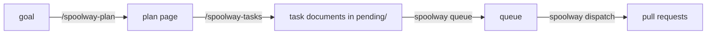

# Planning

A plan is a group of related tasks. All of them are queued from one branch, and each task
depends on the one before it. This page covers writing a plan, cutting it into tasks, queueing
them, and finishing the plan.



## Why a plan is a branch

`spoolway queue` writes the branch of the current checkout into each task's `base:`. That
branch is the plan's branch. Queue a plan from the branch the work should land in, such as
`main` or a release branch. Several plans can be queued from one checkout. They all share one
queue and one dispatcher.

## Two skills, cut at approval

`/spoolway-plan` talks the goal through with you and writes a plan page. It names no task, no
pipeline and no glob. When you approve the shape, it calls `/spoolway-tasks`.

`/spoolway-tasks` cuts the shape into task documents. It picks a pipeline per task, sizes each
task, chooses ids and globs, and writes the dependency order. You can also run it directly when
the shape is already agreed.

When the goal names an issue, both skills read it with `spoolway issue show <ref>`. The issue's
URL goes into each task's `source:`.

Both skills are optional. The queue screen reads task documents, so any script or tool that
writes a document into the pending directory works too.

## The plan file


The plan page is one self-contained HTML file. A person reads it once to approve the shape.
The binary never reads it. It lives outside the checkout, at
`~/.spoolway/<project>/plans/<YYYY-MM-DD>-<slug>.html`.

Every page has four sections in this order: Intend, Context, Decisions and Mockup. The
template is `assets/skills/claude/spoolway-plan/assets/template.html`.

The page also carries a machine copy of its own words, in a `<script type="text/markdown"
id="plan">` block at the foot of the page that a browser never shows. `/spoolway-plan` writes
that block; `/spoolway-tasks` reads it instead of the page around it.

## Writing a good breakdown

`/spoolway-tasks` applies these rules. They apply whether or not you use the skill.

| Rule | What it means |
|---|---|
| Size for a lane | A task is what one agent in a fresh worktree can finish. `spoolway task contract` prints the project's sizing guidance. Keep each task's criteria under five bullets. |
| Checkable criteria | Write `GET /health returns 200`, not `works well`. The review step judges against these. |
| Non-goals | Name the tempting wrong thing next door: the refactor, the extra endpoint, the framework swap. |
| Reference paths | Point at files and examples. Do not paste prose that will go stale. |
| Mockups from real output | Draw a panel from a real screenshot or real command output. A panel for something that does not exist yet names the bound it was drawn to. |
| Exact globs | The `document` step resolves `touches` against every document's `covers`. Vague globs produce stale documentation. |
| Pipeline per task | A bug wants `bugfix`, a feature wants `default`. `spoolway pipeline show` prints each pipeline's description. If none fits, the skill offers `spoolway pipeline gen`. See [Generating a pipeline](pipelines.md#generating-a-pipeline). |
| Disjoint, or ordered | Two tasks with overlapping globs need a `depends_on` between them. Two tasks that run side by side are both marked `parallel: true`. |

## Queueing a plan

`/spoolway-tasks` writes each task as its own document into
`~/.spoolway/<project>/pending/<task-id>.md`. Every document names the same `group:`. It then
runs `spoolway task contract --from` over the directory to check the set.


`spoolway queue` opens the screen. The left pane lists one row per group in the pending
directory. The right pane lists the highlighted group's tasks and what each waits on.

| Key | What it does |
|---|---|
| `space` | Select a group. |
| `enter` | Check the selection and queue it. Then it asks whether to start a dispatcher here. Only `y` starts one. |
| `g` | Set or clear a gate on the highlighted task. |
| `o` | Open the highlighted document in your editor. |
| `f` | Filter the group list. `enter` keeps the filter, `esc` clears it. |
| `p` | Fork the group as a trial. See [Trials](#trials). |
| `r` | Show the routines pane. See [Routines](#routines). |
| `s` | Save the highlighted group as a routine. |
| `h` | Show hidden groups, such as ones already queued. |
| `q` | Quit. |

Queueing deletes the group's documents from the pending directory. A group with a validation
error is refused and nothing is deleted. If a dispatcher already holds the queue, the report
names its pid and that dispatcher picks the tasks up on its next pass.

`spoolway queue add --from <dir>` queues every document in a directory without the screen. It
deletes nothing.

Two more commands:

```
spoolway queue conflicts    # tasks with overlapping globs and no order between them
spoolway group list         # every group with open tasks, and which tasks are open
```

### Trials

A trial runs one group under several pipelines to compare them. Press `p` on a group.

1. The first screen assigns a pipeline to each task. `←` and `→` cycle through the project's
   pipelines. `enter` continues.
2. The second screen lists each task's steps. `space` ticks a step to skip. `esc` goes back.
   `enter` runs the trial.

Each task becomes one arm, queued under its assigned pipeline, with a minted id such as
`<id>-1`. All arms share one trial id. The source documents stay in the pending directory.

An arm never pushes a branch or opens a pull request. Compare the arms with
`spoolway eval --runs --trial <id>`. When the last arm finishes, every arm's copy is removed.
Only the source group and the ledger rows remain. `spoolway eval --discard <id>` removes a
trial early. See [Trial arms](dispatcher.md#trial-arms).

### Routines

A routine is work you run more than once. It lives in `.spoolway/routines/`, tracked in git,
in folders of your choice. Nothing creates the directory for you.

Press `r` on the queue screen to browse routines.

| Key | What it does |
|---|---|
| `→` / `←` | Open or leave a folder. |
| `space` | Tick a folder. Over a single document on the right, queue that one task alone. |
| `enter` | Queue every document under every ticked folder as one batch. |
| `r` | Return to the pending pane. |

Every queued copy gets a fresh id, so a routine can run again. A `depends_on` on a sibling in
the same batch is rewritten to the sibling's new id. The saved files are never changed.

Press `s` on a pending group to save it as a routine. The panel is prefilled with the group's
name, and `enter` copies the documents into `.spoolway/routines/<name>/`. Keys from an earlier
run are removed on the way. A folder that already holds documents is refused.

A job queues a routine on a cron schedule. See [Jobs](jobs.md).

## Closing a plan out

There is no closing step. Every task documents its own diff and hands over its own change:

```yaml
  - id: document
    agent: pi
    prompt: archivist
    on_pass: handover

  - id: handover
    run: spoolway stack
    on_pass: done
```

The `document` step updates the documents whose `covers` match the task's `touches`, so the
documentation lands in the same pull request. The `handover` step opens one pull request per
task. See [`spoolway stack` hands the change over](pipelines.md#spoolway-stack-hands-the-change-over).

A command step with `last:` runs once for the chain. See
[`last:`](pipelines.md#last--a-step-the-chain-runs-once).

## Why a plan is a chain

A dependent task's worktree is cut from its dependency's branch. That is what makes a stack of
pull requests possible.

| Shape | Result |
|---|---|
| Chain: each task depends on the one before | A stack of pull requests. |
| Fan: no dependencies | One flat pull request per task. Mark the tasks `parallel: true`. |
| Join: one task depends on two | Broken. The task is based on one parent only and ships without the other's work. |

`/spoolway-tasks` checks the chain when it writes the documents. The binary does not check it
again, so a task file edited afterwards can break the shape. `spoolway queue conflicts` reports
a `touches` overlap between two tasks with no order between them, including two marked
`parallel: true`.
