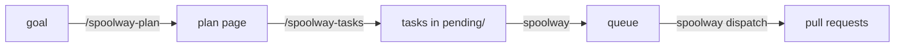
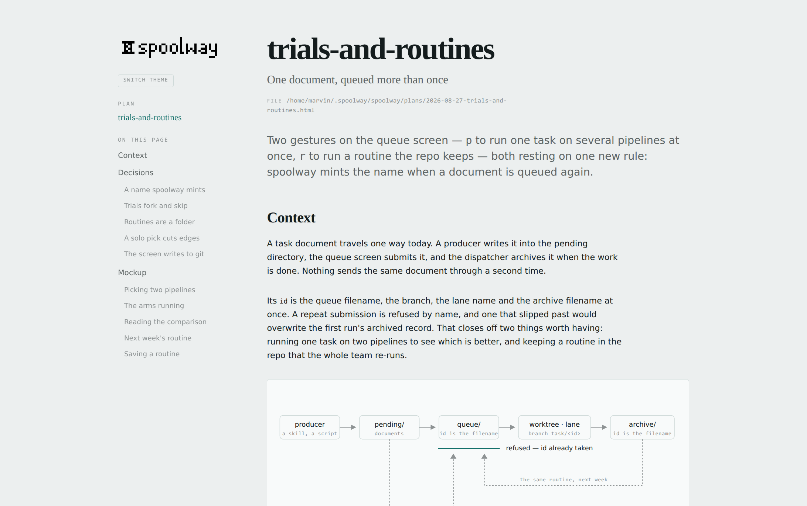

# Planning

A plan is a group of related tasks. All of them are queued from one branch, and each task
depends on the one before it. This page covers writing a plan, cutting it into tasks, queueing
them, and finishing the plan.


```mermaid
flowchart LR
  A[goal] -->|/spoolway-plan| B[plan page]
  B -->|/spoolway-tasks| C[tasks in pending/]
  C -->|spoolway| D[queue]
  D -->|spoolway dispatch| E[pull requests]
```

## Why a plan is a branch

Each task's `base:` is the branch the plan lands in, such as `main` or a release branch.
`/spoolway-tasks` writes it for you, from `spoolway task contract`'s own `base`: the branch
your checkout has out. It stops instead of guessing when that checkout is detached.

A chain's base can also be set with a note on the split ballot's answer, such as `1 from #412`
or `cart-empty from main`: a branch is taken as written, and a pull request number resolves to
that pull request's own branch. A task can still name its own `base:` by hand, or the whole
submission can share one with `spoolway queue add --base`.

Several plans can be queued from one checkout. They all share one queue and one dispatcher.

## Two skills, cut at approval

`/spoolway-plan` talks the goal through with you and writes a plan page. It names no task and
no pipeline. When you approve the shape, it calls `/spoolway-tasks`.

`/spoolway-tasks` cuts the shape into tasks. It picks a pipeline per task, sizes each
task, chooses ids, and writes the dependency order. You can also run it directly when the
shape is already agreed.

When the goal names an issue, both skills read it with `spoolway issue show <ref>`. The issue's
URL goes into each task's `source:`.

Both skills are optional. The queue screen reads tasks, so any script or tool that
writes a task into the pending directory works too.

## The plan file



The plan page is one self-contained HTML file. A person reads it once to approve the shape.
The binary never reads it. It lives outside the checkout, at
`~/.spoolway/<project>/plans/<YYYY-MM-DD>-<slug>.html`.

Every page has four sections in this order: Intend, Context, Decisions and Mockup. The
template is `assets/skills/claude/spoolway-plan/assets/template.html`.

The page also carries a machine copy of its own words, in a `<script type="text/markdown"
id="plan">` block at the foot of the page that a browser never shows. `/spoolway-plan` writes
that block; `/spoolway-tasks` reads it instead of the page around it.

## Writing a good breakdown

`/spoolway-tasks` applies these rules. They apply whether or not you use the skill.

| Rule | What it means |
|---|---|
| Size for a lane | A task is what one agent in a fresh worktree can finish. `spoolway task contract` prints the project's sizing guidance. Keep each task's criteria under five bullets. |
| Checkable criteria | Write `GET /health returns 200`, not `works well`. The review step judges against these. |
| Non-goals | Name the tempting wrong thing next door: the refactor, the extra endpoint, the framework swap. |
| Reference paths | Point at files and examples. Do not paste prose that will go stale. |
| Mockups from real output | Draw a panel from a real screenshot or real command output. A panel for something that does not exist yet names the bound it was drawn to. |
| Link a mockup, never redraw it | A task's `## Mockup` links each plan step and decision record it builds, by id. A source file from outside the project home is copied into `~/.spoolway/<project>/plans/<group>/` first, and the task links the copy. |
| Pipeline per task | A bug wants `bugfix`, a feature wants `default`. `spoolway pipeline show` prints each pipeline's description. |
| Independent, or ordered | Judge from what each task changes whether two tasks may run side by side. A shared file alone is no reason to chain them. Tasks that do run side by side are both marked `parallel: true`. |

## Queueing a plan

`/spoolway-tasks` writes each task as its own file into
`~/.spoolway/<project>/pending/<task-id>.md`. Every task names the same `group:`. It then
runs `spoolway task contract --from` over the directory to check the set.


Bare `spoolway` opens the screen, on the queue tab. The left pane lists one row per group in the
pending directory. The right pane lists the highlighted group's tasks and what each waits on.

| Key | What it does |
|---|---|
| `tab` | Switch focus between the groups and tasks panes. |
| `esc` | With the tasks pane focused, return focus to the groups pane. |
| `space` | Select a group. |
| `enter` | Check the selection and queue it. |
| `g` | With the tasks pane focused, set or clear a gate on the highlighted task. |
| `o` | With the tasks pane focused, open the highlighted task in your editor. |
| `f` | Filter the group list. `enter` keeps the filter, `esc` clears it. |
| `t` | Fork the group as a trial. See [Trials](#trials). |
| `s` | Save the highlighted group as a routine. See [Routines](#routines). |
| `h` | Show or hide done groups. A queued group never appears. |
| `ctrl-c` | Leave the screen. |

Queueing deletes the group's pending tasks from the pending directory. A sibling task
already in the queue or the archive is left exactly where it is. A
group with a validation error is refused and nothing is deleted. If a dispatcher already holds
the queue, that dispatcher picks the tasks up on its next pass.

`spoolway queue add --from <dir>` queues every task in a directory without the screen. A
task under this project's own pending directory is deleted once the batch is written. A
task anywhere else is left alone.

One more command:

```
spoolway group list         # every group with open tasks, and which tasks are open
```

### Trials

A trial runs one group under several pipelines to compare them. Press `t` on a group.

1. The first screen assigns a pipeline to each task. `←` and `→` cycle through the project's
   pipelines. `enter` continues.
2. The second screen lists each task's steps. `space` ticks a step to skip. `esc` goes back.
   `enter` runs the trial.

Each task becomes one arm, queued under its assigned pipeline, with a minted id such as
`<id>-1`. All arms share one trial id. The source tasks stay in the pending directory.

An arm never pushes a branch or opens a pull request. Compare the arms with
`spoolway eval --by task --trial <id>`. When the last arm finishes, every arm's copy is removed.
Only the source group and the ledger rows remain. `spoolway eval --discard <id>` removes a
trial early. See [Trial arms](dispatcher.md#trial-arms).

### Routines

A routine is one folder directly under `.spoolway/routines/`, tracked in git. A task in a
subfolder still belongs to the routine above it: it shows and queues with that routine.
Nothing creates the directory for you.

Bare `spoolway` has a routines tab, between the queue and jobs tabs. Its left pane lists one
row per routine, and its right pane lists the highlighted routine's tasks.

| Key | What it does |
|---|---|
| `space` | Over the list, tick a routine. Over a single task on the right, queue that one task alone. |
| `enter` | Queue every task under every ticked routine as one batch. |
| `x` | Over the list, delete the highlighted routine and every job that points into it, after a popup. |
| `tab` | Switch focus between the routine list and the tasks pane. |
| `o` | Over the tasks pane, open the highlighted task in your editor. |
| `esc` | Over the tasks pane, return focus to the list. Over the list, do nothing. |

The tab reads the routine folders again each time you switch to it, so a routine saved with `s`
a moment ago is already listed. It starts each visit fresh, with nothing ticked.

Every queued copy gets a fresh id, so a routine can run again. A `depends_on` on a sibling in
the same batch is rewritten to the sibling's new id. The saved files are never changed.

Press `s` on a pending group to save it as a routine. The panel is prefilled with the group's
name, and `enter` copies the tasks into `.spoolway/routines/<name>/`. Keys from an earlier
run are removed on the way. A folder that already holds tasks is refused.

Press `x` on a routine to delete it. The popup names the routine, its task count, and every
job whose routine path is that folder or a task inside it. Each job is listed beside its
store, `user` or `project`. `enter` deletes those jobs first, then the folder. `esc` keeps
everything. The folder leaves disk without touching git, so only git can bring it back. A job
store that will not read refuses the delete before anything is removed, naming the store and
`spoolway doctor`.

A job queues a routine on a cron schedule. See [Jobs](jobs.md).

## Closing a plan out

spoolway does not prescribe how a finished task is published. The optional [`spoolway
stack`](pipelines.md#spoolway-stack) command can open one GitHub pull request per task without
using a model, but where or whether a pipeline calls it is up to you.

A command step with `last:` runs once for the chain. See
[`last:`](pipelines.md#last--a-step-the-chain-runs-once).

## Why a plan is a chain

A dependent task's worktree is cut from its dependency's branch. That is what makes a stack of
pull requests possible.

| Shape | Result |
|---|---|
| Chain: each task depends on the one before | A stack of pull requests. |
| Fan: no dependencies | One flat pull request per task. Mark the tasks `parallel: true`. |
| Join: one task depends on two | Broken. The task is based on one parent only and ships without the other's work. |

`/spoolway-tasks` checks the chain when it writes the tasks. The binary does not check it
again, so a task file edited afterwards can break the shape.
