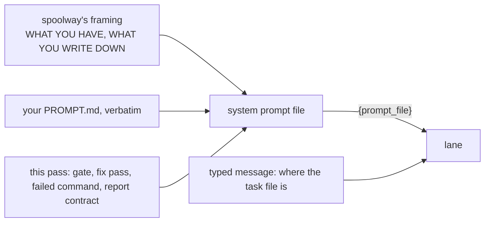

# Prompts

A prompt is the Markdown file a step runs its lane with. spoolway has no built-in roles. A
step names a file, the file is prose. Adding a role is two things: the prompt and the step
that runs it.

## Where a prompt lives

A prompt is a directory under `.spoolway/prompts/` holding a `PROMPT.md`, plus any assets the
role uses. A step's `prompt:` names it and defaults to the step's own id. A step with
`id: review` and no `prompt:` runs `.spoolway/prompts/review/PROMPT.md`.

## A prompt is prose, and nothing else

spoolway never parses a prompt. There is no format and no generated region:

```markdown
You review one task's diff and deliver a verdict. You do not fix anything.

## What you are looking at
...
## How to do it here
...
## Never
...
```

Edit the shipped prompts in place. `spoolway update` never touches a prompt. To take a shipped
prompt back, run `spoolway update --replace .spoolway/prompts/<name>/PROMPT.md`.

## A prompt is a section of the system prompt, not the whole of it

A lane is sent two things.



The system prompt is composed at launch and written to
`~/.spoolway/<project>/system-prompts/<task> · <step>.md`. The typed message is one
sentence naming the task file. The file in `.spoolway/prompts/` is never changed.

Paragraphs sent only when they apply:

| Paragraph | Sent when |
|---|---|
| The previous step failed the task back. Work from its `## Handoff`. | the previous step routes `on_fail` here |
| A person reads this pane after the report. Leave anything viewable running. | the step has `gate:` or the task's `gate_at:` names it |
| A command step failed into this one, and where its log is. | the previous step is a command step whose `on_fail` is here |
| The task blocked and nobody is coming. Clear the obstacle. | the lane runs in an [unattended run](pipelines.md#unattended-runs) |
| `spoolway queue list`, `spoolway queue show`, `spoolway lane` and `spoolway resume`. | the step is `blocked` |

`WHAT YOU HAVE` lists the lane's diff command, log command, scratch path, and what its branch
sits on. `WHAT YOU WRITE DOWN` lists the task-file headings spoolway appends to: `Status Log`,
`Handoff`, `Blocker`. Their wording is fixed and built into spoolway. See
[Tasks and the queue](tasks.md#the-body-is-the-projects).

## What every lane is told about spoolway

The system prompt opens with the step and the task, then five rules:

- One step's worth of the job. Other steps and other tasks are somebody else's.
- Not a conversation. Nobody reads the pane unless the step is gated.
- Nothing will wake you. Poll inside the turn for anything you wait on.
- Reporting is the only exit. A turn ended any other way stalls the task.
- Commit as you go. Uncommitted work is committed for you when the lane reports.

A `blocked` step gets a different opening and a `READING THE RUN` block naming
`spoolway queue list`, `spoolway queue show`, `spoolway lane` and `spoolway resume`.

A report can leave a note for the next step with `--handoff "<text>"`. It is written into the
task file's `## Handoff` and can be repeated.

## What a lane is handed

The binary prints the contract:

```
spoolway prompt contract --pipeline impl    # impl's first agent step
spoolway prompt contract --pipeline impl --step review   # one step
spoolway prompt contract --task login       # rendered against a real queued task
```

It prints seven sections:

| # | Section | What it shows |
|---|---|---|
| 1 | Where the prompt goes | The file path and the flag it reaches the agent through |
| 2 | The system prompt | The whole composed prompt |
| 3 | The message typed into its pane | One sentence naming the task file, after any `skills:` invocations |
| 4 | The environment every lane has | The table below |
| 5 | What a lane may reach | Whatever the person running the dispatcher can |
| 6 | How a lane finishes | The forms this step may use, and where each one routes. `--fail` is left out when it would route where `--block` already does. On `blocked`: `--pass` and `--pause`. A form left out is named under a refusal, so the lane knows it exists and may not use it |
| 7 | The shape to write | The headings below, then what a prompt may never restate, the ban on examples, and the ban on sentences defending a rule |

| Variable | What it is |
|---|---|
| `SPOOLWAY_TASK` | The task's id |
| `SPOOLWAY_TASK_FILE` | The task file's path |
| `SPOOLWAY_REPO` | The project root |
| `SPOOLWAY_STEP` | The step's id. A prompt should not branch on it. |
| `SPOOLWAY_WORKTREE` | The lane's worktree, already the working directory |
| `SPOOLWAY_SCRATCH` | Writable space outside the worktree, one per task, removed when the task is archived |

## The sample workflow's cast

Five prompts ship. None of them is named in the binary.

| Prompt | Role |
|---|---|
| `implementer` | Implements one task in one worktree, then stops. Treats a task's `## Mockup` as the specification. |
| `reviewer` | Reviews one task's diff and gives a verdict. Fixes nothing. |
| `reproducer` | Writes a failing repro for a bug and runs it. The bugfix pipeline runs it before and after the fix. |
| `archivist` | Updates the domain documents for its own task's diff. |
| `unblocker` | Staffs `blocked` in an unattended run. Clears the obstacle or pauses the task for a person. See [Staffing `blocked`](pipelines.md#staffing-blocked). |

## Writing your own

Write `.spoolway/prompts/auditor/PROMPT.md`. Nothing registers it; the step naming it is the
only reference. Use this shape:

```markdown
# auditor

## What you are looking at
## How to do it here
## Never
```

Headings and bullets a small local model can skim. One default per choice. Write only what
the model does not already know. `spoolway prompt show implementer` shows the house style.

Then add the step:

```yaml
  - id: audit
    agent: claude
    prompt: auditor
    on_pass: document
    on_fail: implement
```

The step says where the role sits. The prompt says what the role does.

```
spoolway pipeline check             # reads every prompt against the steps that run it
```

It refuses a prompt that names a `spoolway` command or flag this release does not have. It
warns, without refusing, on a prompt that names `spoolway report` or one of its flags — the
report contract spoolway already injects at launch.

The `spoolway-config` skill writes the prompt and the step together. To turn a whole workflow
into steps and prompts, see
[Converting a workflow you already run](pipelines.md#converting-a-workflow-you-already-run).

## Reading what you have

```
spoolway prompt list          # each prompt, and which steps run it
spoolway prompt show <name>   # one file
```
