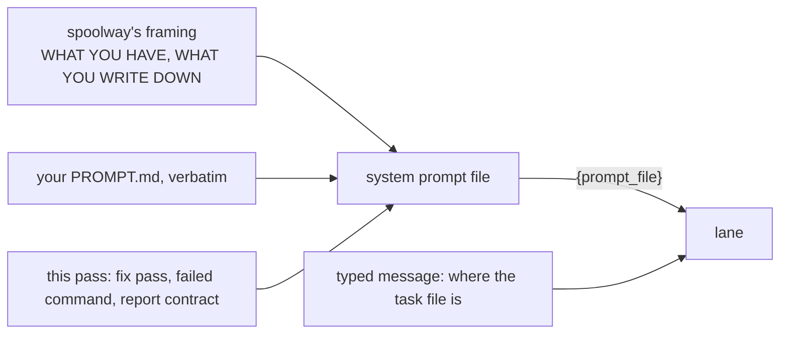

# Prompts

A prompt is the Markdown file a step runs its lane with. spoolway has no built-in roles. A
step names a file, the file is prose. Adding a role is two things: the prompt and the step
that runs it.

## Where a prompt lives

A prompt is a directory under `.spoolway/prompts/` holding a `PROMPT.md`, plus any assets the
role uses. A step's `prompt:` names it and defaults to the step's own id. A step with
`id: review` and no `prompt:` runs `.spoolway/prompts/review/PROMPT.md`.

### Private prompts

A private prompt lives at `local/prompts/<name>/PROMPT.md`, under the project's own home
rather than the checkout, in the same directory shape as a tracked prompt. See [Private
pipelines](pipelines.md#private-pipelines). It answers only when the tracked prompt of that
name is absent, only in repo mode, only when `<name>` is one plain name with no `/`, and only
in the directory shape above: a flat `local/prompts/<name>.md` is not read.

A private prompt whose name matches a tracked one is refused, naming both: the private file,
and the tracked one in whichever shape actually exists, the directory `<name>/PROMPT.md` or
the flat `<name>.md`.

A private pipeline's step whose prompt is in neither layer is told so by both files at once,
the tracked `.spoolway/prompts/<name>/PROMPT.md` and the private `local/prompts/<name>/PROMPT.md`.
The message adds that the private layer never reads a flat `local/prompts/<name>.md`.

`spoolway prompt list` and `spoolway prompt override` find a private prompt the same way
`spoolway prompt show` does. `prompt list` marks its row `private`. `prompt override` forks it
into the overrides layer, but the fork only starts applying once the pipeline that runs it is
promoted, since an override patches a tracked file and a private prompt is not one. See [The
overrides layer](configuration.md#the-overrides-layer).

### A missing prompt

`spoolway doctor`, `spoolway pipeline check`, `spoolway prompt contract` and the lane launch all
report a step whose prompt file is missing. The advice depends on the prompt's name.

| The prompt | The advice |
|---|---|
| One of the five that `spoolway init` ships | Run `spoolway init`. |
| Any other, such as one named by `unattended.blocked_prompt` | `init` does not ship it, so write it yourself at a path the message names. |

## A prompt is prose, and nothing else

spoolway never parses a prompt. There is no format and no generated region:

```markdown
# Reviewer

Review one task's diff against its acceptance criteria. Fix nothing.
Done: a verdict, with every problem as its own finding.

## Domain knowledge
...

## Never
...
```

Edit the shipped prompts in place. `spoolway sync` never touches a prompt. To take a shipped
prompt back, run `spoolway sync --replace .spoolway/prompts/<name>/PROMPT.md`.

## A prompt is a section of the system prompt, not the whole of it

A lane is sent two things.


```mermaid
flowchart LR
  A[spoolway's framing<br>WHAT YOU HAVE, WHAT YOU WRITE DOWN] --> S[system prompt file]
  B[your PROMPT.md, verbatim] --> S
  C[this pass: fix pass, failed command, report contract] --> S
  S -->|"{prompt_file}"| L[lane]
  M[typed message: where the task file is] --> L
```

The system prompt is composed at launch and written to
`~/.spoolway/<project>/system-prompts/<task> · <step>.md`. The typed message is one
sentence naming the task file. The file in `.spoolway/prompts/` is never changed.

Paragraphs sent only when they apply:

| Paragraph | Sent when |
|---|---|
| The previous step failed the task back. Work from its `## Handoff`. | the previous step routes `on_fail` here |
| A command step failed into this one, and where its log is. | the previous step is a command step whose `on_fail` is here |
| The task blocked and nobody is coming. Clear the obstacle. | the lane runs in an [unattended run](pipelines.md#unattended-runs) |
| `spoolway queue list`, `spoolway queue show`, `spoolway lane`, `spoolway prompt show <name>` and `spoolway resume`. | the step is `blocked` |
| Which step this pass stands in for, that step's own `description:` when it has one, and where to read its craft: `spoolway prompt show <name>` for an agent step, the command line itself for a command step. For an agent step, also the ready `spoolway report --pass --stage <step>` command that runs that step again, for a lane that only cleared the cause. A command step gets no such command, because a plain pass already runs it again. | the step is `blocked`, rendered against a real task whose `blocked_from` names a step this pipeline still has |

`WHAT YOU HAVE` lists the lane's diff command, log command, scratch path, and what its branch
sits on. `WHAT YOU WRITE DOWN` lists the task-file headings spoolway appends to: `Status Log`,
`Handoff`, `Blocker`. Their wording is fixed and built into spoolway. See
[Tasks and the queue](tasks.md#the-body-is-the-projects).

## What every lane is told about spoolway

The system prompt opens with the step and the task, then nine rules:

- One step's worth of the job, and nothing enforces it. The role below is the whole of what is
  the lane's. Steps split the work for a reason; the lane does not do another step's on its own.
- The lane's output is not read. Only what it writes to the task file reaches anyone. It asks
  nothing unless told to.
- Nothing will wake you. Poll anything you wait on.
- Reporting is the only exit. A turn ended any other way stalls the task.
- Commit as you go. Uncommitted work is committed for you when the lane reports.
- `spoolway queue route <task>` shows every step the task runs, what each does, and where resuming sends the
  task. The lane reads it before it tells a person what happens next.
- If a person talks to the lane in its pane, it does what they ask, whichever step's work it
  is. It writes every change they ask for into the task file, so later steps see it:
  `spoolway task edit <task> --section <heading> --from -` while the task is held on `paused`
  or `blocked`, `--handoff` while it runs.
- Resuming a held task stays the person's. Once their request is done, the lane tells them
  where resuming sends it, and to resume it on the board.
- What a person has to do, name on the board, never as a `spoolway` command. To send the task
  to another step than resuming would, the lane tells them to press `r` on its row and pick the
  step.

A `blocked` step gets a different first rule — its remit is the run, not one task's step, and it
lacks the "another step's" sentence — and a `READING THE RUN` block naming
`spoolway queue list`, `spoolway queue show`, `spoolway lane`, `spoolway prompt show <name>` and
`spoolway resume`.

A prompt does not repeat or contradict these rules. Compare a new prompt with
`spoolway prompt contract` and cut any overlap.

A report can leave a note for the next step with `--handoff "<text>"`. It is written into the
task file's `## Handoff` and can be repeated.

## What a lane is handed

The binary prints the contract:

```
spoolway prompt contract --pipeline impl    # impl's first agent step
spoolway prompt contract --pipeline impl --step review   # one step
spoolway prompt contract --task login       # rendered against a real queued task
```

It prints seven sections:

| # | Section | What it shows |
|---|---|---|
| 1 | Where the prompt goes | The file path and the flag it reaches the agent through |
| 2 | The system prompt | The whole composed prompt |
| 3 | The message typed into its pane | Eight states: `opening`, `restart` and six more. Each shows one sentence naming the task file. `restart` adds a paragraph saying an earlier attempt's changes are still in the worktree. A step with `skills:` shows one message per skill first, then that briefing, each labelled `message N of M`, for `opening` and `restart` alike |
| 4 | The environment every lane has, and never reads | The table below, with a note that these variables are set for the lane's own tooling and that a prompt naming one only runs under spoolway. A closing note says what a role needs is in the task file whose path section 3 names |
| 5 | What a lane may reach | Whatever the person running the dispatcher can |
| 6 | How a lane finishes | The forms this step may use, each with a sentence saying what reporting it claims. `--fail` is left out when it would route where `--block` already does. On `blocked`: `--pass`, `--pass --stage <step>` and `--pause`. Off `blocked`, a step that leaves out `--fail` prints no refusal for it — `commands::report` already refuses `--stage` by name on every other step, so `blocked`'s own forms are what teach a lane the flag exists. A step with nothing left to withhold prints no "not available to you" block at all. A step held in front of a person adds one line saying so: a step's own `gate:` holds a pass, for whoever opens the pane; a task's own `gate_at:` holds the report whatever it is. On `blocked`, that line and the `--stage` form's own "never one past `<step>`" clause both ask the step this pass stands in for, never `blocked` itself, which no pipeline may gate |
| 7 | The shape to write | The headings below, then what a prompt may never restate, the ban on examples, and the ban on sentences defending a rule |

| Variable | What it is |
|---|---|
| `SPOOLWAY_TASK` | The task's id |
| `SPOOLWAY_TASK_FILE` | The task file's path |
| `SPOOLWAY_REPO` | The project root |
| `SPOOLWAY_STEP` | The step's id. A prompt should not branch on it. |
| `SPOOLWAY_WORKTREE` | The lane's worktree, already the working directory |
| `SPOOLWAY_SCRATCH` | Writable space outside the worktree, one per task, removed when the task is archived |

## The sample workflow's cast

Five prompts ship. None of them is named in the binary.

| Prompt | Role |
|---|---|
| `implementer` | Implements one task in one worktree, then stops. Treats a task's `## Mockup` as the specification. |
| `reviewer` | Reviews one task's diff and gives a verdict. Fixes nothing. |
| `reproducer` | Writes a failing repro for a bug and runs it. The bugfix pipeline runs it before and after the fix. |
| `archivist` | Updates the domain documents for its own task's diff. |
| `unblocker` | Staffs `blocked` in an unattended run. Clears the obstacle or pauses the task for a person. See [Staffing `blocked`](pipelines.md#staffing-blocked). |

## Writing your own

Write `.spoolway/prompts/auditor/PROMPT.md`. Nothing registers it; the step naming it is the
only reference. Use this shape:

```markdown
# auditor

<the job and when it is done, 1–3 lines>

## Domain knowledge
- <a fact the model cannot know: a path, a convention, a trap>

## Never
- <a guardrail; none is fine>
```

Bullets, not paragraphs. Facts, not narration. No jargon, and no procedure any capable model
follows unasked. Knowledge two prompts share belongs in a skill, reached through the step's
`skills:`. `spoolway prompt show implementer` shows the house style.

Then add the step:

```yaml
  - id: audit
    agent: claude
    prompt: auditor
    on_pass: document
    on_fail: implement
```

The step says where the role sits. The prompt says what the role does.

```
spoolway pipeline check             # reads every prompt against the steps that run it
```

It refuses a prompt that names a `spoolway` command or flag this release does not have. It
warns, without refusing, on a prompt that names `spoolway report` or one of its flags — the
report contract spoolway already injects at launch.

The `spoolway-config` skill writes the prompt and the step together. To turn a whole workflow
into steps and prompts, see
[Converting a workflow you already run](pipelines.md#converting-a-workflow-you-already-run).

## Reading what you have

```
spoolway prompt list          # each prompt, and which steps run it
spoolway prompt show <name>   # one file
```
