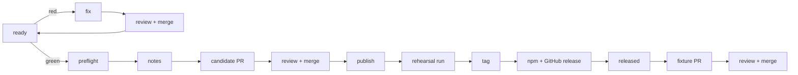

# Releasing spoolway

A release is a `v*` tag. The `release` pipeline cuts it unattended. Queue the routine and it
does the rest: repair `main`, review and merge every pull request it creates, write the release
record, publish, verify the public artifacts, and land the upgrade fixture.



| Step | What it does |
|---|---|
| `ready` | Runs the whole local gate and a fresh nightly CI run on the candidate. Verifies only — it never edits. |
| `fix` | Repairs a release blocker in one pull request and drives its checks green. Product code included. |
| `merge-fix` | Independently reviews the repair, corrects the same branch if needed, and squash-merges it. |
| `preflight` | Checks `main` is clean and green. Lists every change since the last tag. Proposes the version. |
| `notes` | Writes and validates the one changelog section used by the binary and release page. |
| `candidate` | Builds the exact four-file release commit and opens its pull request. |
| `merge-release` | Reviews that exact commit and rebase-merges it without changing the recorded candidate. |
| `publish` | Rehearses the landed release commit, tags it, and checks what npm and GitHub received. |
| `released` | `scripts/release-verify.sh`. Proves the tag, the six packages, the archives and the published body exist. A command step, so nothing can be credited with it — see below. |
| `fixture` | `scripts/release-fixture.sh`. Scaffolds the released version's upgrade fixture from its own tag and opens its pull request. |
| `merge-fixture` | Reviews and squash-merges that generated fixture before the task can finish. |

`main` is protected and every pull request is gated on `ci`. Producer lanes never merge their own
work. A separate landing lane reads the complete diff and required checks, corrects findings on the
same branch, and merges only the reviewed head. A repair then returns to `ready`, because changing
`main` invalidates the earlier exact-SHA proof. Failures in the post-publication verifier or fixture
script use the same repair-review-merge loop and retry the command that found them.

`released` is not ceremony. `publish` is an agent step, and a `--pass` out of `blocked` carries
the task one step *past* it — so a release could reach `done` with nothing published if
`publish` were the last word. A command step is never carried past, so `released` is what makes
`done` mean released.

## Cutting a release

1. Open `spoolway queue`, press `r`, and queue `release-spoolway`.
2. Wait for `done`. The task reports the tag, the workflow runs, the registry versions and the
   result of a real install.

The routine is `.spoolway/routines/release-spoolway/release-spoolway.md`. The prompts are
`.spoolway/prompts/release-*/PROMPT.md`. The workflow is `.github/workflows/release.yml`.

## What ships

- Five platform binaries, packed into five npm platform packages plus the `spoolway` wrapper.
- A GitHub release with five archives and `SHA256SUMS`.
- The changelog section, as the release body and inside every binary (`spoolway whats-new`).

`Cargo.toml` is the only version source. `CHANGELOG.md` holds one section per version and its
contract is written at the top of the file.

## Version rule

While the major version is `0`: a change in user-facing shape bumps minor. Fixes and internal
changes alone bump patch.

## Commands the pipeline runs

Local gate, in this order:

```sh
cargo fmt --check
cargo deny check advisories
cargo clippy --all-targets --locked -- -D warnings
cargo test --all-targets --locked
cargo build --release --locked
./target/release/spoolway pipeline check
```

Release commit. Only `Cargo.toml`, `Cargo.lock`, `CHANGELOG.md` and `herdr-plugin.toml`
change, with subject `chore(release): v<version>`. `herdr-plugin.toml` carries its own
`version` and is not stamped at build time, so it is bumped by hand with `Cargo.toml`:
`verify.yml`'s `test` job fails the release rehearsal when the two disagree, and
`scripts/fetch-or-build.sh` reads that `version` to pick the release tag it downloads.

```sh
cargo check --offline                              # refreshes the lock entry
cargo test --locked release_notes::tests
cargo build --release --locked && ./target/release/spoolway whats-new
```

Landing it. `main` is protected and takes no direct push: the required `verify / test`
and `verify / audit` contexts are only ever recorded against a check suite whose head
branch is `main`, and `ci.yml` has no push trigger, so a commit that is not yet on
`main` can never have one. `enforce_admins` is on, so this holds for a person too. The
release commit lands the way every other change does, through a pull request:

```sh
git push origin HEAD:release/v<version>
gh pr create --base main --head release/v<version> --fill
gh pr checks <number> --watch
gh pr merge <number> --rebase
```

The candidate producer stops at the pull request. A separate merge lane performs the final review,
requires fresh protected checks, and runs the merge. It then **reads the landed SHA off
`origin/main`** and records that as the release SHA; no pre-merge object is tagged.

Rehearsal, on the release commit, with publication off:

```sh
gh workflow run release.yml --ref main -f publish=false
gh run list --workflow release.yml --event workflow_dispatch --branch main --commit <release-sha>
gh run view <run-id> --json event,headSha,status,conclusion,jobs
gh run watch <run-id>
```

Tag, only after the rehearsal is green on that exact SHA:

```sh
git tag v<version> <release-sha>
git push origin refs/tags/v<version>
```

Verify:

```sh
npm view <package>@<version> version               # each name in npm/targets.json, plus spoolway
gh release view v<version> --json body --jq .body   # must equal the approved section
cd "$(mktemp -d)" && npm install spoolway@<version> && ./node_modules/.bin/spoolway --version
```

## The fixture the nightly suite asks for

`scripts/e2e/suites/upgrade.sh` runs a project a *past* release actually wrote through the
new binary, from `scripts/e2e/fixtures/<version>/.spoolway/` — a tree scaffolded by that
version's own binary, at that version's own tag. It cannot be produced before the tag, so a
`CHANGELOG.md` section is asked for its fixture only once `origin` carries its `v<version>`
tag *and* `Cargo.toml` has moved past it. A release is therefore never blocked by its own
missing fixture — not while it is being cut, and not when the release workflow runs the suite
again from the tag it has just pushed — and the first bump past a released version turns the
exemption into a failing check.

The `fixture` step does this, straight after `released`. It builds the binary at the tag just
pushed, scaffolds a throwaway project with it, sets `housekeeping.retention_days`, hand-adds the
one line of prose below the pipeline file's generated key block, and opens a pull request. The
following merge lane reviews and lands it. The script is idempotent, so a fixture already on `main`
costs it one lookup.

It is a pipeline step rather than a line in this runbook because it was a line in this runbook
and that did not hold: 0.4.0 was tagged and published without one, nothing asked until
`Cargo.toml` moved past 0.4.0, and main's daily dress rehearsal then failed for two days reading
like a regression. The gap is structural — the fixture is impossible to make before the tag and
not demanded until the next bump — so the only place it can be caught is the release that owes
it.

To scaffold one by hand — an older release that was missed, or a `fixture` step that blocked:

```sh
npx spoolway@<version> init                        # in a scratch git repo
npx spoolway@<version> config set housekeeping.retention_days 45
```

Copy that `.spoolway/` to `scripts/e2e/fixtures/<version>/`, hand-add one line of prose below
the pipeline file's generated key block, and commit it. The suite's own header says what each
part is for. The published binary and one built from the tag scaffold the same tree, so either
will do.

## When it fails

- A red rehearsal leaves an untagged candidate. Fix the cause, then rehearse again. A product
  change needs a fresh readiness, preflight and notes pass.
- If `main` moves before the tag, the publisher removes or reverts its release commit and the
  task goes back to `preflight`.
- A partial publish is retried with `gh run rerun <run-id> --failed`. Published npm versions
  are never replaced. A successful release tag is never moved.
