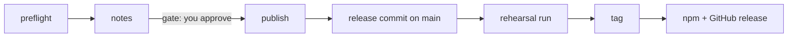

# Releasing spoolway

A release is a `v*` tag. The `release` pipeline cuts it. Queue the routine, approve the
release notes at the gate, and the pipeline does the rest.



| Step | What it does |
|---|---|
| `preflight` | Checks `main` is clean and green. Lists every change since the last tag. Proposes the version. |
| `notes` | Writes one changelog section. Stops at a gate until you approve it. |
| `publish` | Commits the version bump and the section, rehearses the workflow, tags, and checks what npm and GitHub received. |

## Cutting a release

1. Open `spoolway queue`, press `r`, and queue `release-spoolway`.
2. When the task pauses at `notes`, read the section and approve it or send it back.
3. Wait for `done`. The task reports the tag, the workflow runs, the registry versions and the
   result of a real install.

The routine is `.spoolway/routines/release-spoolway/release-spoolway.md`. The prompts are
`.spoolway/prompts/release-*/PROMPT.md`. The workflow is `.github/workflows/release.yml`.

## What ships

- Six platform binaries, packed into six npm platform packages plus the `spoolway` wrapper.
- A GitHub release with six archives and `SHA256SUMS`.
- The changelog section, as the release body and inside every binary (`spoolway whats-new`).

`Cargo.toml` is the only version source. `CHANGELOG.md` holds one section per version and its
contract is written at the top of the file.

## Version rule

While the major version is `0`: a change in user-facing shape bumps minor. Fixes and internal
changes alone bump patch.

## Commands the pipeline runs

Local gate, in this order:

```sh
cargo fmt --check
cargo deny check advisories
cargo clippy --all-targets --locked -- -D warnings
cargo test --all-targets --locked
cargo check --target x86_64-pc-windows-gnu --all-targets --locked
cargo build --release --locked
./target/release/spoolway pipeline check
```

Release commit. Only `Cargo.toml`, `Cargo.lock` and `CHANGELOG.md` change, with subject
`chore(release): v<version>`:

```sh
cargo check --offline                              # refreshes the lock entry
cargo test --locked release_notes::tests
cargo build --release --locked && ./target/release/spoolway whats-new
git push origin main
```

Rehearsal, on the release commit, with publication off:

```sh
gh workflow run release.yml --ref main -f publish=false
gh run list --workflow release.yml --event workflow_dispatch --branch main --commit <release-sha>
gh run view <run-id> --json event,headSha,status,conclusion,jobs
gh run watch <run-id>
```

Tag, only after the rehearsal is green on that exact SHA:

```sh
git tag v<version> <release-sha>
git push origin refs/tags/v<version>
```

Verify:

```sh
npm view <package>@<version> version               # each name in npm/targets.json, plus spoolway
gh release view v<version> --json body --jq .body   # must equal the approved section
cd "$(mktemp -d)" && npm install spoolway@<version> && ./node_modules/.bin/spoolway --version
```

## When it fails

- A red rehearsal leaves an untagged candidate. Fix the cause, then rehearse again. A product
  change needs a new preflight and a new approval.
- If `main` moves before the tag, the publisher removes or reverts its release commit and the
  task goes back to `preflight`.
- A partial publish is retried with `gh run rerun <run-id> --failed`. Published npm versions
  are never replaced. A successful release tag is never moved.
