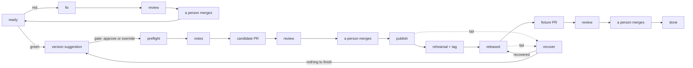

# Releasing spoolway

A release is a `v*` tag. The `release` pipeline asks a person to choose the version, then does the
rest by itself except for merging: repair `main`, review every pull request it opens, wait for a
person to merge each one on GitHub, publish, verify the public artifacts, and land the upgrade
fixture.


```mermaid
flowchart LR
  R[ready] -->|red| X[fix] --> M[review] --> W1[a person merges] --> R
  R -->|green| S[version suggestion] -->|gate: approve or override| A[preflight] --> B[notes]
  B --> C[candidate PR] --> N[review] --> W2[a person merges] --> P[publish]
  P --> E[rehearsal + tag] --> V[released] --> Z[fixture PR] --> Q[review] --> W3[a person merges] --> D[done]
  P -.->|fail| RC[recover]
  V -.->|fail| RC
  RC -->|recovered| V
  RC -->|nothing to finish| S
```

| Step | What it does |
|---|---|
| `ready` | Runs the whole local gate and a fresh nightly CI run on the candidate. Verifies only — it never edits. |
| `fix` | Repairs a release blocker in one pull request and drives its checks green. Product code included. |
| `review-fix` | Independently reviews the repair, corrects the same branch if needed, and reports the pull request and its merge method for a person. |
| `await-fix` | Waits for a person to merge the repair on GitHub, then returns to `ready`. |
| `version` | Recommends the next version, explains the bump, and waits for a person to approve or override it. |
| `preflight` | Checks `main` is clean and green, accepts the version gate's choice, and validates that exact version. |
| `notes` | Writes and validates the one changelog section used by the binary and release page. |
| `candidate` | Builds the exact four-file release commit and opens its pull request. |
| `review-release` | Independently reviews that exact commit and reports it for a person to merge by rebase. |
| `await-release` | Waits for a person to merge the release candidate, then runs `publish`. |
| `publish` | `scripts/release-publish.sh`. Rehearses the merged release commit, tags it, and checks the tag's own workflow run. A command step, so it never asks auto mode to push a tag. |
| `released` | `scripts/release-verify.sh`. Proves the tag, the six packages, the archives and the published body exist. A command step, so nothing can be credited with it — see below. |
| `recover` | Recovers a failed `publish` or `released`: reverts an untagged release commit, or fixes and waits for a person to merge a repair. |
| `fixture` | `scripts/release-fixture.sh`. Scaffolds the released version's upgrade fixture from its own tag and opens its pull request. |
| `review-fixture` | Independently reviews the generated fixture and reports it for a person to merge by squash. |
| `await-fixture` | Waits for a person to merge the fixture on GitHub. The task finishes once it does. |

`main` is protected and every pull request is gated on `ci`. Producer lanes never merge their own
work, and no lane merges anything either. A `review-*` step reads the complete diff and required
checks, corrects findings on the same branch, and reports the pull request's number, URL and merge
method. A person merges it on GitHub, and the `await-*` step right after waits for that merge
before carrying on. A repair then returns to `ready`, because changing `main` invalidates the
earlier exact-SHA proof. A failure in `publish` or `released` goes to `recover` instead, which
either finishes the recovery itself or returns the task to `version`.

The `version` gate is the one planned human stop the pipeline pauses for. Its lane records a
recommendation in the task, then a resume message either accepts it or names the version to use
instead. Preflight and every later lane treat that choice as final; they may report a mechanically
impossible version, but they do not change its semver class or argue for the earlier recommendation.

`released` is not ceremony. `publish` pushes the tag and watches its own workflow run, and `recover`
can report a recovery finished, but neither's own success is the registry's or the release page's
real state. `released` reads the tag, the packages, the archives and the published body directly,
so `done` means the release is actually public, not merely that a script or a lane said so.

## Cutting a release

1. Open `spoolway queue`, press `r`, and queue `release-spoolway`.
2. When the task pauses after `version`, read its recommendation in the task handoff.
3. Approve it with `spoolway resume <task> -m "Approve X.Y.Z"`, or override it with
   `spoolway resume <task> -m "Use X.Y.Z"`.
4. Merge each pull request the task opens, once its review step reports the pull request's
   number, URL and merge method. The command step right after it waits for that merge and carries
   on by itself.
5. Wait for `done`. The task reports the tag, the workflow runs, the registry versions and the
   result of a real install.

The routine is `.spoolway/routines/release-spoolway/release-spoolway.md`. The prompts are
`.spoolway/prompts/release-*/PROMPT.md`. The workflow is `.github/workflows/release.yml`.

## What ships

- Five platform binaries, packed into five npm platform packages plus the `spoolway` wrapper.
- A GitHub release with five archives and `SHA256SUMS`.
- The changelog section, as the release body and inside every binary (`spoolway whats-new`).

`Cargo.toml` is the only version source. `CHANGELOG.md` holds one section per version and its
contract is written at the top of the file.

## Version rule

While the major version is `0`: a change in user-facing shape bumps minor. Fixes and internal
changes alone bump patch. This controls the pipeline's recommendation; the version named by the
person at the gate is the version every later step uses.

## Commands the pipeline runs

Local gate, in this order:

```sh
cargo fmt --check
cargo deny check advisories
cargo clippy --all-targets --locked -- -D warnings
cargo test --all-targets --locked
cargo build --release --locked
./target/release/spoolway pipeline check
```

Release commit. Only `Cargo.toml`, `Cargo.lock`, `CHANGELOG.md` and `herdr-plugin.toml`
change, with subject `chore(release): v<version>`. `herdr-plugin.toml` carries its own
`version` and is not stamped at build time, so it is bumped by hand with `Cargo.toml`:
`verify.yml`'s `test` job fails the release rehearsal when the two disagree, and
`scripts/fetch-or-build.sh` reads that `version` to pick the release tag it downloads.

```sh
cargo check --offline                              # refreshes the lock entry
cargo test --locked release_notes::tests
cargo build --release --locked && ./target/release/spoolway whats-new
```

Landing it. `main` is protected and takes no direct push: the required `verify / test`
and `verify / audit` contexts are only ever recorded against a check suite whose head
branch is `main`, and `ci.yml` has no push trigger, so a commit that is not yet on
`main` can never have one. `enforce_admins` is on, so this holds for a person too. The
release commit lands the way every other change does, through a pull request:

```sh
git push origin HEAD:release/<task>
gh pr create --base main --head release/<task> --fill
gh pr checks <number> --watch
```

The candidate producer stops at the pull request. `review-release` performs the final review and
requires fresh protected checks, but never merges. A person merges it on GitHub by rebase, so the
single release commit lands directly on the recorded source. `scripts/release-publish.sh` then
**finds that landed commit by its `chore(release): v<version>` subject on `origin/main`**; no
pre-merge object is tagged.

Rehearsal, on the release commit, with publication off:

```sh
gh workflow run release.yml --ref main -f publish=false
gh run list --workflow release.yml --event workflow_dispatch --branch main --commit <release-sha>
gh run view <run-id> --json event,headSha,status,conclusion,jobs
gh run watch <run-id>
```

Tag, only after the rehearsal is green on that exact SHA:

```sh
git tag v<version> <release-sha>
git push origin refs/tags/v<version>
```

Verify:

```sh
npm view <package>@<version> version               # each name in npm/targets.json, plus spoolway
gh release view v<version> --json body --jq .body   # must equal the approved section
cd "$(mktemp -d)" && npm install spoolway@<version> && ./node_modules/.bin/spoolway --version
```

## The fixture the nightly suite asks for

`scripts/e2e/suites/upgrade.sh` runs a project a *past* release actually wrote through the
new binary, from `scripts/e2e/fixtures/<version>/.spoolway/` — a tree scaffolded by that
version's own binary, at that version's own tag. It cannot be produced before the tag, so a
`CHANGELOG.md` section is asked for its fixture only once `origin` carries its `v<version>`
tag *and* `Cargo.toml` has moved past it. A release is therefore never blocked by its own
missing fixture — not while it is being cut, and not when the release workflow runs the suite
again from the tag it has just pushed — and the first bump past a released version turns the
exemption into a failing check.

The `fixture` step does this, straight after `released`. It builds the binary at the tag just
pushed, scaffolds a throwaway project with it, sets `housekeeping.retention_days`, hand-adds the
one line of prose below the pipeline file's generated key block, and opens a pull request from
branch `fixture/<task>`. `review-fixture` reviews it, and a person merges it on GitHub. The script
is idempotent, so a fixture already on `main` costs it one lookup.

It is a pipeline step rather than a line in this runbook because it was a line in this runbook
and that did not hold: 0.4.0 was tagged and published without one, nothing asked until
`Cargo.toml` moved past 0.4.0, and main's daily dress rehearsal then failed for two days reading
like a regression. The gap is structural — the fixture is impossible to make before the tag and
not demanded until the next bump — so the only place it can be caught is the release that owes
it.

To scaffold one by hand — an older release that was missed, or a `fixture` step that blocked:

```sh
npx spoolway@<version> init                        # in a scratch git repo
npx spoolway@<version> config set housekeeping.retention_days 45
```

Copy that `.spoolway/` to `scripts/e2e/fixtures/<version>/`, hand-add one line of prose below
the pipeline file's generated key block, and commit it. The suite's own header says what each
part is for. The published binary and one built from the tag scaffold the same tree, so either
will do.

## When it fails

`publish` and `released` both fail to `recover`, an agent step with three outcomes: pass back to
`released` once the public record is complete and correct, fail to `version` once nothing here can
be finished, or block when only a person can take the next step.

- A red rehearsal, or a failed tag push with nothing yet on `origin`, leaves `main` carrying an
  untagged `chore(release): v<version>` commit. `recover` opens one pull request that reverts it,
  waits for a person to merge that revert, confirms the version files and `CHANGELOG.md` are back
  at the previous release, and fails to `version` with the cause. A product defect needs a fresh
  readiness, version decision, preflight and notes pass; `version` skips straight to `preflight`,
  so `recover` says plainly when the cause is a defect on `main`.
- A partial publish, with `v<version>` already on `origin`, is retried with
  `gh run rerun <run-id> --failed`. Published npm versions are never replaced. If the workflow
  itself needs a code fix, `recover` lands it through a reviewed pull request, waits for a person
  to merge it, and passes back to `released`. If the fix has to move the tag to a different commit,
  `recover` blocks and names the move for a person:

  ```sh
  git tag -f v<version> <corrected-sha>
  git push --force origin refs/tags/v<version>
  ```

- If `main` moves before the tag, `recover` opens one pull request that reverts only the release
  commit, waits for a person to merge it, confirms the version files and `CHANGELOG.md` are back
  at the previous release, and fails to `version` so a fresh candidate is chosen.
