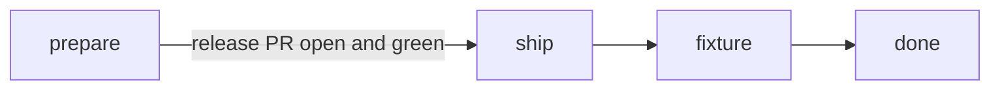

# Releasing spoolway

A release is a `v*` tag. The `release` pipeline runs it end to end in three steps, and nobody has
to approve or merge anything along the way.


```mermaid
flowchart LR
  P[prepare] -->|release PR open and green| S[ship] --> F[fixture] --> D[done]
```

| Step | What it does |
|---|---|
| `prepare` | An agent. It runs the local gate and fixes anything red, walks an upgrade from the last release, refreshes the vendored model price table, picks the version, writes the changelog section, and opens one `release/v<version>` pull request with the release commit last. |
| `ship` | `scripts/release-ship.sh`. Waits for the pull request's checks, rehearses the release workflow on its head, merges it by rebase, tags the release commit, watches the tag's workflow publish it, and runs `scripts/release-verify.sh`. |
| `fixture` | `scripts/release-fixture.sh`. Scaffolds the released version's upgrade fixture from its own tag and opens its pull request with auto-merge on. |

`ship` and `fixture` are command steps on purpose. Claude Code's auto mode refused both the merge
and the tag push when an agent did them, and it never sees a command step.

Both scripts read the version from the release worktree's `Cargo.toml`, so a person can run them
by hand from that worktree. Both are idempotent: a re-run picks up after the last thing that
already happened.

## Cutting a release

1. Open `spoolway`, press `r`, and queue `release-spoolway`. To force a version, name it in the
   task.
2. Wait for `done`.

## What ships

- Five platform binaries, packed into five npm platform packages plus the `spoolway` wrapper.
- A GitHub release with five archives and `SHA256SUMS`.
- The changelog section, as the release body and inside every binary (`spoolway whats-new`).

`Cargo.toml` is the only version source. `CHANGELOG.md` holds one section per version and its
contract is written at the top of the file.

## Version rule

While the major version is `0`, a change in user-facing shape bumps minor. Fixes and internal
changes alone bump patch. A version named in the task wins over the rule.

## Commands

Local gate, in this order:

```sh
cargo fmt --check
cargo deny check advisories
cargo clippy --all-targets --locked -- -D warnings
cargo test --all-targets --locked
cargo build --release --locked
./target/release/spoolway pipeline check
```

The release commit changes only `Cargo.toml`, `Cargo.lock`, `CHANGELOG.md` and
`herdr-plugin.toml`, plus `docs/migrations.md` when the release carries migration work and
`assets/model-prices.json` when the price refresh changed it. Its subject
is `chore(release): v<version>`. `herdr-plugin.toml` carries its own `version`, so it is bumped by
hand with `Cargo.toml`. `verify.yml` fails when the two disagree.

```sh
cargo run --release --quiet -- models refresh --vendor   # refreshes assets/model-prices.json
cargo check --offline                              # refreshes the lock entry
cargo test --locked release_notes::tests
cargo build --release --locked && ./target/release/spoolway whats-new
```

`main` is protected. It takes no direct push, needs `verify / test`, `verify / audit` and
`verify / test-macos` green, and needs a branch to be up to date before it merges. `ship` rebases a branch that fell behind and
waits for its checks again.

The rehearsal and the tag, as `ship` runs them:

```sh
gh workflow run release.yml --ref release/v<version> -f publish=false
gh pr merge <number> --rebase --match-head-commit <rehearsed-sha>
git tag v<version> <release-sha>
git push origin refs/tags/v<version>
```

## The upgrade fixture

`scripts/e2e/suites/upgrade.sh` runs a project a past release actually wrote through the new
binary, from `scripts/e2e/fixtures/<version>/.spoolway/`. The suite asks for a version's fixture
only once its tag is on `origin` and `Cargo.toml` has moved past it. So a fixture cannot be made
before the tag, and nothing notices it is missing until the next bump. That is why the release
that owes it makes it, in the `fixture` step.

To scaffold one by hand:

```sh
npx spoolway@<version> init                        # in a scratch git repo
npx spoolway@<version> config set housekeeping.retention_days 45
```

Copy that `.spoolway/` to `scripts/e2e/fixtures/<version>/`, hand-add one line of prose below the
pipeline file's generated key block, and commit it.

## When it fails

A failed step blocks the task with the script's own message. Fix the cause and resume the task on
the step that failed.

- Red checks or a red rehearsal before the merge: fix it on the `release/v<version>` branch, then
  resume on `ship`. Nothing is on `main` yet.
- A tag workflow that failed partway: rerun its failed jobs with `gh run rerun <run-id> --failed`,
  then resume on `ship`. Published npm versions are never replaced.
- A fix that needs the tag on a different commit: move it by hand, then resume on `ship`.

  ```sh
  git tag -f v<version> <corrected-sha>
  git push --force origin refs/tags/v<version>
  ```
