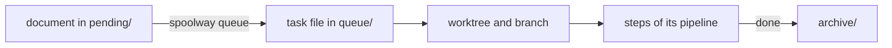

# Tasks and the queue

A task is one unit of work, small enough for one agent to finish in one sitting. This page
covers the task file, queueing it, ordering tasks, and getting a stuck task moving again.



## The task file

A task is a Markdown file with YAML frontmatter. It lives in `~/.spoolway/<project>/queue/`,
outside the checkout.

```markdown
---
id: sessions
title: feat(auth): add session tokens on top of login
group: auth
touches:
  - src/auth/**
depends_on:
  - login
---
## Context
## Goal
## Non-goals
## Acceptance criteria
## References
```

### The frontmatter is spoolway's

Every dispatch decision reads a field here. `spoolway task contract` prints the same contract
as JSON.

| Field | Set by | Meaning |
|---|---|---|
| `id` | you | The task's name. Also the file name and the branch suffix. Required. |
| `title` | you | One Conventional Commits line, such as `feat(queue): add a --dry-run flag`. Becomes the squashed commit subject and the pull request title. Required. |
| `group` | you | The group of work this task belongs to. Tasks of one group run in one shared tab. Required. |
| `pipeline` | you | The pipeline this task runs on. Required, and must name a pipeline that exists. |
| `touches` | you | Globs of the files this task changes. Drives conflict detection and the `document` step. |
| `depends_on` | you | Task ids that must reach `done` before this one starts. |
| `parallel` | you | `true` marks a missing `depends_on` to another `parallel: true` task of the same group as chosen on purpose. See [Declaring a fan on purpose](#declaring-a-fan-on-purpose). |
| `gate_at` | you | A step id. The task pauses after that step reports, once, whatever it reports. See [Paused is the other one, and it is not a block](#paused-is-the-other-one-and-it-is-not-a-block). |
| `base` | you | The branch the group lands in. Required, here or with `spoolway queue add --base`. |
| `source` | you | Where the task came from: an issue URL, a plan page path, a name. Never parsed. |
| `plan` | you | The plan page's absolute path, when `source` holds an issue. Never parsed. |
| `group_description` | you | The group's own words for its tracker issue. See [Issue tracking](configuration.md#open--a-fifth-event-run-by-queue-add-itself). |
| `epic`, `ticket` | the `open` hook, or you | Tracker references. A document that sets `ticket:` itself skips the hook. See [Issue tracking](configuration.md#open--a-fifth-event-run-by-queue-add-itself). |
| `stage` | the pipeline | The step the task is on. |
| `branch` | the dispatcher | `task/<id>`, or `task/<slug>-<id>` with `issue_tracking.key_in_names`. |
| `cut_from` | the dispatcher | The branch the worktree was cut from: the first dependency's branch, else `base`. The pull request opens against it. |
| `base_commit` | the dispatcher | The commit `cut_from` pointed at when the worktree was cut. |
| `run` | the dispatcher | The run id. `spoolway eval --runs` groups ledger lines by it. |
| `patch` | the dispatcher | Files, insertions and deletions of the branch, measured at cleanup. |
| `worktree_path`, `workspace_id`, `pane_id`, `tab_id` | the dispatcher | Where the work happens on this machine. |
| `attempts`, `launched_at`, `prompts`, `rounds`, `arrived_from`, `launch_failures` | the dispatcher | Launch and loop counters. The board and the ledger read them. |
| `last_report` | `spoolway report` | The last outcome a lane reported. |
| `blocked_from`, `parked_from`, `escalated`, `paused_at`, `paused_by`, `resume` | the dispatcher | Where a stopped task continues from, and for a pause which road caught it — `gate` for a step's own `gate:`, `schedule` for the task's own `gate_at:`, absent for a `--pause` raised from `blocked`. `spoolway resume` reads them. |
| `skip`, `trial` | the queue screen's `p` picker | Steps to pass without a lane, and the trial this task is an arm of. See [Trials](planning.md#trials). |
| `borrowed` | the dispatcher | The checkout already existed and is not removed at cleanup. |

Keys not in this table are kept as they are, so a project can add its own metadata.

### What a document may set

`id`, `title` and `group` are required. The other keys marked "you" are optional. A document
with an empty body is refused.

Six keys are refused in a document: `stage`, `run`, `attempts`, `base_commit`, `cut_from` and
`branch`.

```
$ spoolway queue add --from mine.md
mine.md sets `run:`, which spoolway sets on every task itself — remove it from the document
```

Every other dispatcher field in a document is dropped.

### Two constraints no key can express

- An id must fit a lane name, `<task> · <step>`, of at most 34 bytes. `spoolway task contract`
  prints each pipeline's id budget under `.pipelines.<name>.id_budget`.
- `gate_at` must name a step of the task's pipeline. `spoolway task contract` lists them under
  the same entry.

### What only holds across a set

`depends_on` is checked over the whole submission. It must name a task in the queue, in the
archive, or in the same batch. It must not name the task itself or close a cycle. A dependency
and its dependent must share the same `base` and the same `group`.

When `depends_on` names more than one id, the first must be the one whose branch already
contains the others. `queue add` reorders the list to put it first. A list with no such id is
refused.

When `issue_tracking.hook` is set, one document in a group must set `group_description:`. A
document already queued in the same group also satisfies it. A submission is refused, naming
the group, when none does.

### The body is the project's

spoolway never reads the body. It is written once, from the skeleton in
`.spoolway/templates/tasks/`, and read by the agent. The shipped skeleton has these sections:

| Section | What goes there |
|---|---|
| `## Context` | Three to five facts about the system today and the decision this task implements. |
| `## Goal` | What the task achieves, in one or two sentences. |
| `## Mockup` | What the result looks like, drawn as the thing itself. Delete the heading when nothing a person opens changes. The reviewer checks the change against it. |
| `## Non-goals` | What the task must not do. |
| `## Acceptance criteria` | Statements that are true or false when the task is done. |
| `## End-to-end coverage` | The end-to-end test the change adds or updates, or "none" and why. |
| `## References` | Paths to read before starting. |

Three sections are appended as the task runs. spoolway creates them if they are missing.

| Section | Who writes it |
|---|---|
| `## Status Log` | Every step. One timestamped line per transition. |
| `## Handoff` | Any step, with `spoolway report --handoff`. What the next step should know. |
| `## Blocker` | The dispatcher. Why the task needs a person. |

The wording under each heading is fixed and built into spoolway. It is sent to the lane as
the `WHAT YOU WRITE DOWN` block of its system prompt. See
[What a lane is handed](prompts.md#what-a-lane-is-handed).

At lane start the dispatcher also tells the lane which tasks it waited on, with a pointer to
their `## Handoff`, the scope its `touches` globs set, and the scratch directory.

## Queueing a task

### Get the skeleton

```
spoolway queue add                 # prints a document skeleton with a `pipeline:` row to fill in
```

The skeleton's `pipeline:` row names the first pipeline alphabetically and lists every other
choice in a trailing comment. Body skeletons live in `.spoolway/templates/tasks/`, one per
pipeline. `bugfix.md` serves the `bugfix` pipeline. `default.md` serves every pipeline without
a file of its own.

### Add it

`spoolway queue add --from` is the only way into the queue. The queue screen uses it too. All
documents in one call are checked together and written all or none.

```
spoolway queue add --from task.md               # one file
spoolway queue add --from a.md --from b.md      # several
spoolway queue add --from tasks/                # every *.md in a directory
spoolway queue add --from -                     # a `---`-separated stream on stdin
```

Producers write documents to `~/.spoolway/<project>/pending/`. The queue screen lists that
directory and `.spoolway/routines/`. See [Queueing a plan](planning.md#queueing-a-plan).


A body may not contain a line that is exactly `---`. The task starts on its pipeline's first
step.

### Read the queue

| Command | What it does |
|---|---|
| `spoolway queue list` | Whether a dispatcher runs, and where every task is. |
| `spoolway queue show <task>` | Prints one task file. |
| `spoolway queue add --from <path>` | Queues documents. |
| `spoolway queue conflicts` | Reports overlapping `touches` with no order between them. |
| `spoolway queue pause <task>` | Stops the task's lane and parks it on `paused`. |
| `spoolway queue resume <task>` | Same as `r` on the board. |
| `spoolway queue unqueue <task>` | Moves a not-started task back to the pending directory. `--all` and `--force` reach the rest. |

A task file that does not parse is skipped. The board names it in amber.

## Expressing order

Tasks of different groups are independent. Inside a group, `depends_on` sets the order.

A task stays `queued` until every task it names has reached `done`. A dependency is refused
when it names a task that does not exist, names itself, closes a cycle, crosses two bases, or
crosses two groups. If a dependency is blocked, every task behind it shows `unreachable`.

```
TASK       STEP       NOTE
login      implement  writes the code
sessions   queued     waiting on: login
profile    queued     unreachable — login is blocked
```

## Finding the edges you are missing

```
spoolway queue conflicts
```

This reports pairs of tasks whose `touches` globs can name the same file and that have no
`depends_on` path between them. Two ordered tasks that overlap are fine.

### Declaring a fan on purpose

Two tasks of one group may have nothing to do with each other. Mark both `parallel: true` so
that `queue conflicts` and `queue list` know the missing edge is intended.

```
id: left
group: fan
touches: [notes/left.md]
parallel: true
```

A `touches` overlap between two `parallel: true` tasks is still reported as a mistake.

## When a task needs a person

A task moves to `blocked` when a step reports `block`, when a step spends its `loop` budget
and routes to `blocked`, or when a lane fails to start three times. The reason is written to
`## Blocker`, and the board pins the task at the top of its group.

```
spoolway resume <task>
spoolway resume <task> --stage review -m "credentials rotated"
```

`resume` continues the blocked lane's own session at the step it stopped on. `--stage` starts
a fresh session at the step you name.

### Paused is the other one, and it is not a block

A task that passes a step with [`gate: true`](pipelines.md#gates) stops on `paused`. So does a
task whose own `gate_at:` names the step it is reporting from, whatever that step reports.
Nothing went wrong. You decide whether it goes on.

```
spoolway resume <task>                                    # on, by the step's on_pass
spoolway resume <task> --reject -m "the migration has not run yet"   # back, by on_fail
```

A `gate_at` that caught a block, or a loop-max bound for `blocked`, sends a plain resume to
`blocked` instead of `on_pass` — the same place it would have reached unheld. The board's NEXT
column names the outcome a scheduled pause caught, such as `review failed → e2e`, when it was
not a plain pass.

`--reject` writes your message into `## Handoff` for the next lane. A gated step with no
`on_fail` sends a rejected task to `blocked`.

## Reporting an outcome

Prompts call this when their work is done. You rarely run it yourself.

```
spoolway report --pass -m "implemented and tests pass"
spoolway report --fail -m "acceptance criterion 2 is not met"
spoolway report --block -m "needs a credential I do not have"
spoolway report --pause -m "only a person can clear this"   # only on `blocked`
```

The task id defaults to `$SPOOLWAY_TASK`, which every lane has set.

`--handoff` leaves a note for the next step, one per thing to say:

```
spoolway report --pass -m "shipped" \
  --handoff "the migration script wants a dry run before the next deploy"
```

Each note is written to `## Handoff` as `` - `<step>` — <text> ``. A dependent task's reading
list points at it.

## Archiving

On `done` the dispatcher removes the worktree and the branch and moves the task file to the
archive directory. The branch is kept while a remote still lacks one of its commits. The usage
ledger keeps its lines after the task is archived.
