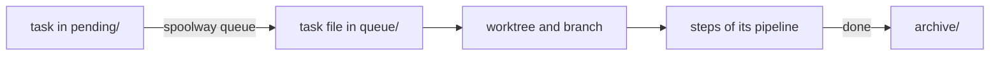
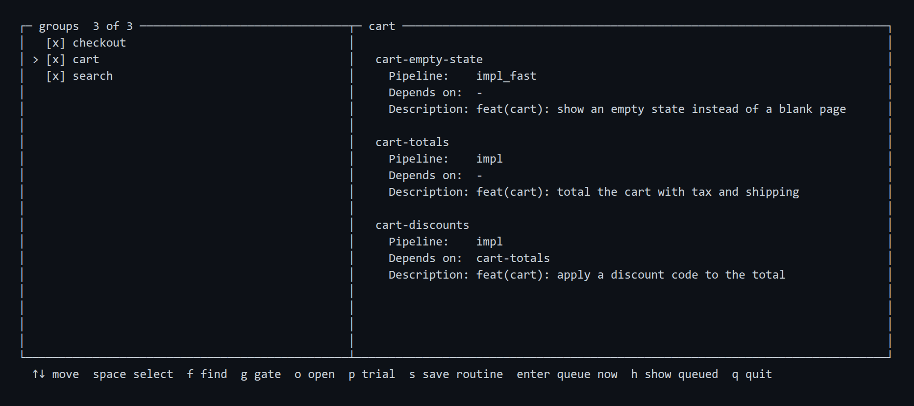

# Tasks and the queue

A task is one unit of work, small enough for one agent to finish in one sitting. This page
covers the task file, queueing it, ordering tasks, and getting a stuck task moving again.


```mermaid
flowchart LR
  A[task in pending/] -->|spoolway queue| B[task file in queue/]
  B --> C[worktree and branch]
  C --> D[steps of its pipeline]
  D -->|done| E[archive/]
```

## The task file

A task is a Markdown file with YAML frontmatter. It lives in `~/.spoolway/<project>/queue/`,
outside the checkout.

```markdown
---
id: sessions
title: feat(auth): add session tokens on top of login
group: auth
depends_on:
  - login
---
## Context
## Intend
## Non-goals
## Acceptance criteria
## References
```

### The frontmatter is spoolway's

Every dispatch decision reads a field here. `spoolway task contract` prints the same contract
as JSON.

| Field | Set by | Meaning |
|---|---|---|
| `id` | you | The task's name. Also the file name and the branch suffix. Required. |
| `title` | you | One Conventional Commits line, such as `feat(queue): add a --dry-run flag`. Becomes the squashed commit subject and the pull request title. Required. |
| `group` | you | The group of work this task belongs to. Tasks of one group run in one shared tab. Required. |
| `pipeline` | you | The pipeline this task runs on. Required, and must name a pipeline that exists. |
| `depends_on` | you | Task ids that must reach `done` before this one starts. |
| `parallel` | you | `true` marks a deliberate fan: the planner judged this task and another `parallel: true` task of the same group safe to run side by side, rather than a missing `depends_on`. |
| `gate_at` | you | A step id. The task pauses after that step reports, once, whatever it reports. See [Paused is the other one, and it is not a block](#paused-is-the-other-one-and-it-is-not-a-block). |
| `base` | `spoolway-tasks`, or you | The branch the group lands in. `spoolway-tasks` writes it from `spoolway task contract`'s own `base`, the branch your checkout has out. Otherwise required, here or with `spoolway queue add --base`. Must exist locally or on `origin`. |
| `source` | you | Where the task came from: an issue URL, a plan page path, a name. Never parsed. |
| `plan` | you | The plan page's absolute path, when `source` holds an issue. Never parsed. |
| `group_description` | you | The group's own words for its tracker issue. See [Issue tracking](configuration.md#open--a-fifth-event-run-by-queue-add-itself). |
| `epic`, `ticket` | the `open` hook, or you | Tracker references. A task that sets `ticket:` itself skips the hook. See [Issue tracking](configuration.md#open--a-fifth-event-run-by-queue-add-itself). |
| `tracking` | the queue screen, or you | `off` is the only value accepted. Fires no `[issue_tracking]` hook event for this task and never holds it waiting on one. See [Issue tracking](configuration.md#issue_tracking--a-hook-fired-on-four-task-events). |
| `stage` | the pipeline | The step the task is on. |
| `branch` | the dispatcher | `task/<id>`, or `task/<slug>-<id>` with `issue_tracking.key_in_names`. |
| `cut_from` | the dispatcher | The branch the worktree was cut from: the first dependency's branch, else `base`. The pull request opens against it. Once that branch is gone, it opens against the branch its own pull request merged into instead. See [`spoolway stack`](pipelines.md#spoolway-stack). A branch only `origin` has is cut from directly, with no local branch made for it. |
| `base_commit` | the dispatcher | The commit `cut_from` pointed at when the worktree was cut. |
| `run` | the dispatcher | The run id. `spoolway eval --by task` groups ledger lines by it. |
| `patch` | the dispatcher | Files, insertions and deletions of the branch, measured at cleanup. |
| `worktree_path`, `workspace_id`, `pane_id`, `tab_id` | the dispatcher | Where the work happens on this machine. |
| `attempts`, `launched_at`, `steps`, `rounds`, `arrivals`, `arrived_from`, `launch_failures` | the dispatcher | Launch and loop counters. The board and the ledger read them. |
| `last_report` | `spoolway report` | The last outcome a lane reported. |
| `blocked_from`, `parked_from`, `escalated`, `paused_at`, `paused_by`, `resume` | the dispatcher | Where a stopped task continues from, and for a pause which road caught it — `gate` for a step's own `gate:`, `schedule` for the task's own `gate_at:`, absent for a `--pause` raised from `blocked`. `spoolway resume` reads them. |
| `parked_by_stop` | the dispatcher | Set when the dispatch tab's stop popup, `i`, is what parked this task. The next start resumes it on its own and clears the flag; `spoolway resume` and `r` clear it too. |
| `skip`, `trial` | the queue screen's `t` picker | Steps to pass without a lane, and the trial this task is an arm of. See [Trials](planning.md#trials). |
| `borrowed` | the dispatcher | The checkout already existed and is not removed at cleanup. |

Keys not in this table are kept as they are, so a project can add its own metadata.

### What a task may set

`id`, `title` and `group` are required. The other keys marked "you" are optional. A task
with an empty body is refused.

Six keys are refused in a task: `stage`, `run`, `attempts`, `base_commit`, `cut_from` and
`branch`.

```
$ spoolway queue add --from mine.md
mine.md sets `run:`, which spoolway sets on every task itself — remove it from the task
```

Every other dispatcher field in a task is dropped.

### One constraint no key can express

`gate_at` must name a step of the task's pipeline. `spoolway task contract` lists them under
`.pipelines.<name>.gate_at`.

An id follows the same path-safe rule as every other id on this project: lowercase letters,
digits and hyphens, starting with a letter. No length budget applies. A lane whose name would
outgrow the multiplexer's own limit gets a short internal alias instead of a refusal.

### What only holds across a set

`depends_on` is checked over the whole submission. It must name a task in the queue, in the
archive, or in the same batch. It must not name the task itself or close a cycle. A dependency
and its dependent must share the same `base` and the same `group`.

`spoolway dispatch` checks the same base rule again before it starts, since a task file can be
edited by hand, or a base branch deleted, after the batch was sent. A dependent whose `base:` no
longer agrees with its dependency's, or a cut task whose `base:` no longer names what `cut_from`
recorded, refuses the whole start. A task still waiting to be cut whose base exists neither
locally nor on `origin` refuses it too, checked locally first; a task already cut is not asked.
See [`spoolway dispatch`](cli-reference.md#spoolway-dispatch). While a dispatcher is already
running, the same three problems hold only the task they are found on, the way a task with no
`base:` at all is held.

When `depends_on` names more than one id, the first must be the one whose branch already
contains the others. `queue add` reorders the list to put it first. A list with no such id is
refused.

When `issue_tracking.hook` is set, one task in a group must set `group_description:`. A
task already queued in the same group also satisfies it. A submission is refused, naming
the group, when none does.

### The body is the project's

spoolway never reads the body. It is written once, from the skeleton in
`.spoolway/templates/tasks/`, and read by the agent. The shipped skeleton has these sections:

| Section | What goes there |
|---|---|
| `## Context` | Three to five facts about the system today and the decision this task implements. |
| `## Intend` | What the task achieves, in one or two sentences. |
| `## Mockup` | What the result looks like, linked to the plan step or file that draws it, never redrawn. Delete the heading when nothing a person opens changes. The reviewer checks the change against it. |
| `## Non-goals` | What the task must not do. |
| `## Acceptance criteria` | Statements that are true or false when the task is done. |
| `## End-to-end coverage` | The end-to-end test the change adds or updates, or "none" and why. |
| `## References` | Paths to read before starting. |

Three sections are appended as the task runs. spoolway creates them if they are missing.

| Section | Who writes it |
|---|---|
| `## Status Log` | Every step. One timestamped line per transition. |
| `## Handoff` | Any step, with `spoolway report --handoff`. What the next step should know. |
| `## Blocker` | The dispatcher. Why the task needs a person. |

The wording under each heading is fixed and built into spoolway. It is sent to the lane as
the `WHAT YOU WRITE DOWN` block of its system prompt. See
[What a lane is handed](prompts.md#what-a-lane-is-handed).

At lane start the dispatcher also tells the lane which tasks it waited on, with a pointer to
their `## Handoff`, and the scratch directory.

## Queueing a task

### Get the skeleton

```
spoolway queue add                 # prints a task skeleton with a `pipeline:` row to fill in
```

The skeleton's `pipeline:` row names the first pipeline alphabetically and lists every other
choice in a trailing comment. Body skeletons live in `.spoolway/templates/tasks/`, one per
pipeline. `bugfix.md` serves the `bugfix` pipeline. `default.md` serves every pipeline without
a file of its own.

### Add it

`spoolway queue add --from` is the only way into the queue. The queue screen uses it too. All
tasks in one call are checked together and written all or none.

```
spoolway queue add --from task.md               # one file
spoolway queue add --from a.md --from b.md      # several
spoolway queue add --from tasks/                # every *.md in a directory
spoolway queue add --from -                     # a `---`-separated stream on stdin
```

Producers write tasks to `~/.spoolway/<project>/pending/`. The queue screen lists that
directory and `.spoolway/routines/`. See [Queueing a plan](planning.md#queueing-a-plan).



A body may not contain a line that is exactly `---`. The task starts on its pipeline's first
step.

### Read the queue

| Command | What it does |
|---|---|
| `spoolway queue list` | Whether a dispatcher runs, and where every task is. |
| `spoolway queue show <task>` | Prints one task file. |
| `spoolway queue add --from <path>` | Queues tasks. |
| `spoolway queue pause <task>` | Stops the task's lane and parks it on `paused`. |
| `spoolway queue resume <task>` | Same as `r` on the board. |
| `spoolway queue unqueue <task>` | Moves a not-started task back to the pending directory. `--all` and `--force` reach the rest. |

A task file that does not parse is skipped. The board names it in amber.

## Expressing order

Tasks of different groups are independent. Inside a group, `depends_on` sets the order.

A task stays `queued` until every task it names has reached `done`. A dependency is refused
when it names a task that does not exist, names itself, closes a cycle, crosses two bases, or
crosses two groups. If a dependency is blocked, every task behind it stays `queued`.

```
TASK       STEP       NOTE
login      implement  writes the code
sessions   queued     waiting on: login
profile    queued     waiting on: sessions
```

## Declaring a fan on purpose

Two tasks of one group may have nothing to do with each other. Whether they are safe to run
side by side is judged from what each task changes, not from any file both happen to touch.
Mark both `parallel: true` so that `queue list` shows the missing `depends_on` as chosen on
purpose, not forgotten.

```
id: left
group: fan
parallel: true
```

## When a task needs a person

A task moves to `blocked` when a step reports `block`, when a step spends its `loop` budget
and routes to `blocked`, or when a lane fails to start three times. The reason is written to
`## Blocker`, and the board pins the task at the top of its group.

```
spoolway resume <task>
spoolway resume <task> --stage review -m "credentials rotated"
```

`resume` continues the blocked lane's own session at the step it stopped on. `--stage` starts
a fresh session at the step you name.

### Paused is the other one, and it is not a block

A task that passes a step with [`gate: true`](pipelines.md#gates) stops on `paused`. So does a
task whose own `gate_at:` names the step it is reporting from, whatever that step reports.
Nothing went wrong. You decide whether it goes on.

```
spoolway resume <task>                                    # on, by the step's on_pass
spoolway resume <task> --stage review -m "send it back round"   # on, at a step you name
```

A `gate_at` that caught a block, or a loop-max bound for `blocked`, sends a plain resume to
`blocked` instead of `on_pass` — the same place it would have reached unheld. The board's NEXT
column names the outcome a scheduled pause caught, such as `review failed → e2e`, when it was
not a plain pass.

### The stop is yours to work in

The pane a stop left open is still there. Type into it, and the lane does what you ask,
including work its own step would otherwise leave to another. Only resuming stays a person's:
a lane cannot call `spoolway resume` on its own task.

`spoolway task edit` rewrites one section of the task while it sits on `paused` or
`blocked`, under the same task lock `spoolway report` takes.

```
spoolway task edit <task> --section Mockup --from mockup.md
spoolway task edit <task> --section Mockup --from -   # read the new content from stdin
```

`--section` names a `##` heading without its `##`. The heading must already exist in the body.
The whole section's content is replaced, the way editing the file by hand would. Run against a
task that is neither `paused` nor `blocked`, it is refused.

Every choice a stop offers is printed key first, then the command that does the same thing:

```
demo-gate2: `## Mockup` rewritten, 14 lines

  resuming it is still a person's:
  resume   [r]   spoolway resume demo-gate2
```

## Reporting an outcome

Prompts call this when their work is done. You rarely run it yourself.

```
spoolway report --pass -m "implemented and tests pass"
spoolway report --fail -m "acceptance criterion 2 is not met"
spoolway report --block -m "needs a credential I do not have"
spoolway report --pause -m "only a person can clear this"   # only on `blocked`
spoolway report --pass --stage implement -m "done"           # only on `blocked`
```

`--stage <step>` sends a pass from `blocked` to a named step instead of the step's own default.
It only works on `blocked`, and only names a step this task has already run.

The task id defaults to `$SPOOLWAY_TASK`, which every lane has set.

`--handoff` leaves a note for the next step, one per thing to say:

```
spoolway report --pass -m "shipped" \
  --handoff "the migration script wants a dry run before the next deploy"
```

Each note is written to `## Handoff` as `` - `<step>` — <text> ``. A dependent task's reading
list points at it.

## Archiving

On `done` the dispatcher removes the worktree and the branch and moves the task file to the
archive directory. The branch is kept while a remote still lacks one of its commits. The usage
ledger keeps its lines after the task is archived.
