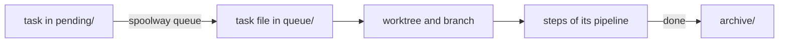

# Tasks and the queue

A task is one unit of work, small enough for one agent to finish in one sitting. This page
covers the task file, queueing it, ordering tasks, and getting a stuck task moving again.


```mermaid
flowchart LR
  A[task in pending/] -->|spoolway queue| B[task file in queue/]
  B --> C[worktree and branch]
  C --> D[steps of its pipeline]
  D -->|done| E[archive/]
```

## The task file

A task is a Markdown file with YAML frontmatter. It lives in `~/.spoolway/<project>/queue/`,
outside the checkout.

```markdown
---
id: sessions
title: feat(auth): add session tokens on top of login
group: auth
depends_on:
  - login
---
## Context
## Intend
## Non-goals
## Acceptance criteria
## References
```

### The frontmatter is spoolway's

Every dispatch decision reads a field here. `spoolway task contract` prints the same contract
as JSON.

| Field | Set by | Meaning |
|---|---|---|
| `id` | you | The task's name, at most 100 characters. Also the file name and the branch suffix. Required. |
| `title` | you | One Conventional Commits line, such as `feat(queue): add a --dry-run flag`. Becomes the squashed commit subject and the pull request title. Required. |
| `group` | you | The group of work this task belongs to. Required. |
| `pipeline` | you | The pipeline this task runs on. Required, and must name a pipeline that exists. |
| `depends_on` | you | Task ids that must finish (reach `done`, be cleaned up and be archived) before this one starts. See [Expressing order](#expressing-order). |
| `gate_at` | you | A step id. The task pauses after that step reports, or after a command step exits, once, whatever it reports or exits with. See [Paused is the other one, and it is not a block](#paused-is-the-other-one-and-it-is-not-a-block). |
| `base` | `spoolway-tasks`, or you | The branch the group lands in. `spoolway-tasks` writes it from `spoolway task contract`'s own `base`, the branch your checkout has out. Otherwise required, here or with `spoolway queue add --base`. Must exist locally or on `origin`. |
| `source` | you | Where the task came from: an issue URL, a plan page path, a name. Never parsed. |
| `plan` | you | The plan page's absolute path, when `source` holds an issue. Never parsed. |
| `group_description` | you | The group's own words for its tracker issue. See [Issue tracking](configuration.md#open--a-fifth-event-run-by-queue-add-itself). |
| `labels` | you | Plain words for a hook to put on this task's own tracker issue and its group's. A label may hold no whitespace and no comma. |
| `epic`, `ticket` | the `open` hook, or you | Tracker references. A task that sets `ticket:` itself skips the hook. See [Issue tracking](configuration.md#open--a-fifth-event-run-by-queue-add-itself). |
| `tracking` | the queue screen, or you | `off` is the only value accepted. Fires no `[issue_tracking]` hook event for this task and never holds it waiting on one. See [Issue tracking](configuration.md#issue_tracking--a-hook-fired-on-four-task-events). |
| `stage` | the pipeline | The step the task is on. |
| `branch` | the dispatcher | `task/<id>`, or `task/<slug>-<id>` with `issue_tracking.key_in_names`. |
| `starts_from` | the dispatcher, or you | The branch the worktree is cut from: the first dependency's branch, else `base`. Set it yourself before the task starts to cut from another branch. The pull request opens against it. Once that branch is gone, it opens against the branch its own pull request merged into instead. See [`spoolway stack`](pipelines.md#spoolway-stack). A branch only `origin` has is cut from directly, with no local branch made for it. See [A start branch that does not exist](#a-start-branch-that-does-not-exist). |
| `base_commit` | the dispatcher | The commit `starts_from` pointed at when the worktree was cut. |
| `run` | the dispatcher | The run id. `spoolway eval --by task` groups ledger lines by it. |
| `patch` | the dispatcher | Files, insertions and deletions of the branch, measured at cleanup. |
| `worktree_path`, `workspace_id`, `pane_id`, `tab_id` | the dispatcher | Where the work happens on this machine. |
| `attempts`, `launched_at`, `steps`, `rounds`, `arrivals`, `arrived_from`, `launch_failures` | the dispatcher | Launch and loop counters. The board and the ledger read them. |
| `last_report` | `spoolway report` | The last outcome a lane reported. |
| `blocked_from`, `parked_from`, `escalated`, `paused_at`, `paused_by`, `resume` | the dispatcher | Where a stopped task continues from, and for a pause which road caught it — `gate` for a step's own `gate:`, `schedule` for the task's own `gate_at:`, absent for a `--pause` raised from `blocked`. `spoolway resume` reads them. |
| `restart` | `spoolway restart` | The step to start over on, for one launch. The lane opens a new conversation even where the step has `session: true`, and its briefing says an earlier attempt's changes are still in the worktree. The launch clears the key. |
| `missing_start_branch` | the dispatcher | The start branch that did not exist when the dispatcher paused the task. `spoolway resume` clears it. |
| `hook_paused` | the dispatcher | `queued`, `started` or `done`: which one's issue-tracking hook failed and paused the task. `spoolway resume` reads and clears it, forgetting that hook run so it fires again. |
| `parked_by_stop` | the dispatcher | Set when the dispatch tab's stop popup, `i`, is what parked this task. The next start resumes it on its own and clears the flag; `spoolway resume` and `r` clear it too. |
| `skip`, `trial`, `trial_group` | the queue screen's `t` picker | Steps to pass without a lane, the trial this task is an arm of, and the source group a person tried. See [Trials](planning.md#trials). |
| `borrowed` | the dispatcher | The checkout already existed and is not removed at cleanup. |

Keys not in this table are kept as they are, so a project can add its own metadata.

### What a task may set

`id`, `title` and `group` are required. The other keys marked "you" are optional. A task
with an empty body is refused.

Five keys are refused in a task: `stage`, `run`, `attempts`, `base_commit` and `branch`.

```
$ spoolway queue add --from mine.md
mine.md sets `run:`, which spoolway sets on every task itself — remove it from the task
```

Every other dispatcher field in a task is dropped, including `hook_paused` and
`missing_start_branch`.

A label in `labels:` holding whitespace or a comma is refused, naming the task and the label,
since a hook reads the whole list comma-joined.

```
$ spoolway queue add --from mine.md
mine.md: label `has space` may not hold whitespace or a comma — a hook reads every label
comma-joined in SPOOLWAY_LABELS, and Jira's own labels cannot hold a space at all. Join the
words with a hyphen instead, for example `needs-triage`.
```

### One constraint no key can express

`gate_at` must name a step of the task's pipeline. `done` is not a step. `spoolway queue add`
and `spoolway task contract --from` refuse any other value, naming the task and the steps it
may name. `spoolway task contract` lists those steps under `.pipelines.<name>.gate_at`.

An id follows the same path-safe rule as every other id on this project: lowercase letters,
digits and hyphens, starting with a letter. A task id may be at most 100 characters and a
step id at most 64, because spoolway builds file names from the pair and a name past 255 bytes
fails. `spoolway task contract --from`, `spoolway queue add --dry-run` and `spoolway queue add`
refuse a longer id, naming it and the limit. A lane whose name would outgrow the
multiplexer's own limit gets a short internal alias instead of a refusal.

### What only holds across a set

`depends_on` is checked over the whole submission. It must name a task in the queue, in the
archive, or in the same batch. It must not name the task itself or close a cycle. A dependency
and its dependent must share the same `base`. They must also share the same `group`, unless the
dependent is its own group's first task naming the other group's own last task. See [Stacking
one group on another](#stacking-one-group-on-another).

`spoolway dispatch` checks the same base rule again before it starts, since a task file can be
edited by hand, or a base branch deleted, after the batch was sent. A dependent whose `base:` no
longer agrees with its dependency's refuses the whole start. A task still waiting to be cut whose
base exists neither locally nor on `origin` refuses it too, checked locally first; a task already
cut is not asked. See [`spoolway dispatch`](cli-reference.md#spoolway-dispatch). While a
dispatcher is already running, the same two problems hold only the task they are found on, the way
a task with no `base:` at all is held.

When `depends_on` names more than one id, the first must be the one whose branch already
contains the others. `queue add` reorders the list to put it first. A list with no such id is
refused.

When `issue_tracking.hook` is set, one task in a group must set `group_description:`. A
task already queued in the same group also satisfies it. A submission is refused, naming
the group, when none does.

### The body is the project's

spoolway never reads the body. It is written once, from the skeleton in
`.spoolway/templates/tasks/`, and read by the agent. The shipped skeleton has these sections:

| Section | What goes there |
|---|---|
| `## Context` | Three to five facts about the system today and the decision this task implements. |
| `## Intend` | What the task achieves, in one or two sentences. |
| `## Mockup` | What the result looks like, linked to the plan step or file that draws it, never redrawn. Delete the heading when nothing a person opens changes. The reviewer checks the change against it. |
| `## Non-goals` | What the task must not do. |
| `## Acceptance criteria` | Statements that are true or false when the task is done. |
| `## End-to-end coverage` | The end-to-end test the change adds or updates, or "none" and why. |
| `## References` | Paths to read before starting. |

Four sections are appended as the task runs. spoolway creates them if they are missing.

| Section | Who writes it |
|---|---|
| `## Status Log` | Every step. One timestamped line per transition. |
| `## Handoff` | Any step, with `spoolway report --handoff`. What the next step should know. |
| `## Blocker` | The dispatcher. Why the task needs a person. When the task is put back, spoolway adds a dated `- Cleared` line below the entries. |
| `## Hook error` | The dispatcher, on a failing `[issue_tracking]` hook. The run's own last output. |

The wording under each heading is fixed and built into spoolway. It is sent to the lane as
the `WHAT YOU WRITE DOWN` block of its system prompt. See
[What a lane is handed](prompts.md#what-a-lane-is-handed).

At lane start the dispatcher also tells the lane which tasks it waited on, with a pointer to
their `## Handoff`, and the scratch directory.

## Queueing a task

### Get the skeleton

```
spoolway queue add                 # prints a task skeleton with a `pipeline:` row to fill in
```

The skeleton's `pipeline:` row names the first pipeline alphabetically and lists every other
choice in a trailing comment. Body skeletons live in `.spoolway/templates/tasks/`, one per
pipeline. `bugfix.md` serves the `bugfix` pipeline. `default.md` serves every pipeline without
a file of its own.

### Add it

`spoolway queue add --from` is the only way into the queue. The queue screen uses it too. All
tasks in one call are checked together and written all or none. The queue screen leaves out a
task whose start branch does not exist and queues the rest. See [A start branch that does not
exist](#a-start-branch-that-does-not-exist). A task id that is already in the queue or the
archive is refused, also when several adds of that id run at once. See [`spoolway queue
add`](cli-reference.md#spoolway-queue-add).

```
spoolway queue add --from task.md               # one file
spoolway queue add --from a.md --from b.md      # several
spoolway queue add --from tasks/                # every *.md in a directory
spoolway queue add --from -                     # a `---`-separated stream on stdin
```

Producers write tasks to `~/.spoolway/<project>/pending/`. The queue screen lists that
directory and `.spoolway/routines/`. See [Queueing a plan](planning.md#queueing-a-plan).


A body may not contain a line that is exactly `---`. The task starts on its pipeline's first
step.

### Read the queue

| Command | What it does |
|---|---|
| `spoolway queue list` | Whether a dispatcher runs, and where every task is. |
| `spoolway queue show <task>` | Prints one task file. |
| `spoolway queue route <task>` | Prints the steps of the task's pipeline that it runs, with its step marked, and where resuming it sends it. |
| `spoolway queue add --from <path>` | Queues tasks. |
| `spoolway queue pause <task>` | Stops the task's lane and parks it on `paused`. |
| `spoolway queue resume <task>` | Same as `r` on the board. |
| `spoolway queue unqueue <task>` | Moves a not-started task back to the pending directory. `--all` and `--force` reach the rest. |

A task file that does not parse is skipped. The board names it in amber.

## Expressing order

A group is one chain: each task depends on the one before it. There is one root, with no
`depends_on`, and one tail, that nothing depends on. `queue add` and `task contract` refuse
any other shape, over the queue, the archive and the batch being added together, so a group
split across two `queue add` calls is still caught.

```
TASK       STEP       NOTE
login      implement  writes the code
sessions   queued     waiting on: login
profile    queued     waiting on: sessions
```

```
$ spoolway task contract --from pending/
group `cart` has two tasks with no dependency in it: cart-totals and cart-empty — a group is
one chain. Give one a `depends_on`, or move it to a group of its own.
```

A task stays `queued` until every task it names has finished. A dependency has finished once it
has reached `done`, been cleaned up and been archived. Reaching `done` is not enough: if cleanup
or the `done` hook holds the dependency on `blocked` or `paused`, every task behind it stays
`queued`. A dependency is refused when it names a task that does not exist, names itself, closes
a cycle, or crosses two bases.

Work that has nothing to do with another task goes in a group of its own, not a second root of
the same group.

## Stacking one group on another

A group's first task, the one with no dependency inside its own group, may name one other
group's own last task in `depends_on`. That is the only edge allowed between two groups, and a
group may stack on at most one other group.

```
id: auth-form
group: auth-ui
depends_on:
  - auth-sessions    # auth-api's own last task
```

The stacked group's first task is cut from the named task's branch, the same way an in-group
dependent is cut from its dependency's branch. Any other cross-group edge is refused: naming a
task that is not the other group's own last task, naming more than one other group, or naming
a cross-group task alongside an in-group one. Queueing a group while the group it names is
still in the pending directory is refused too, naming that group.

The board reads a stacked group's line as `after <group>`. See [Rows are grouped by
`group:`](dispatcher.md#reading-the-state).

## When a task needs a person

A task moves to `blocked` when a step reports `block`, when a step spends its `loop` budget
and routes to `blocked`, or when a lane fails to start three times. The reason is written to
`## Blocker`, and the board pins the task at the top of its group.

A person puts the task back with `spoolway resume`, with `r` or restart on the board, or by answering a gate. Each adds one line under the entries in `## Blocker`:

```
- Cleared 2026-10-09 22:31: the task was put back; the entries above are past.
```

Entries above a `Cleared` line belong to a stop that is over. A later stop appends its entry
below the line, so the last entry with no `Cleared` line under it is the current one. A task
that goes back onto `blocked` gets no line.

Press `r` on the blocked row. The picker preselects the step the task stopped on, and `enter`
continues the blocked lane's own session there, if that session's last reply is within the
model's [`prompt_cache_ttl`](agents.md#cache-warmth-is-a-models-fact). Past it, `enter` opens
a fresh session at the same step. The same check applies to a task that comes back from a
park. Pick another step and `enter` starts a fresh session at that step. A task that leaves
`blocked` by any road starts every
step's [`loop:`](pipelines.md#loops) count again from zero.

To throw the step's conversation away and brief the step from scratch, run
[`spoolway restart <task>`](cli-reference.md#spoolway-restart-task).

### Paused is the other one, and it is not a block

A task that passes a step with [`gate: true`](pipelines.md#gates) stops on `paused`. So does a
task whose own `gate_at:` names the step it is reporting from, whatever that step reports. The
same holds for a command step: `gate: true` holds a passing exit, and `gate_at:` holds any exit.
Nothing went wrong. You decide whether it goes on.

Press `r` on the paused row. The picker preselects the step the gate's pass leads to, and
`enter` sends the task on. Pick another step to send it back round to that step.

A `gate_at` that caught a block, or a loop-max bound for `blocked`, sends a plain resume to
`blocked` instead of `on_pass` — the same place it would have reached unheld. The board's NEXT
column names the outcome a scheduled pause caught, such as `review failed → e2e`, when it was
not a plain pass.

A `gate_at` that caught a command step's failing exit sends a plain resume down that step's
`on_fail`, the route the exit code chose.

A failing [issue-tracking hook](configuration.md#issue_tracking--a-hook-fired-on-four-task-events)
also pauses the task, on `queued`, on `started` or on `done`. `spoolway resume` forgets that
hook's failed run, so the hook fires again. A task paused on `queued` or `started` resumes back
to `queued`. A task paused on `done` resumes straight back to `done` instead, since a plain
resume only knows pipeline steps and `queued`.

### A start branch that does not exist

A dependent is cut from its first dependency's branch. GitHub deletes that branch when the
dependency's pull request merges. A task not yet cut whose start branch exists nowhere is not
started. The dispatcher moves it to `paused`, writes `missing_start_branch: <branch>` and prints
one line:

```
! paused `cart-totals`: it starts from `task/gh-412-checkout`, which doesn't exist. Set `starts_from:` in the task front matter and resume.
```

This applies to a task that sets `starts_from:` or names a `depends_on`. The start branch is its
own `starts_from:`, else its first dependency's branch once that dependency has finished. A branch
counts as existing when it is a local branch, a remote-tracking branch or a branch on `origin`.
When `origin` cannot be reached, the task is not paused.

Queueing checks the same branch. `spoolway queue add` refuses the whole batch when a task's start
branch exists neither locally nor on `origin`. It prints, for each such task:

```
cart-totals starts from task/gh-412-checkout, which doesn't exist. Set starts_from: in the task front matter and requeue.
```

The queue screen queues the rest of the selection. It leaves the task and every selected task that
depends on it in the pending directory, and lists them in its popup. Once `starts_from:` names a
branch that exists, sending the task again queues it. A dependency that is not yet `done` has no
branch to check, so a dependent of it is queued.

To carry on, add `starts_from:` to the task file's front matter, naming a branch that exists.
Then resume the task:

```
spoolway resume cart-totals
```

`resume`, and `r` on the board, clear `missing_start_branch:` and put the task back on `queued`.
It prints `cart-totals: -> queued`. A pass that still finds no start branch pauses it again.

Once a task is cut, its `starts_from:` holds the branch it was cut from. `spoolway queue unqueue
--force` removes that value, so a task sent again is cut again from its start branch. A
`starts_from:` you set before the cut stays.

`unqueue --force` keeps the task's branch when it has commits no remote has. A task sent again
with that branch in place is refused and moves to `blocked`, because its first cut never uses a
branch that already exists. Rename the branch with `git branch -m task/<id> <name>` and set
`starts_from: <name>` to keep the work, or run `git branch -D task/<id>` to drop it. Then resume
the task. See [Where work happens on
disk](dispatcher.md#where-work-happens-on-disk).

### The stop is yours to work in

The pane a stop left open is still there. Type into it, and the lane does what you ask,
including work its own step would otherwise leave to another. The lane writes each change you
ask for into the task, so later steps see it. It tells you where resuming sends the task, the
same route `spoolway queue route <task>` shows. Only resuming stays a person's: a lane cannot
call `spoolway resume` on its own task.

`spoolway task edit` rewrites one section of the task while it sits on `paused` or
`blocked`, under the same task lock `spoolway report` takes.

```
spoolway task edit <task> --section Mockup --from mockup.md
spoolway task edit <task> --section Mockup --from -   # read the new content from stdin
```

`--section` names a `##` heading without its `##`. The heading must already exist in the body.
The whole section's content is replaced, the way editing the file by hand would. Run against a
task that is neither `paused` nor `blocked`, it is refused.

Every choice a stop offers is printed key first, then the command that does the same thing:

```
demo-gate2: `## Mockup` rewritten, 14 lines

  resuming it is still a person's:
  resume   [r]   spoolway resume demo-gate2
```

## Reporting an outcome

Prompts call this when their work is done. You rarely run it yourself.

```
spoolway report --pass -m "implemented and tests pass"
spoolway report --fail -m "acceptance criterion 2 is not met"
spoolway report --block -m "needs a credential I do not have"
spoolway report --pause -m "only a person can clear this"   # only on `blocked`
spoolway report --pass --stage implement -m "done"           # only on `blocked`
```

`--stage <step>` sends a pass from `blocked` to a named step instead of the step's own default.
It only works on `blocked`, and only names a step this task has already run.

The task id defaults to `$SPOOLWAY_TASK`, which every lane has set.

`--handoff` leaves a note for the next step, one per thing to say:

```
spoolway report --pass -m "shipped" \
  --handoff "the migration script wants a dry run before the next deploy"
```

Each note is written to `## Handoff` as `` - `<step>` — <text> ``. A dependent task's reading
list points at it.

## Archiving

On `done` the dispatcher removes the worktree and the branch and moves the task file to the
archive directory. The branch is kept while a remote still lacks one of its commits. The usage
ledger keeps its lines after the task is archived.
