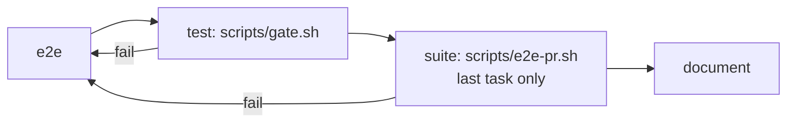
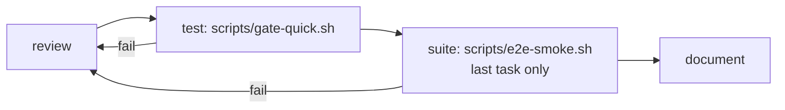

# Testing

The tests are split by the question they answer.

| Kind | Where | Answers | Needs a model? | Command |
|---|---|---|---|---|
| Unit tests | `src/**`, `#[cfg(test)]` | Does each piece decide correctly? | No | `cargo test` |
| Suites | `scripts/e2e/suites/` | Does it work with real processes, git and a forge? | No | `scripts/e2e/run.sh` |
| Plans | `scripts/e2e/plans/` | What does a real run do on screen: panes, gates, focus? | Yes | You queue one |

Anything decidable from files and exit codes is a unit test. A suite needs a real git
repository, a real detached process or a real forge. Anything only a screen can show is a plan.

## Running the suites

```sh
scripts/e2e/run.sh                        # the pr tier
scripts/e2e/run.sh --tier smoke           # the fast signal
scripts/e2e/run.sh --suite flow           # one suite
scripts/e2e/run.sh --jobs 1               # one suite at a time, output live
scripts/e2e/run.sh --list                 # every suite, and which setting each case covers
```

To run against a fresh build:

```sh
cargo build --release
SPOOLWAY="$PWD/target/release/spoolway" scripts/e2e/run.sh --tier nightly
```

| Flag | Default | What it does |
|---|---|---|
| `--tier smoke\|pr\|nightly\|cloud\|live` | `pr` | Run a named set of suites |
| `--suite <name>` | | Run one suite. Repeatable. Overrides `--tier`. |
| `--jobs <n>` | `4` | How many suites run at once. `JOBS=<n>` does the same. `--jobs 1` runs them one at a time and streams each suite's output live; anything higher captures it and prints it under the suite's row. A value that is not a positive integer is refused. |
| `--keep` | off | Keep each suite's scratch tree on disk. `KEEP=1` does the same. |
| `--list` | | Print the suites and the setting-to-case map |

Every lane runs a stand-in agent script from `scripts/e2e/agents/`. The harness needs `git`,
`bash`, `curl`, `setsid` and `flock`. Only the `cloud` and `live` tiers run a real agent binary.

`spoolway dispatch` refuses `backend = headless` unless `SPOOLWAY_TEST_BACKEND` is set in the
environment. `fixture.sh` and `scaffold.sh` export it for every suite and scaffolded project
that runs on that backend.

Each run's scratch root lives under `/tmp` and is removed on exit. A kept tree carries a
`.keep` marker, and the next run sweeps any other run's root whose process is gone.

### Coverage

`--list` reads every key in `.spoolway/config.toml` and in `assets/pipelines/default.yml`, and
matches each against the cases that claim it. A suite claims a setting with a
`# covers: <setting> — <what the case is>` line, a plan in its coverage block, and a unit test
with a `// covers:` line.

| Reading | Meaning |
|---|---|
| a case | A suite fails when the setting stops working |
| `no case — plans/x` | Only a plan run can see it |
| `no case — unit <path>` | A unit test in that file covers it |
| `no case` | A gap |

## Tiers

| Tier | Suites | Used by |
|---|---|---|
| `smoke` | flow | A person, by hand |
| `pr` | flow, commands, command-steps, issue-tracking, stacking, stack, conflicts, forge, disaster, lock, trials, routines, jobs, jobs-screen, board-pause, queue-unqueue, restart, overrides | The `suite` step of the pipelines, on the last task of a chain |
| `nightly` | the `pr` suites plus `upgrade` | Daily CI and the release workflow |
| `cloud` | warmth | Nothing automatic. Runs only with `SPOOLWAY_E2E_CLOUD=1`. |
| `live` | live | Nothing automatic. Runs only with `SPOOLWAY_E2E_CODEX_MODEL=<model>`. |

## The suites

| Suite | Covers |
|---|---|
| `flow` | A task's whole life: queued, agent steps, command steps, archived |
| `commands` | CLI behaviour that belongs to no domain of its own: `init` and `sync`, the three contracts, the queue screen read off a real pipe, the archive's rows, `config`'s checkout/project asymmetry, the overrides layer through a linked worktree, housekeeping's retention sweep, a confirm dialog over a real pty |
| `command-steps` | A `run:` step's own mechanics: exit-code routing, `background:`, `timeout:`, `loop:`, headless and paned steps, the environment a step is handed |
| `issue-tracking` | `[issue_tracking]`'s hook on `queued`, `blocked`, `paused`, `done` and `open`, the shipped `github.sh` against the `gh` double, and `key_in_names` |
| `stacking` | Three chained tasks, each pull request on the branch it is cut from |
| `stack` | `spoolway stack`: the squash, a refused lease, an empty diff, a bad `branch:`, the body from the task file, a base branch that exists locally and nowhere else |
| `conflicts` | A base that moves under a waiting branch, and the rebase |
| `forge` | The `gh` test double, including an empty change |
| `disaster` | A hard kill with lanes live, a stale lock, a restart over a running lane, a stop with live lanes, retention |
| `lock` | A second `--tier pr` run waits for the first |
| `trials` | The `t` picker on the queue screen, the arms it queues, and their cleanup |
| `routines` | The routines pane and the `s` save panel on the queue screen |
| `jobs` | A cron job fired by a real dispatcher pass, and what `spoolway doctor` says about a bad job |
| `jobs-screen` | The `spoolway jobs` screen writing, pausing and deleting a job |
| `board-pause` | The board's confirm panels: `p`, `P`, `U` over a live lane |
| `queue-unqueue` | `spoolway queue unqueue`: its `--help`, the refusal and the two routes out of it, and `--force` over a live lane |
| `restart` | The dispatcher's restart guard and its exit codes |
| `overrides` | The override commands: fork a setting out of the checkout, list it, promote it back |
| `upgrade` | Whether this binary still reads what an older release wrote. A `.spoolway/` tree scaffolded by an old tag's own binary, under `scripts/e2e/fixtures/`, goes through a real `spoolway sync`. A value set under a retired table lands at its current home, and hand-written prose comes back byte for byte |
| `warmth` | `cloud` tier. Real `claude-haiku-4-5` lanes, to check session reuse against a real transcript. |
| `live` | `live` tier. The real `codex` binary through `agent verify codex --live`. |

Each suite runs in its own process and scratch tree under `/tmp`, with its own prompts, so no
suite depends on the shipped prompt text. That isolation is what lets four of them run at
once, which is the default — see `--jobs`.

## The one suite that spends money

```sh
SPOOLWAY_E2E_CLOUD=1 scripts/e2e/run.sh --tier cloud
```

`warmth` runs eight turns of `claude-haiku-4-5` against a two-file repo. It uses your real
`$HOME` and the real `claude`. Put the build under test on `PATH`, because the prompt runs
`spoolway report`.

## The suite that runs the real binaries

```sh
SPOOLWAY_E2E_CODEX_MODEL=<model> scripts/e2e/run.sh --tier live
```

`live` runs `spoolway agent verify codex --live`: one turn, then one resume, on the installed
`codex`. A model served by a local endpoint (`wire_api = "responses"` in codex's provider
config) costs nothing.

## Plan runs

Panes, focus, gates and notifications can only be checked by a person. Queue a plan into a
throwaway project:

```sh
scripts/e2e/scaffold.sh --list                    # the plans
scripts/e2e/scaffold.sh --plan gates              # build a project for one
cd ~/dev/project/spoolway-e2e-gates
# in claude: open scripts/e2e/plans/gates.html, approve it, let /spoolway-plan cut the tasks
spoolway queue                                    # submit them
spoolway dispatch                                 # watch
scripts/e2e/scaffold.sh --plan gates --clean      # when done
```

`scaffold.sh` seeds a repo, builds a local forge from `scripts/e2e-fake-gh.sh`, and installs
`scripts/e2e/runtime/end-to-end.yml` with every step on `pi`. It needs `pi` on `PATH` and a
model server that knows the model.

| Plan | What it is for |
|---|---|
| `escalation` | A block, a review that runs out of loops, a lane that goes quiet |
| `gates` | A gated step stopping in its pane, and the notification |
| `workspace` | Two lanes, two worktrees, one shared file, an interrupted run |
| `observer` | The backgrounded observer and its `observations.md` |

The observer is `scripts/e2e/observe.sh`. It polls `spoolway lane` and appends what it sees
to `observations.md` in the project root.

## Local gates and daily CI



`impl`'s `test` step runs `scripts/gate.sh` for every task:

```sh
cargo fmt --check
cargo deny check advisories
cargo clippy --all-targets --locked -- -D warnings
cargo test --all-targets --locked
cargo build --release
./target/release/spoolway pipeline check
```

`impl`'s `suite` step runs `scripts/e2e-pr.sh` on the last task of a chain, through `last:`
(see [`last:`](pipelines.md#last--a-step-the-chain-runs-once)):

```sh
SPOOLWAY="$PWD/target/release/spoolway" scripts/e2e/run.sh --tier pr
```

`impl_lite` runs the same two steps against lighter scripts:



`test` runs `scripts/gate-quick.sh`, `scripts/gate.sh`'s six commands minus `cargo deny check
advisories`. `suite` runs `scripts/e2e-smoke.sh`, which runs the `smoke` tier instead of `pr`:

```sh
SPOOLWAY="$PWD/target/release/spoolway" scripts/e2e/run.sh --tier smoke
```

A failure sends the task back to the step before `test` (`e2e` in `impl`, `reproduce-again`
in `bugfix`), at most twice, then `on_loop_max` parks it. The gate needs `cargo-deny` installed.

`.github/workflows/ci.yml` runs daily on `main` at 03:17 UTC, and on every pull request.
Pushes do not trigger it. The scheduled run's Linux job runs the same gate plus the
`nightly` tier; a pull request runs the `pr` tier instead. A commit that already has a
successful run is skipped.

Run it by hand before a release or to check a fix:

```sh
gh workflow run ci --ref main -f tier=nightly
gh run list --workflow ci --limit 5
gh run view <run-id> --json headSha,conclusion,jobs
```

Daily CI and the release workflow share `.github/workflows/verify.yml`. See
[Releasing spoolway](releasing.md). No pipeline waits on those runs: a task reaches `done`
once `handover` has opened its pull request, so a red check afterwards is yours to pick up
from the pull request itself. Daily CI checks the integrated tree.

`verify.yml`'s `test` job also fails when [`herdr-plugin.toml`](../herdr-plugin.toml)'s
`version` differs from `Cargo.toml`'s. See [Installation and setup](installation.md).
