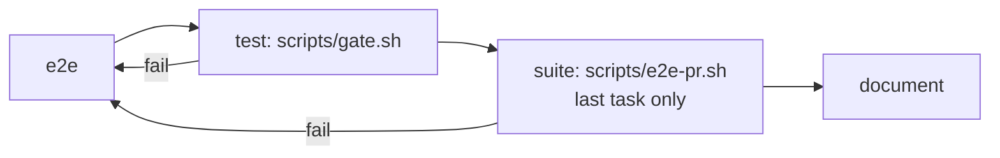
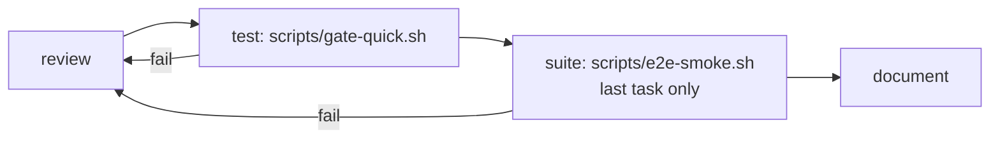

# Testing

The tests are split by the question they answer.

| Kind | Where | Answers | Needs a model? | Command |
|---|---|---|---|---|
| Unit tests | `src/**`, `#[cfg(test)]` | Does each piece decide correctly? | No | `cargo test` |
| Suites | `scripts/e2e/suites/` | Does it work with real processes, git and a forge? | No | `scripts/e2e/run.sh` |
| Plans | `scripts/e2e/plans/` | What does a real run do on screen: panes, gates, focus? | Yes | You queue one |

Anything decidable from files and exit codes is a unit test. A suite needs a real git
repository, a real detached process or a real forge. Anything only a screen can show is a plan.

## Running the suites

```sh
scripts/e2e/run.sh                        # the pr tier
scripts/e2e/run.sh --tier smoke           # the fast signal
scripts/e2e/run.sh --suite flow           # one suite
scripts/e2e/run.sh --jobs 1               # one suite at a time, output live
scripts/e2e/run.sh --list                 # every suite, and which setting each case covers
```

To run against a fresh build:

```sh
cargo build --release
SPOOLWAY="$PWD/target/release/spoolway" scripts/e2e/run.sh --tier nightly
```

| Flag | Default | What it does |
|---|---|---|
| `--tier smoke\|pr\|nightly\|cloud\|live` | `pr` | Run a named set of suites |
| `--suite <name>` | | Run one suite. Repeatable. Overrides `--tier`. |
| `--jobs <n>` | `4` | How many suites run at once. `JOBS=<n>` does the same. `--jobs 1` runs them one at a time and streams each suite's output live; anything higher captures it and prints it under the suite's row. A value that is not a positive integer is refused. |
| `--keep` | off | Keep each suite's scratch tree on disk. `KEEP=1` does the same. |
| `--list` | | Print the suites and the setting-to-case map |

Every lane runs a stand-in agent script from `scripts/e2e/agents/`. The harness needs `git`,
`bash`, `curl`, `setsid`, `flock` and `script` (util-linux). Only the `cloud` and `live` tiers
run a real agent binary. On a machine with no `setsid` or `flock`, such as macOS,
`scripts/e2e/portable.sh` appends perl stand-ins from `scripts/e2e/portable/` to `PATH`. A
machine with the real commands keeps using them.

### On macOS

Only `command-steps` runs on a Mac, in CI's `verify / test-macos` job. It is the suite that
starts real processes, sessions and process groups, which is where macOS differs. The other
suites drive git, the queue and the TUI the same way on any Unix. Nobody who works on this
repo has a Mac, so the runner is the only place this suite runs on macOS.

The suites also need GNU `sed`, GNU `coreutils` and a current `bash`. They use `sed -i` with
no suffix, `0,/re/` addresses, `timeout`, `date +%N` and `wait -n`, and the macOS versions
of those tools support none of them. The job installs them with Homebrew and puts their
unprefixed names on `PATH` ahead of the system ones. There is no stand-in for `script`: only
the suites that drive a screen over a pty call it, and `command-steps` does not.

`spoolway dispatch` refuses `backend = headless` unless `SPOOLWAY_TEST_BACKEND` is set in the
environment. `fixture.sh` and `scaffold.sh` export it for every suite and scaffolded project
that runs on that backend.

Each run's scratch root lives under `/tmp` and is removed on exit. A kept tree carries a
`.keep` marker, and the next run sweeps any other run's root whose process is gone.

### Coverage

`--list` reads every key in `.spoolway/config.toml` and in `assets/pipelines/default.yml`, and
matches each against the cases that claim it. A suite claims a setting with a
`# covers: <setting> — <what the case is>` line, a plan in its coverage block, and a unit test
with a `// covers:` line.

| Reading | Meaning |
|---|---|
| a case | A suite fails when the setting stops working |
| `no case — plans/x` | Only a plan run can see it |
| `no case — unit <path>` | A unit test in that file covers it |
| `no case` | A gap |

## Tiers

| Tier | Suites | Used by |
|---|---|---|
| `smoke` | flow | A person, by hand |
| `pr` | flow, commands, command-steps, issue-tracking, stacking, stack, conflicts, forge, disaster, lock, trials, routines, jobs, jobs-screen, screen, board-pause, queue-unqueue, restart, overrides, kept-panes | The `suite` step of the pipelines, on the last task of a chain |
| `nightly` | the `pr` suites plus `upgrade` | Daily CI and the release workflow |
| `cloud` | warmth | Nothing automatic. Runs only with `SPOOLWAY_E2E_CLOUD=1`. |
| `live` | live | Nothing automatic. Runs only with `SPOOLWAY_E2E_CODEX_MODEL=<model>`. |

## The suites

| Suite | Covers |
|---|---|
| `flow` | A task's whole life: queued, agent steps, command steps, archived; copying a pipeline and a prompt into the private layer from a real linked worktree, then promoting the pipeline into the checkout |
| `commands` | CLI behaviour that belongs to no domain of its own: `init` and `sync`, the three contracts, the queue tab of bare `spoolway` driven over a real pty, the archive's rows, `config`'s checkout/project asymmetry, `config set` refusing an unknown backend and a hook that is not a bare filename and warning on a missing agent or hook script, the overrides layer through a linked worktree, housekeeping's retention sweep, a behind checkout staying silent over a real pty, `spoolway sync`'s confirm panel over a real pty with esc after its title, checking the panel reaches the terminal, no alternate screen, and the cancel message |
| `command-steps` | A `run:` step's own mechanics: exit-code routing, `background:`, `timeout:`, `loop:`, headless and paned steps, the environment a step is handed, nothing over 512 bytes typed into a pane |
| `issue-tracking` | `[issue_tracking]`'s hook on `queued`, `started`, `blocked`, `paused`, `done` and `open`, the shipped `github.sh` against the `gh` double and `jira.sh` against the `acli` double, both opening a ticket titled with its commit prefix stripped and a body built from the task's own `## Context` and `## Acceptance criteria`, never `## Intend`, `jira.sh`'s body read back as real ADF, a failing hook's own trace landing in `## Hook error`, `key_in_names`, `labels:` reaching the hook as `SPOOLWAY_LABELS`, and `queue add` refusing a label with a space |
| `stacking` | Three chained tasks, each pull request on the branch it is cut from |
| `stack` | `spoolway stack`: the squash, a refused lease, an empty diff, a bad `branch:`, the body from the task file, the title prefixed with a bare `ticket:` key and left alone for a GitHub `ticket:` URL, a base branch that exists locally and nowhere else, a deleted `starts_from` followed to its merged pull request's base, one closed without merging named instead, and one with no pull request at all |
| `conflicts` | A base that moves under a waiting branch, and the rebase |
| `forge` | The `gh` test double, including an empty change |
| `disaster` | A hard kill with lanes live, a stale lock, a restart over a running lane, a stop with live lanes, retention |
| `lock` | A second `--tier pr` run waits for the first |
| `trials` | The `t` picker on the queue screen, the arms it queues, and their cleanup |
| `routines` | The routines tab, and the `s` save panel on the queue screen |
| `jobs` | A cron job fired by a real dispatcher pass, and what `spoolway doctor` says about a bad job |
| `jobs-screen` | Bare `spoolway`'s jobs tab writing, pausing and deleting a job |
| `screen` | Bare `spoolway`: the five-label strip, opening on the queue tab, `←` reaching the dispatch tab, `enter` there starting a dispatcher, the warnings popup naming the prompt of a pipeline added after the screen opened, and, behind the stop popup, `enter` stopping it, `→` from the queue tab reaching the routines tab, a second `spoolway` or `spoolway dispatch` refusing while a screen holds `spoolway.pid`, the grouped help off a terminal, its raw output opening and closing on the alternate screen, a full board in a 30-row pane scrolling its task table under a marker row and keeping its key line, a full board in a 120-column pty leaving column 0 and the last column empty, and a walk through all five tabs and back that draws no frame with a full-screen erase |
| `board-pause` | The board's confirm panels: `p` and the dispatch tab's stop popup's `i`, and `U`, over a live lane. `spoolway restart` over a live blocked lane, and the board's `s` restart panel |
| `queue-unqueue` | `spoolway queue unqueue`: its `--help`, the refusal and the two routes out of it, `--force` over a live lane, and the tool-requirements gate over `queue add --from` on a real pty, checking no alternate screen and the task left in pending |
| `restart` | A second `spoolway dispatch` against a held lock, refused the same way every time, and an empty queue never refused at all |
| `overrides` | The override commands: fork a setting out of the checkout, list it, promote it back, and skip a stale one |
| `home-mode` | A checkout with no `.spoolway/`, run in a workspace under `~/.spoolway/`. It also covers the clone's id: a superproject moved on disk that finds its queue again, an `init` cancelled at its first question that leaves `.git` and `~/.spoolway/` as they were (needs util-linux `script`), and several first commands started at once in a fresh clone that agree on one home |
| `kept-panes` | A two-step task driven through the herdr double: `spoolway lane` still lists the first step's lane while the second step runs, and both lanes are gone once the task is done. A second task with `dispatch.keep_finished_lanes` set to `false` lists only the second step's lane while it runs |
| `upgrade` | Whether this binary still reads what the 0.6.0 release wrote. The 0.6.0 `.spoolway/` tree under `scripts/e2e/fixtures/` goes through a real `spoolway sync`: its `housekeeping.retention_days` survives, the prose around the pipeline file's key block comes back byte for byte, `spoolway pipeline check` loads the result, and a task queues against it. A dry run changes no file, and the files it lists are the files a real run reports and changes on disk. A sync that cannot remove one file writes nothing, `config.toml` included |
| `warmth` | `cloud` tier. Real `claude-haiku-4-5` lanes, to check session reuse against a real transcript. It ages sessions by waiting, so a run takes about ten minutes. |
| `live` | `live` tier. The real `codex` binary through `agent verify codex --live`. |

Each suite runs in its own process and scratch tree under `/tmp`, with its own prompts, so no
suite depends on the shipped prompt text. That isolation is what lets four of them run at
once, which is the default — see `--jobs`.

## The one suite that spends money

```sh
SPOOLWAY_E2E_CLOUD=1 scripts/e2e/run.sh --tier cloud
```

`warmth` runs five turns of `claude-haiku-4-5` against a two-file repo, and waits real minutes
to age its sessions, so a run takes about ten minutes. It uses your real `$HOME` and the real
`claude`. Put the build under test on `PATH`, because the prompt runs
`spoolway report`.

## The suite that runs the real binaries

```sh
SPOOLWAY_E2E_CODEX_MODEL=<model> scripts/e2e/run.sh --tier live
```

`live` runs `spoolway agent verify codex --live`: one turn, then one resume, on the installed
`codex`. A model served by a local endpoint (`wire_api = "responses"` in codex's provider
config) costs nothing.

## Plan runs

Panes, focus, gates and notifications can only be checked by a person. Queue a plan into a
throwaway project:

```sh
scripts/e2e/scaffold.sh --list                    # the plans
scripts/e2e/scaffold.sh --plan gates              # build a project for one
cd ~/dev/project/spoolway-e2e-gates
# in claude: open scripts/e2e/plans/gates.html, approve it, let /spoolway-plan cut the tasks
spoolway queue                                    # submit them
spoolway dispatch                                 # watch
scripts/e2e/scaffold.sh --plan gates --clean      # when done
```

`scaffold.sh` seeds a repo, builds a local forge from `scripts/e2e-fake-gh.sh`, and installs
`scripts/e2e/runtime/end-to-end.yml` with every step on `pi`. It needs `pi` on `PATH` and a
model server that knows the model.

| Plan | What it is for |
|---|---|
| `escalation` | A block, a review that runs out of loops, a lane that goes quiet |
| `gates` | A gated step stopping in its pane, and the notification |
| `workspace` | Two lanes, two worktrees, one shared file, an interrupted run |
| `observer` | The backgrounded observer and its `observations.md` |

The observer is `scripts/e2e/observe.sh`. It polls `spoolway lane` and appends what it sees
to `observations.md` in the project root.

## Local gates and daily CI


```mermaid
flowchart LR
  A[e2e] --> B[test: scripts/gate.sh] --> C[suite: scripts/e2e-pr.sh<br/>last task only] --> D[document]
  B -- fail --> A
  C -- fail --> A
```

`impl`'s `test` step runs `scripts/gate.sh` for every task:

```sh
cargo fmt --check
cargo deny check advisories
cargo clippy --all-targets --locked -- -D warnings
cargo test --all-targets --locked
cargo build --release
./target/release/spoolway pipeline check
```

`impl`'s `suite` step runs `scripts/e2e-pr.sh` on the last task of a chain, through `last:`
(see [`last:`](pipelines.md#last--a-step-the-chain-runs-once)):

```sh
SPOOLWAY="$PWD/target/release/spoolway" scripts/e2e/run.sh --tier pr
```

`impl_lite` runs the same two steps against lighter scripts:


```mermaid
flowchart LR
  R[review] --> B[test: scripts/gate-quick.sh] --> C[suite: scripts/e2e-smoke.sh<br/>last task only] --> D[document]
  B -- fail --> R
  C -- fail --> R
```

`test` runs `scripts/gate-quick.sh`, `scripts/gate.sh`'s six commands minus `cargo deny check
advisories`. `suite` runs `scripts/e2e-smoke.sh`, which runs the `smoke` tier instead of `pr`:

```sh
SPOOLWAY="$PWD/target/release/spoolway" scripts/e2e/run.sh --tier smoke
```

A failure sends the task back to the step before `test` (`e2e` in `impl`, `reproduce-again`
in `bugfix`), at most twice, then the task parks on `blocked`. The gate needs `cargo-deny`
installed.

`.github/workflows/ci.yml` runs daily on `main` at 03:17 UTC, and on every pull request.
Pushes do not trigger it. The scheduled run's Linux job runs the same gate plus the
`nightly` tier; a pull request runs the `pr` tier instead. A commit that already has a
successful scheduled run is skipped, and so is a pull request whose changed files are all
under `docs/` or `site/`, or are `README.md`, `DOCS.md` or `log.md`.

Every run of `verify.yml` also has a `verify / test-macos` job on `macos-latest`. It runs
`cargo test --all-targets --locked`, then the `command-steps` suite from a release build. A
failed run uploads the suite's scratch tree as an artifact on the run page. `main` requires
this job together with `verify / test` and `verify / audit`.

Run it by hand before a release or to check a fix:

```sh
gh workflow run ci --ref main -f tier=nightly
gh run list --workflow ci --limit 5
gh run view <run-id> --json headSha,conclusion,jobs
```

Daily CI and the release workflow share `.github/workflows/verify.yml`. See
[Releasing spoolway](releasing.md). No pipeline waits on those runs: a task reaches `done`
once `handover` has opened its pull request, so a red check afterwards is yours to pick up
from the pull request itself. Daily CI checks the integrated tree.

`verify.yml`'s `test` job also fails when [`herdr-plugin.toml`](../herdr-plugin.toml)'s
`version` differs from `Cargo.toml`'s. See [Installation and setup](installation.md).
